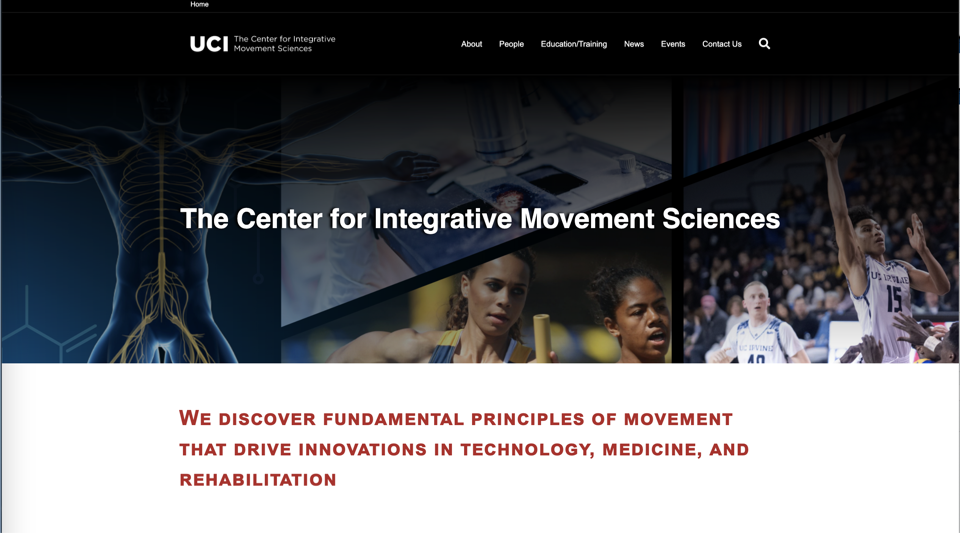
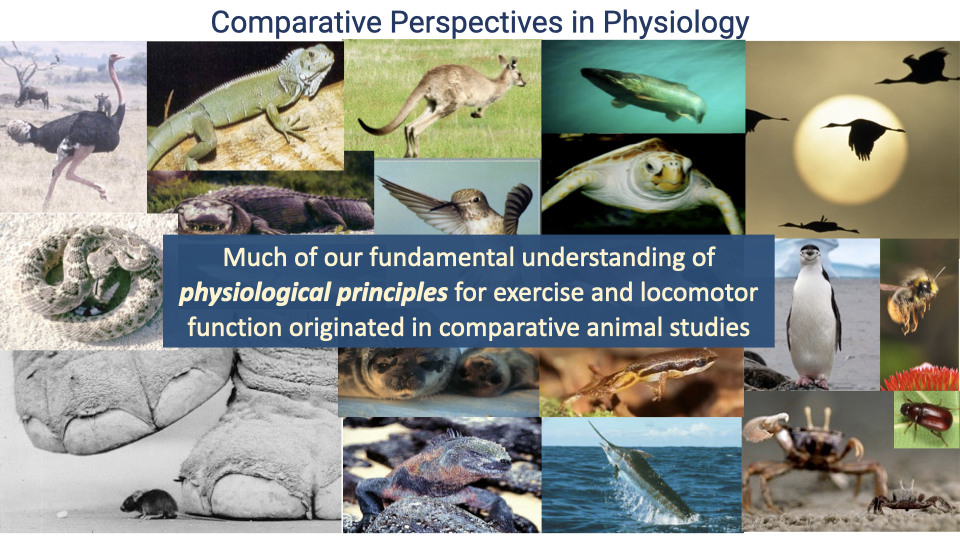

## Slide 1

- This lecture introduces the course structure and key themes of E183 Exercise Physiology.
- The course takes a **comparative approach**, examining exercise physiology across species rather than focusing solely on humans.
- Professor Daley's research background spans both human and comparative neuromechanics, informing this cross-species perspective.

---

## Slide 2

- **University of Utah** — Biology undergrad; first research on interactions between running and breathing in humans.
- **Harvard University** — PhD in comparative locomotor biomechanics; studied neuromuscular function in movement across terrestrial animals; also trained in human gross anatomy.
- **School of Kinesiology (postdoc)** — Developed models of bipedal gait for bio-inspired robotics, exoskeletons.
- **Royal Veterinary College** — Faculty for 12 years, led Comparative Neuromechanics lab and taught comparative anatomy and musculoskeletal biomechanics to veterinary students.
- **UC Irvine (2019–present)** — Runs both the Human Neuromechanics Lab and the Comparative Neuromechanics Lab.

---

## Slide 3

- Professor Daley directs the **Center for Integrative Movement Sciences (CIMS)** at UCI.
- CIMS is an interdisciplinary group spanning Biology, Engineering, the School of Arts (Dance), and the School of Medicine.
- The center focuses on fundamental principles of movement with applications in technology, medicine, and rehabilitation.
- CIMS runs a **summer research program** for undergraduates interested in movement science research.

---

## Slide 4

- The **Comparative Physiology Group** in the School of Biological Sciences includes 10 faculty members.
- Research across this group uses evolutionary and comparative perspectives to understand organismal physiology and evolution of form and function in animals.
- Faculty study diverse physiological systems beyond biomechanics, including endocrine systems, heat tolerance, and other physiological mechanisms.

---

## Slide 5

![Text slide titled "What is Exercise Physiology?" defining exercise physiology as the study of the physiology of physical mechanisms that govern movement and responses to physical activity. Lists four areas of understanding: (1) fundamental physiology of respiratory, cardiovascular, and musculoskeletal systems, (2) responses to physical activity, training/detraining, and (3) physiological and structural factors that dictate performance limits. Notes that E183 takes a comparative perspective to understand exercise physiology in an evolutionary context.](images/lec01/slide-005.png)

**Exercise physiology** is the study of the physiological mechanisms that govern movement and responses to physical activity. It includes understanding the:

1. **Fundamental physiology** of the respiratory, cardiovascular, and musculoskeletal systems
2. **Responses to physical activity**, including training and detraining effects
3. **Physiological and structural factors** that dictate performance limits

- In E183, these topics are examined through a **comparative perspective**, placing human athletic performance into an evolutionary context.
- The course covers both **short-term responses** (immediate energy delivery needs) and **long-term adaptations** (training effects).

---

## Slide 6

![Text slide titled "What is Exercise?" explaining that in human kinesiology, a distinction is often made between exercise (planned, voluntary physical activity for recreation or health) and physical activity more broadly. This course does not make that distinction because physiological processes and training effects apply regardless of intent. The distinction is an artifact of modern human lifestyles and doesn't consider evolutionary history. Exercise involves many shared mechanisms across humans and other vertebrates.](images/lec01/slide-006.png)

- In human kinesiology, **"exercise"** is sometimes defined narrowly as planned, voluntary physical activity for recreation or health, as distinct from general physical activity.
- This course **does not make that distinction** — daily physical activity is equally important for health and involves the same physiological processes.
- The narrow definition is an artifact of modern human lifestyles and does not account for evolutionary history.
- The course uses a broad definition: how humans and other animals respond to the physical demands of movement, including both **aerobic** and **anaerobic** energy delivery.

---

## Slide 7

The course follows the **oxygen delivery pathway** from environment to tissues:

1. **Alveolar ventilation** — moving air into the lungs
2. **Alveolar diffusion** — gas exchange across the lung membrane
3. **Circulatory transport** — cardiac output carrying O2 in the blood
4. **Circulatory O2 diffusion** — delivery of O2 from capillaries to muscle tissue
5. **Mitochondrial O2 use** — aerobic metabolism in the muscle
6. **Muscle ATP turnover** — conversion to neuromechanical output (movement)

- Muscles are the **only actuators** in movement, and muscle physiology is strongly conserved across vertebrates.
- The course also covers **neuromuscular control** — how the sensory-motor system interacts with biomechanics to adapt to changing conditions during exercise.

---

## Slide 8

![Table titled "Class grading" showing the grade breakdown: In-class participation (2 pts/week x 10 weeks) = 15%, Background reading in Perusall (5 pts/week x 10 weeks) = 15%, Quizzes (12 pts each x 8) = 40% with short answer, and Final (0-60 MCQ, plus short answer) = 30%. Below the table are reminders to read the grading policy, expect approximately 8 quizzes, expect to receive the grade you earn, and notes that instructors will not respond to individual requests for extra credit, additional curving, or anonymous emails about grading.](images/lec01/slide-008.png)

### Grade breakdown

| Component | Format | Percentage |
|-----------|--------|-----------|
| In-class participation | 2 pts/week x 10 weeks | 15% |
| Background reading (Perusall) | 5 pts/week x 10 weeks | 15% |
| Quizzes | 12 pts each x 8 | 40% |
| Final exam | MCQ + short answer | 30% |

- The number of quizzes is approximate; one lowest quiz score is dropped.
- Students should expect to receive the grade they earn — no additional curving.
- Instructors will not respond to individual requests for extra credit, grade curving, or anonymous emails about grading.

---

## Slide 9

- One **extra credit assignment** is available, worth up to 3% of the total grade.
- Students log their physical activity over 6 weeks during the quarter and reflect on their exercise habits and barriers to regular physical activity.
- This is the only extra credit opportunity in the course.

---

## Slide 10

![Text slide titled "Academic honesty" listing academic integrity policies: students are responsible for maintaining academic integrity; do not engage in activities to receive grades by means other than honest effort; this includes use of AI tools to answer quiz/exam questions or post comments on background reading; do not aid another student who is attempting to cheat; do not share assessment information on Discord, text/DM, messaging, or other platforms; do not submit participation notecards on behalf of someone else. States that violations will be reported and will lead to a zero score on the assessment in question. Instructors will not provide leniency to anyone found violating academic integrity policies.](images/lec01/slide-010.png)

- Students are responsible for maintaining **academic integrity** in all coursework.
- Prohibited activities include: using AI tools on assessments, sharing quiz/exam information on any platform (Discord, text, DM), aiding other students in cheating, and submitting participation cards for others.
- Violations will be **reported** and result in a zero score on the assessment.

---

## Slide 11

- An in-class survey gauges student attitudes toward AI tool usage on assessments.
- The questions address temptation to use AI, expectations about peer behavior, and the effect of in-class vs. out-of-class quiz formats on AI use.

---

## Slide 12

- Reliance on AI tools leads to **poorer learning outcomes** and lower retention.
- Learning occurs through the process of struggling to understand material independently — there are no shortcuts.
- AI tools have legitimate uses, but **not as a shortcut** in activities whose sole purpose is learning.

---

## Slide 13

### Quiz format

- Administered **in class on Fridays** via Canvas, 25 minutes in duration.
- Format: true/false, multiple-choice questions, and problem solving.
- **Question banks** ensure every student receives a different version of the quiz.
- In place of a quiz in Week 1 there is a Community Expectation Agreement, that counts 1 full quiz credit for completion.
- Make-up quizzes require confirmed documentation of excused absence, arranged in advance.
- One lowest quiz score is dropped before final grade calculation.

---

## Slide 14

![Text slide titled "Study tips" with a graph showing memory retention over time. The graph illustrates the space repetition effect: after first learning, retention declines, but with repeated review sessions, the rate of decline slows and overall retention improves. Tips listed include: actively engage with material, study regularly with short study bouts, take regular "brain-body breaks," preview the study guide, use "Active Listening" by writing down questions about the topic and listening for answers, take notes on key points rather than verbatim, and come to office hours with specific questions.](images/lec01/slide-014.png)

### Study strategies

- **Spaced repetition** improves long-term retention: repeated short study bouts are more effective than cramming. The retention curve shows that each review session slows the rate of memory decline.
- **Active engagement**: preview study guide before class, write down 1–2 questions, and listen for answers during lecture.
- **Take selective notes** — key concepts and questions for follow-up, not verbatim transcription.
- **Physical activity** supports brain function, learning, and retention — take regular "brain-body breaks."
- Bring specific questions to **office hours**.

---

## Slide 15

### Week 1 topics

- What is exercise physiology?
- The power of comparative approaches
- Principles of gas exchange
- The oxygen supply cascade

### Background reading

- BioE183 Syllabus
- Carrier — "The Evolution of Locomotor Stamina in Tetrapods: Circumventing a Mechanical Constraint"
- "The Oxygen Cascade" (Deranged Physiology)

---

## Slide 16

- Weekly materials are organized on **Canvas** with links to Perusall readings, study guides, and video recordings.
- Background readings must be accessed **through Canvas assignment links** (not directly through Perusall) for grades to post correctly.
- After Week 1, the course follows a pattern of **two content lectures** per week (Monday/Wednesday) plus an **interactive Friday session** (not recorded).

---

## Slide 17

### Learning objectives

1. Appreciate the value of the **comparative method** in physiology.
2. Describe the features of **early tetrapods** that may have limited locomotor endurance.

- The remainder of this lecture shifts from course logistics to the scientific content: understanding humans in an evolutionary context through comparative physiology.

---

## Slide 18

- The diversity of animal body forms reflects adaptations for **movement and energy delivery**.
- Physical activity is one of the main drivers of the structural and functional diversity observed among animals.
- The comparative approach uses this diversity to uncover **fundamental principles** of physiology and biomechanics.

---

## Slide 19

- Most fundamental physiological principles taught in human physiology textbooks were **originally discovered through comparative animal studies**.
- Many medical and pre-med students are unaware that key discoveries about physiological systems were worked out in non-human species.
- The comparative approach helps place **humans in an evolutionary context**, revealing both our exceptional traits and our limitations.

---

## Slide 20

- The question "**Are humans good athletes?**" is explored through a comparative lens.
- Examples of exceptional human athletes include:
  - **Sha'Carri Richardson** — world-class sprinter (100m and 200m)
  - **Kelvin Kiptum** — marathon world record holder (2:00:35, 2023 Chicago Marathon)
  - **Annie Hughes** — multiple first-place finishes in 100-mile ultra marathons
  - **Jacky Hunt-Broersma** — transtibial amputee athlete who ran 104 marathons in 104 days
- While individual humans can achieve remarkable feats, the average human is **not athletically exceptional** compared to many other species.

---

## Slide 21

### Animal speed records

| Animal | Top Speed |
|--------|----------|
| Cheetah | 60–75 mph |
| Pronghorn | 55 mph |
| Wildebeest | 50 mph |
| Ostrich | 45 mph |
| Horse | 44 mph |
| Dog | 43 mph |
| **Usain Bolt (fastest human)** | **27.8 mph** |
| *Ctenosaura similis* (lizard) | 21 mph |

- Humans are **not exceptional in speed** — Usain Bolt cannot outrun any of the listed animals, and some lizards approach his top speed.
- However, humans are **exceptional in endurance**, particularly in hot conditions, due to superior heat-dissipating capacity (sweating, lack of fur).
- Horses and dogs can match human endurance distances in cold weather, but not in heat.
- Comparative context reveals **what is physically possible** across the diversity of animal solutions.

---

## Slide 22

![Slide titled "The Krogh Principle" featuring a black-and-white portrait photo of August Krogh (1874-1949, Nobel Prize in Physiology or Medicine, 1920). Two quotes are displayed: (1) "For a large number of problems there will be some animal of choice, or a few such animals, on which it can be most conveniently studied" (Krogh, 1929, restated by Krebs, 1975), and (2) "A unifying theory of living things will be obtained only when we study the vital functions in all their aspects throughout all the myriad of organisms." The slide concludes: "Comparative studies reveal the evolutionary possibilities!"](images/lec01/slide-022.png)

### The Krogh Principle

> "For a large number of problems there will be some animal of choice, or a few such animals, on which it can be most conveniently studied." — Krogh (1929)

- **August Krogh** (1874–1949) received the Nobel Prize in Physiology or Medicine (1920).
- The principle states that for any physiological question, certain species are **especially well-suited** for study — either because they have exceptional performance in a particular trait or because their anatomy allows measurements not feasible in other species.
- Example: early studies on lung function and cardiorespiratory physiology were done in **turtles**, whose hard shell made certain measurements possible.
- Comparative studies **reveal the evolutionary possibilities** and contribute to a unifying understanding of living systems.

---

## Slide 23

### Two main comparative approaches

1. **"Case studies" or "model species"** — study individual species with exceptional traits or unique experimental accessibility.
2. **Evolutionary approaches** — examine functional diversity and variation among species within evolutionary lineages.

- Reference: Garland and Carter (1994) *Annual Review of Physiology*.

---

## Slide 24

![Expanded version of the "Two main comparative approaches" slide now showing details under each approach. (1) "Case studies" or "model species": Study specific animals that allow techniques not feasible in others, or that are especially well-adapted for a specific function to increase "signal to noise" in understanding adaptation. Sub-questions: How do organisms work? What factors limit performance? (2) Examine functional diversity and variation among species within evolutionary lineages. Reference: Garland and Carter (1994) Annu. Rev. Physiol.](images/lec01/slide-024.png)

**Approach 1 — Model species:**

- Study specific animals that allow techniques **not feasible in others**, or that are especially well-adapted for a function to increase the "signal to noise" in understanding adaptation.
- Key questions: How do organisms work? What factors limit performance?

**Approach 2 — Evolutionary diversity:**

- Examine how physiological traits vary **across related species** within evolutionary lineages.
- While case studies reveal mechanisms, they don't capture the full picture of how diversity and evolution shape different solutions.

---

## Slide 25

![Slide titled "What factors limit performance?" featuring a photo of a wildebeest and two graphs. Text explains that wildebeest travel 20-40 km between drinking events, travel 60-80 km during migration, and face average daily temperatures above 34 degrees Celsius (100 degrees Fahrenheit) in 9 out of 12 months. Graphs compare muscle efficiency between wildebeest and cow, showing wildebeest muscle has higher efficiency. Caption states: "If wildebeest completed the same muscle work with cow efficiency, water loss would be 50% greater." Reference: Curtis et al. (2018) Remarkable muscles, remarkable locomotion in desert-dwelling wildebeest, Nature.](images/lec01/slide-025.png)

### Case study: Wildebeest muscle efficiency

- Wildebeest are adapted to **hot desert environments** and travel 20–40 km between drinking events (60–80 km during migration), with average daily temperatures exceeding 34°C (100°F) for 9 out of 12 months.
- Researchers tracked wildebeest with collars, took muscle biopsies via helicopter blow-darting, and measured muscle performance in a field lab.
- Wildebeest muscle has **significantly higher efficiency** than cow muscle.
- Higher efficiency means **lower heat waste** and **lower water loss** — if wildebeest had cow-level muscle efficiency, their water loss would be 50% greater.
- This illustrates **integrated function**: muscle efficiency directly impacts water balance, thermoregulation, and endurance capacity.
- Reference: Curtis et al. (2018) *Nature*.

---

## Slide 26

![Slide titled "What are the fundamental demands of bipedal locomotion?" with a quote from Julia Clarke and Kevin Middleton (2006): "Birds are like our doppelgangers perched on another branch of the tree of life. Many of their qualities -- including complex behavior, bipedality, endothermic, and a highly visual nature -- verge on those of humans while refracted through their fiery exterior." Below lists key facts: approximately 9,500 species (most diverse terrestrial vertebrates), 2,500-fold range of body mass, bipedal gaits include walk, run, hop, and skip, and diverse leg proportions and locomotor ecology. Photos show various bird species walking and running.](images/lec01/slide-026.png)

### Case study: Bipedal locomotion in birds

- **Birds** share key traits with humans: bipedality, endothermy, complex behavior, and highly visual nature.
- Birds have a **250-million-year** evolutionary legacy of bipedalism, compared to approximately 10 million years for humans.
- They are the most diverse terrestrial vertebrates: ~9,500 species spanning a 2,500-fold range of body mass.
- Birds use **all physically possible bipedal gaits**: walking, running, hopping, and skipping.
- Their diverse leg proportions and locomotor ecologies make them valuable for studying the fundamental demands of bipedal movement.

---

## Slide 27

- The **ostrich** is the fastest biped on the planet (45 mph) and uses the same walking and running gaits as humans.
- From still images alone, one can distinguish walking from running in both humans and ostriches — this is because both species use **fundamentally similar physical mechanisms** (e.g., inverted pendulum in walking, spring-mass in running) despite completely different evolutionary histories.
- This represents **convergent evolution** in locomotor mechanics.

---

## Slide 28

- Despite using similar adult gaits, humans and ostriches have **fundamentally different development**.
- Ostriches can walk and run like adults **within 24 hours of hatching** (precocial development).
- Human infants require **hundreds of thousands of practice steps** before achieving stable walking (altricial development).
- Yet both species converge on similar locomotor solutions as adults — a fascinating example of different developmental paths reaching similar functional outcomes.

---

## Slide 29

**Approach 2 — Evolutionary diversity (expanded):**

Key questions addressed by evolutionary comparative studies:

- Are physiological differences among species **adaptive**?
- How do physiological traits **evolve**?
- Do unrelated species **converge** on similar adaptive features for specific functions?

- The bird/human bipedalism example illustrates convergent evolution — two unrelated lineages arriving at similar locomotor solutions.

---

## Slide 30

![Phylogenetic tree diagram titled "Diversity of animal form and function reflects both adaptation and evolutionary history." The tree shows the evolutionary relationships from aquatic locomotion (ancestral sarcopterygian fish using paired fins and lateral body undulation) through the transition to tetrapods (amphibians, reptiles, birds, and mammals). A highlighted box asks "Why is this important?" and answers: "Evolution 'tinkers' with what is there; it doesn't reinvent from scratch." Illustrations of representative species appear at the branch tips.](images/lec01/slide-030.png)

### Evolutionary context: From fish to tetrapods

- All tetrapods (amphibians, reptiles, birds, mammals) share a common ancestor: a **sarcopterygian fish** that used paired fins and lateral body undulation for aquatic locomotion.
- **Evolution tinkers with existing structures** — it does not reinvent from scratch. Despite hundreds of millions of years of evolution, tetrapods retain anatomical features and physiological mechanisms inherited from this aquatic ancestor.
- This means that some features of human physiology reflect **evolutionary constraints** inherited from ancestors adapted to a completely different environment.

---

## Slide 31

### Physical properties: Air vs. water

| Property | Air | Water | Ratio |
|----------|-----|-------|-------|
| Density (g/cm3) | 0.0012 | 1 | 830x |
| Dynamic viscosity (Pa&middot;s) | 18 x 10-6 | 1 x 10-3 | 55x |
| O2 content (mL O2/L) | 209 | 7 | 30x |
| Heat capacity (kJ/L&middot;°C) | 0.31 | 3200 | ~10,000x |

- These differences profoundly influence the **forces**, **energy demands**, **oxygen supply**, and **thermoregulation** requirements of movement in each medium.
- Air contains **30 times more oxygen** than water per unit volume.
- Water is **830 times denser** than air, which affects drag and buoyancy.

---

## Slide 32

### Forces by locomotor mode

- **Aquatic** — Major forces are inertial and drag forces; buoyancy supports body weight, so no muscular effort is needed to resist gravity.
- **Terrestrial** — Gravity and inertia are the dominant forces; air resistance is typically low at terrestrial speeds.
- **Aerial** — Gravity, inertia, and drag are all significant because flying animals move at higher speeds where air resistance becomes substantial.

---

## Slide 33

### Energetic cost of transport (CoT)

- **Cost of transport** measures the energy required to move a unit of body mass over a unit of distance (J/kg&middot;m). It allows comparison of locomotor efficiency across species and locomotor modes.
- On a log-log plot of body mass vs. CoT:
  - **Running** is the most energetically costly mode
  - **Flying** is intermediate
  - **Swimming** is the least costly
- Running is expensive because of **gravity** and **collisional energy losses** each time a limb strikes the ground.
- Swimming is cheap because **buoyancy** supports body weight, eliminating the cost of resisting gravity.
- Flying animals move faster, so despite drag costs, the **energy per unit distance** is lower than running.
- References: Tucker (1975), Schmidt-Nielsen (1972).

---

## Slide 34

- A central evolutionary question: **How did ancestral tetrapods move and breathe on land?**
- The transition from aquatic to terrestrial locomotion required fundamental changes in both the mechanics of movement and the mechanics of breathing.
- The inherited body plan from aquatic ancestors created **constraints** that influenced how early land animals could move and ventilate simultaneously.

---

## Slide 35

### Early tetrapod locomotion

- Early tetrapods (Devonian period) had a body plan resembling a **fish with legs** — sprawling posture with lateral body undulation for propulsion.
- Modern lizards retain this ancestral locomotor pattern: they bend their trunk from side to side during locomotion, similar to how a fish undulates in water.
- This **lateral bending** engages the trunk muscles — the same muscles required for breathing.

---

## Slide 36

### Mechanical conflict: locomotion vs. breathing

- In sprawling tetrapods, the **intercostal muscles** and **abdominal muscles** serve dual roles: powering breathing (ventilation) and stabilizing/bending the trunk during locomotion.
- Early tetrapods lacked a **diaphragm** — a structure unique to mammals — so they relied entirely on these trunk muscles for ventilation.
- This creates a fundamental **mechanical constraint**: the same muscles cannot efficiently serve both locomotion and breathing simultaneously.
- Reference: Carrier (1991) "Conflict in the Hypaxial Musculo-Skeletal System." *American Zoologist* 31, 644–654.

---

## Slide 37

### Evidence: Tidal volume decreases with locomotion in lizards

- At rest, lizards show large, regular tidal volumes.
- As treadmill speed increases (0 to 0.8 m/s), **tidal volume decreases** from ~4 cm3 to ~1.5 cm3.
- This is the **opposite** of what would be expected — tidal volume should increase with exercise to meet higher metabolic demands.
- The decrease demonstrates that **locomotion mechanically impairs breathing** in sprawling tetrapods.
- Reference: Carrier (1991).

---

## Slide 38

- Follow-up study by Wang, Carrier, and Hicks (1997) confirmed these findings.
- During treadmill exercise, lizards show **low tidal volumes** and erratic, high-frequency breathing.
- This pattern is consistent with a **mechanical conflict** between locomotion and ventilation — the trunk muscles cannot serve both functions effectively at the same time.
- Reference: Wang, Carrier, Hicks (1997) *J. Exp. Biol.* 200, 2629–2639.

---

## Slide 39

![Slide titled "Intercostal muscles stabilize the trunk during locomotion" showing electromyography (EMG) data from Carrier (1991). Left panel (highlighted in yellow) shows EMG recordings of left and right intercostal muscles and tidal volume during locomotion -- the intercostal muscles fire rhythmically with each locomotor stride. Right panel shows EMG recordings during resting, where external and internal intercostal muscles fire only during breathing cycles. A diagram of a lizard on a treadmill and a skeleton illustration show the experimental setup.](images/lec01/slide-039.png)

### EMG evidence for dual muscle function

- **Electromyography (EMG)** recordings from Carrier (1991) demonstrate the mechanical conflict directly:
  - **At rest**: intercostal muscles fire only during breathing cycles (ventilatory function).
  - **During locomotion**: the same intercostal muscles fire rhythmically with each stride (trunk stabilization function), overriding their ventilatory role.
- This confirms that intercostal muscles are **recruited for trunk stabilization** during locomotion, compromising their ability to power breathing.

---

## Slide 40

### Summary: Early tetrapod locomotion

Key features inherited from the aquatic ancestor:

- **Sprawling posture** with lateral bending of the trunk during locomotion
- **Relatively massive distal limbs**
- **Same muscles** (intercostal, hypaxial) used for both ventilation and trunk stabilization
- **Mechanical interference** between running and breathing
- Result: **limited aerobic scope and endurance** in locomotion

---

## Slide 41

- Ancestral tetrapods used **lateral body undulation** coupled with limb motion — inherited from their fish ancestor.
- They used **costal (rib cage) breathing** powered by hypaxial body wall muscles.
- This combination led to **limited aerobic scope and endurance** in locomotion.
- Two lineages — **mammals** and **birds** — independently evolved features that overcame this ancestral constraint (to be discussed in subsequent lectures).

---

## Slide 42

- Certain lineages within mammals and birds have evolved to become **highly athletic animals** with high aerobic scope, speed, and/or endurance.
- These lineages independently evolved solutions to the ancestral constraint on simultaneous running and breathing:
  - **Mammals** evolved the diaphragm and erect posture, decoupling trunk bending from locomotion.
  - **Birds** evolved a rigid trunk with a flow-through lung system.
- The phylogenetic distribution of athletic performance reflects both **adaptation** and **evolutionary history**.

---

## Slide 43

### Lecture 1 — Key takeaways

1. Many features of animal morphology and physiology (**form and function**) reflect adaptation for **movement and energy delivery** to tissues.
2. The comparative approach provides insight into **fundamental mechanisms** — how animals work.
3. The comparative approach provides **evolutionary context** to understand adaptive features and performance limits.

---

## Glossary of Key Terms

| Term | Definition |
|------|-----------|
| **Exercise physiology** | The study of the physiological mechanisms that govern movement and responses to physical activity, including the respiratory, cardiovascular, and musculoskeletal systems. |
| **Comparative approach** | A research framework that studies physiological and biomechanical principles across multiple species to understand fundamental mechanisms and evolutionary adaptations. |
| **Krogh Principle** | The principle that for any given physiological problem, there exists an ideal animal species on which it can be most conveniently studied (Krogh, 1929). |
| **Cost of transport (CoT)** | The energy required to move a unit of body mass over a unit of distance (J/kg&middot;m), used to compare locomotor efficiency across species and locomotor modes. |
| **Tetrapod** | A vertebrate animal with four limbs (or descended from four-limbed ancestors), including amphibians, reptiles, birds, and mammals. |
| **Sarcopterygian fish** | Lobe-finned fish; the common aquatic ancestor of all tetrapods, which used paired fins and lateral body undulation for locomotion. |
| **Lateral body undulation** | A locomotor pattern in which the trunk bends side-to-side during movement, inherited from aquatic ancestors and retained in modern lizards and salamanders. |
| **Sprawling posture** | A limb configuration in which the legs extend laterally from the body (as in lizards), as opposed to the erect posture of mammals and birds. |
| **Hypaxial muscles** | The muscles of the body wall below the vertebral column (including intercostals and abdominals) that are used for both ventilation and trunk stabilization during locomotion. |
| **Mechanical constraint** | A physical limitation arising from the dual use of trunk muscles for both breathing and locomotion in sprawling tetrapods, limiting simultaneous aerobic capacity. |
| **Convergent evolution** | The independent evolution of similar features or functions in unrelated lineages — e.g., bipedal locomotion in humans and birds. |
| **Aerobic scope** | The range between resting and maximal aerobic metabolic rate; a measure of an animal's capacity for sustained physical activity. |
| **Precocial development** | A developmental pattern in which offspring are relatively mature and mobile shortly after birth or hatching (e.g., ostriches). |
| **Altricial development** | A developmental pattern in which offspring are relatively immature and dependent at birth, requiring extended periods of parental care and practice to develop motor skills (e.g., humans). |
| **Diaphragm** | A dome-shaped muscle unique to mammals that separates the thoracic and abdominal cavities and is the primary muscle of breathing, enabling ventilation independent of trunk locomotion. |
