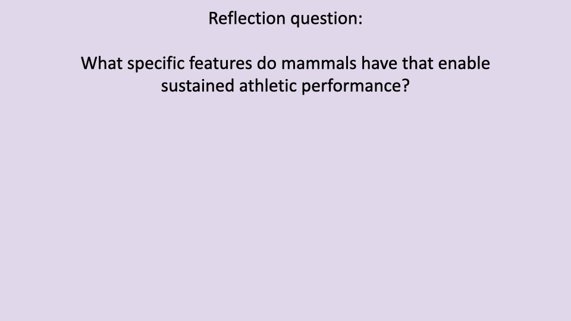
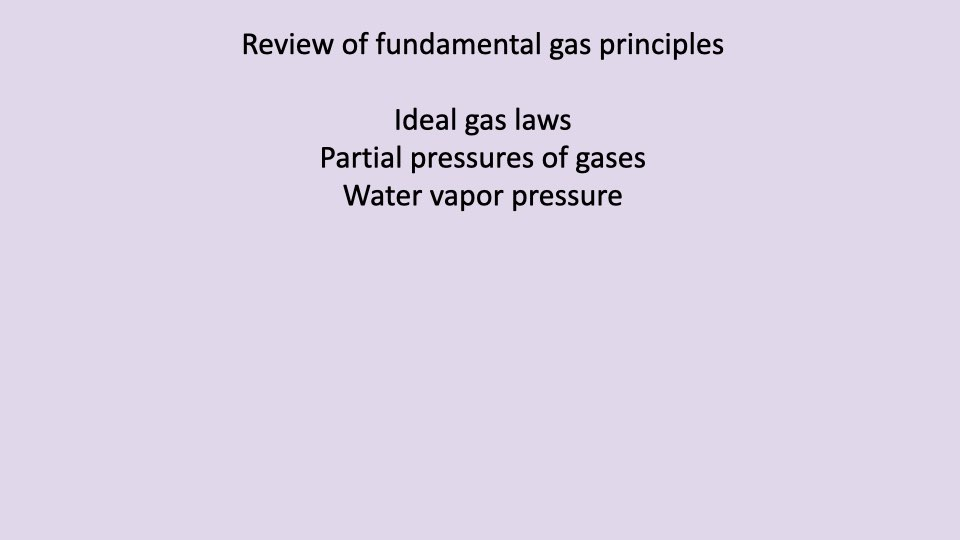
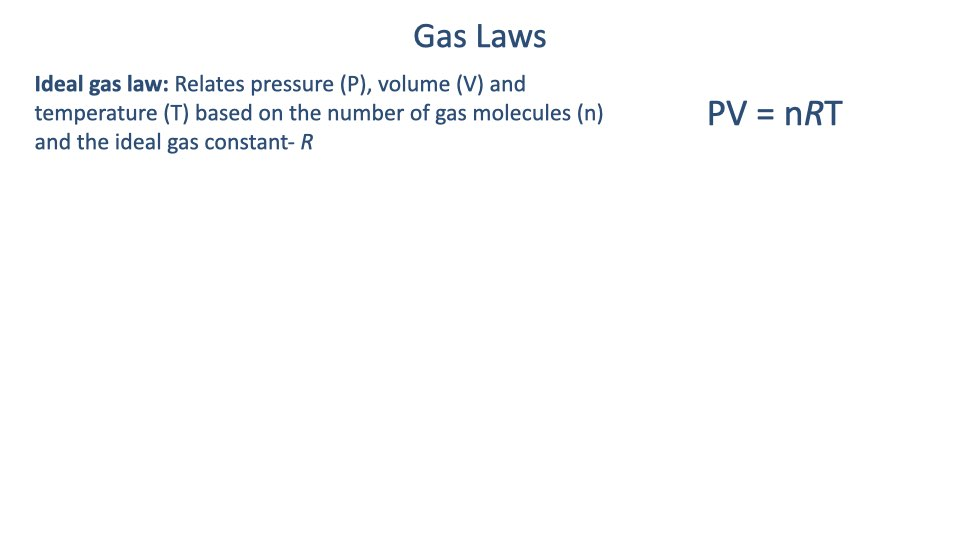
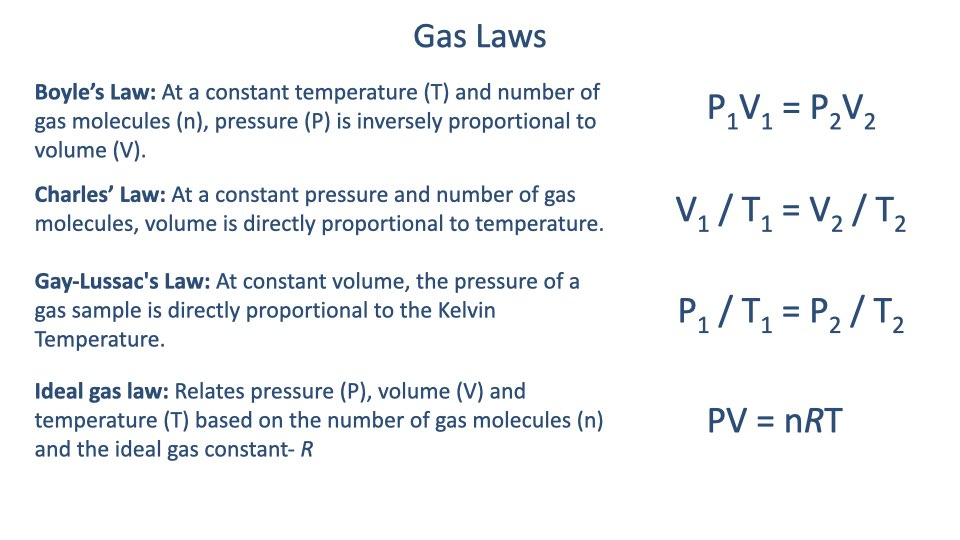
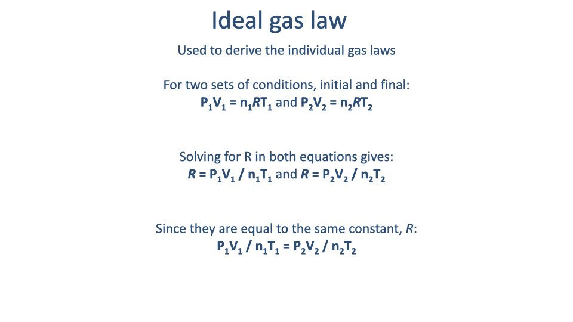

## Slide 1

- This lecture has two parts: (1) completing the introduction to comparative perspectives begun in Lecture 1, and (2) beginning the principles of gas exchange and the oxygen supply cascade.
- Several background readings are assigned this week to cover foundational material, since there is no quiz in Week 1.

---

## Slide 2

### Learning objectives (continued from Lecture 1)

1. Appreciate the value of the **comparative method**.
2. Describe the features of **early tetrapods** that may have limited locomotor endurance.

---

## Slide 3

![Slide titled "Two main comparative approaches" showing both approaches with photos of a human child walking and an ostrich walking side by side. Approach 1: "Case studies" or "model species" — study specific animals to increase signal-to-noise in understanding adaptation. Approach 2: Examine functional diversity and variation among species within evolutionary lineages, asking whether differences are adaptive, how traits evolve, and whether unrelated species converge. Reference: Garland and Carter (1994).](images/lec02/slide-003.jpeg)

- Review of the two comparative approaches from Lecture 1:
  1. **Model species / case studies** — study species with exceptional traits or unique experimental access.
  2. **Evolutionary diversity** — examine variation across lineages to test whether differences are adaptive and whether unrelated species converge on similar solutions.

---

## Slide 4

- All tetrapods evolved from an **aquatic sarcopterygian fish** ancestor that used paired fins and lateral body undulation.
- Evolution works by **modifying existing structures** rather than inventing from scratch — this means ancestral constraints persist in modern species.
- The physical demands of movement are strongly affected by the **medium** (water vs. air) in which an animal moves.

---

## Slide 5

### Why medium matters for exercise physiology

| Property | Air | Water | Ratio | Relevance |
|----------|-----|-------|-------|-----------|
| Density (g/cm3) | 0.0012 | 1 | 830x | Forces, energy demand |
| Dynamic viscosity (Ns/m) | 18 x 10-6 | 1 x 10-3 | 55x | Forces, energy demand |
| O2 content (mL O2/L) | 209 | 7 | 30x | Oxygen, aerobic energy supply |
| Heat capacity (cal/L&middot;°C) | 0.31 | 1000 | 3200x | Thermoregulation, energy demand |

- Air has **30x more oxygen** per unit volume than water, making aerial gas exchange more efficient.
- **Thermoregulation** is critical for exercise: muscles are only ~25% efficient, generating ~75% heat as waste. Exercising animals must dissipate this heat to sustain locomotion.
- Example: **cheetahs** can only sustain short sprint bouts because they overheat during prolonged exercise.

---

## Slide 6

### Forces by locomotor mode

- **Aquatic** — Inertial and drag forces dominate; buoyancy supports body weight (no muscular effort against gravity).
- **Terrestrial** — Gravity and inertia are the dominant forces; air resistance is low at typical terrestrial speeds.
- **Aerial** — Gravity, inertia, and drag are all significant because high flight speeds increase air resistance.

---

## Slide 7

### Cost of transport (review)

- **Cost of transport (CoT)** = energy per unit body mass per unit distance (J/kg&middot;m). Equivalently, CoT = Power / (mass x velocity).
- Running is the **most costly** mode due to gravity and collisional energy losses at each footfall.
- Swimming is the **least costly** because buoyancy supports body weight.
- Flying is **intermediate** — despite drag, higher speeds reduce energy cost per unit distance.

---

## Slide 8

- Central evolutionary question: **How did ancestral tetrapods move and breathe on land?**
- The aquatic ancestor's body plan was not well equipped for sustained aerobic locomotion on land.

---

## Slide 9

- Early tetrapods had a body plan resembling a **robust fish with massive limbs** — sprawling posture with lateral body undulation for propulsion.
- Modern lizards retain this ancestral locomotor pattern, bending the trunk side-to-side during running.
- The sprawling posture requires significant muscular effort to support body weight against gravity (analogous to doing push-ups with hands far apart).

---

## Slide 10

- A full locomotor cycle in a lizard involves pronounced **lateral bending of the trunk**.
- The trunk muscles (intercostal and abdominal) involved in this bending are the **same muscles used for breathing**.
- Since early tetrapods lacked a **diaphragm**, they relied entirely on these trunk muscles for ventilation.
- Reference: Carrier (1991) *Amer. Zool.* 31, 644–654.

---

## Slide 11

### Evidence: Tidal volume decreases during locomotion

- At rest, lizards produce **large, regular breaths**.
- During treadmill locomotion, tidal volumes **decrease** with increasing speed — the opposite of what aerobic demand requires.
- This demonstrates a **mechanical constraint**: the trunk muscles cannot effectively serve both locomotion and ventilation simultaneously.

---

## Slide 12

- Follow-up studies in **monitor lizards** (*Varanus*) and **iguanas** confirmed the mechanical interference.
- Tidal volumes do not increase during exercise but **increase dramatically in the recovery period** after exercise stops.
- These animals cannot sustain prolonged locomotion because the running-breathing conflict **inhibits oxygen supply** during exercise.
- Reference: Wang, Carrier, Hicks (1997) *J. Exp. Biol.* 200, 2629–2639.

---

## Slide 13

![Slide titled "Intercostal muscles stabilize the trunk during locomotion" showing EMG data from Carrier (1991). Left panel (purple highlight, "Locomotion"): EMG recordings of left and right intercostal muscles firing rhythmically with each locomotor stride, with body bending trace and small, irregular tidal volumes. Right panel (yellow highlight, "Resting"): intercostal EMG firing only during breathing cycles with large, regular tidal volumes. A skeletal diagram of a lizard on a treadmill is shown.](images/lec02/slide-013.jpeg)

### EMG evidence for the mechanical conflict

- **During locomotion** (purple): intercostal muscles fire rhythmically with each stride for **trunk stabilization**, and tidal volumes are small and irregular.
- **During rest** (yellow): the same intercostal muscles fire only during **breathing cycles**, producing large, regular tidal volumes.
- The muscles cannot serve both functions effectively at the same time.

---

## Slide 14

### Summary: Early tetrapod locomotor constraints

- **Sprawling posture** with lateral trunk bending and massive distal limbs
- Same muscles used for **ventilation** and **trunk stabilization** during locomotion
- Mechanical interference between running and breathing
- Result: **limited aerobic scope and endurance**
- Modern lizards are adapted for **burst locomotion** (short sprints between hiding spots), not sustained aerobic activity — this reflects their evolutionary heritage, not poor adaptation.

---

## Slide 15

- The ancestral **conflict between running and breathing** was inherited by all tetrapod lineages.
- However, several lineages have evolved solutions to overcome this constraint.

---

## Slide 16

### Lineages that overcame the ancestral constraint

- **Archosaurs** (crocodilians + birds): Evidence suggests ancestral archosaurs had high aerobic capacity, based on convergent features in hearts, bones, and musculoskeletal systems shared between modern crocodilians and birds.
- **Mammals**: Many species evolved high endurance, high aerobic scope, and the ability to sustain high metabolic rates under extreme conditions (drought, heat).
- The course will examine the specific adaptations that enabled these lineages to achieve sustained athletic performance.

---

## Slide 17

### Reflection question

> What specific features do mammals have that enable sustained athletic performance?

- This question is posed as a thought exercise to inspire curiosity about upcoming course material.
- Key features to be discussed in later lectures include: the **diaphragm**, **erect posture**, **four-chambered heart**, and modifications to the musculoskeletal system.

---

## Slide 18

### Summary: Comparative perspectives

1. Many features of animal morphology and physiology (**form and function**) reflect adaptation for **movement and energy delivery** to tissues.
2. The comparative approach provides insight into **fundamental mechanisms** — how animals work.
3. The comparative approach provides **evolutionary context** to understand adaptive features and performance limits.

---

## Slide 19

### Learning objectives — Gas exchange

1. Review fundamental **gas laws and principles**: ideal gas law, partial pressures of gases, water vapor pressure.
2. Describe the steps in the **oxygen supply cascade** from the environment to the mitochondria.

---

## Slide 20

![Diagram showing the steps of gas exchange from the environmental medium (water or air) to the cell. Left side shows photos of diverse animals (runners, antelope, bats, birds, crocodile, fish). Right side shows a schematic with alternating convection and diffusion steps: O₂ enters by convection, crosses the respiratory surface (skin/gill/lung) by diffusion, is transported by the heart and blood through the systemic vasculature by convection, crosses the interstitium by diffusion, and reaches the cell where CO₂ is produced.](images/lec02/slide-020.jpeg)

### Fundamental steps of gas exchange

Regardless of species, oxygen delivery follows the same sequence of alternating **convection** and **diffusion** steps:

1. **Convection** — Bulk flow of air or water to the respiratory surface
2. **Diffusion** — O2 crosses the respiratory surface (skin, gill, or lung)
3. **Convection** — Circulatory transport via the heart and blood
4. **Diffusion** — O2 crosses from capillaries to cells through the interstitium

- This pattern is conserved across all air-breathing and water-breathing vertebrates.

---

## Slide 21

![Diagram titled "Gas Exchange and the Oxygen Supply Cascade" with an anatomical illustration of a cell showing the full pathway from lung to mitochondria. Right side lists the five steps: (1) Ventilatory air convection, (2) Pulmonary oxygen diffusion, (3) Blood oxygen transport — convection, (4) Capillary-tissue diffusion, (5) Cellular respiration. The demand side lists protein synthesis, ion pumps, and actomyosin ATPase. A downward purple arrow indicates the progressive decrease in oxygen along the cascade.](images/lec02/slide-021.jpeg)

### The five steps of the oxygen supply cascade

1. **Ventilatory air convection** — moving air into the lungs
2. **Pulmonary oxygen diffusion** — gas exchange across the alveolar membrane
3. **Blood oxygen transport (convection)** — cardiac output carrying O2 in the blood
4. **Capillary-tissue diffusion** — O2 crossing from capillaries to cells
5. **Cellular respiration** — O2 consumed in mitochondria for ATP production (powering protein synthesis, ion pumps, actomyosin ATPase)

- Each step represents a potential bottleneck that can **limit oxygen delivery** and thus limit exercise capacity.

---

## Slide 22

![Slide titled "Oxygen cascade" with a definition box: "Oxygen cascade refers to the progressive decrease in the partial pressure of oxygen from the ambient air to the cellular level." A table shows PO₂ values at each step: inspired air 150-160 mmHg, alveolar gas (PAO₂) 100-110 mmHg, arterial blood (PaO₂) 98 mmHg, capillary blood 50-80 mmHg, tissues 30-50 mmHg, cell mitochondria 10-20 mmHg. A staircase graph on the right shows the progressive decrease from Air (~150 Torr) through Alveoli, End capillary/Arterial blood (~100), Tissue capillary (~50), Cell, to Mitochondria (~10).](images/lec02/slide-022.jpeg)

### The oxygen cascade

The **oxygen cascade** describes the progressive decrease in PO₂ at each step from the environment to the mitochondria:

| Location | PO₂ (mmHg) |
|----------|----------------------|
| Inspired air | 150–160 |
| Alveolar gas (PAO2) | 100–110 |
| Arterial blood (PaO2) | 98 |
| Capillary blood | 50–80 |
| Tissues | 30–50 |
| Cell mitochondria | 10–20 |

- Each step involves a drop in PO₂ due to diffusion barriers, dilution, and metabolic consumption.
- The drop at the tissue capillary bed depends on **metabolic rate** — the more O2 consumed, the lower the tissue PO₂.
- The first step (inspired air) sets the **upper limit** on how much oxygen is available.

---

## Slide 23

- The remainder of this lecture reviews the **fundamental gas laws** needed to calculate oxygen availability at each step of the cascade.

---

## Slide 24

![Text slide titled "Gas Pressures" with five bullet points: (1) Pressure is proportional to the average force exerted by molecules colliding with the walls of a container, (2) Pressure is proportional to kinetic energy and therefore proportional to temperature, (3) Gas pressure is measured in mmHg (millimeters of mercury) with a barometer (barometric pressure), (4) Standard atmospheric pressure is 760 mmHg, also known as 760 Torr or 1 atm, (5) The SI unit for pressure is the kPa; 1 atm equals 101.32 kPa.](images/lec02/slide-024.jpeg)

### Gas pressure fundamentals

- **Gas pressure** is proportional to the average force exerted by gas molecules colliding with container walls.
- Pressure is proportional to **kinetic energy** and therefore to **temperature**.
- Measured in **mmHg** (millimeters of mercury) using a barometer.

### Pressure unit equivalences

| Unit | Value |
|------|-------|
| 1 atmosphere (atm) | 760 mmHg |
| 1 atm | 760 Torr |
| 1 atm | 101.32 kPa (SI unit) |

---

## Slide 25

- **Barometric pressure** (atmospheric pressure) is the weight of the column of air above a given point, pulled down by gravity.
- Because the amount of air above decreases with altitude, **barometric pressure decreases with altitude**.

---

## Slide 26

### Barometric pressure and altitude

- At **sea level**: PB = 760 mmHg, inspired PO₂ ≈ 150 mmHg.
- At **Mt. Everest** (~8,848 m): PB ≈ 250 mmHg, inspired PO₂ is approximately **one-third** of sea level — not sustainable for long-term human habitation.
- The graph shows barometric pressure decreases non-linearly with altitude, and inspired PO₂ decreases proportionally.

---

## Slide 27

### Extreme altitude: La Rinconada, Peru

- **La Rinconada, Peru** is the highest permanent human settlement in the world.
- Available oxygen is approximately **50% of sea level**.
- About one-third of Peru's population lives at high altitude.
- Residents suffer from high rates of **chronic mountain sickness** due to the extreme hypoxic conditions.
- This illustrates the physiological limits of human adaptation to low oxygen availability.

---

## Slide 28

### Boyle's Law

- At constant temperature and number of gas molecules, **pressure is inversely proportional to volume**.

$$P_1 V_1 = P_2 V_2$$

- If three of the four quantities (P1, V1, P2, V2) are known, the fourth can be calculated.
- The graph shows the characteristic inverse (hyperbolic) relationship between pressure and volume.

---

## Slide 29

### Charles' Law

- At constant pressure and number of gas molecules, **volume is directly proportional to temperature**.

$$\frac{V_1}{T_1} = \frac{V_2}{T_2}$$

- As temperature increases, gas molecules move faster and occupy a larger volume.

---

## Slide 30

### Gay-Lussac's Law

- At constant volume, **pressure is directly proportional to the Kelvin temperature**.

$$\frac{P_1}{T_1} = \frac{P_2}{T_2}$$

---

## Slide 31

### Ideal Gas Law

$$PV = nRT$$

- Where: P = pressure, V = volume, n = number of gas molecules (moles), R = ideal gas constant, T = temperature (Kelvin).
- All three individual gas laws (Boyle's, Charles', Gay-Lussac's) can be **derived from the ideal gas law** by holding certain variables constant.

---

## Slide 32

### Gas laws summary

| Law | Relationship | Constant | Equation |
|-----|-------------|----------|----------|
| Boyle's Law | P–V (inverse) | T, n | $P_1 V_1 = P_2 V_2$ |
| Charles' Law | V–T (direct) | P, n | $V_1/T_1 = V_2/T_2$ |
| Gay-Lussac's Law | P–T (direct) | V, n | $P_1/T_1 = P_2/T_2$ |
| Ideal Gas Law | P, V, T, n | — | $PV = nRT$ |

---

## Slide 33

### Deriving gas laws from the ideal gas law

- Write the ideal gas law for two sets of conditions (initial and final): $P_1V_1 = n_1RT_1$ and $P_2V_2 = n_2RT_2$
- Solve both for R and set equal:

$$\frac{P_1 V_1}{n_1 T_1} = \frac{P_2 V_2}{n_2 T_2}$$

- By holding specific variables constant, individual gas laws emerge.

---

## Slide 34

### Derivations from the combined gas law

Starting from $\frac{P_1 V_1}{n_1 T_1} = \frac{P_2 V_2}{n_2 T_2}$:

- **Boyle's Law**: Hold n and T constant → n's and T's cancel → $P_1V_1 = P_2V_2$
- **Charles' Law**: Hold n and P constant → n's and P's cancel → $V_1/T_1 = V_2/T_2$
- **Gay-Lussac's Law**: Hold n and V constant → n's and V's cancel → $P_1/T_1 = P_2/T_2$

---

## Slide 35

### Dalton's Law — Partial pressures

- The **total pressure** of a gas mixture equals the sum of the partial pressures of each component gas.

$$P_{\text{air}} = P_{O_2} + P_{CO_2} + P_{N_2}$$

- The **partial pressure** of any gas equals the barometric pressure multiplied by that gas's fractional concentration:

$$P_{O_2} = P_B \times F_{O_2}$$

### Partial pressures of dry air at sea level

| Gas | % in air | Fraction | PB (mmHg) | Partial P (mmHg) |
|-----|---------|----------|----------------------|-------------------|
| O2 | 20.93 | 0.2093 | 760 | 159 |
| CO2 | 0.03 | 0.0003 | 760 | 0.3 |
| N2 | 79.04 | 0.7904 | 760 | 600.7 |
| **Total** | 100 | | | **760** |

---

## Slide 36

![Slide titled "Water vapor pressure" with a graph showing water vapor pressure (mmHg) vs. temperature (°C). The curve rises exponentially, reaching 760 mmHg near 100°C. At 37°C, the vapor pressure is marked as 47 mmHg. Key points listed: water vapor pressure depends on temperature and is independent of barometric pressure. Inspired air is rapidly warmed and saturated with water. The PO₂ of dry air at sea level is 159 mmHg (760 x 0.21), but the PO₂ of saturated air at 37°C is 149 mmHg = (760 - 47) x 0.21. Because 47 mmHg is a constant at 37°C, you must subtract 47 mmHg from barometric pressure to calculate P_IO₂.](images/lec02/slide-036.jpeg)

### Water vapor pressure correction

- When air enters the lungs, it is rapidly **warmed to body temperature (37°C)** and **saturated with water vapor**.
- Water vapor pressure at 37°C = **47 mmHg** (constant, independent of barometric pressure).
- This water vapor **dilutes** the inspired air, reducing the available oxygen.

### Calculating inspired PO₂

$$P_{I}O_2 = (P_B - P_{H_2O}) \times F_{O_2}$$

**Example at sea level:**

- Dry air: $P_{O_2} = 760 \times 0.21 = 159$ mmHg
- Saturated air at 37°C: $P_IO_2 = (760 - 47) \times 0.21 = 149$ mmHg

- For all calculations in this course, use **47 mmHg** as the water vapor pressure (assuming body temperature of 37°C).

---

## Slide 37

- To calculate PIO2 at altitude, substitute the appropriate **barometric pressure** for that altitude into the water vapor correction formula.
- The fraction of O2 in air (20.93%) does not change with altitude — only the total barometric pressure decreases.

---

## Slide 38

![Slide showing an airplane in flight with the calculation for rapid decompression at 35,000 feet: P_B = 178 mmHg, P_IO₂ = (178 - 47) × 0.21 = 27 mmHg (compared to 149 mmHg at sea level). A table shows "Time of Useful Consciousness" at various altitudes: 45,000 ft = 9-15 seconds, 40,000 ft = 15-20 seconds, 35,000 ft = 30-60 seconds, 30,000 ft = 1-2 minutes, 28,000 ft = 2.5-3 minutes, 25,000 ft = 3-5 minutes, 22,000 ft = 5-10 minutes, 20,000 ft = 30 minutes or more. A photo of deployed oxygen masks in an aircraft cabin is shown.](images/lec02/slide-038.jpeg)

### Applied example: Cabin decompression at altitude

**At 35,000 ft cruising altitude:**

$$P_IO_2 = (178 - 47) \times 0.21 = 27 \text{ mmHg}$$

- This is only **18% of sea-level** PIO2 (149 mmHg) — lower than typical venous blood oxygen levels.
- At this PO₂, the brain is rapidly starved of oxygen.

### Time of useful consciousness after decompression

| Altitude (ft) | Consciousness time |
|----------------|-------------------|
| 45,000 | 9–15 seconds |
| 40,000 | 15–20 seconds |
| 35,000 | 30–60 seconds |
| 30,000 | 1–2 minutes |
| 25,000 | 3–5 minutes |
| 20,000 | 30+ minutes |

- This is why **emergency oxygen masks** are essential in aircraft — consciousness can be lost in under a minute at cruising altitude.

---

## Slide 39

- Over the next several lectures, the course will **march through each step** of the oxygen supply cascade.
- For each step, the relevant physical principles governing oxygen uptake and the factors that **limit oxygen delivery** will be examined.
- Background reading on the oxygen supply cascade (Deranged Physiology) provides additional preparation.

---

## Slide 40

### Lecture 2 — Key takeaways

1. All tetrapods inherited a **mechanical conflict between running and breathing** from their aquatic ancestor. Mammals and birds independently evolved solutions to this constraint.
2. Oxygen delivery follows a **cascade** of alternating convection and diffusion steps, with PO₂ decreasing at each stage from ~150 mmHg in inspired air to ~10–20 mmHg at the mitochondria.
3. The **gas laws** (Boyle's, Charles', Gay-Lussac's) are all derivable from the ideal gas law ($PV = nRT$).
4. Calculating **inspired PO₂** requires correcting for water vapor pressure: $P_IO_2 = (P_B - 47) \times 0.21$.
5. **Barometric pressure decreases with altitude**, dramatically reducing oxygen availability — at Mt. Everest, inspired PO₂ is only one-third of sea level.

---

## Key Equations

| Equation | Name | Description |
|----------|------|-------------|
| $PV = nRT$ | Ideal Gas Law | Relates pressure, volume, temperature, and number of gas molecules via the gas constant R |
| $P_1V_1 = P_2V_2$ | Boyle's Law | At constant T and n, pressure is inversely proportional to volume |
| $\frac{V_1}{T_1} = \frac{V_2}{T_2}$ | Charles' Law | At constant P and n, volume is directly proportional to temperature |
| $\frac{P_1}{T_1} = \frac{P_2}{T_2}$ | Gay-Lussac's Law | At constant V and n, pressure is directly proportional to temperature |
| $\frac{P_1V_1}{n_1T_1} = \frac{P_2V_2}{n_2T_2}$ | Combined Gas Law | General form from which individual gas laws are derived by holding variables constant |
| $P_{\text{air}} = P_{O_2} + P_{CO_2} + P_{N_2}$ | Dalton's Law | Total pressure of a gas mixture equals the sum of individual partial pressures |
| $P_{O_2} = P_B \times F_{O_2}$ | Partial pressure | Partial pressure of a gas equals barometric pressure multiplied by its fractional concentration |
| $P_IO_2 = (P_B - P_{H_2O}) \times F_{O_2}$ | Inspired PO₂ | Partial pressure of inspired O2, corrected for water vapor pressure (47 mmHg at 37°C) |

---

## Glossary of Key Terms

| Term | Definition |
|------|-----------|
| **Barometric pressure (PB)** | The pressure exerted by the atmosphere at a given point, equal to the weight of the air column above that point. Standard sea-level value: 760 mmHg. |
| **Partial pressure** | The pressure exerted by a single gas within a mixture, calculated as the total pressure multiplied by the fractional concentration of that gas. |
| **Oxygen cascade** | The progressive decrease in the partial pressure of oxygen at each step from ambient air to the cellular mitochondria. |
| **Convection** | Bulk flow of a fluid (air or blood) that transports gases over large distances; the mechanism of ventilation and circulatory transport. |
| **Diffusion** | The passive movement of gas molecules from regions of high partial pressure to low partial pressure across a membrane or barrier. |
| **Water vapor pressure (PH₂O)** | The partial pressure exerted by water vapor in a gas mixture. At body temperature (37°C), saturated water vapor pressure is 47 mmHg. |
| **Inspired PO₂ (PIO2)** | The partial pressure of oxygen in air after it has been warmed to body temperature and saturated with water vapor in the airways. |
| **Tidal volume** | The volume of air inhaled or exhaled in a single breath during normal breathing. |
| **Aerobic scope** | The difference between resting and maximal aerobic metabolic rate; a measure of capacity for sustained physical activity. |
| **Chronic mountain sickness** | A condition affecting long-term residents at high altitude, caused by chronic hypoxia, characterized by excessive red blood cell production and cardiovascular complications. |
| **Torr** | A unit of pressure equal to 1 mmHg. 760 Torr = 1 atmosphere. |
| **Ideal gas law** | The equation PV = nRT relating pressure, volume, number of gas molecules, and temperature through the universal gas constant R. |
| **Dalton's Law** | The principle that the total pressure of a gas mixture equals the sum of the partial pressures of each component gas. |
| **Burst locomotion** | A locomotor strategy characterized by short, high-intensity sprints rather than sustained aerobic activity; typical of lizards and other sprawling tetrapods. |
