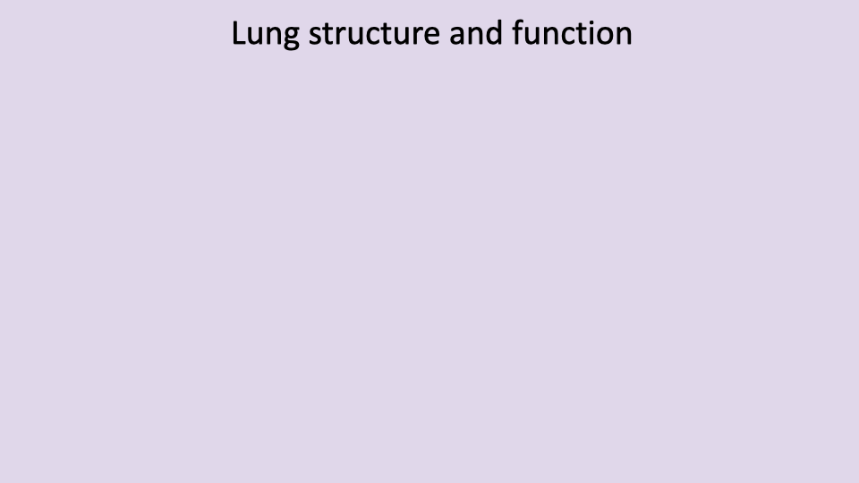
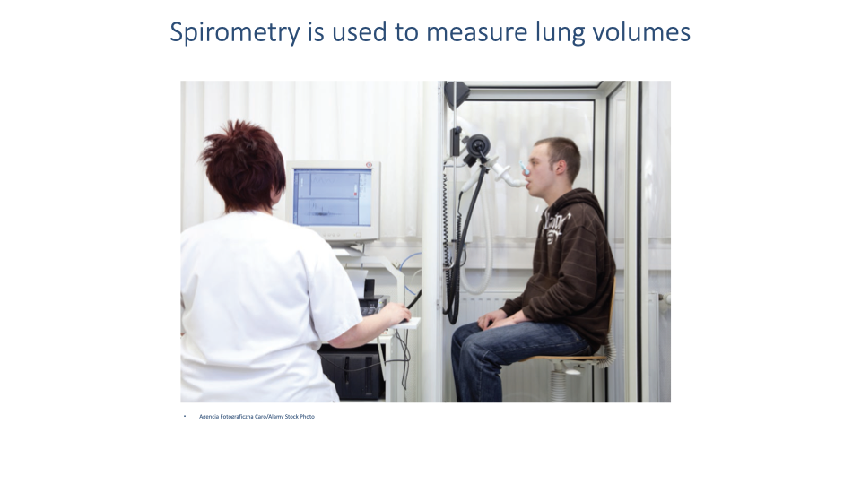

## Slide 1

- This lecture focuses on the **first step of the oxygen supply cascade**: pulmonary and alveolar ventilation — getting air from the environment into the lungs and to the gas exchange surfaces.
- Subsequent lectures will build up the remaining steps, introducing governing equations at each stage to understand what limits oxygen delivery during exercise.

---

## Slide 2

### Learning objectives

1. Describe the steps in the **oxygen supply cascade** from the environment to the mitochondria.
2. Describe the **path of air** into the lungs.
3. Define **dead space volume** and discuss factors that contribute to it.
4. Describe the factors that contribute to **minute ventilation** and **alveolar ventilation**.

---

## Slide 3

### The oxygen cascade

- The **oxygen cascade** refers to the progressive decrease in PO₂ from ambient air (~150 mmHg) to the cellular mitochondria (~10–20 mmHg).
- PO₂ drops at each step because oxygen is consumed or diluted as it moves through the system.

| Location | PO₂ (mmHg) |
|----------|----------------------|
| Inspired air | ~150 |
| Alveolar gas | 100–110 |
| Arterial blood | ~98 |
| Capillary blood | 30–60 |
| Tissues | 20–30 |
| Cell mitochondria | 10–20 |

- By learning the equations governing each step, the **physical factors limiting oxygen supply** can be identified under different conditions (e.g., normoxia, hypoxia, diving).

---

## Slide 4

- Gas exchange follows a series of alternating **convection** and **diffusion** steps.
- **Convection** (bulk flow) moves gases over long distances — ventilation moves air into the lungs; the circulatory system transports oxygen in blood.
- **Diffusion** moves gases across thin barriers — at the lung surface and at the tissue capillaries.
- CO2 flows in the reverse direction, from cells to the environment.
- The fundamental principles are **shared across vertebrates**, though the structures differ (gills, lungs, parabronchial systems).

---

## Slide 5

### Review: Gas laws applied to ventilation

- The **ideal gas law** and **Dalton's law** (from Lecture 2) provide the foundation for calculating oxygen availability.
- The key equation for the top of the oxygen cascade is:

$$P_IO_2 = F_IO_2 \times (P_{atm} - P_{H_2O})$$

- At sea level and body temperature (37°C):

$$P_IO_2 = 0.21 \times (760 - 47) = 149 \text{ mmHg}$$

- **FIO2** = 0.21 (fractional concentration of O2 in air) is approximately constant and used for all calculations in this course.
- **PH₂O** = 47 mmHg at body temperature, and must be subtracted because water vapor dilutes the inspired air.
- This value (149 mmHg) represents PO₂ at the **top** of the cascade — it does not indicate how much oxygen actually reaches the gas exchange surfaces.

---

## Slide 6

### Diversity of gas exchange structures

- **Fish** — Water flows over gills in a **countercurrent** exchange system (water and blood flow in opposite directions), maximizing O2 extraction.
- **Birds** — Air flows through **parabronchial lungs** in a **cross-current** pattern (air flow perpendicular to blood flow). This is highly efficient and contributes to birds' success at high altitudes.
- **Amphibians, non-crocodilian reptiles, and mammals** — Use **tidally ventilated lungs** where air flows in and out through the same passages. Air reverses direction, creating a "pool" exchange system. This is the ancestral condition for tetrapods.
- **Key difference**: In gills and parabronchial lungs, there is **no anatomical dead space** because airflow is unidirectional. In tidally ventilated lungs, air cannot be fully emptied with each breath, resulting in **anatomical dead space** that dilutes the oxygen reaching the gas exchange surfaces.

---

## Slide 7

### Step 1: Ventilatory air convection

- The oxygen supply cascade is built up step by step, with governing equations introduced at each stage.
- This lecture focuses on **Step 1: ventilatory air convection** — the tidal ventilation of the lungs.
- Topics include lung structure and function, the mechanics of breathing, dead space, and the distinction between pulmonary and alveolar ventilation.
- Understanding the factors that limit lung performance provides the foundation for discussing exercise limitations and hypoxia in later lectures.

---

## Slide 8

- This section covers the functional organization of the mammalian respiratory system, focusing on features important for oxygen delivery rather than detailed anatomical memorization.

---

## Slide 9

- The respiratory system includes the **upper airway** (nasal cavity, pharynx, larynx) and the **lower airway** (trachea, bronchi, bronchioles, alveoli).
- The focus is on **functional organization** rather than memorization of anatomical detail — understanding which structures participate in gas exchange and which do not.

---

## Slide 10

### Intrapleural pressure

- The lungs are surrounded by a thin **pleural cavity** between the visceral pleura (on the lung surface) and the parietal pleura (on the chest wall).
- **Intrapleural pressure is negative** (below atmospheric pressure), which keeps the lungs inflated against the chest wall.
- Ventilation depends on managing changes in air pressure and airway resistance to move air in and out of the lungs.

---

## Slide 11

### The blood-gas barrier

- Gas exchange occurs at the **alveoli**, where the alveolar wall is in close contact with pulmonary capillaries.
- For effective gas exchange, three conditions must be met:
  1. Air must reach the alveolar space.
  2. **Deoxygenated blood** must flow through the capillaries surrounding the alveoli.
  3. The barrier between the alveolar surface and capillary blood must be **thin enough** to allow efficient diffusion.

---

## Slide 12

### Muscles of ventilation

**Muscles of inspiration:**
- **Diaphragm** — the primary muscle of inspiration in mammals
- **External intercostals** and **parasternal intercostals** — assist in expanding the rib cage
- **Accessory muscles** (sternocleidomastoid, scalenes) — recruited during forced breathing or exercise; largely inactive during quiet breathing

**Muscles of expiration:**
- **Internal intercostals** — active during forced exhalation
- **Abdominal muscles** (external oblique, internal oblique, transversus abdominis, rectus abdominis) — contract to increase abdominal pressure and push the diaphragm upward during forced exhalation
- During **quiet breathing**, exhalation is largely **passive**, driven by the elastic recoil of the lungs and rib cage.

---

## Slide 13

![Slide titled "Mechanics of breathing and the muscles of ventilation" showing diagrams of the thoracic cavity during inspiration and expiration. During inspiration, the diaphragm contracts and flattens, and the rib cage expands, increasing thoracic volume. During expiration, the diaphragm relaxes and domes upward, and the rib cage returns to its resting position. Below: the equation for Boyle's Law P₂ = (P₁V₁)/V₂, with the statement "An increase in lung volume results in a decrease in intrapulmonary pressure."](images/lec03/slide-013.png)

### Breathing mechanics and Boyle's Law

- The **diaphragm** has a complex 3D dome shape. When it contracts, it flattens, increasing thoracic volume by:
  - Moving downward (increasing vertical space)
  - Pushing the lower ribs outward (increasing lateral space)
  - Pushing the sternum forward (increasing anterior-posterior space)
- **Boyle's Law** governs the resulting pressure change:

$$P_2 = \frac{P_1 V_1}{V_2}$$

- An **increase in lung volume** during inspiration causes a **decrease in intrapulmonary pressure**, drawing air into the lungs.
- During expiration, the volume decreases, pressure rises, and air flows out.

---

## Slide 14

### Airflow equation

- Ventilation occurs by **convection** (bulk flow) driven by pressure differences.
- The rate of airflow is determined by:

$$\dot{V} = \frac{\Delta P}{R_{airway}}$$

- Where $\dot{V}$ is the volume flow rate, $\Delta P$ is the pressure difference between intrapulmonary and atmospheric pressure, and $R_{airway}$ is the resistance of the airways.
- Two factors govern airflow:
  1. The **pressure difference** generated by thoracic volume changes
  2. The **airway resistance**, which depends on airway diameter

---

## Slide 15

### Airway resistance — Clinical relevance

- **Airway resistance** is clinically important because it can vary substantially in disease:
  - **Chronic Obstructive Pulmonary Disease (COPD)** — fibrosis and scarring reduce airway elasticity and increase resistance.
  - **Asthma** (including exercise-induced asthma) — acute inflammation narrows airways, increasing resistance.
- When airway resistance increases, a **greater pressure difference** is required to maintain the same flow rate, significantly increasing the **muscular work of breathing**.

---

## Slide 16

### Breathing exercise — Exploring ventilation mechanics

Four breathing exercises highlight differences in muscle recruitment:

1. **Quiet breathing** — Primarily diaphragmatic; exhalation is nearly passive (elastic recoil). People often do not notice intercostal involvement during quiet breathing, though it varies with habitual patterns and stress levels.
2. **Maximum inspiration + forced exhalation** — Recruits intercostals, abdominal muscles, and accessory muscles (sternocleidomastoid, scalenes, trapezius, pectoralis).
3. **Maximum inspiration + slow exhalation** — Involves controlled resistance to lung recoil; individuals may purse their lips to **increase airway resistance** and slow the flow rate (applying $\dot{V} = \Delta P / R$).
4. **Belly breathing** — Focuses on diaphragm-driven breathing with minimal rib cage movement. Used as a **meditative practice** to reduce anxiety, because chronic stress often causes habitual recruitment of accessory muscles even during quiet breathing, increasing the perceived effort of breathing.

---

## Slide 17

- This slide serves as a **reference** during the breathing exercise discussion.
- **Inspiration muscles** are listed on the left; **expiration muscles** on the right.
- In practice, the division is not absolute — the intercostals contribute to both phases at different times.

---

## Slide 18

![Slide titled "Organization of respiratory system — Conducting & respiratory zones" showing a diagram of the bronchial tree branching from the trachea through bronchi and bronchioles. The left side is labeled "Conducting Airways" (trachea, segmental bronchi, small bronchi, bronchioles, terminal bronchioles — generations 0–16). The right side is labeled "Respiratory Unit" (respiratory bronchioles, alveolar ducts, alveolar sacs — generations 17–23). A transition zone labeled "Subsegmental bronchi" is in between.](images/lec03/slide-018.png)

### Conducting zone vs. respiratory zone

- The airways are divided into two functional regions:
  - **Conducting zone** (generations 0–16): Trachea, bronchi, and bronchioles that transport air but **do not participate in gas exchange**. This constitutes the **anatomical dead space**.
  - **Respiratory zone** (generations 17–23): Respiratory bronchioles, alveolar ducts, and alveolar sacs where the tissue barrier is thin enough for **gas exchange by diffusion**.
- The branching pattern creates enormous increases in total cross-sectional area and surface area in the respiratory zone.

---

## Slide 19

- Returning to the oxygen supply cascade framework: this lecture is building up the equations for **Step 1 (ventilatory air convection)**.
- The equations introduced here will determine how much oxygen is transported to the alveolar gas exchange surfaces.

---

## Slide 20

### Total pulmonary ventilation and alveolar ventilation

- **Total pulmonary ventilation** ($\dot{V}_E$) includes both dead space and alveolar ventilation:

$$\dot{V}_E = f_b \times V_T$$

- **Dead space ventilation** ($V_D$) — the portion of tidal volume that does **not** participate in gas exchange (air in the conducting airways).
- **Alveolar ventilation** ($V_A$) — the portion that reaches the alveolar compartment and participates in gas exchange.
- The **alveolar ventilation rate**:

$$\dot{V}_A = f_b \times (V_T - V_D)$$

- Where $f_b$ = breathing frequency, $V_T$ = tidal volume, $V_D$ = dead space volume.
- Dead space ventilation is functionally important because it reduces the amount of oxygen reaching the gas exchange surfaces.

---

## Slide 21

### Types of dead space

- **Anatomical dead space** — the volume of the conducting airways (trachea, bronchi, bronchioles) that do not participate in gas exchange. Approximately **150 mL** in a healthy adult.
- **Alveolar dead space** — alveoli that are ventilated but **not perfused** with blood, so no gas exchange occurs (e.g., during rest when only a subset of the pulmonary capillary bed is recruited).
- **Physiological dead space** = anatomical dead space + alveolar dead space:

$$V_{D,\text{physiological}} = V_{D,\text{alveolar}} + V_{D,\text{anatomic}}$$

- In healthy individuals, physiological dead space is approximately equal to anatomical dead space (~150 mL).
- During exercise, **pulmonary perfusion increases** and more alveoli become perfused, reducing alveolar dead space and increasing the effective gas exchange surface.
- In disease (e.g., pneumonia), fluid or scarring can prevent gas exchange in affected alveoli, increasing physiological dead space.

---

## Slide 22

### Minute ventilation vs. alveolar ventilation — Example

**Minute (pulmonary) ventilation** — total air moved in and out of the lungs per minute:

$$\dot{V}_E = f_b \times V_T = 12 \times 500 = 6000 \text{ mL/min}$$

**Alveolar ventilation** — air reaching the gas exchange surfaces per minute:

$$\dot{V}_A = f_b \times (V_T - V_D) = 12 \times (500 - 150) = 4200 \text{ mL/min}$$

- In this example, **30% of each breath** (150 mL out of 500 mL) is wasted in dead space.
- The distinction is functionally important: only alveolar ventilation contributes to oxygen uptake and CO2 elimination.

---

## Slide 23

![Slide titled "Gas Exchange and the Oxygen Supply Cascade" showing the cascade diagram with equations for the first step. P_IO₂ = F_IO₂(P_atm − P_wv) determines the partial pressure of inspired oxygen. V̇_A = f_b(V_T − V_D) determines the alveolar ventilation rate. The oxygen delivery equation is shown: V̇O₂ = V̇_A × β_gO₂ × (P_IO₂ − P_EO₂), where β_gO₂ is the capacitance coefficient for O₂ in air. A note states that in practice, it is difficult to measure these quantities, so V̇O₂ is measured based on minute ventilation of exhaled air. The Fick Principle is mentioned as the approach for calculating V̇O₂ based on externally measurable variables.](images/lec03/slide-023.png)

### Oxygen delivery at Step 1 — Building the equation

- The **partial pressure of inspired oxygen** sets the starting point:

$$P_IO_2 = F_IO_2 \times (P_{atm} - P_{H_2O})$$

- The **alveolar ventilation rate** determines how much air reaches the exchange surfaces:

$$\dot{V}_A = f_b \times (V_T - V_D)$$

- The amount of oxygen actually delivered to the alveoli can be expressed as:

$$\dot{V}O_2 = \dot{V}_A \times \beta_{gO_2} \times (P_IO_2 - P_EO_2)$$

- Where $\beta_{gO_2}$ is the **capacitance coefficient** for O2 in air, and $P_EO_2$ is the partial pressure of O2 in exhaled air.
- In practice, these partial pressures are difficult to measure directly. The **Fick Principle** (introduced in the next lecture) provides a more practical approach to calculating $\dot{V}O_2$ from externally measurable variables.

---

## Slide 24

### Spirometry

- **Spirometry** is the clinical and research tool used to measure lung volumes and airflow rates.
- The patient breathes through a mouthpiece connected to a device that measures the rate and volume of exhaled air.
- Spirometry is used in:
  - **Clinical settings** — to test lung function and diagnose obstructive or restrictive lung diseases.
  - **Exercise physiology labs** — with a face mask to measure ventilation rates and calculate $\dot{V}O_2$ during exercise.

---

## Slide 25

![Spirogram showing lung volume (mL) on the y-axis (0–6000 mL) and time on the x-axis. The trace shows quiet tidal breathing (~500 mL), a maximum inhalation reaching ~5800 mL, and a forced maximum exhalation down to ~1200 mL. Labeled volumes: Tidal volume (normal breath amplitude), Inspiratory reserve volume (from tidal peak to maximum inhalation), Expiratory reserve volume (from tidal trough to maximum exhalation), Residual volume (below maximum exhalation, ~1200 mL). Labeled capacities: Inspiratory capacity (tidal volume + inspiratory reserve volume), Vital capacity (total range from maximum exhalation to maximum inhalation), Total lung capacity (vital capacity + residual volume), Functional residual capacity (expiratory reserve volume + residual volume).](images/lec03/slide-025.png)

### Lung volumes and capacities

| Term | Definition |
|------|-----------|
| **Tidal volume (VT)** | Volume of air inhaled or exhaled in a normal breath (~500 mL at rest) |
| **Inspiratory reserve volume (IRV)** | Additional volume that can be inhaled beyond a normal tidal inhalation |
| **Expiratory reserve volume (ERV)** | Additional volume that can be exhaled beyond a normal tidal exhalation |
| **Residual volume (RV)** | Air remaining in the lungs after maximum exhalation; cannot be measured by spirometry |
| **Vital capacity (VC)** | Total usable lung volume = IRV + VT + ERV |
| **Total lung capacity (TLC)** | VC + RV; the maximum volume the lungs can hold |
| **Functional residual capacity (FRC)** | ERV + RV; the volume remaining after a normal exhalation |
| **Inspiratory capacity (IC)** | VT + IRV; the maximum volume that can be inhaled from the end of a normal exhalation |

- Changes in these volumes during exercise (e.g., increased tidal volume, decreased reserve volumes) are examined in later lectures.

---

## Slide 26

![Slide titled "Spirometry used to measure lung volumes to test lung function." Text explains that thresholds for normal lung function are used to determine referral for additional care, but many people are unaware that race-based correction factors are built into spirometric systems. These factors were calculated decades ago and assume inherent racial differences in lung capacity. However, these differences are more likely due to environmental factors — historically, minoritized communities were concentrated in areas with poor living conditions and higher pollution rates through redlining, leading to higher rates of asthma and reduced lung capacity. A small inset shows a photo and title for Neil Evans Patel's article on "Social Vulnerability and the Legacy of Redlining."](images/lec03/slide-026.png)

### Race-based spirometry correction factors — A health equity issue

- Clinical spirometry systems use **thresholds** to determine whether lung function is normal and whether a patient should be referred for further care.
- Many systems include **race-based correction factors** developed decades ago, which apply different thresholds based on race under the assumption of inherent racial differences in lung capacity.
- Evidence suggests these differences are largely due to **environmental factors**, not inherent biology:
  - **Historical redlining** concentrated minoritized communities in areas with higher pollution, less green space, and more industrial activity.
  - These environmental exposures lead to higher rates of **asthma and chronic lung disease**.
  - The legacy persists: people in historically redlined areas still show higher incidence of lung problems today.
- Using race-based thresholds can result in patients from minoritized groups needing **worse lung function** before being referred for treatment — perpetuating health disparities.
- This issue was highlighted during the **COVID-19 pandemic** and remains an active area of discussion in medicine.

---

## Slide 27

### Lecture 3 — Key takeaways

1. The **oxygen cascade** describes the progressive drop in PO₂ from inspired air (~150 mmHg) to the mitochondria (~10–20 mmHg), with each step governed by specific physical equations.
2. Vertebrate respiratory systems vary widely — **mammalian tidal lungs** have anatomical dead space, while **fish gills** and **avian parabronchial lungs** use unidirectional flow and have no dead space, making them more efficient.
3. Breathing is driven by **pressure differences** created by the diaphragm and chest wall muscles, governed by Boyle's Law. Airflow rate depends on both the pressure difference and airway resistance ($\dot{V} = \Delta P / R$).
4. **Dead space** (anatomical + alveolar) reduces effective ventilation. Only **alveolar ventilation** ($\dot{V}_A = f_b \times (V_T - V_D)$) contributes to gas exchange.
5. **Spirometry** measures lung volumes and ventilation rates, providing essential data for both clinical diagnosis and exercise physiology research.

---

## Key Equations

| Equation | Name | Description |
|----------|------|-------------|
| $P_IO_2 = F_IO_2 \times (P_{atm} - P_{H_2O})$ | Inspired PO₂ | Partial pressure of inspired O2, corrected for water vapor (47 mmHg at 37°C) |
| $P_2 = \frac{P_1 V_1}{V_2}$ | Boyle's Law (applied) | Pressure change resulting from a change in lung volume during breathing |
| $\dot{V} = \frac{\Delta P}{R_{airway}}$ | Airflow equation | Volume flow rate of air equals the pressure difference divided by airway resistance |
| $\dot{V}_E = f_b \times V_T$ | Minute ventilation | Total rate of air movement in and out of the lungs per minute |
| $\dot{V}_A = f_b \times (V_T - V_D)$ | Alveolar ventilation rate | Rate of air reaching the gas exchange surfaces, accounting for dead space |
| $V_{D,\text{phys}} = V_{D,\text{alveolar}} + V_{D,\text{anatomic}}$ | Physiological dead space | Total dead space is the sum of anatomical and alveolar dead space |
| $\dot{V}O_2 = \dot{V}_A \times \beta_{gO_2} \times (P_IO_2 - P_EO_2)$ | Alveolar O2 delivery | Oxygen delivery rate to alveoli; in practice, measured using the Fick Principle |

---

## Glossary of Key Terms

| Term | Definition |
|------|-----------|
| **Oxygen supply cascade** | The series of alternating convection and diffusion steps through which oxygen travels from the atmosphere to the mitochondria, with PO₂ decreasing at each stage. |
| **Tidal ventilation** | The pattern of breathing in which air flows in and out through the same airways, characteristic of mammalian lungs. |
| **Anatomical dead space** | The volume of the conducting airways (trachea, bronchi, bronchioles) that do not participate in gas exchange; approximately 150 mL in healthy adults. |
| **Alveolar dead space** | The volume of alveoli that are ventilated but not perfused with blood, and therefore do not contribute to gas exchange. |
| **Physiological dead space** | The total non-functional volume: anatomical dead space plus alveolar dead space. |
| **Minute ventilation ($\dot{V}_E$)** | The total volume of air moved in and out of the lungs per minute; also called pulmonary ventilation. |
| **Alveolar ventilation ($\dot{V}_A$)** | The volume of air per minute that actually reaches the alveolar gas exchange surfaces; equals minute ventilation minus dead space ventilation. |
| **Conducting zone** | The portion of the airways (generations 0–16) that transports air but does not participate in gas exchange. |
| **Respiratory zone** | The portion of the airways (generations 17–23) containing alveoli where gas exchange occurs by diffusion. |
| **Diaphragm** | The primary muscle of inspiration in mammals; its dome-shaped contraction increases thoracic volume in multiple dimensions. |
| **Accessory muscles of ventilation** | Muscles (sternocleidomastoid, scalenes, trapezius, pectoralis) that assist breathing during exercise or respiratory distress but are largely inactive during quiet breathing. |
| **Airway resistance** | The opposition to airflow through the airways, determined primarily by airway diameter. Increased in COPD, asthma, and other obstructive conditions. |
| **Countercurrent exchange** | A gas exchange arrangement (as in fish gills) where water and blood flow in opposite directions, maximizing O2 extraction. |
| **Parabronchial lung** | The avian lung structure in which air flows unidirectionally through rigid tubes (parabronchi), creating a cross-current exchange system with no dead space. |
| **Spirometry** | A clinical and research technique for measuring lung volumes and airflow rates by analyzing exhaled air. |
| **Vital capacity** | The maximum volume of air that can be exhaled after a maximum inhalation; equals IRV + VT + ERV. |
| **Capacitance coefficient ($\beta_{gO_2}$)** | A constant describing the amount of O2 that can be carried per unit volume of air per unit partial pressure difference. |
| **Fick Principle** | A method for calculating oxygen consumption ($\dot{V}O_2$) from externally measurable variables; introduced in the next lecture. |
