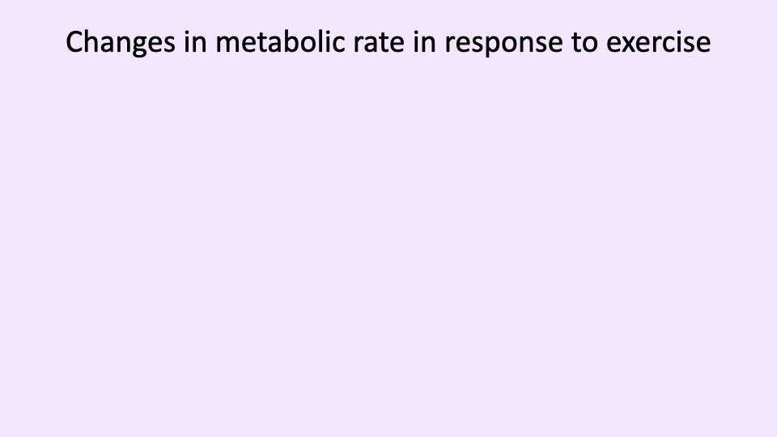

## Slide 1

- This lecture examines how **metabolic energy supply** and **ventilation** change dynamically during the transition from rest to exercise and back to recovery.
- Topics include measurement of oxygen consumption (VO2), the relationship between exercise intensity and metabolic rate, the oxygen deficit and excess post-exercise oxygen consumption (EPOC), ATP production pathways, ventilatory dynamics, and exercise-induced hypoxemia in elite athletes.

---

## Slide 2

### Overview and Learning Objectives

**Overview:**
- Fundamentals of gas exchange and the oxygen supply cascade
- Changes in VO2 and energy supply during exercise
- Ventilatory responses to exercise

**Learning objectives:**
1. Describe how **metabolic energy supply** changes during exercise.
2. Describe **ventilatory responses** to exercise.
3. Discuss conditions that may lead to **pulmonary limitations** in gas exchange.
4. Define **ventilation-perfusion ratio (V/Q)** and discuss how variation in V/Q may limit gas exchange.

---

## Slide 3

### Review: Steps in the Oxygen Supply Cascade

- **Step 1 — Pulmonary ventilation** (environment to alveoli): Governed by gas laws and the **Fick principle**.
  - The equation based on internal (alveolar) variables:

$$\dot{V}O_2 = \dot{V}_A \times F_AO_2 - F_{\overline{v}}O_2$$

  - The equation based on externally measurable variables:

$$\dot{V}O_2 = \dot{V}_E \times (F_IO_2 - F_EO_2)$$

- **Step 2 — Alveolar gas exchange** (lungs to capillary blood): Governed by **Fick's law of diffusion** and the **diffusion capacity** of the lungs.

$$\dot{V}O_2 = D_L(P_AO_2 - P_aO_2)$$

- The key principle is that **partial pressure gradients** drive gas transport from the lungs into the blood.

---

## Slide 4

### Factors Influencing Alveolar Partial Pressures: Inspired Air

- The **partial pressures of inspired air** (PO₂ and PCO₂) are a key factor affecting alveolar gas composition.
- **Altitude** reduces atmospheric pressure and therefore reduces PIO2, resulting in lower alveolar PO₂.
- **Indoor air quality** affects PCO₂ — inadequate ventilation in enclosed spaces causes CO2 to build up from exhaled air.
  - Portable **CO2 monitors** became popular during the COVID-19 pandemic to assess indoor ventilation adequacy.
  - Elevated indoor CO2 reflects poor air circulation and can also influence breathing dynamics by altering sensed CO2 partial pressures.

---

## Slide 5

### Factors Influencing Alveolar Partial Pressures: Ventilation Rate

- At a **constant metabolic rate**, the alveolar partial pressures depend on the ventilation rate.
- As ventilation increases:
  - **PAO2 rises** (more fresh air replaces consumed O2).
  - **PACO2 falls** (CO2 is washed out more efficiently).
- **Hyperventilation**: Ventilation exceeding metabolic demands — leads to elevated PAO2 and reduced PACO2.
- **Hypoventilation**: Ventilation below metabolic demands — leads to reduced PAO2 and elevated PACO2.
- Homeostatic control mechanisms normally **match ventilation rate to metabolic demands**, maintaining equilibrium.

---

## Slide 6

### Factors Influencing Alveolar Partial Pressures: Metabolic Rate

- At a **constant alveolar ventilation**, changes in metabolic rate alter alveolar partial pressures.
- As metabolic rate increases:
  - **PAO2 decreases** because O2 is consumed faster by the mitochondria, creating a larger oxygen sink in the tissues.
  - **PACO2 increases** because more CO2 is produced and must be removed.
- In practice, homeostatic processes **match ventilation to metabolic demand**, so that ventilation also increases when metabolic rate rises.
- If ventilation fails to keep pace with metabolic demand, alveolar gas composition shifts unfavorably.

---

## Slide 7

### Calculating Alveolar PO₂ and PCO₂

- **Clinical alveolar ventilation equation** for PACO2:

$$P_ACO_2 = \frac{\dot{V}CO_2}{\dot{V}_A} \times K$$

  - $K = 863 \text{ mmHg}$ when flow rates are in L/min (BTPS) and $\dot{V}CO\_2$ is measured in mL/min (STPD).

- **Alveolar gas equation** for PAO2:

$$P_AO_2 = P_IO_2 - \frac{P_ACO_2}{R} \times \left(1 - F_IO_2 \times \frac{1 - R}{R}\right)$$

- Together, these equations allow the calculation of alveolar PO₂ and PCO₂ from **non-invasive external measurements**.
- The constant $K$ depends on the units used — always verify unit consistency when performing calculations.

---

## Slide 8

- This section transitions to the core topic of the lecture: how metabolic rate (measured as VO2) changes in response to exercise, including the equipment used, calculation methods, and the relationship between exercise intensity and oxygen consumption.

---

## Slide 9

![Slide titled "Measurement of VO2" showing a photo of a subject exercising on a treadmill while wearing a face mask connected to metabolic measurement equipment. The slide lists three required components: gas analyzers (fractional concentration of O2 and CO2), a pneumotachometer (gas volume flow rate at STPD), and two-way breathing valves (to measure exhaled and inhaled air separately). Below is a worked example: ventilation (STPD) = 60 L/min, inspired O2 = 21%, expired O2 = 17%, subject mass = 60 kg. The equation VO2 = VE times (FIO2 minus FEO2) is shown, with the prompt "Calculate VO2 based on the information provided."](images/lec05/slide-009.png)

### Measurement of VO2

- **VO2** (volume rate of oxygen consumption) is typically measured in mL O2/min and is a fundamental measure of metabolic rate.
- Three essential pieces of equipment are required:
  1. **Gas analyzers** — measure fractional concentrations of O2 and CO2 in exhaled air. CO2 analyzers are generally cheaper and more readily available than O2 analyzers. If only one gas is measured, a specific **respiratory exchange ratio (R)** must be assumed.
  2. **Pneumotachometer** — measures the volume flow rate of gas (at STPD conditions).
  3. **Two-way breathing valves** — separate the inhaled and exhaled gas circuits for independent measurement. If unavailable, measurements can be taken on the exhaled circuit alone using assumed values for inspired air composition.

### Calculation of Mass-Specific VO2

- The equation for VO2:

$$\dot{V}O_2 = \dot{V}_E \times (F_IO_2 - F_EO_2)$$

- **Example calculation**: Given $\dot{V}\_E = 60$ L/min, $F\_IO\_2 = 0.21$, $F\_EO\_2 = 0.17$, and body mass = 60 kg:

$$\dot{V}O_2 = 60 \times (0.21 - 0.17) = 60 \times 0.04 = 2.4 \text{ L/min} = 2400 \text{ mL/min}$$

- **Mass-specific VO2**:

$$\dot{V}O_2 = \frac{2400 \text{ mL/min}}{60 \text{ kg}} = 40 \text{ mL/kg/min}$$

- Mass-specific values (mL/kg/min) are the **standard units** for comparing VO2 across subjects and species.
- Problems can be posed in different ways — students should practice solving for any unknown variable in the equation (e.g., given VO2 and ventilation rate, solve for exhaled fractional concentration).

---

## Slide 10

### Walking and Running Speed vs. Steady-State VO2

- Within the **aerobic range**, VO2 increases approximately **linearly** with speed for both walking and running.
- **Walking**: $\dot{V}O\_2 = 0.1x + 3.5$ (mL/kg/min), where $x$ is speed in m/min.
- **Running**: $\dot{V}O\_2 = 0.2x + 3.5$ (mL/kg/min).
- Key observations:
  - Running is **more metabolically expensive** than walking at any given speed (higher intercept when extrapolated).
  - The **slope** for running (0.2) is steeper than for walking (0.1), meaning metabolic cost increases faster with speed during running.
  - The y-intercept of 3.5 mL/kg/min represents the approximate **resting metabolic rate**.
- These are **steady-state** values, measured after sufficient time (3-5 minutes) at each speed for metabolic equilibrium to be reached.

---

## Slide 11

### Cycling Work Rate vs. VO2

- During **cycle ergometry**, there is an approximately **linear relationship** between work rate (watts) and steady-state VO2.
- VO2 increases from approximately 15 mL/kg/min at 50 W to approximately 37 mL/kg/min at 200 W.
- These measurements represent **steady-state** values — the metabolic machinery requires time to ramp up at each work rate.
  - Each data point is measured after at least 3-5 minutes at a constant work rate to reach a plateau.
- In real-world exercise (e.g., a bicycle race), work rate fluctuates constantly, so VO2 would also fluctuate rather than remaining at a constant steady state.

---

## Slide 12

### Metabolic Cost of Running Varies Among Individuals

- The **metabolic cost of running** (measured in mL O2/kg/km) varies significantly among individuals.
- **Elite runners** have the lowest cost (~180 mL/kg/km), **good runners** are intermediate (~192 mL/kg/km), and **untrained runners** have the highest cost (~200 mL/kg/km).
- There is approximately a **10% difference** in running economy between elite and untrained runners.
- **Running economy** improves with training because trained individuals develop more efficient movement patterns, reducing overall energetic cost for the same speed.
- This concept is known as **running economy** or **locomotor economy** — a key factor in endurance performance.

---

## Slide 13

![Graph titled "Metabolic dynamics: transition from rest to exercise." The x-axis shows exercise time in minutes (Rest to 10 min), and the y-axis shows VO2 in L/min (approximately 0.8 to 2.0). A pink shaded region shows the steady-state VO2 level. A dark blue shaded triangular region between the immediate exercise demand (a square-wave step up) and the slowly rising VO2 curve is labeled "O2 deficit." The VO2 curve rises from resting baseline and gradually reaches a plateau (steady-state VO2) after about 4 minutes.](images/lec05/slide-013.png)

### Metabolic Dynamics: Rest-to-Exercise Transition

- When exercise begins at a constant work rate, the **ATP demand increases immediately** (square-wave step).
- However, **oxygen uptake (VO2) increases gradually**, taking 1-4 minutes to reach steady state.
- The **oxygen deficit** is the difference between the total energy demand and the energy supplied by aerobic metabolism during this ramp-up period (the dark shaded area between the square wave and the VO2 curve).
- The oxygen deficit represents energy produced through **anaerobic pathways** (phosphocreatine and anaerobic glycolysis) while the oxidative machinery ramps up.
- The time to reach steady state varies based on:
  - **Training status** — highly trained athletes ramp up aerobic metabolism faster.
  - **Exercise type and intensity**.

---

## Slide 14

![Text slide titled "Metabolic dynamics: transition from rest to exercise" listing key bullet points. At rest, almost all ATP is produced through aerobic metabolism. In exercise, ATP use and production increase immediately; initial ATP production is through anaerobic pathways. Oxygen uptake takes 1-4 minutes to reach steady state. The oxygen deficit is the lag in oxygen uptake at the start of exercise. At steady state for sub-maximal exercise, almost all ATP is supplied by aerobic metabolism, unless operating above VO2max.](images/lec05/slide-014.png)

### Metabolic Dynamics: Key Points

- **At rest**: Almost all ATP is produced through **aerobic metabolism**, which can easily meet steady-state resting demands.
- **At the onset of exercise**:
  - ATP use and production **increase immediately**.
  - Initial ATP production is through **anaerobic pathways** because aerobic metabolism requires time to ramp up.
- **Oxygen uptake** takes 1-4 minutes to reach steady state.
- The **oxygen deficit** reflects the energy gap caused by the lag in oxygen uptake at the start of exercise.
- Once **steady state** is reached for sub-maximal exercise, almost all ATP is supplied by **aerobic metabolism**.
- If exercise intensity exceeds **VO2max**, anaerobic pathways continue to be used throughout the exercise bout, increasing the oxygen deficit.

---

## Slide 15

### Three ATP Production Pathways

**1. Immediate energy — Phosphocreatine (PCr) pathway:**
- The fastest ATP source, available instantaneously because PCr is stored within muscle cells.

$$H_2O + ATP \rightarrow H^+ + ADP + P_i$$

$$H^+ + ADP + PCr \rightarrow ATP + Creatine$$

**2. Anaerobic glycolysis:**
- The next fastest pathway; metabolizes glucose to pyruvate without oxygen.

$$C_6H_{12}O_6 + 2\,NAD^+ + 2\,ADP + 2P_i \rightarrow 2\,\text{pyruvate} + 2\,NADH + 2\,H^+ + 2\,ATP$$

- Produces only **2 ATP per glucose** molecule.

**3. Aerobic metabolism (oxidative phosphorylation):**
- The slowest to activate but produces far more ATP per glucose molecule.

$$C_6H_{12}O_6 + 6O_2 \rightarrow 6CO_2 + 6H_2O + 36\,ATP$$

- The 36 ATP is a **theoretical yield**; the actual yield is estimated at **29-32 ATP** due to mitochondrial inefficiency.
- This pathway produces substantially more energy per glucose but requires the full oxidative machinery to be operational.

---

## Slide 16

![Graph titled "Metabolic dynamics: transition from rest to exercise" showing VO2 (L/min) versus exercise time (minutes). The same O2 deficit graph as slide 13, but with three numbered labels corresponding to ATP production pathways shown on the right. Label 1 (at the immediate jump) corresponds to ADP + PCr yielding ATP + Cr. Label 2 (during the rising curve) corresponds to Glucose yielding Pyruvate yielding Lactate. Label 3 (at steady state) corresponds to Glucose yielding Pyruvate yielding Oxidative Phosphorylation.](images/lec05/slide-016.png)

### Mapping ATP Pathways to the VO2 Curve

- Each ATP production pathway corresponds to a specific phase of the rest-to-exercise transition:
  1. **Phase 1 (immediate jump)** — The **phosphocreatine pathway** provides instantaneous ATP from PCr stores within muscle. This accounts for the initial spike in energy supply.
  2. **Phase 2 (rising curve)** — **Anaerobic glycolysis** converts glucose to pyruvate and then to lactate, producing ATP without oxygen. This pathway fills the energy gap during the O2 deficit period and results in **lactic acid accumulation**.
  3. **Phase 3 (steady state)** — **Aerobic metabolism** (oxidative phosphorylation) takes over once the oxidative machinery is fully operational. Pyruvate enters the mitochondria for complete oxidation, meeting the entire energy demand.
- The transition from anaerobic to aerobic pathways explains the shape of the VO2 curve during the onset of exercise.

---

## Slide 17

![Slide titled "Oxygen deficit and excess post-exercise O2 consumption (EPOC)" showing two graphs side by side. Left graph: VO2 over time showing rest, exercise onset, exercise period with O2 deficit (shaded area above VO2 curve and below demand line), exercise cessation, and recovery with EPOC (shaded area below the VO2 curve as it returns to baseline). A rapid component and slow component of EPOC are labeled. Right graph: A similar plot showing how the oxygen deficit increases with exercise intensity when demand exceeds VO2max, with a larger EPOC area.](images/lec05/slide-017.png)

### Oxygen Deficit and Excess Post-Exercise Oxygen Consumption (EPOC)

- After exercise stops, VO2 does **not immediately return** to resting levels — it gradually declines back to baseline.
- The elevated oxygen consumption after exercise is called **excess post-exercise oxygen consumption (EPOC)**.
- Historically, EPOC was called **"oxygen debt"**, implying the body was "paying back" the deficit. However, the EPOC area is typically **larger** than the oxygen deficit for complex physiological reasons.
- EPOC has two components:
  - **Rapid component**: A fast initial decline in VO2 (first ~2 minutes).
  - **Slow component**: A gradual exponential return to baseline over a longer period.
- When exercise intensity **exceeds VO2max**:
  - The oxygen deficit is larger because anaerobic pathways are used continuously throughout exercise.
  - EPOC magnitude and duration increase sharply.
  - The energy demand exceeds oxidative capacity, so anaerobic sources must supplement aerobic metabolism throughout the exercise bout.

---

## Slide 18

### Rapid and Slow Portions of EPOC

**Rapid portion of EPOC:**
- **Resynthesis of phosphocreatine (PCr)** stores in muscle — this is a reversible reaction that can be rapidly restored.
- **Replenishing oxygen stores in myoglobin** — myoglobin in muscle serves as an oxygen store and buffer that is depleted during exercise.
- **Replenishing hemoglobin O2 stores** in the blood — ensuring full saturation of hemoglobin after exercise.

**Slow portion of EPOC:**
- **Increased body temperature** — thermoregulation requires energy to return body temperature to equilibrium. Environmental conditions (exercising in heat vs. cold) affect the magnitude of this component.
- **Conversion of lactic acid to glucose** — **gluconeogenesis** in the liver converts accumulated lactate back to glucose.
- **Elevated hormones** — increased blood levels of **epinephrine and norepinephrine** keep metabolic rate elevated above baseline.
- The slow portion does not relate directly to the oxygen deficit; it reflects broader physiological changes induced by exercise that take time to resolve.
- EPOC is one reason why regular exercise helps maintain elevated metabolic rate beyond the exercise bout itself.

---

## Slide 19

### Measuring VO2max with an Incremental Exercise Test

- **VO2max** is determined using an **incremental exercise test** on a treadmill or cycle ergometer.
- The protocol involves progressively increasing work rate at regular intervals (3-5 minutes per stage) to allow steady-state VO2 at each level.
- Each data point represents the **steady-state VO2** measured after a plateau is reached at that work rate.
- VO2 increases **linearly** with work rate up to a point where it begins to **plateau** — this inflection point defines **VO2max**.
- Beyond VO2max, further increases in work rate do not produce additional increases in VO2.
- **Challenges of VO2max testing**:
  - Subjects often **give up before reaching true VO2max** due to exhaustion.
  - **Elite athletes** tend to produce more reliable VO2max measurements because they are accustomed to pushing their physical limits.
  - In untrained individuals, the test may need to be terminated before a clear plateau is observed, requiring VO2max to be estimated.

---

## Slide 20

![Text slide titled "Ventilatory responses in steady state exercise." Describes the ventilatory response to fixed level of submaximal exercise, divided into 4 phases: Phase I — sudden increase at onset; Phase II — ventilation gradually increases; Phase III — steady state ventilation maintained; Phase IV — gradual return to resting levels. A small graph shows minute ventilation over time through rest, exercise onset, exercise, and recovery. A note indicates that Phase IV reflects excess post-exercise oxygen consumption (EPOC), related to the oxygen deficit.](images/lec05/slide-020.png)

### Ventilatory Responses in Steady-State Exercise

- The ventilatory response to a fixed level of **submaximal exercise** follows four phases:
  - **Phase I** — A **sudden increase** in ventilation at exercise onset, driven by immediate sensing of increased ATP use and CO2 production.
  - **Phase II** — Ventilation **gradually increases** further as the metabolic machinery ramps up, creating a deeper oxygen sink in the supply cascade.
  - **Phase III** — **Steady-state ventilation** is maintained, matching metabolic demand. This corresponds to steady-state VO2.
  - **Phase IV** — After exercise cessation, ventilation drops rapidly but does not immediately return to resting levels; it then **gradually returns to baseline**, mirroring the EPOC period.
- Phase IV reflects the EPOC — the body's continued elevated metabolic needs during recovery, including PCr resynthesis, myoglobin and hemoglobin reoxygenation, thermoregulation, and metabolic clearance.

---

## Slide 21

![Slide titled "Changes in Breathing Pattern During Exercise" showing a spirometry trace schematic. The trace illustrates tidal volume at rest (f = 12 breaths/min), then moderate exercise (f = 18), then heavy exercise (f = 35), and very heavy exercise (f = 45). At rest, breathing uses a narrow range around functional residual capacity. During moderate exercise, inspiratory reserve volume is increasingly used (larger inhalations) and some expiratory reserve volume is also recruited. During heavy and very heavy exercise, tidal volume plateaus near its maximum while breathing frequency increases substantially. Labels indicate inspiratory volume, tidal volume, expiratory reserve volume, and residual volume.](images/lec05/slide-021.png)

### Changes in Breathing Pattern During Exercise

- **Minute ventilation** ($\dot{V}\_E$) is the product of **breathing frequency** ($f\_b$) and **tidal volume** ($V\_T$).
- At **rest**: Breathing frequency is approximately 12 breaths/min, and tidal volume uses a small fraction of total lung capacity.
- As exercise intensity increases:
  - **Both tidal volume and breathing frequency increase** initially.
  - Tidal volume increases by using both the **inspiratory reserve volume** (deeper inhalations) and the **expiratory reserve volume** (more forceful exhalations).
- At **moderate exercise** ($f$ ~ 18): Both $V\_T$ and $f\_b$ increase.
- At **heavy exercise** ($f$ ~ 35): Tidal volume approaches its **physical limit** — further increases in ventilation rely more heavily on increases in frequency.
- At **very heavy exercise** ($f$ ~ 45, approaching 100% VO2max): **Breathing frequency increases disproportionately** compared to tidal volume because the muscular effort to further expand tidal volume becomes prohibitive.
- This shift from volume-dominated to frequency-dominated ventilation increases reflects the **mechanical limits of the lung and respiratory muscles**.

---

## Slide 22

![Slide titled "Ventilation in steady state exercise" showing actual measured breathing data from a journal article (Mateika and Duffin, 1995, Eur J Appl Physiol). Three columns of data traces are shown for light, moderate, and heavy exercise. The top row shows ventilation rate (each dot represents one breath), the middle row shows PCO2, and the bottom row shows PO2. In light and moderate exercise, ventilation and partial pressures approach a steady state. In heavy exercise, ventilation continues to rise progressively without reaching a plateau, and PCO2 decreases over time, suggesting ventilation exceeds metabolic demand. An illustration of a person exercising on equipment is shown.](images/lec05/slide-022.png)

### Ventilation Data During Steady-State Exercise

- Real ventilation data from a published study (Mateika and Duffin, 1995) illustrates breath-by-breath measurements during light, moderate, and heavy exercise.
- Each dot on the ventilation trace represents **one measured breath**.
- **Light and moderate exercise**:
  - Ventilation rate reaches an approximate **steady state**.
  - PCO₂ stabilizes at a relatively constant level.
  - PO₂ also stabilizes — the system achieves homeostatic balance.
- **Heavy exercise**:
  - Ventilation continues to **increase progressively** without reaching a plateau.
  - PCO₂ **decreases** over time, suggesting that ventilation is exceeding metabolic CO2 production (a relative hyperventilation).
  - PO₂ dynamics also do not stabilize.
- In very intense exercise, the **homeostatic steady state breaks down** because the steps in the oxygen supply cascade are no longer fully matched, and the specific limiting factors depend on individual physiology.

---

## Slide 23

![Slide titled "Changes in ventilation and blood gases during incremental workload exercise." Left: A dual-axis graph showing ventilation (L/min) and PaO2 (mmHg) versus work rate, comparing an untrained student and an elite trained runner. Ventilation increases linearly up to 50-70% VO2max (the ventilatory threshold), then increases exponentially. The exponential increase is more pronounced in the elite athlete. Right: The PaO2 (arterial oxygen) in the elite athlete drops notably at high work rates, indicating exercise-induced hypoxemia, while the untrained student maintains relatively stable PaO2. Bullet points note the linear increase to the ventilatory threshold, the exponential increase beyond it, notable PaO2 differences between untrained and elite athletes approaching VO2max, and the concept of exercise-induced hypoxemia.](images/lec05/slide-023.png)

### Ventilation and Blood Gases During Incremental Exercise

- During an **incremental workload test**, ventilation increases **linearly** with work rate up to approximately 50-70% of VO2max.
- The point at which ventilation begins to increase exponentially is called the **ventilatory threshold**.
- Beyond the ventilatory threshold, ventilation rate increases **exponentially**.
- The exponential increase is **more pronounced in elite athletes** compared to untrained individuals.
- **Arterial oxygen saturation (PaO2)**:
  - In **untrained individuals**: PaO2 remains relatively stable across all work rates.
  - In **elite athletes**: PaO2 **drops significantly** at the highest work rates, reflecting a phenomenon called **exercise-induced hypoxemia (EIAH)**.
- This means that in elite athletes, metabolic demands at peak exercise intensity **exceed the lungs' ability to maintain adequate oxygenation** of the blood.

---

## Slide 24

![Slide titled "Impact of endurance exercise training on ventilation during exercise." A graph shows work rate (watts) versus ventilation (L/min BTPS), with two curves: "Before training" (higher) and "After training" (lower). After endurance training, baseline ventilation at each work rate is reduced. Bullet points list the mechanism: increased aerobic capacity of locomotor muscles results in lower H+ production; this shifts afferent feedback from muscles that stimulate breathing, reducing the ventilatory response at each work rate.](images/lec05/slide-024.png)

### Impact of Endurance Training on Ventilation

- After **endurance training**, ventilation rate at any given work rate is **reduced** compared to pre-training values.
- **Mechanism**:
  - Training increases the **aerobic capacity of locomotor muscles**.
  - Greater aerobic capacity reduces reliance on anaerobic pathways, resulting in **lower hydrogen ion (H+) production** during exercise.
  - Reduced H+ production **shifts the sensory (afferent) feedback** from muscles that stimulates breathing.
  - Since the control of breathing is highly sensitive to **blood pH**, lower acid production means less stimulation of ventilation.
- The result is that trained individuals can perform the same work rate with **less ventilatory effort**, reflecting improved metabolic efficiency.

---

## Slide 25

![Slide titled "Exercise induced hypoxemia in elite athletes (EIAH)." Left: Two graphs from Dempsey and Wagner (1999, J Appl Physiol). The top graph shows oxygen uptake and arterial O2 saturation versus work rate under three conditions: hyperoxia (FIO2 = 0.26), normoxia (FIO2 = 0.21), and hypoxia (FIO2 = 0.15). Arterial saturation drops at high work rates in normoxia and at lower work rates in hypoxia, but is corrected by supplemental oxygen. Right: A photo of elite female distance runners competing in a race.](images/lec05/slide-025.png)

### Exercise-Induced Hypoxemia in Elite Athletes (EIAH) — Human Data

- A study by Dempsey and Wagner (1999) investigated EIAH by measuring elite athletes under three oxygen conditions:
  - **Hyperoxia** ($F\_IO\_2 = 0.26$) — supplemental oxygen.
  - **Normoxia** ($F\_IO\_2 = 0.21$) — normal room air.
  - **Hypoxia** ($F\_IO\_2 = 0.15$) — reduced oxygen.
- Key findings:
  - In **normoxia**, arterial oxygen saturation **drops at high work rates** in elite athletes.
  - **Supplemental oxygen (hyperoxia) corrects the desaturation**, confirming that the limitation is **pulmonary** — the lungs cannot deliver enough oxygen to meet demand.
  - In **hypoxia**, the desaturation occurs at **lower work rates**, shifting the onset earlier.
- This demonstrates that the limitation in EIAH resides in the **pulmonary gas exchange** step of the oxygen supply cascade, not in cardiac output or muscle oxygen extraction.

---

## Slide 26

### Exercise-Induced Hypoxemia — Comparative Evidence from Thoroughbred Racehorses

- The same EIAH phenomenon has been demonstrated in **thoroughbred racehorses**, which are also elite athletes bred for maximal aerobic performance.
- Under **normoxia**, horses show a significant drop in arterial O2 saturation at high treadmill speeds.
- **Supplemental oxygen mostly corrects** the desaturation, confirming a pulmonary limitation.
- This cross-species comparison demonstrates that EIAH is a **general physiological phenomenon** in elite athletes — not unique to humans — occurring when cardiovascular capacity outpaces pulmonary capacity at peak exercise intensities.

---

## Slide 27

### Negative Correlation Between VO2max and Arterial PO₂

- A study by Hopkins (2006) measured **arterial PaO2** at 90-100% VO2max across a population of athletes.
- The data show a **negative correlation** ($R = -0.64$) between VO2max and PaO2:
  - Athletes with the **highest VO2max** values show the **most pronounced exercise-induced hypoxemia** (lowest PaO2).
  - Athletes with lower VO2max values maintain relatively higher arterial oxygenation.
- This finding reinforces the concept that **pulmonary gas exchange** becomes a limiting factor specifically in the most elite, highly trained athletes whose cardiovascular and muscular adaptations have outpaced the capacity of the respiratory system.

---

## Slide 28

![Text slide titled "Does pulmonary function limit performance?" with bullet points. Pulmonary function is NOT a limitation in most healthy individuals at sea level and most exercise intensities. However, respiratory muscle fatigue may limit performance during very long endurance events (marathons, ultra-marathons). Gas exchange does limit performance in some elite endurance athletes: 40-50% of elite athletes experience exercise-induced hypoxemia (EIAH). Specific mechanisms remain debated (multiple possible factors listed): inadequate hyperventilation, mechanical limitations due to constraints on lung capacity (maximum tidal volume range), changes in breathing (such as increased chemosensitivity), ventilation/perfusion mismatch and heterogeneity (more later in the course), and short RBC transit time due to high cardiac output.](images/lec05/slide-028.png)

### Does Pulmonary Function Limit Performance?

- In **most healthy individuals** at sea level and at most exercise intensities, pulmonary function is **NOT the limiting factor** in oxygen delivery.
- **Exception — Endurance events**: During very long endurance events (marathons, ultra-marathons), **respiratory muscle fatigue** can limit ventilatory capacity and thus limit performance.
- **Exception — Elite athletes**: Pulmonary gas exchange **does limit performance** in some elite endurance athletes.
  - An estimated **40-50% of elite athletes** experience exercise-induced hypoxemia (EIAH).
  - Specific mechanisms remain debated, but multiple possible factors include:
    1. **Inadequate hyperventilation** — failure to increase ventilation sufficiently to match extreme metabolic demands.
    2. **Mechanical constraints on lung capacity** — physical limits on maximum tidal volume range.
    3. **Changes in chemosensitivity** — altered breathing control responses.
    4. **Ventilation/perfusion (V/Q) mismatch** and heterogeneity — uneven matching of airflow and blood flow in different lung regions.
    5. **Short red blood cell transit time** — extremely high cardiac output in elite athletes reduces the time available for O2 diffusion in pulmonary capillaries.
- The heart is highly **trainable** (it can adapt to pump more blood), but the lungs have a more **limited capacity for adaptation** — creating a potential mismatch in elite athletes.

---

## Slide 29

![Summary slide titled "Metabolic dynamics and ventilation during exercise," identical to Slide 2, listing the overview (fundamentals of gas exchange and the oxygen supply cascade; changes in VO2 and energy supply during exercise; ventilatory responses to exercise) and four learning objectives: (1) Describe how metabolic energy supply changes during exercise, (2) Describe ventilatory responses to exercise, (3) Discuss conditions that may lead to pulmonary limitations in gas exchange, (4) Define ventilation-perfusion ratio (V/Q) and discuss how variation in V/Q may limit gas exchange.](images/lec05/slide-029.png)

### Lecture 5 — Key Takeaways

1. **VO2** is the fundamental measure of metabolic rate, calculated from ventilation rate and the difference in inspired vs. expired oxygen fractions. Mass-specific VO2 (mL/kg/min) allows comparison across individuals and species.
2. VO2 increases **linearly** with exercise intensity (speed or work rate) in the aerobic range, and **running economy** varies among individuals, improving with training.
3. The transition from rest to exercise involves an **oxygen deficit** — the period during which anaerobic pathways (phosphocreatine, anaerobic glycolysis) supplement aerobic metabolism until oxidative phosphorylation reaches steady state.
4. **EPOC** (excess post-exercise oxygen consumption) has rapid and slow components reflecting PCr resynthesis, oxygen store replenishment, thermoregulation, gluconeogenesis, and hormonal effects.
5. Ventilatory responses to exercise follow four phases, with both **tidal volume and breathing frequency** increasing, though frequency dominates at very high intensities.
6. **Exercise-induced hypoxemia (EIAH)** occurs in 40-50% of elite athletes, demonstrating that pulmonary gas exchange — not cardiac output — becomes the limiting factor at peak performance levels.

---

## Key Equations

| Equation | Name | Description |
|----------|------|-------------|
| $\dot{V}O\_2 = \dot{V}\_E \times (F\_IO\_2 - F\_EO\_2)$ | VO2 from expired air | Oxygen consumption rate from minute ventilation and the difference in inspired vs. expired O2 fractions |
| $\text{Mass-specific } \dot{V}O\_2 = \frac{\dot{V}O\_2}{m\_{body}}$ | Mass-specific VO2 | VO2 divided by body mass; standard units are mL/kg/min |
| $\dot{V}O\_2 = 0.1x + 3.5$ | Walking VO2 | Estimated VO2 (mL/kg/min) for walking at speed $x$ (m/min) |
| $\dot{V}O\_2 = 0.2x + 3.5$ | Running VO2 | Estimated VO2 (mL/kg/min) for running at speed $x$ (m/min) |
| $P\_ACO\_2 = \frac{\dot{V}CO\_2}{\dot{V}\_A} \times K$ | Clinical alveolar ventilation equation | Calculates alveolar PCO₂ from CO2 production rate and alveolar ventilation; $K = 863$ mmHg |
| $P\_AO\_2 = P\_IO\_2 - \frac{P\_ACO\_2}{R}$ | Alveolar gas equation (simplified) | Estimates alveolar PO₂ from inspired PO₂, alveolar PCO₂, and respiratory exchange ratio $R$ |
| $H^+ + ADP + PCr \rightarrow ATP + Creatine$ | Phosphocreatine pathway | Immediate ATP production from phosphocreatine stored in muscle |
| $C\_6H\_{12}O\_6 + 6O\_2 \rightarrow 6CO\_2 + 6H\_2O + 36\,ATP$ | Aerobic metabolism (theoretical) | Complete oxidation of glucose; actual yield is 29-32 ATP |
| $\dot{V}\_E = f\_b \times V\_T$ | Minute ventilation | Total ventilation rate equals breathing frequency times tidal volume |

---

## Glossary of Key Terms

| Term | Definition |
|------|-----------|
| **VO2** | Volume rate of oxygen consumption; the standard measure of metabolic rate, typically expressed in mL O2/min or mL/kg/min. |
| **Mass-specific VO2** | Oxygen consumption rate normalized to body mass (mL/kg/min), used for comparing metabolic rates across individuals or species. |
| **VO2max** | The maximum rate of oxygen consumption attainable during incremental exercise; represents the upper limit of aerobic metabolism. |
| **Pneumotachometer** | An instrument that measures the flow rate of gas (air) during breathing, essential for metabolic rate measurement. |
| **Respiratory exchange ratio (R)** | The ratio of CO2 produced to O2 consumed (VCO2/VO2); reflects the metabolic substrate being used. |
| **Running economy** | The metabolic cost of running at a given speed, expressed as O2 consumption per unit distance (mL/kg/km); lower values indicate greater efficiency. |
| **Oxygen deficit** | The difference between the total energy demand at the onset of exercise and the energy supplied aerobically during the period before VO2 reaches steady state. |
| **EPOC (Excess Post-Exercise Oxygen Consumption)** | The elevated oxygen consumption that persists after exercise ends, reflecting physiological recovery processes including PCr resynthesis, oxygen store replenishment, thermoregulation, and gluconeogenesis. |
| **Phosphocreatine (PCr) pathway** | The fastest ATP production pathway; uses phosphocreatine stored in muscle to immediately regenerate ATP from ADP. |
| **Anaerobic glycolysis** | The metabolic pathway that converts glucose to pyruvate and then lactate without oxygen, yielding 2 ATP per glucose molecule. |
| **Aerobic metabolism (Oxidative phosphorylation)** | The metabolic pathway that fully oxidizes glucose using O2 in the mitochondria, theoretically yielding 36 ATP (actual yield ~29-32 ATP). |
| **Ventilatory threshold** | The exercise intensity (typically 50-70% VO2max) at which ventilation begins to increase exponentially rather than linearly with work rate. |
| **Exercise-induced hypoxemia (EIAH)** | A decrease in arterial oxygen saturation during high-intensity exercise, observed in 40-50% of elite athletes due to pulmonary gas exchange limitations. |
| **Myoglobin** | An oxygen-binding protein in muscle tissue that serves as an oxygen store and buffer, facilitating O2 diffusion to mitochondria. |
| **Gluconeogenesis** | The metabolic process of converting lactate (and other substrates) back to glucose, primarily in the liver; contributes to the slow component of EPOC. |
| **Ventilation-perfusion ratio (V/Q)** | The ratio of alveolar ventilation to pulmonary blood flow; mismatches can limit gas exchange efficiency, particularly in elite athletes at high exercise intensities. |
| **Incremental exercise test** | A standardized protocol for measuring VO2max in which work rate is progressively increased at regular intervals until the subject reaches exhaustion or VO2 plateaus. |
| **Hyperventilation** | Breathing in excess of metabolic demand, leading to reduced PACO2 and elevated PAO2. |
| **Hypoventilation** | Breathing below metabolic demand, leading to elevated PACO2 and reduced PAO2. |
