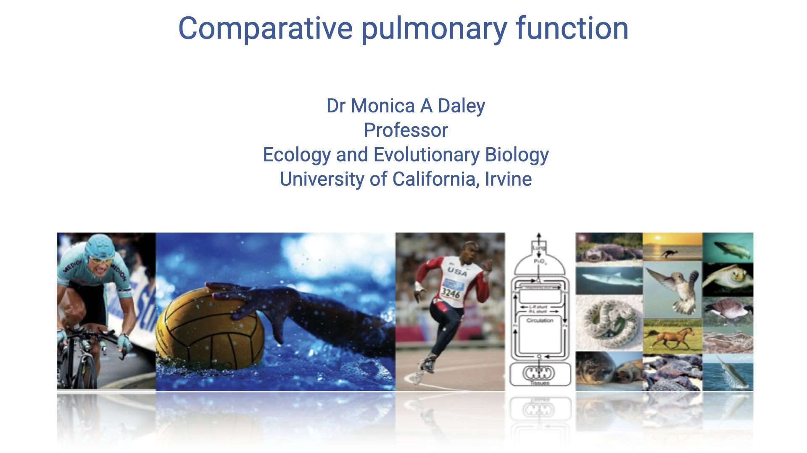

## Slide 1

- This lecture explores the diversity of **lung structure and function** across vertebrate species and how that diversity relates to endurance exercise capacity.
- Building on the oxygen supply cascade and ventilatory physiology covered in earlier lectures, this lecture takes a **comparative approach**, using case studies of birds, crocodilians, lizards, and dinosaurs to illustrate how respiratory architecture limits or enables aerobic performance.

---

## Slide 2

![Slide titled "Review: Exercise induced hypoxemia in elite athletes (EIAH)." Left: a graph with work rate on the x-axis, oxygen uptake (mL/kg/min) on the left y-axis, and arterial O2 saturation (%) on the right y-axis. Three curves show different inspired O2 fractions (FIO2 = 0.26, 0.21, 0.15). At normoxia (0.21), O2 uptake plateaus while arterial saturation drops below 95% at high work rates. Right: photo of elite female distance runners competing in a road race. Citation: Dempsey and Wagner, J Appl Physiol, 1999.](images/lec06/slide-002.png)

### Review: Exercise-Induced Hypoxemia in Elite Athletes (EIAH)

- **Exercise-induced arterial hypoxemia (EIAH)** is observed in approximately 40–50% of elite endurance athletes — and also in elite animal athletes such as **thoroughbred racehorses**.
- At high work rates, arterial O2 saturation drops below 95% in normoxia; supplemental O2 ameliorates the effect, indicating a **pulmonary limitation** on O2 uptake.

### Does Pulmonary Function Limit Performance?

- For most healthy individuals at sea level, **pulmonary function is NOT the limiting factor** for exercise performance at most intensities.
- However, pulmonary exchange **does limit performance** in some elite endurance athletes. Mechanisms include:
  - **Inadequate hyperventilation** — mechanical limits on lung airflow, feedback inhibition from mechanical constraints, or decreased chemoreceptor sensitivity
  - **Respiratory muscle fatigue** (especially in extreme endurance events)
  - **Ventilation/perfusion mismatch and heterogeneity** — uneven matching of airflow to blood flow across lung regions
  - **Short red blood cell transit time** — very high cardiac output causes RBCs to pass through pulmonary capillaries too quickly for full O2 diffusion
  - **Pulmonary edema**

---

## Slide 3

![Text slide titled "Does training improve pulmonary function?" Top section explains that ventilation is lower during exercise following endurance training due to increased aerobic capacity of locomotor muscles, resulting in lower H+ production and shifted feedback control. Bottom section notes that training has limited effect on lung structure: normal lung function exceeds demands for gas exchange, training-induced adaptation is not required for most individuals, EIAH occurs only in the most elite athletes, and the lung may have low capacity for structural or developmental adaptation.](images/lec06/slide-003.png)

### Does Training Improve Pulmonary Function?

- Ventilation is actually **lower** during exercise following endurance training.
  - This is thought to result from increased aerobic capacity of locomotor muscles, leading to lower H+ production, which shifts the feedback control mechanisms that stimulate breathing.
- Training has a **limited effect on lung structure**:
  - Normal lung function exceeds demands for gas exchange in most individuals.
  - Training-induced adaptation of the lungs is not typically necessary for performance.
  - EIAH occurs only in the most elite athletes.
  - The lung may have a **low capacity for structural or developmental adaptation** because it is composed mainly of passive elastic tissue, unlike highly adaptable skeletal and cardiac muscle.

---

## Slide 4

![Slide titled "Three-dimensional (3D) lung segmentation for diagnosis of COVID-19 and the communication of disease impact to the public," showing a research paper by Schachner and Spieler. Multiple panels display 3D segmented lung models from CT scans: (A) healthy lung in blue, (B–D) COVID-19 affected lungs showing areas of ground-glass opacity and ARDS in contrasting colors. The right side shows four 3D-rendered lung models in anterior view comparing healthy tissue (blue) against diseased regions (teal/orange/yellow).](images/lec06/slide-004.png)

### COVID-19 and Limited Lung Adaptation

- The limited capacity of the lung to adapt structurally has important clinical implications.
- **3D lung segmentation** from CT scans illustrates the pronounced tissue damage caused by COVID-19 infection.
- Panel A shows a healthy lung model (blue), while panels B–D show COVID-19 positive patients with progressively more severe damage, including ground-glass opacity and ARDS (acute respiratory distress syndrome).
- The contrast between healthy (blue) and damaged (teal/orange/yellow) tissue visually demonstrates how infection can severely compromise gas-exchange surface area.

---

## Slide 5

### Long-Term Lung Damage Following COVID-19

- Longitudinal studies tracking patients for up to **two years** after COVID-19 infection show persistent lung damage.
- Only **61%** of patients showed complete radiologic resolution by two years post-infection.
- **39% had persistent interstitial lung abnormalities** even after two years — demonstrating the lung's limited ability to regenerate and structurally adapt.
- This is partly because lung tissue is predominantly passive and elastic, unlike muscle tissue, which is highly vascularized and responsive to training stimuli.

---

## Slide 6

### Lecture Overview and Learning Objective

**Overview:**
- Comparative case studies on cardiorespiratory physiology

**Learning objective:**
1. Discuss the diversity of **lung structure** present among vertebrates and its relationship with endurance exercise capacity.

---

## Slide 7

### Diversity in Vertebrate Cardiorespiratory Systems

- Vertebrate groups show fundamentally different cardiorespiratory architectures:
  - **Fish** — single-loop circulation; blood passes through gill capillaries then directly to systemic capillaries.
  - **Amphibians and non-crocodilian reptiles** — partially divided heart; mixing of oxygenated and deoxygenated blood creates a functional **cardiac shunt**.
  - **Birds** (highlighted) — uniquely have a **parabronchial lung** with **unidirectional airflow** and **crosscurrent gas exchange**, paired with a fully divided four-chambered heart.
  - **Mammals** — fully divided four-chambered heart with a compliant, **tidal lung**.
- Mammals and birds independently evolved complete ventricular division — an example of **convergent evolution** associated with high aerobic capacity.
- The key difference between birds and mammals lies in **lung design**: birds have a rigid, flow-through lung, while mammals have compliant, tidal lungs.

---

## Slide 8

### Comparative Respiratory Anatomy: Human, Bird, and Insect

- This infographic compares three fundamentally different respiratory designs:
  - **Human lungs** — tidal ventilation; air moves in and out through the same airways; gas exchange in alveoli (dead-end sacs).
  - **Bird lungs** — unidirectional airflow through rigid parabronchi; air sacs serve as bellows; gas exchange occurs in the fixed lung structure.
  - **Grasshopper trachea** — air is delivered directly to tissues through a network of tubes (tracheae); no circulatory involvement in gas transport.
- The bird system **separates the ventilatory function** (air sacs) **from the gas-exchange function** (parabronchi), unlike mammals where the same structures do both.

---

## Slide 9

### Avian Respiratory System — Detailed Anatomy

- The avian respiratory system is fundamentally different from mammalian lungs, consisting of:
  - **Air sacs** — large, thin-walled sacs distributed throughout the body cavity, divided into anterior (cervical, clavicular, cranial thoracic) and posterior (caudal thoracic, abdominal) groups.
  - **Parabronchi** — rigid gas-exchange tubes within the relatively small, compact lung.
  - **Ventro-bronchi and dorso-bronchi** — connecting airways that direct flow through the parabronchi.
- The lung itself is **rigid** and does not expand during breathing — it is a fixed gas exchanger.
- The **air sacs** act as bellows that expand and contract to drive air through the lungs, but **gas exchange does not occur in the air sacs**.
- This arrangement takes up most of the body cavity and is far more elaborate than the mammalian tidal system.

---

## Slide 10

### Advantages of the Avian Respiratory System

- **Unidirectional airflow** minimizes dead space volume and maximizes alveolar PO₂ — fresh air is continuously available at the gas-exchange surface rather than mixing with residual air as in tidal lungs.
- **Functional separation** of ventilation (air sacs) and gas exchange (parabronchi) has important advantages:
  - The ventilatory structures (air sacs) must be tough and elastic to withstand repeated expansion and compression.
  - The gas-exchange structures (parabronchi) can have a **thinner blood-gas barrier** because they do not need to deform mechanically.
  - This thinner barrier improves **diffusion efficiency**, enhancing O2 transfer.
- These features explain why birds have more efficient lungs than mammals, why many birds thrive at **high altitudes**, and why birds can sustain the extreme aerobic demands of **flight**.

---

## Slide 11

### Two-Cycle Breathing in Birds

- A single bolus of air takes **two complete respiratory cycles** to pass through the avian system:
  - **Inhalation (cycle 1):** Air enters through the trachea and flows all the way to the **posterior air sacs** (abdominal region). Some air also passes directly through the lung.
  - **Exhalation (cycle 1):** The posterior air sacs compress and push air through the **rigid parabronchial lung**, where gas exchange occurs. The air then passes into the **anterior air sacs**.
  - **Inhalation (cycle 2):** Fresh air enters the posterior sacs again while the anterior sacs hold the now-deoxygenated air.
  - **Exhalation (cycle 2):** The anterior air sacs compress, expelling the used air out through the trachea.
- This creates **unidirectional airflow** through the gas-exchange surfaces — air always flows in one direction through the parabronchi, regardless of inhalation or exhalation phase.

---

## Slide 12

![Slide titled "Unidirectional airflow may be a factor in the diversity of athletic animals in the archosaur lineage." A phylogenetic tree shows major vertebrate groups from fish (hagfishes, lampreys) through tetrapods to mammals and birds, with archosaurs (crocodilians and birds) highlighted with red markers. Photos on the right show examples of athletic archosaurs: a bird of prey in flight, a running ostrich, a galloping crocodile, and a running cheetah. Text labels note "Athletic animals, high aerobic scope, endurance."](images/lec06/slide-012.png)

### Unidirectional Airflow and the Archosaur Lineage

- Unidirectional pulmonary airflow may have been a key factor enabling the **athletic success of archosaurs** — the lineage that includes dinosaurs, birds, and crocodilians.
- The phylogenetic tree highlights that features of unidirectional airflow likely originated in **ancestral archosaurs** and were further refined in the avian lineage.
- Modern birds and crocodilians both show evidence of structures that direct airflow unidirectionally through the lung, suggesting this trait **preceded the evolution of flight**.
- These respiratory adaptations may help explain the **high aerobic scope and endurance** of athletic archosaurs.
- Birds are among the most impressive vertebrate athletes, capable of sustained flight and high-altitude performance; mammals (cheetahs, canids) provide a parallel example of athletic specialization in a lineage with a different respiratory architecture.

---

## Slide 13

![Slide showing a Journal of Anatomy paper by Schachner et al. (2020, DOI: 10.1111/joa.13358) titled "Anatomy, ontogeny, and evolution of the archosaurian respiratory system: A case study on Alligator mississippiensis and Struthio camelus." Left: photo of researcher Emma R. Schachner, PhD, sitting with a dog surrounded by taxidermy specimens. Right: titled "Phylogeny for Tetrapoda demonstrating the structural diversity of the tetrapod lung," showing a phylogenetic tree with CT-based 3D lung reconstructions for various species labeled (a) through (j), displayed as colorful segmented models.](images/lec06/slide-013.png)

### Research on Archosaurian Respiratory Diversity

- Recent research by **Emma R. Schachner** and colleagues uses advanced **3D imaging and CT-based lung segmentation** to study the structural diversity of tetrapod lungs.
- The phylogenetic tree displays CT-reconstructed lung models for diverse species, revealing much greater complexity in lung structure than previously appreciated.
- Earlier textbook descriptions portrayed reptile lungs as simple and mammalian lungs as "advanced," but these imaging studies reveal **extensive diversity** in lung architecture across vertebrates.
- Advanced imaging techniques can segment delicate lung tissues that are difficult to study through traditional dissection, enabling **computational fluid dynamics** modeling of airflow patterns.

---

## Slide 14

### Structural Diversity of Tetrapod Lungs

- CT-based 3D lung reconstructions reveal that lung architecture is far more complex and diverse across tetrapods than traditionally recognized.
- Some species show **highly partitioned internal structures** with complex airways that help direct airflow in specific patterns.
- Even species without the full air-sac system of birds show internal structures that may promote **unidirectional airflow** within portions of the lung.
- These findings suggest that the structural basis for efficient gas exchange evolved **incrementally** across the tetrapod lineage, rather than appearing abruptly in birds.

---

## Slide 15

![Slide titled "Unidirectional pulmonary airflow patterns in the savannah monitor lizard" with author names (Emma R. Schachner, Robert L. Cieri, James P. Butler, C. G. Farmer). Left: photo of researcher Emma R. Schachner with a dog. Right: Figure 1 labeled "Pulmonary anatomy and airflow patterns of Varanus exanthematicus" showing panels (a–d): a skeleton with lungs highlighted, and CT-based 3D segmented lung models in multiple views with color-coded regions showing distinct anatomical compartments and labeled airflow directions.](images/lec06/slide-015.png)

### Unidirectional Airflow in Monitor Lizards

- Research on the **savannah monitor lizard** (*Varanus exanthematicus*) demonstrates that unidirectional pulmonary airflow is **not exclusive to birds**.
- CT-based 3D lung reconstructions reveal complex internal partitioning with distinct anatomical compartments (color-coded).
- These structures physically direct airflow through the lung in a **unidirectional pattern**, even though monitor lizards lack the complete air-sac system of birds.
- Computational fluid dynamics modeling of these complex structures confirms that airflow follows unidirectional pathways, **minimizing tidal dead space ventilation**.
- This finding supports the hypothesis that efficient airflow patterns evolved early in the archosaur lineage and are more widespread among reptiles than previously known.

---

## Slide 16

### Crocodilian Lung Structure

- CT-based imaging of **crocodilian lungs** reveals complex internal compartmentalization similar to that found in monitor lizards.
- Color-coded 3D segmentations show distinct anatomical regions within the lungs, suggesting structures that direct airflow in specific patterns.
- Crocodilians are **archosaurs** — the same lineage as birds and dinosaurs — and share some features of unidirectional airflow despite lacking the bird-like air-sac system.
- These findings suggest that the **ancestral archosaur lung** already possessed features promoting unidirectional airflow, which were further elaborated in the avian lineage.

---

## Slide 17

![Slide titled "Ostrich (Struthio camelus)" showing four panels (a–d) of CT-based 3D reconstructions. Panels (a–b): lateral and dorsal views of the ostrich skeleton with the respiratory system (lungs and air sacs) segmented and overlaid in color. The lungs (compact, blue) are small relative to the extensive air sacs distributed throughout the body cavity. Panels (c–d): isolated 3D models of the respiratory system with color-coded components labeled: GL (gas-exchanging lung), IAS (interclavicular air sac), CS (cervical sac), CRTS (cranial thoracic sac), AAS (abdominal air sac), CTS (caudal thoracic sac). Citation: Journal of Anatomy, DOI: 10.1111/joa.13358.](images/lec06/slide-017.png)

### Ostrich Respiratory System

- CT-based 3D reconstructions of the **ostrich** (*Struthio camelus*) respiratory system illustrate the dramatic extent of the avian air-sac system.
- The **lungs** (compact blue structures, labeled GL) are relatively **small** compared to the extensive network of air sacs that fill the body cavity.
- Air sac components include:
  - **IAS** — interclavicular air sac
  - **CS** — cervical sac
  - **CRTS** — cranial thoracic sac
  - **CTS** — caudal thoracic sac
  - **AAS** — abdominal air sac
- The air sacs do not participate in gas exchange — they serve purely as bellows to drive unidirectional airflow through the rigid, gas-exchanging lung.
- This architecture demonstrates the extreme specialization of the avian respiratory system compared to the mammalian tidal lung.

---

## Slide 18

![Slide showing a Comparative Biochemistry and Physiology research paper titled "Linking structure and function in the vertebrate respiratory system: A tribute to August Krogh" by C. G. Farmer. Three schematic lung diagrams labeled A, B, and C show: (A) a mammalian-style branching tidal lung; (B) a bird-like tubular unidirectional lung with air sacs; (C) a crocodilian circuit with unidirectional flow. Text on the left: "CT imaging & modeling of fluid dynamics to reveal airflow patterns in lungs. Birds, crocodiles & some lizards have unidirectional airflow through lungs. Birds have the most distinct separation between ventilation and gas exchange."](images/lec06/slide-018.png)

### Key Findings: Airflow Patterns Across Vertebrates

- Advanced **CT imaging and computational fluid dynamics** modeling have revealed airflow patterns in vertebrate lungs that were previously unknown.
- Key findings:
  - **Birds, crocodiles, and some lizards** have unidirectional airflow through their lungs — not just birds.
  - **Birds** have the **most distinct separation** between ventilation and gas exchange functions, with rigid parabronchi for gas exchange and compliant air sacs for ventilation.
- Three schematic lung designs:
  - **(A) Mammalian** — branching, tidal (bidirectional) airflow with dead-end alveoli
  - **(B) Avian** — tubular, unidirectional flow through rigid parabronchi
  - **(C) Crocodilian** — circuit with unidirectional flow elements despite lacking a full air-sac system
- These studies honor the legacy of **August Krogh**, who pioneered the comparative approach to understanding physiological principles.

---

## Slide 19

![A research article page titled "Respiratory evolution in archosaurs" by Brocklehurst, Schachner, Codd, and Sellers (2020). Figure 1 shows a cladogram of Archosauromorpha illustrating evolutionary relationships, with major innovations in respiratory system evolution mapped onto branches. Extant taxa are shown in black and extinct taxa in grey. Labels on the right list eight numbered evolutionary innovations including unidirectional airflow, heterogeneous parabronchial lungs, mobile pubis with pelvic aspiration, diaphragmaticus and hepatic piston breathing, dorsally immobile lungs, post-cranial skeletal pneumaticity, mobile gastralia, uncinate processes, and immobile lungs with thinned blood-gas barriers. Skeletal illustrations by Scott Hartman accompany several clades.](images/lec06/slide-019.png)

### Respiratory Evolution in Archosaurs

- This cladogram traces the **evolutionary innovations** in the respiratory system across the archosaur lineage.
- Major respiratory innovations are mapped onto the phylogeny, showing a progressive accumulation of features:
  1. Unidirectional airflow and heterogeneous parabronchial lungs (basal)
  2. Mobile pubis with pelvic aspiration; hepatic piston breathing
  3. Dorsally immobile lungs (possible thinning of the blood-gas barrier)
  4. Post-cranial skeletal pneumaticity, pneumatic hiatus, cranial and caudal air sacs
  5. Mobile gastralia, cuirassal ventilation
  6. Uncinate processes; possible bipartite post-pulmonary septum
  7. Immobile lungs, thinned blood-gas barrier, bipartite post-pulmonary septum, caudally expanded sternum, no gastralia
- Many features found in modern birds — including unidirectional airflow and pneumatic (air-filled) bones — were likely present in **dinosaur ancestors**.
- Extinct taxa (shown in grey) include diverse dinosaur groups that may have had sophisticated respiratory systems supporting high metabolic rates and activity levels.
- This evolutionary perspective suggests that respiratory efficiency was a key factor in the **ecological dominance of archosaurs**, including dinosaurs.

---

## Slide 20

![Slide titled "Did bird-like lungs allow dinosaurs to dominate? (See supplemental resources on canvas)." Top left: an NPR.org article by Emma Schachner titled "How Did Dinosaurs' Lungs Help Them Dominate The Earth For So Long?" with a brief summary and a URL. Top right: an illustration of dinosaurs in a prehistoric landscape. Bottom right: a screenshot of a YouTube video showing a presenter discussing "the leverage of a particular muscle that they use," with the channel name "Sauropods - Air Holes."](images/lec06/slide-020.png)

### Did Bird-Like Lungs Allow Dinosaurs to Dominate?

- Dinosaurs ruled Earth for approximately **180 million years**, and paleontologist **Emma Schachner** hypothesizes that their lung architecture could have been a key competitive advantage.
- Bird-like respiratory features — including **unidirectional airflow** and potential air-sac systems — may have enabled dinosaurs to achieve higher aerobic capacities than competing vertebrate groups.
- Supplemental resources on Canvas include:
  - An NPR interview with Emma Schachner discussing how dinosaur lungs may have contributed to their ecological dominance
  - A YouTube video exploring sauropod respiratory adaptations
- Studying the diversity of modern animals (birds, crocodilians, lizards) helps reconstruct what respiratory function may have been like in extinct dinosaurs.

---

## Slide 21

### Summary: Unidirectional Airflow and Athletic Diversity

- The **archosaur lineage** — including dinosaurs, birds, and crocodilians — encompasses many of the most **athletic vertebrates** on Earth.
- Features promoting **unidirectional airflow** through the lungs appear to be shared across this lineage, likely originating in a common ancestor.
- These respiratory adaptations are associated with **high aerobic scope** (the ratio of VO2max to basal metabolic rate) and **endurance capacity**.
- Birds represent the most extreme elaboration of this design, with complete separation of ventilation and gas exchange enabling efficient O2 uptake during the high metabolic demands of flight and high-altitude performance.
- The comparative approach reveals that understanding respiratory diversity across species illuminates both **evolutionary history** and **fundamental principles of gas exchange**.

---

## Slide 22

### Lecture 6 — Key Takeaways

1. **Lung architecture varies dramatically across vertebrates**, and these structural differences are tightly linked to differences in aerobic exercise capacity. The lung is largely passive elastic tissue with limited capacity for adaptation, so structural design constrains physiological performance.
2. **Birds have a unique parabronchial lung** featuring rigid gas-exchange tubes and air sacs that act as bellows, producing **unidirectional airflow** with **crosscurrent gas exchange**. This design minimizes dead space, maximizes alveolar PO₂, and allows a thinner blood-gas barrier, all of which improve diffusion efficiency.
3. **Two-cycle breathing** in birds requires two full respiratory cycles for a single bolus of air to traverse the system: posterior air sacs → parabronchial lung → anterior air sacs → out. The result is continuous, unidirectional airflow across the gas-exchange surfaces.
4. **Unidirectional airflow is not unique to birds.** CT-based imaging and computational fluid dynamics modeling reveal unidirectional flow patterns in the lungs of crocodilians and some lizards (e.g., savannah monitor lizard). These findings suggest that efficient airflow patterns originated in **ancestral archosaurs** and were further refined in the avian lineage.
5. The **archosaur lineage** (birds, crocodilians, and extinct dinosaurs) includes many of the most athletic vertebrates on Earth. Bird-like respiratory features may have contributed to the **ecological dominance of dinosaurs** for ~180 million years and to the high aerobic scope of modern birds.

---

## Glossary of Key Terms

| Term | Definition |
|------|-----------|
| **Exercise-induced arterial hypoxemia (EIAH)** | A decrease in arterial O2 saturation during high-intensity exercise, observed in 40–50% of elite athletes; indicates a pulmonary limitation on O2 uptake. |
| **Parabronchi** | Rigid gas-exchange tubes in the avian lung through which air flows unidirectionally; site of crosscurrent O2 exchange with capillary blood. |
| **Crosscurrent exchange** | Gas-exchange arrangement in avian lungs where air flows through parabronchi perpendicular to capillary blood flow, maintaining a partial-pressure gradient along the entire exchange surface. |
| **Air sacs** | Thin-walled, compliant sacs in the avian respiratory system that act as bellows to drive air through the rigid parabronchial lung; do not themselves participate in gas exchange. Divided into anterior (cervical, clavicular, cranial thoracic) and posterior (caudal thoracic, abdominal) groups. |
| **Unidirectional airflow** | A respiratory pattern in which air moves in one direction through the gas-exchange surfaces, regardless of inhalation or exhalation phase. Found in birds, crocodilians, and some lizards. |
| **Tidal ventilation** | Bidirectional airflow in which the same airways carry air in and out of dead-end alveoli; the mammalian (and amphibian/non-crocodilian reptile) pattern. |
| **Two-cycle breathing** | The avian breathing pattern in which a single bolus of air requires two full respiratory cycles to pass through the system: posterior air sacs → lung → anterior air sacs → out. |
| **Archosaurs** | The vertebrate clade that includes birds, crocodilians, and extinct dinosaurs; many members share respiratory features promoting unidirectional pulmonary airflow. |
| **Aerobic scope (factorial)** | The ratio of VO2max to basal (or standard) metabolic rate; reflects the capacity for aerobic exercise. Most vertebrates have values of 5–10×; birds in flight can exceed 50×. |
| **Blood-gas barrier** | The thin tissue separating air in the gas-exchange surface from blood in the pulmonary capillaries; thinner barriers (as in avian parabronchi) allow more efficient O2 diffusion. |
| **Convergent evolution** | The independent evolution of similar features in unrelated lineages, often in response to similar selective pressures. The four-chambered heart in mammals and birds is one example. |
