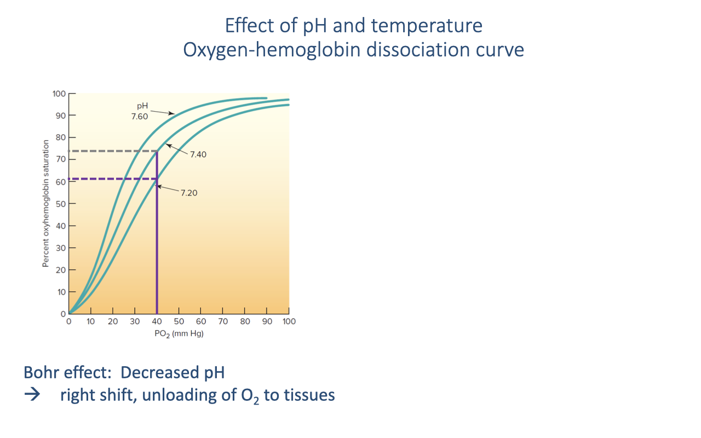
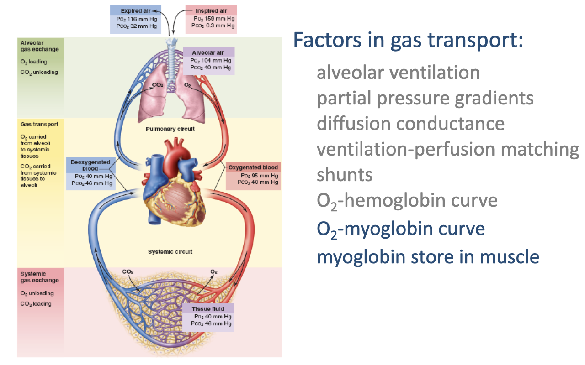
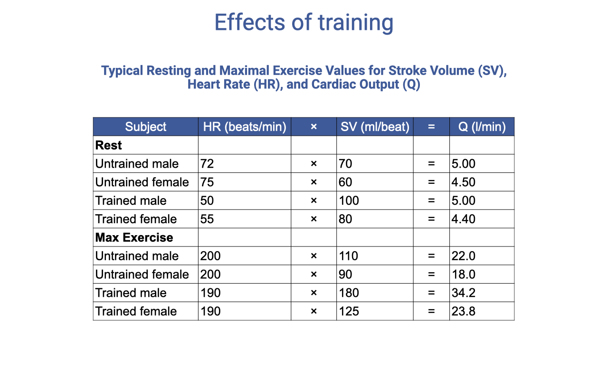

## Slide 1

- This lecture covers the cardiovascular responses to exercise, including O2-hemoglobin binding, myoglobin function, the graphical Fick principle for comparing O2 delivery across species, and the specific cardiovascular adjustments (heart rate, stroke volume, blood flow redistribution) during exercise.
- Topics bridge from the ventilatory system (covered in Lecture 6) to the circulatory system's role in O2 delivery to the tissues.

---

## Slide 2

### Overview and Learning Objectives

**Overview:**
- Oxygen supply cascade from alveoli to mitochondria
- Cardiovascular response to exercise
- Comparative cardiorespiratory physiology

**Learning objectives:**
1. Review **ventilation-perfusion ratio (V/Q)** and how V/Q heterogeneity may limit gas exchange.
2. Describe the mechanisms that transport O2 from the alveoli to the tissues.
3. Discuss factors that limit cardiovascular transport of O2.
4. Describe how **cardiac output** increases during exercise.
5. Describe how **oxygen-dissociation curves** influence O2 transport in rest and exercise.
6. Use the **graphical solution to the Fick principle** to illustrate how blood O2 concentration and cardiac output combine to increase O2 delivery for exercise.
7. Compare and contrast different vertebrate groups in cardiovascular function during exercise.

---

## Slide 3

### Review: Steps in the Oxygen Supply Cascade

- The oxygen supply cascade consists of four steps, each governed by specific equations:
  1. **Pulmonary ventilation** — Fick principle for air convection
  2. **Alveolar gas exchange** — Fick's law of diffusion
  3. **Blood gas transport** (highlighted) — Fick principle for blood convection
  4. **Systemic gas exchange** — Fick's law of diffusion at the tissue level
- The blood gas transport step uses:

$$\dot{V}O_2 = \dot{Q} \cdot B_{blood}(P_aO_2 - P_vO_2)$$

- Equivalently, in terms of blood O2 content:

$$\dot{V}O_2 = \dot{Q}(C_aO_2 - C_{\bar{v}}O_2)$$

- Where cardiac output is: $\dot{Q} = HR \times SV$

---

## Slide 4

### Review: Factors in Gas Transport

- The complete circuit of O2 transport shows progressive decreases in PO₂ at each step:
  - **Inspired air:** PO₂ = 159 mmHg
  - **Alveolar air:** PO₂ = 104 mmHg
  - **Oxygenated blood:** PO₂ = 95 mmHg; PCO₂ = 40 mmHg
  - **Deoxygenated blood:** PO₂ = 40 mmHg; PCO₂ = 46 mmHg
  - **Tissue fluid:** PO₂ = 40 mmHg; PCO₂ = 46 mmHg
- Key factors: alveolar ventilation, partial pressure gradients, diffusion conductance, ventilation-perfusion matching, and shunts.

---

## Slide 5

### Review: V/Q Heterogeneity Across the Lung

- **Blood flow** declines steeply from the lung base to the apex; **ventilation** also declines but less steeply.
- The **V/Q ratio** rises from below 1.0 at the base (overperfused = shunt) to above 3.0 at the apex (underperfused = dead space ventilation).
- The spread between the highest and lowest V/Q values represents **V/Q heterogeneity** — greater heterogeneity reduces gas-exchange efficiency.
- The ideal V/Q ratio is 1.0 across all lung regions.

---

## Slide 6

### Review: V/Q Changes During Exercise Across Species

- V/Q heterogeneity increases during exercise in most vertebrates — including humans and horses — but **not in birds**.
- **Human athletes:** Light exercise improves V/Q matching, but heavy exercise increases heterogeneity, contributing to EIAH.
- **Horses:** V/Q heterogeneity increases during exercise.
- **Varanid lizards:** Resting shunt decreases during exercise, shifting the distribution toward 1.0.
- **Emus (birds):** V/Q distribution centers around 1.0 during exercise — the avian parabronchial lung maintains near-perfect V/Q matching even at high intensities.

---

## Slide 7

![Slide titled "Diversity of the tetrapod lung." Left: a phylogenetic tree with CT-based 3D lung reconstructions for diverse species (labeled a through j), showing colorful segmented lung models. Right side text: Birds, crocodiles, and some lizards have unidirectional airflow through lungs. In crocodiles and lizards, this is through physical separation of ventilation and gas exchange in different regions. Birds have the most distinct separation. Functional separation allows thinner blood-gas barrier. Citation: Schachner et al. 2020.](images/lec07/slide-007.png)

### Review: Diversity of the Tetrapod Lung

- CT imaging reveals that **birds, crocodiles, and some lizards** have structures promoting unidirectional airflow through the lungs.
- In crocodiles and lizards, this occurs through physical separation of ventilation and gas exchange in different lung regions.
- **Birds** have the most extreme separation — rigid parabronchi for gas exchange and compliant air sacs for ventilation.
- This functional separation allows a **thinner blood-gas barrier** in the gas-exchange regions, improving diffusion efficiency.
- These features likely originated in ancestral archosaurs, predating the evolution of birds.

---

## Slide 8

### Review: Respiratory Evolution in Archosaurs

- Many dinosaurs likely had **air sacs and relatively rigid lungs**, similar to modern birds.
- The cladogram maps respiratory innovations across the archosaur lineage, showing progressive elaboration from simple lungs to the complex air-sac system.
- These respiratory features were likely present before the origin of flight and may have enabled dinosaurs to achieve **high metabolic rates and activity levels**.

---

## Slide 9

### Did Bird-Like Lungs Allow Dinosaurs to Dominate?

- Paleontologist **Emma Schachner** hypothesizes that efficient, bird-like respiratory systems gave dinosaurs a competitive advantage during their 180-million-year dominance.
- Studying modern animal diversity (birds, crocodilians, lizards) helps reconstruct ancestral respiratory function in extinct dinosaurs.
- Supplemental resources include an NPR interview and a YouTube video ("Sauropods: Air Hulks") exploring respiratory adaptations in large dinosaurs.

---

## Slide 10

### Transition: From Pulmonary to Cardiovascular Responses

- This slide marks the transition from the review of ventilation-perfusion matching and comparative lung structure to the main topic: **cardiovascular responses to exercise**.
- The remaining learning objectives focus on O2-hemoglobin binding, the Bohr effect, myoglobin function, cardiac output during exercise, and comparative cardiovascular physiology.

---

## Slide 11

### Factors in Gas Transport: New Topics

- Building on previously covered factors, this lecture introduces three additional mechanisms critical for O2 delivery to tissues:
  - **O2-hemoglobin curve** — the relationship between PO₂ and hemoglobin saturation
  - **O2-myoglobin curve** — myoglobin's role in intramuscular O2 transport
  - **Myoglobin store in muscle** — acting as an O2 reservoir and shuttle within muscle tissue
- These mechanisms operate at the interface between blood gas transport and systemic gas exchange, determining how effectively O2 moves from capillary blood to mitochondria.

---

## Slide 12

### Focus: O2-Hemoglobin Curve

- The **oxygen-hemoglobin dissociation curve** describes how hemoglobin binds and releases O2 at different partial pressures.
- This curve is central to understanding how O2 is loaded in the lungs and unloaded at the tissues — and how exercise conditions modify this process.

---

## Slide 13

![Slide titled "Oxygen-Hemoglobin Dissociation Curve." Left side shows the equation for percent saturation: %Sat = [O2]/O2 capacity × 100, with a note that O2 capacity is the maximum quantity of oxygen that will combine chemically with hemoglobin in a unit volume of blood (normally 1.34 mL O2 per g Hb, or 20 mL O2 per 100 mL of blood). Right side: a sigmoid curve with partial pressure of oxygen (mmHg) on the x-axis (0–120) and % saturation of Hb on the y-axis (0–100). The curve shows a steep rise between 20–60 mmHg and a plateau above 80 mmHg. A note states "On the y-axis we can have % Sat or [O2]."](images/lec07/slide-013.png)

### Oxygen-Hemoglobin Dissociation Curve

- **Percent saturation** of hemoglobin is defined as:

$$\%\text{Sat} = \frac{[O_2]}{O_2 \text{ capacity}} \times 100$$

- **O2 capacity** is the maximum amount of O2 that can bind hemoglobin per unit volume of blood — normally **1.34 mL O2 per gram of Hb**, or approximately 20 mL O2 per 100 mL of blood.
- The curve has a characteristic **sigmoid (S-shaped)** form:
  - Steep rise between ~20–60 mmHg PO₂ — small changes in PO₂ cause large changes in saturation
  - Plateau above ~80 mmHg — hemoglobin is nearly fully saturated
- The y-axis can show either percent saturation or absolute O2 concentration (mL O2/100 mL blood).

---

## Slide 14

### Hemoglobin-Bound vs. Dissolved Oxygen

- The **vast majority** of O2 in the blood is bound to hemoglobin (solid curve, "O2 combined with Hb").
- **Dissolved O2** in the plasma (bottom line) is a very small fraction of total blood O2 — only about 0.3 mL O2 per 100 mL blood at PO₂ = 100 mmHg.
- The dashed "Total O2" line is the sum of hemoglobin-bound and dissolved O2, running just slightly above the hemoglobin curve.
- At typical hemoglobin concentrations (~15 g/dL), fully saturated blood carries approximately **20 mL O2 per 100 mL** — making hemoglobin the dominant O2 carrier.
- The properties of hemoglobin — specifically the PO₂ at which it binds and releases O2 — are therefore critically important for O2 delivery.

---

## Slide 15

### O2 Loading and Unloading In Vivo

- At **arterial PO₂** (~100 mmHg), hemoglobin is essentially **100% saturated** with O2 — this is in the plateau region of the curve.
- At **resting venous PO₂** (~40 mmHg), hemoglobin is approximately **75% saturated**.
- The difference between arterial and venous saturation represents the **amount of O2 unloaded to the tissues** — approximately 5 mL O2 per 100 mL blood at rest (a-v O2 difference of ~25% of total carrying capacity).
- At rest, a significant reserve of O2 remains bound to hemoglobin in the venous blood — this reserve can be tapped during exercise as venous PO₂ falls further.
- The steep portion of the sigmoid curve (20–60 mmHg) means that small decreases in venous PO₂ during exercise release **large amounts** of additional O2 to the tissues.

---

## Slide 16

![Graph titled "Effect of pH and temperature: Oxygen-hemoglobin dissociation curve." X-axis: PO2 (mmHg, 0–100). Y-axis: percent saturation (0–100%). Three sigmoid curves are shown at pH 7.60, 7.40, and 7.20. As pH decreases (more acidic), the curve shifts to the right. A horizontal dashed line at ~75% saturation intersects the pH 7.40 curve at PO2 ≈ 40 mmHg, but intersects the pH 7.20 curve at PO2 ≈ 50 mmHg, showing more O2 is released at lower pH. Text: "Bohr effect: Decreased pH → right shift, unloading of O2 to tissues."](images/lec07/slide-016.png)

### The Bohr Effect: pH and the Dissociation Curve

- The **Bohr effect** describes the rightward shift of the oxygen-hemoglobin dissociation curve when blood pH decreases.
- During exercise, active muscles produce CO2, which lowers local blood pH — causing a rightward shift.
- At a given venous PO₂ (e.g., ~40 mmHg):
  - At pH 7.40 (normal): hemoglobin is ~75% saturated
  - At pH 7.20 (exercising muscle): hemoglobin is ~60% saturated
- The rightward shift means **more O2 is released** to the tissues at the same PO₂.
- This is a self-regulating feedback: the tissues that are most metabolically active produce the most CO2 and acid, creating a local rightward shift precisely where O2 is most needed.

---

## Slide 17

![Slide titled "Effect of pH and temperature: Oxygen-hemoglobin dissociation curve." Two panels side by side. Left panel: three curves at pH 7.60, 7.40, and 7.20 showing the Bohr effect (decreased pH → rightward shift). Right panel: three curves at temperatures 20°C, 37°C, and 42°C showing the temperature effect (increased temperature → rightward shift). Horizontal dashed lines show that at the same PO2, higher temperature results in lower hemoglobin saturation. Text: "Temperature: Increased temperature → right shift, unloading of O2 to tissues."](images/lec07/slide-017.png)

### Temperature Effect on the Dissociation Curve

- Increased temperature also causes a **rightward shift** of the O2-hemoglobin dissociation curve, facilitating O2 release at the tissues.
- Normal body temperature is 37°C. During exercise, active muscles generate heat and can warm to ~42°C locally.
- At the same venous PO₂, the temperature increase shifts hemoglobin saturation from ~65% to ~55%, releasing more O2.
- This temperature effect is **localized** — it is most pronounced in the muscles that are actually working and generating heat.
- Both the Bohr effect (pH) and the temperature effect act together during exercise to enhance O2 offloading at the tissue level, directing O2 preferentially to active muscles.
- In **ectotherms** (reptiles, amphibians), the temperature effect is even more important because body temperature can vary over a much wider range.

---

## Slide 18

### Focus: Myoglobin and Intramuscular O2 Transport

- The next factors in gas transport are the **O2-myoglobin curve** and the **myoglobin store in muscle**.
- These operate at the final step of the oxygen supply cascade — getting O2 from the capillary blood across the muscle tissue to the mitochondria.

---

## Slide 19

![Graph titled "Comparison of myoglobin and hemoglobin dissociation curve." X-axis: PO2 (mmHg, 0–120). Y-axis: saturation (%, 0–100). Two curves: myoglobin (left-shifted, reaching near-full saturation by ~20 mmHg) and hemoglobin (sigmoid, reaching near-full saturation by ~80 mmHg). Two vertical dashed lines mark "Venous blood" (~40 mmHg) and "Arterial blood" (~100 mmHg). At venous PO2, hemoglobin is ~75% saturated but myoglobin is still nearly fully saturated. Text below: "Binds O2 at a very low PO2 → shuttle O2 from capillaries to mitochondria. Acts as O2 store in muscle → buffers muscle O2 demand at exercise onset, until cardiopulmonary system increases O2 delivery."](images/lec07/slide-019.png)

### Myoglobin vs. Hemoglobin Dissociation Curves

- **Myoglobin (Mb)** has a **left-shifted** dissociation curve compared to hemoglobin — it has a much higher O2 affinity.
- At typical **venous PO₂** (~40 mmHg):
  - Hemoglobin is ~75% saturated — it releases O2
  - Myoglobin is **nearly fully saturated** — it accepts and binds the released O2
- Myoglobin only releases O2 at **very low PO₂** values (near actively respiring mitochondria), creating an effective shuttle:
  - Hemoglobin → releases O2 at the capillary → **myoglobin** binds it → carries it through the muscle cell → releases it at the mitochondria where PO₂ is near zero.
- Myoglobin also acts as an **O2 store** in muscle tissue, buffering the immediate demand for O2 at exercise onset before the cardiopulmonary system fully ramps up.
- Higher myoglobin concentration in trained muscle → greater O2 shuttling capacity and steeper diffusion gradient from capillary to mitochondria.

---

## Slide 20

### Summary: All Factors in Gas Transport

- All key factors in gas transport through the oxygen supply cascade have now been covered:
  1. **Alveolar ventilation** — delivery of fresh air to the gas-exchange surface
  2. **Partial pressure gradients** — the driving force at each step
  3. **Diffusion conductance** — membrane thickness and surface area
  4. **Ventilation-perfusion matching** — coordination of airflow and blood flow
  5. **Shunts** — blood bypassing gas exchange
  6. **O2-hemoglobin curve** — loading in lungs, unloading at tissues (modulated by pH and temperature)
  7. **O2-myoglobin curve** — intramuscular O2 shuttle from capillaries to mitochondria
  8. **Myoglobin store in muscle** — O2 reserve buffering demand at exercise onset

---

## Slide 21

### Think-pair-share in class Activity: Factors Influencing the Fick Equation

---

## Slide 22

### Review: Diversity in Vertebrate Cardiovascular Systems

- **Fish** — two-chambered heart (one atrium, one ventricle); single-loop circulation through gills then to systemic capillaries.
- **Amphibians** — three-chambered heart; mixing of oxygenated and deoxygenated blood in a shared ventricle (pulmocutaneous + systemic circuits).
- **Reptiles** — partially divided ventricle; a functional **cardiac shunt** allows mixing at rest.
- **Mammals and birds** — fully divided four-chambered heart; completely separate pulmonary and systemic circuits with different pressures.
- Mammals and birds independently evolved complete ventricular division — convergent evolution associated with high aerobic demand.
- Animals with incomplete ventricular division can reduce their shunt during exercise, rapidly increasing arterial O2 saturation.

---

## Slide 23

![Graph titled "Changes in blood oxygen content with exercise." Figure 3.2 shows changes in arterial and mixed venous oxygen content with increasing rates of work on the cycle ergometer. X-axis: power (watts) from 25 to 275. Y-axis: oxygen content (mL/100 mL of blood) from 0 to 20. The arterial oxygen content line remains nearly constant at approximately 20 mL/100 mL across all work rates. The mixed venous oxygen content line decreases from approximately 15 mL/100 mL at rest to approximately 4 mL/100 mL at maximal exercise. A double-headed arrow labeled "A-vO2 difference" spans the gap between the two lines at a moderate work rate.](images/lec07/slide-023.png)

### Changes in Blood O2 Content with Exercise

- **Arterial O2 content** remains relatively constant at ~20 mL O2/100 mL blood across the full range of exercise intensities — hemoglobin remains nearly fully saturated.
- **Mixed venous O2 content** decreases progressively with increasing work rate — from ~15 mL/100 mL at rest to ~4 mL/100 mL at maximal exercise.
- The **a-v O2 difference** (the gap between the two lines) expands dramatically with exercise:
  - At rest: ~5 mL O2/100 mL blood
  - At maximal exercise: ~16 mL O2/100 mL blood
- This widening a-v O2 difference reflects increased tissue O2 extraction, driven by:
  - Lower venous PO₂ (mitochondria consuming O2 faster)
  - The Bohr effect (lower pH facilitating O2 release)
  - Increased temperature in active muscles
  - Myoglobin shuttling O2 to mitochondria

---

## Slide 24

![Slide titled "Graphical solution to the Fick principle for oxygen uptake." Left: an oxygen-hemoglobin dissociation curve (blood O2 concentration vs. PO2) with two points marked — one at high PO2 (arterial) and one at low PO2 (venous). Right: a rectangle showing cardiac output (Q̇) on the x-axis and blood O2 concentration change on the y-axis. The area of the rectangle represents total O2 delivery (VO2 = Q̇ × (CaO2 − CvO2)). Two rectangles shown: a small one labeled "BMR" (basal metabolic rate, at rest) and a larger one labeled "Exercise" (with both higher Q̇ and wider a-v O2 difference). A silhouette of a horse and bird of prey illustrate mammals/birds. Citation: Wang et al. 2019.](images/lec07/slide-024.png)

### Graphical Fick Solution: Mammals and Birds

- The **graphical solution** to the Fick principle visualizes total O2 delivery as a rectangle:
  - **Width** = cardiac output ($\dot{Q}$)
  - **Height** = a-v O2 content difference ($C\_aO\_2 - C\_{\bar{v}}O\_2$)
  - **Area** = $\dot{V}O\_2$ (total O2 consumption)
- At **rest (BMR):** A small rectangle — low cardiac output and modest a-v O2 difference.
- During **exercise:** The rectangle expands in both dimensions — cardiac output increases dramatically and the a-v O2 difference widens as venous saturation drops further along the sigmoid curve.
- In **mammals and birds** (with fully divided hearts), the arterial side remains ~100% saturated, so the increase comes from:
  1. Higher cardiac output (wider rectangle)
  2. Greater O2 extraction — venous PO₂ drops into the steep portion of the curve, releasing large amounts of O2

---

## Slide 25

### Graphical Fick Solution: Fish (Ectotherms)

- The same graphical principle applies to **fish and other ectotherms**, but with the terminology **SMR (standard metabolic rate)** instead of BMR.
- SMR must be measured at a **standard ambient temperature** because ectotherm metabolic rate varies dramatically with temperature.
- In fish, O2 is extracted from water (not air) through gill countercurrent exchange. The fundamental Fick principle is identical — $\dot{V}O\_2 = \dot{Q}(C\_aO\_2 - C\_{\bar{v}}O\_2)$.
- The same graphical solution applies: the rectangle expands with exercise as both cardiac output and the a-v O2 difference increase.
- This illustrates that the **same physical principles** of O2 delivery govern gas exchange across all vertebrates, from fish to mammals.

---

## Slide 26

![Slide titled "Graphical solution to the Fick principle for oxygen uptake." Same format showing dissociation curve and rectangle diagram, but for animals with a right-to-left (R-L) shunt (shown with silhouettes of a frog and lizard). At rest (SMR), the arterial point on the curve is below 100% saturation because of the R-L shunt mixing deoxygenated blood. During exercise, the label shows "R-L shunt reduced" — the arterial point moves up the curve toward full saturation, while venous saturation also decreases. This means the a-v O2 difference can expand from both ends. Citation: Wang et al. 2019.](images/lec07/slide-026.png)

### Graphical Fick Solution: Animals with Cardiac Shunts

- In animals with **incomplete ventricular division** (amphibians, non-crocodilian reptiles), a right-to-left shunt exists at rest.
- At rest: Arterial blood is **not fully oxygenated** because deoxygenated blood mixes in the ventricle — the arterial point falls below 100% on the curve.
- During exercise: The shunt is **reduced** due to changes in cardiac fluid dynamics as the heart pumps harder. This means:
  - **Arterial saturation increases** (moves up the curve toward full saturation)
  - **Venous saturation decreases** (more O2 extracted by active tissues)
- The a-v O2 difference can therefore expand from **both ends** — a unique advantage.
- This enables a **large increase in O2 delivery** even with a relatively modest change in cardiac output.
- The shunt acts as a functional switch: costly at rest (lower arterial saturation) but enabling a rapid boost in O2 delivery during exercise.

---

## Slide 27

### Comparative Cardiovascular Parameters Across Species

- Bar graphs compare cardiovascular parameters (heart rate, stroke volume, cardiac output) across diverse vertebrate species at rest and during exercise.
- Species are grouped by color: fish/amphibians, reptiles, birds, and mammals.
- The **factorial change in heart rate** between rest and exercise (bottom-right panel) shows that **birds exhibit the largest increases** — consistent with their exceptionally efficient respiratory and cardiovascular systems.
- Birds not only have more efficient lungs but also show a greater increase in cardiac output during exercise, which is one reason they are among the most impressive vertebrate athletes.
- Flight is an extremely energy-demanding activity, requiring both high cardiac output and efficient gas exchange.

---

## Slide 28

![Slide titled "Diversity & similitude in vertebrate cardiorespiratory systems." Left: a graph showing PaO2 and PaCO2 (mmHg) for selected species (horse, dog, lizard, pigeon, toad, trout) at rest and during exercise. Red lines show PaO2 (typically remaining high during exercise, except in the horse which shows a decline). Blue lines show PaCO2 (typically declining during exercise, suggesting hyperventilation). Right text: "PaO2 typically remains high during exercise. Some athletic species experience a fall in PaO2 with an associated desaturation of Hb — this is most likely due to diffusion limitation. Reduction of PaCO2 suggests that most vertebrates hyperventilate (note horse as an exception)." Citation: Wang et al. 2019.](images/lec07/slide-028.png)

### Arterial Blood Gases During Exercise Across Species

- **PaO2** (red lines) typically remains high during exercise across most vertebrate species — the lungs maintain adequate oxygenation of arterial blood.
  - Exception: The **horse** shows a significant decline in PaO2 during exercise — one of the elite athletes experiencing EIAH, most likely due to **diffusion limitation** in the lungs.
- **PaCO2** (blue lines) typically **declines** during exercise in most species, suggesting that most vertebrates **hyperventilate** relative to their metabolic CO2 production.
  - The horse is again an exception — maintaining or slightly increasing PaCO2.
- PaCO2 in fish is particularly variable due to the low O2 solubility of water, which imposes additional constraints on the hyperventilation response.

---

## Slide 29

![Slide titled "Diversity & similitude in aerobic scope." Subtitle: "Factorial Aerobic scope: VO2max/SMR." A log-log scatter plot from Weibel et al. (2004) shows body mass (g) on the x-axis (0.01 to 1000 kg) and factorial aerobic scope on the y-axis (5 to approximately 50). Two regression lines are shown: one for mammals (fAS = 8.29 M^0.148, r² = 0.448) and one for all species (fAS = 17.66 M^0.244, r² = 0.866). The slope increases with body size. Text notes: "SMR = standard metabolic rate (~BMR in mammals)" and "fAS: 5–10 across diverse species, positive correlation with (1) heart mass relative to body mass, and (2) hemoglobin concentrations ([Hb])."](images/lec07/slide-029.png)

### Factorial Aerobic Scope Across Species

- **Factorial aerobic scope (fAS)** is the ratio of VO2max to standard metabolic rate (SMR), reflecting an animal's capacity for aerobic exercise above baseline.

$$fAS = \frac{\dot{V}O_2\text{max}}{SMR}$$

- Most vertebrates have a fAS of **5–10×**, meaning maximum O2 uptake is 5–10 times the resting rate.
- Factorial aerobic scope shows a **positive correlation with body mass** — larger animals tend to have higher aerobic scope.
- The most athletic species (horses, birds in flight) can reach fAS values up to ~50×.
- Animals with high aerobic scope tend to have:
  1. A relatively **large heart** relative to body mass — enabling high cardiac output
  2. Higher **hemoglobin concentrations** — increasing blood O2-carrying capacity
- Some species (e.g., horses) have large spleens that release stored red blood cells during exercise, rapidly boosting hemoglobin concentration.

---

## Slide 30

### Transition: Cardiovascular Responses to Exercise

- The lecture now transitions from the comparative and mechanistic overview to the specific **cardiovascular adjustments** that occur during exercise in humans and other vertebrates.
- Topics include: heart rate and stroke volume dynamics, the Frank-Starling mechanism, effects of training, blood flow redistribution, and cardiovascular drift.

---

## Slide 31

![Slide titled "Transition from rest to steady exercise to recovery." Three stacked time-series graphs with exercise time (min) on the x-axis (0–20). Top graph: cardiac output (L/min) rises sharply at exercise onset from ~5 to ~15 L/min, maintains a plateau during steady-state exercise, then gradually returns to rest during recovery. Middle graph: stroke volume (mL) rises modestly from ~80 to ~120 mL at exercise onset, then plateaus. Bottom graph: heart rate (beats/min) rises sharply from ~70 to ~160 at exercise onset, then gradually returns to rest during recovery. The recovery rate of heart rate is noted as an indicator of fitness.](images/lec07/slide-031.png)

### Transition from Rest to Steady Exercise to Recovery

- At exercise onset, all three components show a **rapid increase**:
  - **Cardiac output** rises sharply from ~5 to ~15 L/min
  - **Stroke volume** increases modestly from ~80 to ~120 mL and then plateaus
  - **Heart rate** rises sharply from ~70 to ~160 beats/min
- During **steady-state exercise**, cardiac output and stroke volume maintain relatively stable levels.
- During **recovery**, all parameters gradually return toward resting values, with a characteristic lag.
- The **rate of heart rate recovery** after exercise is an indicator of cardiovascular fitness — faster recovery indicates better fitness. This is one of the metrics tracked by modern fitness watches.

---

## Slide 32

![Slide titled "Cardiac output during incremental workload tests" with the equation Q̇ = HR(SV). Three graphs plot cardiovascular variables against % VO2max (25–100%). Top: heart rate (beats/min, 100–200) shows an approximately linear increase across the full range. Middle: stroke volume (mL, 80–120) increases linearly at low work rates but plateaus at approximately 40% VO2max. Bottom: cardiac output (L/min, 5–25) shows a linear increase at low work rates that becomes slightly steeper beyond the stroke volume plateau point. Right side notes: HR is directly proportional to exercise intensity; maximum HR declines slightly with age; maximum HR can be estimated as HRmax ≈ 208 − (0.7 × Age).](images/lec07/slide-032.png)

### Heart Rate, Stroke Volume, and Cardiac Output During Incremental Exercise

- **Heart rate (HR)** increases approximately **linearly** with exercise intensity across the full range of % VO2max.
- **Stroke volume (SV)** increases at low work rates but **plateaus** at approximately **40% VO2max**. At very high heart rates, diastolic filling time shortens, limiting further SV increases.
- **Cardiac output** ($\dot{Q} = HR \times SV$) rises linearly at low work rates. Above the SV plateau, continued increases in $\dot{Q}$ depend primarily on rising HR.
- **Maximum heart rate** declines slightly with age and can be estimated:

$$HR_{max} \approx 208 - (0.7 \times \text{Age})$$

- There is substantial individual variability (±10–15 bpm) around this estimate, depending on training history and body size.

---

## Slide 33

![Slide titled "Cardiac output during incremental workload tests" with the equation CO (Q̇) = HR × SV. A graph with work rate (watts, rest to 200) on the x-axis shows three curves: cardiac output (L/min, 6–18, left y-axis), heart rate (b/min, 60–200, right y-axis), and stroke volume (mL, 60–120, right y-axis). Cardiac output and HR rise progressively. Stroke volume rises at low work rates, plateaus, and may decrease slightly at very high work rates due to reduced diastolic filling time at extremely fast heart rates.](images/lec07/slide-033.png)

### Stroke Volume at Very High Work Rates

- At very high work rates, stroke volume may actually **decrease slightly** — this occurs because extremely fast heart rates reduce diastolic filling time.
- The **Frank-Starling mechanism** depends on adequate venous return filling the ventricle during diastole. At extreme heart rates, the interval between beats becomes too short for complete filling, reducing end-diastolic volume and therefore SV.
- This represents operating at the **limits of the cardiovascular system** for that individual.
- Despite the SV plateau (or slight decline), cardiac output continues to increase because heart rate continues to rise — but the rate of $\dot{Q}$ increase slows.

---

## Slide 34

### Effects of Training on Cardiovascular Parameters

| Subject | Rest HR (b/min) | Rest SV (mL) | Rest Q̇ (L/min) | Max HR (b/min) | Max SV (mL) | Max Q̇ (L/min) |
|:---|:---|:---|:---|:---|:---|:---|
| Untrained male | 72 | 70 | 5.00 | 200 | 110 | 22.0 |
| Untrained female | 75 | 60 | 4.50 | 200 | 90 | 18.0 |
| Trained male | 50 | 100 | 5.00 | 190 | 180 | 34.2 |
| Trained female | 55 | 80 | 4.40 | 190 | 125 | 23.8 |

- **Resting cardiac output** is similar between trained and untrained individuals — the same blood flow is needed at rest regardless of fitness.
- Trained individuals have a **lower resting heart rate** because their **stroke volume is higher** (cardiac hypertrophy increases the volume of blood ejected per beat).
- **Maximum heart rate** changes very little with training (~190 vs. 200 b/min).
- The main training effect is a **large increase in maximum stroke volume** — trained males can achieve 180 mL vs. 110 mL untrained — which drives the increase in maximum cardiac output (34.2 vs. 22.0 L/min).

---

## Slide 35

### Correlation Between Heart Rate and VO2

- There is a strong **linear relationship** between heart rate and % VO2max (R² = 0.97).
- This linear correlation is physiologically useful because **VO2 is difficult to measure directly** during exercise (requires a mask and metabolic cart).
- Heart rate is easily and continuously measurable using fitness watches and heart rate monitors.
- Modern fitness watches exploit this relationship to **estimate VO2** from heart rate data, using population-level normative data sets.
- The accuracy of these estimates depends on individual variability in the HR–VO2 relationship, which is influenced by training history, body size, and genetics.

---

## Slide 36

### HR–VO2 Correlation in Ectotherms

- The linear relationship between heart rate and VO2 holds not just for humans but also for other vertebrates, including **Galápagos marine iguanas**.
- However, in ectotherms the relationship is **temperature-dependent** — different regression lines for 27°C vs. 36°C body temperature.
- At higher body temperature, the metabolic rate is higher at any given heart rate, shifting the relationship upward.
- This temperature dependence is expected because ectotherm metabolic rate varies directly with body temperature, unlike endotherms where core temperature is tightly regulated.
- This comparative finding reinforces the fundamental physiological principle that heart rate tracks metabolic demand, but the specific relationship varies with species and environmental conditions.

---

## Slide 37

### Redistribution of Blood Flow During Exercise

- During exercise, blood flow is dramatically **redistributed** from non-essential organs to working muscles:
  - **Muscle blood flow** increases steeply — from ~400 mL at rest to ~1500 mL at maximal exercise.
  - **Splanchnic (digestive organ) blood flow** decreases from ~100 mL to near 20 mL.
- This redistribution is mediated by:
  - **Sympathetic vasoconstriction** — norepinephrine acting on α-adrenergic receptors constricts arterioles in non-essential organs (gut, kidney, inactive muscle).
  - **Local metabolic vasodilation** — CO2, H+, adenosine, nitric oxide, and K+ accumulating in active muscles dilate local arterioles, overriding sympathetic tone.
- The net effect: up to 80–85% of cardiac output is directed to working muscles during heavy exercise, compared to only 15–20% at rest.

---

## Slide 38

![Slide titled "Redistribution of blood flow during exercise." A diagram comparing blood flow distribution at rest (cardiac output ~5 L/min, bottom) versus heavy exercise (cardiac output ~25 L/min, top). At rest, blood flow is distributed across the heart, brain, kidneys, splanchnic organs, skin, skeletal muscle, and other organs, with percentages shown. During heavy exercise, skeletal muscle receives 80–85% of blood flow, while splanchnic organs, kidneys, and other non-essential organs receive much less. Brain and heart blood flow percentages decrease proportionally but absolute flow is maintained.](images/lec07/slide-038.png)

### Blood Flow Distribution: Rest vs. Heavy Exercise

- At **rest** (cardiac output ~5 L/min):
  - Skeletal muscle: ~15–20%
  - Splanchnic organs: ~20–25%
  - Kidneys: ~20%
  - Brain: ~15%
  - Heart: ~4–5%
  - Skin and other organs: remaining share

- During **heavy exercise** (cardiac output ~25 L/min):
  - Skeletal muscle: **80–85%**
  - Splanchnic organs: ~3–5%
  - Kidneys: ~3–5%
  - Brain and heart: absolute flow maintained, but a smaller percentage of the much larger total cardiac output
  - Skin: initially reduced, then increases as core temperature rises (thermoregulatory competition for cardiac output)

- Brain and heart circulations are **never vasoconstricted** — they are protected at all intensities.

---

## Slide 39

![Flow chart titled "Summary of cardiovascular responses to exercise." Two main branches: CARDIAC OUTPUT (left) and BLOOD FLOW TO SKELETAL MUSCLES (right). Under cardiac output: heart rate (increased by sympatho-adrenal system) and stroke volume (increased by improved venous return, which is driven by skeletal muscle activity and deeper breathing). Under blood flow to muscles: metabolic vasodilation in muscles and sympathetic vasoconstriction in viscera. A box on the right shows "Frank-Starling mechanism" connecting skeletal muscle activity and deeper breathing to improved venous return and stroke volume.](images/lec07/slide-039.png)

### Summary: Cardiovascular Responses to Exercise

- **Cardiac output** increases through two mechanisms:
  - **Heart rate** — increased by the sympatho-adrenal system (sympathetic stimulation + circulating epinephrine) and parasympathetic withdrawal
  - **Stroke volume** — increased by:
    - Improved **venous return** via the skeletal muscle pump (contracting muscles compress veins) and the respiratory pump (deeper breathing creates greater intrathoracic pressure swings)
    - **Frank-Starling mechanism** — greater venous return stretches the ventricle, producing stronger contractions
    - Increased contractility from sympathetic stimulation (positive inotropy)

- **Blood flow to skeletal muscles** increases through:
  - **Metabolic vasodilation** in active muscles (local accumulation of CO2, H+, adenosine, NO, K+)
  - **Sympathetic vasoconstriction** in visceral organs (gut, kidney) diverts blood to muscles

---

## Slide 40

![Slide titled "Cardiovascular changes in prolonged exercise." Three stacked time-series graphs with exercise time (min, 0–50) on the x-axis. Top: cardiac output (L/min) remains relatively stable around 14–15. Middle: stroke volume (mL) gradually decreases from ~120 to ~95 over 50 minutes. Bottom: heart rate (beats/min) gradually increases from ~150 to ~180 over 50 minutes. Right side text: "Cardiac output is maintained. Gradual decrease in stroke volume due to dehydration and reduced plasma volume. Gradual increase in heart rate (particularly in heat)."](images/lec07/slide-040.png)

### Cardiovascular Drift During Prolonged Exercise

- During **prolonged exercise** (especially in warm environments), a characteristic pattern called **cardiovascular drift** emerges:
  - **Cardiac output** is maintained at a relatively stable level
  - **Stroke volume** gradually **decreases** — from ~120 mL to ~95 mL over 50 minutes
  - **Heart rate** progressively **increases** to compensate — from ~150 to ~180 beats/min
- The mechanism: **dehydration from sweating** reduces plasma volume → less venous return → lower end-diastolic volume → reduced stroke volume (Frank-Starling mechanism).
- Heart rate increases reflexively to maintain the cardiac output needed for the constant work rate.
- Practical consequence: athletes using heart rate to regulate pace must slow down to maintain a target HR in a dehydrated state, because the same work rate now requires a higher HR.

---

## Slide 41

![Flow chart titled "Cardiovascular control in exercise." Central element: "CV control center" receives input from "Central command (higher brain centers)" and "Baroreceptors." The CV control center sends output to three targets: "Blood vessels," "Heart," and "Skeletal muscle." Skeletal muscle feeds back to the CV control center via "Chemoreceptors" (sensing metabolic byproducts) and "Mechanoreceptors" (sensing mechanical activity). The diagram shows a parallel structure to the ventilatory control schematic.](images/lec07/slide-041.png)

### Cardiovascular Control in Exercise

- The **cardiovascular (CV) control center** integrates multiple inputs to coordinate the cardiovascular response:
  - **Central command** (higher brain centers) — anticipatory, feed-forward drive at exercise onset (parallel to ventilatory central command)
  - **Baroreceptors** — sense arterial blood pressure and adjust to maintain appropriate MAP
- The CV control center modulates:
  - **Blood vessels** — vasoconstriction/vasodilation to redirect blood flow
  - **Heart** — heart rate (chronotropy) and contractility (inotropy)
- **Skeletal muscle** provides feedback via:
  - **Chemoreceptors** — detect metabolic byproducts (H+, K+, adenosine) — the **exercise pressor reflex**
  - **Mechanoreceptors** — detect mechanical activity and contribute to the rapid cardiovascular response at exercise onset
- This control scheme parallels the ventilatory control system, reflecting the tight coordination required between breathing and circulation.

---

## Slide 42

### Questions

- Open question-and-answer session for students to clarify concepts from the lecture.

---

## Slide 43

### Lecture 7 — Key Takeaways

1. The **oxygen-hemoglobin dissociation curve** has a sigmoid shape. The steep portion (~20–60 mmHg) enables efficient O2 loading in the lungs and unloading at the tissues. At rest, venous blood is still ~75% saturated — a large reserve exists for exercise.
2. The **Bohr effect** (decreased pH → rightward shift) and **temperature effect** (increased temperature → rightward shift) both enhance O2 unloading at active muscle tissue during exercise. These effects are localized, directing O2 where it is most needed.
3. **Myoglobin** acts as an intramuscular O2 shuttle (capillary → mitochondria) and as an O2 store that buffers demand at exercise onset before the cardiopulmonary system ramps up.
4. The **graphical Fick solution** shows that total O2 delivery = cardiac output × a-v O2 difference. In mammals/birds, expansion comes from both higher $\dot{Q}$ and a wider a-v difference. In animals with cardiac shunts, the arterial side can also increase during exercise.
5. **Heart rate** increases linearly with exercise intensity; **stroke volume** plateaus at ~40% VO2max. Training primarily increases maximum stroke volume, not maximum heart rate.
6. **Blood flow redistribution** during exercise directs up to 80–85% of cardiac output to working muscles via sympathetic vasoconstriction of non-essential organs and local metabolic vasodilation in active muscles.
7. **Cardiovascular drift** during prolonged exercise reflects dehydration-induced reduction in stroke volume compensated by rising heart rate to maintain cardiac output.

---

## Key Equations

| Equation | Name | Description |
|----------|------|-------------|
| $\dot{V}O\_2 = \dot{Q}(C\_aO\_2 - C\_{\bar{v}}O\_2)$ | Fick principle (cardiovascular) | O2 consumption from cardiac output and the arteriovenous O2 content difference |
| $\dot{Q} = HR \times SV$ | Cardiac output | Cardiac output (L/min) equals heart rate (beats/min) times stroke volume (mL/beat) |
| $\%\text{Sat} = \frac{[O\_2]}{O\_2 \text{ capacity}} \times 100$ | Hemoglobin percent saturation | Fraction of hemoglobin binding sites occupied by O2; O2 capacity ≈ 1.34 mL O2/g Hb |
| $HR\_{max} \approx 208 - (0.7 \times \text{Age})$ | Age-predicted maximum heart rate | Estimates maximum heart rate (beats/min) from age; substantial individual variability (±10–15 bpm) |
| $fAS = \frac{\dot{V}O\_2\text{max}}{SMR}$ | Factorial aerobic scope | Ratio of maximum O2 uptake to standard (or basal) metabolic rate; typically 5–10× in vertebrates |

---

## Glossary of Key Terms

| Term | Definition |
|------|-----------|
| **Oxygen-hemoglobin dissociation curve** | The sigmoid-shaped curve describing the relationship between PO₂ and hemoglobin O2 saturation; determines O2 loading and unloading characteristics. |
| **Bohr effect** | Rightward shift of the O2-hemoglobin dissociation curve at lower pH (higher CO2); promotes O2 unloading at metabolically active tissues. |
| **Temperature effect (on Hb curve)** | Rightward shift of the dissociation curve at higher temperature; exercising muscles generate heat locally, enhancing O2 release precisely where demand is highest. |
| **Myoglobin (Mb)** | An O2-binding protein in muscle cells with higher O2 affinity than hemoglobin; acts as an intramuscular O2 shuttle from capillaries to mitochondria and as a short-term O2 store at exercise onset. |
| **a-v O2 difference** | The difference in O2 content between arterial and mixed venous blood; reflects the amount of O2 extracted by tissues per unit of blood. Widens from ~5 to ~16 mL O2/dL from rest to maximal exercise. |
| **Cardiac output ($\dot{Q}$)** | Volume of blood pumped per minute by one ventricle; product of heart rate and stroke volume (L/min). |
| **Stroke volume (SV)** | Volume of blood ejected by one ventricle per heartbeat (mL/beat); increases with training due to cardiac hypertrophy. |
| **Frank-Starling mechanism** | Intrinsic cardiac property where greater venous return stretches the ventricle during diastole, producing a stronger contraction and higher stroke volume. |
| **Cardiac shunt** | Mixing of oxygenated and deoxygenated blood in animals with incompletely divided ventricles; reduces arterial O2 saturation at rest but can be reduced during exercise to boost O2 delivery. |
| **Graphical Fick solution** | Visualization of total O2 delivery as a rectangle where width = cardiac output and height = a-v O2 difference; area = VO2. |
| **Standard metabolic rate (SMR)** | The resting metabolic rate of an ectotherm measured at a standard ambient temperature; analogous to BMR in endotherms. |
| **Factorial aerobic scope (fAS)** | Ratio of VO2max to SMR (or BMR); typically 5–10× in vertebrates; animals with high fAS tend to have large hearts and high hemoglobin concentrations. |
| **Cardiovascular drift** | Progressive rise in heart rate and fall in stroke volume during prolonged exercise with dehydration; cardiac output is maintained but at a different HR–SV balance. |
| **Blood flow redistribution** | The shift of blood flow from non-essential organs (gut, kidney) to working skeletal muscles during exercise, mediated by sympathetic vasoconstriction and local metabolic vasodilation. |
| **Sympathetic vasoconstriction** | α-adrenergic receptor-mediated narrowing of arterioles in non-essential organs during exercise, diverting blood flow to active muscles. |
| **Metabolic vasodilation** | Local dilation of arterioles in active muscles caused by accumulation of CO2, H+, adenosine, nitric oxide, and K+; overrides sympathetic vasoconstriction in working muscles. |
| **Exercise pressor reflex** | Reflex increase in cardiovascular drive triggered by muscle chemoreceptors and mechanoreceptors detecting metabolic byproducts and mechanical activity during exercise. |
