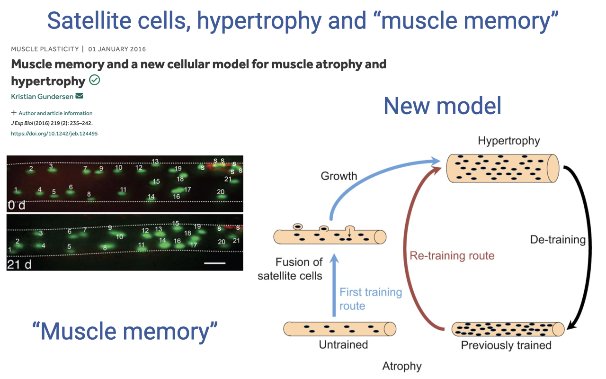

This Friday review consolidates the Week 5 material on **cellular** and **tissue-scale** muscle structure and function. It revisits the **zero-sum game** of muscle volume fractions (myofibrils, SR, mitochondria), distinguishes the **types of muscle action** (concentric, eccentric, isometric, isotonic, isokinetic), reviews the intrinsic **force–length** and **force–velocity** properties as they combine into the 3D F–L–V surface, and walks through a hands-on activity in which students **construct a power–velocity curve** from a tabulated F–V curve. It closes with a look at how the F–L and F–V relationships **shift with activation level** (Holt and Azizi 2016), an effect not yet captured by standard Hill-type muscle models.

---

## Slide 1

- Friday review and discussion session for **Week 5: Introduction to Muscle Structure and Function**.
- Consolidates **cellular-scale** content (Lecture 11: cross-bridge cycle, calcium handling, fiber types, the **zero-sum game** of volume fractions) and **tissue-scale** content (Lecture 12: F–L, F–V, power–velocity, activation effects).
- Combines a structured recap, a **power-velocity sketching activity** carried over from Wednesday, and Q&A on the bar-headed geese background reading.

---

## Slide 2

![Slide titled "Reminders" with several admin reminders. Top: "Friday content: To have your say on what I cover, please ask your questions on Perusal reading and lectures throughout the week. Be curious, ask questions!" Middle: "Please make use of the TA and LA team to help you in this class!" with a small block listing Graduate Teaching Assistant Sean Ono (stono@uci.edu) and Learning Assistants Lemuel Leonidas (lleonida@uci.edu) and Minkyu Kim (minkyk10@uci.edu); office hours for Sean on Tuesdays 11 am–12 pm via Zoom (Meeting ID 493 828 9623); QA sessions with LAs (Minkyu Mondays 12:30–1:30 pm and Lemuel Tuesdays 1:30–2:30 pm via Zoom). Lower: "Extra credit opportunity: Good for you, and will help boost your grade!" alongside a screenshot of an extra-credit assignment titled "Reflecting on the benefits of exercise…" with four steps (watch video, answer reflection questions, keep an exercise journal Weeks 4–10, reflect on barriers to regular exercise) and a download link to "Homework E183_ExtraCreditActivity.docx." Bottom: "Quiz on Sunday, as usual" and "Please complete the anonymous mid-quarter survey to let us know how the class is going for you."](images/friday-review/slide-002.png)

### Class Reminders and Logistics

- **Friday content is shaped by student questions**: post on Perusall and during lecture throughout the week to influence what gets reviewed.
- **TA and LA support team**:
  - **Graduate TA: Sean Ono** (stono@uci.edu) — office hours Tuesdays 11 am–12 pm (Zoom).
  - **LAs: Lemuel Leonidas and Minkyu Kim** — Q&A sessions Mondays 12:30–1:30 pm (Minkyu) and Tuesdays 1:30–2:30 pm (Lemuel).
- **Extra-credit opportunity**: a self-reflection assignment with four parts — (1) watch a linked video, (2) answer reflection questions, (3) keep an exercise journal for Weeks 4–10, (4) reflect on barriers to regular exercise. Helps boost course grade.
- **Quiz on Sunday**, as usual.
- **Anonymous mid-quarter survey** is open — please submit feedback on how the class is going.

---

## Slide 3

### Today's Plan

1. **Quick recap** of the core concepts from Week 5 — cellular-scale (Lecture 11) and tissue-scale (Lecture 12).
2. **Finishing up tissue-level material** that wasn't completed Wednesday — activation-dependent shifts in the F–L and F–V curves.
3. **Background-reading Q&A** — questions from the Sunday reading on **bar-headed geese** and from lecture discussions during the week.

---

## Slide 4

![Slide titled "Design trade-offs among functional components of muscle cells" showing three pie charts of muscle-cell volume fractions arranged left to right. Each pie has three components: myofibril (blue, large), Mitochondria (Mt, orange), and SR (gray). Left pie: anaerobic high-force muscle (~85% myofibril, ~5% Mt, ~10% SR). Middle pie: aerobic muscle (~70% myofibril, ~25% Mt, ~5% SR). Right pie: super-fast muscle (~50% myofibril, ~20% Mt, ~30% SR). Below the pies, a legend lists three functional roles with example proportions: (1) Myofibrils → force capacity: 70%; (2) SR → activation/relaxation speed: 5%; (3) Mitochondria → aerobic energy supply: 25%.](images/friday-review/slide-004.png)

### Recap — The Zero-Sum Game (Cellular Scale)

- **Muscle cells are highly specialized** and packed with three categories of organelles/proteins that determine function and impose **trade-offs**:

| Component | Functional role | Typical % volume |
|---|---|---|
| **Myofibrils** | Force capacity | ~70% (anaerobic high-force can reach ~85%) |
| **Sarcoplasmic reticulum (SR)** | Activation/relaxation speed (Ca2+ handling) | ~5% (super-fast can reach ~30%) |
| **Mitochondria** | Aerobic ATP supply | ~25% (anaerobic ~5%, aerobic ~25%) |

- The three pies illustrate three **functional designs**:
  - **Anaerobic, high-force**: dominated by myofibrils, very little Mt or SR — high force, fast, rapid fatigue.
  - **Aerobic**: substantial Mt fraction at the cost of myofibrils — lower force, slow, fatigue resistant.
  - **Super-fast** (e.g., rattlesnake tail-shaker): elevated SR for very rapid Ca2+ cycling, at the cost of force.
- **Study skill**: given a pie chart of volume fractions, students should be able to **infer fiber type** (fast vs. slow), **force capacity**, and **anaerobic vs. aerobic** profile.

---

## Slide 5

![Slide titled "Design trade-offs among functional components of muscle" with two pie charts shown side by side at different sizes: (left) a small pie representing a typical untrained muscle cell with myofibril, Mt, and SR proportions; (right) a much larger pie of the same proportions representing a hypertrophied muscle cell. Below the pies, three bullet points in purple: "Very few things in life are truly a zero sum game! • this trade-off exists in terms of the division of volume fraction of cell contents • Volume of the muscle cell increases with hypertrophy: the amount of all components increases in absolute terms • Conceptually useful for considering allocation of components per unit mass."](images/friday-review/slide-005.png)

### Caveat — Hypertrophy Breaks the Strict Zero-Sum Game

- **The zero-sum game applies to volume fractions, not absolute amounts.** Muscle is **highly plastic** — with training, the cell can grow larger (**hypertrophy**), so all three components can increase in absolute terms even if their proportions don't change.
- The trade-off is therefore best understood as an **allocation problem per unit mass**.
- **Whole-body consequences**:
  - **Higher muscle mass** → higher force/power capacity, but also **higher cost of carrying mass** in locomotion.
  - **Endurance athletes** are typically lean — extra muscle mass costs energy with little aerobic benefit.
  - **Power/strength athletes** carry more muscle mass — high force and power are the priority, energy economy is secondary.
- This is why **morphotype varies by sport**, even though muscle physiology is the same across humans.

---

## Slide 6

![Slide titled "Types of muscle action during contraction" with three labeled cartoon panels showing a person performing a biceps curl: (1) Concentric (Shortening) — muscle contracts with force greater than resistance and shortens; positive work; highest rate of cross-bridge cycling; energetically expensive; most ATP for a given force. (2) Eccentric (Lengthening) — muscle contracts with force less than resistance and lengthens; negative work; lowest rate of cross-bridge cycling; most economic; least ATP for a given force; most likely to cause muscle injury. (3) Isometric — muscle contracts but does not change length; no work (force only, to resist load); intermediate rate of cross-bridge cycling; steady-state cost proportional to force. Below: also lists 4) Isotonic (constant force) and 5) Isokinetic (constant velocity).](images/friday-review/slide-006.png)

### Recap — Types of Muscle Action

| Action | Definition | Cross-bridge cycling | ATP cost per unit force |
|---|---|---|---|
| **Concentric (shortening)** | Fmuscle > load; muscle shortens; **positive work** | **Highest** rate | **Highest** (energetically expensive) |
| **Eccentric (lengthening)** | Fmuscle < load; muscle lengthens; **negative work** | **Lowest** rate | **Lowest** (most economic) — but **highest injury risk** |
| **Isometric** | No length change; **no work** — force only, to resist load | Intermediate | Steady-state cost ∝ force |
| **Isotonic** | **Constant force** during shortening (lab condition) | — | — |
| **Isokinetic** | **Constant velocity** during shortening (lab condition / clinical dynamometer) | — | — |

- **Important nuance**: muscles cannot **actively** lengthen — the myosin power stroke only ratchets actin one direction. Eccentric "contraction" means the muscle is being **stretched** by an external load while attempting to generate force. Cross-bridges are stuck in a stretched, low-cycling state, which is why eccentric contractions are **economic** — and also why they cause **micro-damage** (and, if stretched too far, popped sarcomeres).
- **Whole-MTU caveat**: an "isometric" contraction at the joint level does **not** mean the muscle fibers are static. The fibers can **shorten while stretching the tendon**. The classic everyday demonstration: hold your forearm fixed, contract your bicep, and feel the muscle belly **bulge** as it shortens against the tendon.

---

## Slide 7

![Slide titled "Intrinsic contractile properties of muscle" with two side-by-side plots from Askew and Marsh 1998 mouse soleus muscle. Left: "Isometric Force-Length (or Length-Tension)" — Force (P/P₀, 0–1.0) on y-axis vs. Length (L/L₀, 0.6–1.4) on x-axis; a parabolic active-force curve peaks at L/L₀ = 1.0 with a passive-force curve rising sharply at long lengths. Right: "Isotonic Force-Velocity" — Velocity (L s⁻¹, 0–6) on y-axis vs. Force (P/P₀, 0–1.0) on x-axis; hyperbolic curve from V_max ≈ 6 at zero force down to 0 at F_max. Citation: "Askew and Marsh 1998 mouse soleus muscle." A purple box across both plots reads: "Both influence force output. Typically measured under maximum stimulation. F_tot = F_FV × F_FL × F_act."](images/friday-review/slide-007.png)

### Recap — Intrinsic F–L and F–V Curves

- The two **intrinsic Hill-type properties** of muscle:
  - **Isometric force–length** (F–L): parabolic active-force curve with peak at L0, plus exponential passive-force curve at long lengths.
  - **Isotonic force–velocity** (F–V): Hill-type hyperbolic curve from Vmax at zero force to Fmax at zero velocity.
- Both are **artificial laboratory measurements** (no natural movement is purely isometric or purely isotonic) — but they isolate fundamental mechanisms:
  - F–L → **actin-myosin overlap** at the sarcomere level (and passive force from titin/connective tissue at long lengths).
  - F–V → **rate of cross-bridge cycling**: at high velocities, fewer cross-bridges are attached at any given moment (they are cycling rapidly), so force is lower.
- These curves are typically measured at **maximum stimulation** and are combined multiplicatively in standard models:

$$F\_{tot} = F\_{FV} \times F\_{FL} \times F\_{act}$$

- **Risk note**: at long lengths, **passive force rises** while **active force falls**. Eccentric contractions at long lengths shift more load onto the connective tissues — which are slow to repair — and are the highest-risk regime for injury.

---

## Slide 8

![Slide titled "Visualize combined intrinsic properties: 3D Force-Length-Velocity" with a 3D wireframe surface plot. Three orthogonal planes are labeled: Length-Tension Plane (parabolic curve), Force-Velocity Plane (hyperbolic curve), and Velocity-Length Plane. The surface combines the parabolic F-L shape and the hyperbolic F-V shape into a 3D ridge — at high velocities, the maximum force is much lower; at intermediate length, force is highest; the surface peaks at optimal length and zero velocity. The horizontal axis at the base is labeled "Negative Work" / "Positive Work." Equation at upper right: F_tot = F_FV × F_FL × F_act.](images/friday-review/slide-008.png)

### The 3D Force–Length–Velocity Surface

- At maximum activation, muscle's force capability lives on a **3D surface** that combines the F–L parabola and the F–V hyperbola.
- Shape:
  - **Force is maximum** at **optimal length and zero velocity**.
  - Force falls off **away from L0** (in either direction).
  - Force falls off **with increasing shortening velocity**.
- Any *in vivo* contraction traces a **trajectory** across this surface; instantaneous force is read off the surface at the current length and velocity.
- This 3D surface is the **kernel** that musculoskeletal simulations (e.g., **OpenSim**) use to predict how muscles will perform during real movement when combined with **activation** (the fourth dimension; see Slide 12).

---

## Slide 9

### Activity — Construct the Power–Velocity Curve from the F–V Curve

- **Wednesday's activity**: starting from the F–V curve, students compute **Power = Force × Velocity** at each tabulated point and sketch the resulting **power-velocity curve**.
- **Provided table** (8 sample points along the F–V hyperbola):

| F/Fmax | V/Vmax |
|---|---|
| 0 | 1.00 |
| 0.05 | 0.67 |
| 0.25 | 0.35 |
| 0.4 | 0.25 |
| 0.5 | 0.17 |
| 0.75 | 0.08 |
| 0.9 | 0.04 |
| 1.0 | 0.00 |

- **Reasoning shortcut** for the endpoints:
  - At **F/Fmax = 0** (zero force), **Power = 0** regardless of velocity.
  - At **V/Vmax = 0** (zero velocity), **Power = 0** regardless of force.
- → The power curve must **start at zero, rise to a single peak, and return to zero** — it cannot be monotonic.

---

## Slide 10

![Slide titled "Sketch a Power-Velocity graph (Power = Force x Velocity)" — solution. Left: a plot of Power vs. Velocity showing the constructed curve rising from zero at very low velocity, peaking at ~0.10 at velocity ~0.25, and falling back to zero at velocity 1.0. Right: the same eight-row table with an additional Power column populated: 0, 1.00, 0.00; 0.05, 0.67, 0.034; 0.25, 0.35, 0.088; **0.4, 0.25, 0.10** (in bold); 0.5, 0.17, 0.085; 0.75, 0.08, 0.06; 0.9, 0.04, 0.036; 1, 0.00, 0.00. The peak (F/Fmax = 0.4, V/Vmax = 0.25, Power = 0.10) is highlighted. Below: "Peak power obtained at intermediate force and velocity. ~0.2–0.3 V/V_max."](images/friday-review/slide-010.png)

### Solution and Interpretation

- Computed **power** at each tabulated point:

| F/Fmax | V/Vmax | Power = F × V |
|---|---|---|
| 0 | 1.00 | 0.00 |
| 0.05 | 0.67 | 0.034 |
| 0.25 | 0.35 | 0.088 |
| **0.4** | **0.25** | **0.10** ← peak |
| 0.5 | 0.17 | 0.085 |
| 0.75 | 0.08 | 0.06 |
| 0.9 | 0.04 | 0.036 |
| 1.0 | 0.00 | 0.00 |

- **Peak power** here is at **F/Fmax ≈ 0.4** and **V/Vmax ≈ 0.25** — i.e., at **intermediate force** and **intermediate velocity**.
- **General rule**: peak power for vertebrate skeletal muscle occurs at **~0.2–0.3 V/Vmax** (varies modestly by fiber type).
- **Counterintuitive consequence**: to maximize power, you don't contract muscles as fast as possible — you contract them at only ~20–30% of Vmax. This is why **bicycles need gears**, why peak deadlifts are slow, and why peak vertical jumps involve a controlled (not maximally fast) shortening phase of the leg extensors.

---

## Slide 11

![Slide titled "Power-stress (force/load) curve" with a textbook plot from Berne and Levy Physiology, Mosby Year Book 1993. Y-axis on the left labeled "Shortening" and "Velocity"; x-axis labeled "Load (stress)." Two curves: a "Velocity-stress curve" descending from V₀ (maximum cycling rate, no load) at the upper left down to zero at maximum stress; and a "Power-stress curve" rising from zero at no load, peaking at intermediate load, and falling to zero at maximum stress. Annotations: V₀ = maximum cycling rate (no load); peak power at intermediate loads and velocities; equation Power = Work/Time = F × V. Header at upper left: "Power = F × V." Title below figure: "Peak power at intermediate loads and velocities."](images/friday-review/slide-011.png)

### Power–Stress (Force/Load) Curve

- An equivalent way to display the same physics: plot **velocity** and **power** against **load (stress)** instead of velocity:
  - **Velocity-stress curve**: starts at **V0** (maximum cycling rate at no load) and falls to zero at maximum stress (isometric).
  - **Power-stress curve**: starts at zero (no load → no work), peaks at **intermediate load**, and falls back to zero at maximum stress.
- $\text{Power} = \dfrac{\text{Work}}{\text{Time}} = F \times V$ (work per unit time).
- **Same conclusion** as the power–velocity curve: peak power at **intermediate load** and **intermediate velocity**.
- **Task-dependence**: peak power is the right optimization for **bicycling** (continuous cyclical movement), but **not all tasks** prioritize power. Some movements optimize for **force** (e.g., grip), some for **speed** (e.g., punching, throwing), some for **economy** (e.g., long-distance running). The **operating point on the F–V curve** depends on the task.

---

## Slide 12

![Slide titled "Intrinsic properties vary with activation" with four panels from Holt and Azizi 2016 Proc Roy Soc B. Top-left (a): F/F_0max vs L/L_0max for activation levels 1.0, 0.68, 0.40, 0.20 — F-L curves shrink and shift to longer L_0 at lower activation. Top-right (a): power (W kg⁻¹) vs velocity (L_0max s⁻¹) for the same activation levels — peak power and optimum velocity both decline with activation. Bottom-left (b): L_0/L_0max vs activation level — optimum length increases at lower activation, from 1.0 at full activation up to ~1.3 at activation 0.2. Bottom-right (b): V_opt vs activation level — optimum velocity for max power decreases at lower activation (from ~2.2 to ~0.7 across the range). Annotations: "Longer optimum length at lower activation level" and "Slower optimum velocity for max power at lower activation level." Citation: Holt and Azizi 2016 Proc Roy Soc B.](images/friday-review/slide-012.png)

### Activation-Dependent Shifts in F–L and F–V — Holt and Azizi 2016

- **Standard Hill-type models** assume that submaximal activation simply **scales** the F–L–V surface — like Russian nesting dolls of the same shape.
- **New experimental data** (Holt and Azizi 2016, *Proc Roy Soc B*; lab of UCI's own Manny Azizi): the curves don't just scale — their **shape changes** with activation:
  - **Top-left (F–L)**: at lower activation, the F–L parabola **shifts to the right** — peak force occurs at **longer fiber lengths**.
  - **Top-right (Power–V)**: at lower activation, the power curve **peaks at lower velocities** in addition to having lower amplitude.
  - **Bottom-left**: optimal length L0 rises from 1.0 (at full activation) up to ~1.3 (at 0.2 activation).
  - **Bottom-right**: optimal velocity for peak power Vopt falls from ~2.2 to ~0.7 across the activation range.
- **Implication**: most natural movements are **submaximally activated**, so the standard $F\_{tot} = F\_{FV} \times F\_{FL} \times F\_{act}$ multiplicative model is an **approximation** that breaks down outside maximal contractions.
- This is an **active area of research** — better models that account for activation-dependent shape changes are needed to predict muscle function in **truly dynamic, natural movement**.

---

## Key Equations

| Equation | Name | Description |
|----------|------|-------------|
| $\text{Power} = F \times V$ | Mechanical power | Instantaneous power output of a contracting muscle. Computed point-by-point from the F–V curve to construct the power–velocity curve. |
| $F\_{tot} = F\_{FV} \times F\_{FL} \times F\_{act}$ | Hill-type combined model | Standard multiplicative muscle model used in musculoskeletal simulations: total force is the product of velocity-, length-, and activation-dependent factors. |
| $\text{Power} = \dfrac{\text{Work}}{\text{Time}}$ | Power as work per unit time | Equivalent definition of power; used when relating muscle output to whole-body locomotor metrics. |

---

## Glossary of Key Terms

| Term | Definition |
|------|-----------|
| **Zero-sum game (volume fractions)** | The principle that a fixed muscle-cell volume must be partitioned among myofibrils, SR, and mitochondria, so increases in one come at the expense of the others (Rome and Lindstedt 1998). Applies per unit volume; **hypertrophy** breaks the strict version by increasing absolute amounts of all three. |
| **Hypertrophy** | Increase in muscle cell volume in response to training; allows simultaneous absolute increases in myofibrils, SR, and mitochondria even if their fractional volumes don't change. |
| **Concentric contraction** | Shortening contraction with Fmuscle > load; performs **positive work**; highest cross-bridge cycling rate; most ATP per unit force. |
| **Eccentric contraction** | Lengthening contraction with Fmuscle < load; performs **negative work**; cross-bridges stuck in a stretched low-cycling state; **most economic** but **highest injury risk** (popped sarcomeres at long stretches). |
| **Isometric contraction** | No length change at the joint level; force generation only, no mechanical work. At the **fascicle** level, fibers can still shorten against the tendon (visible "muscle bulge"). |
| **Isotonic contraction** | Constant-force lab condition used to isolate the F–V relationship via load-clamp experiments. |
| **Isokinetic contraction** | Constant-velocity lab condition; produced by an isokinetic dynamometer (also a clinical-biomechanics device). |
| **Force–length relationship** | Intrinsic relationship between fiber length and the maximum active isometric force; parabolic with a peak at L0; mechanistically explained by actin–myosin filament overlap. |
| **Optimum length (L0)** | The fiber length at which active isometric force is maximum; corresponds to maximal actin–myosin overlap. Shifts to longer lengths at submaximal activation (Holt and Azizi 2016). |
| **Passive force** | Force borne by titin and connective tissue at long lengths, independent of activation; rises exponentially at long lengths and dominates the eccentric injury regime. |
| **Force–velocity relationship** | Hill-type hyperbolic relationship between shortening velocity and load; fundamental property of muscle tissue arising from cross-bridge cycling kinetics. |
| **Vmax** | Maximum unloaded shortening velocity; primarily determined by myosin isoform; varies by fiber type and shifts with activation. |
| **Fmax (P0)** | Maximum isometric force at zero velocity. |
| **Power–velocity curve** | Force × velocity computed across the F–V curve; rises from zero, peaks at **0.2–0.3 V/Vmax** (intermediate force and velocity), and falls to zero at Vmax. |
| **Power–stress curve** | Equivalent representation: power plotted against load (stress) instead of velocity; same hyperbolic-product shape with peak power at intermediate load. |
| **3D F–L–V surface** | The combined intrinsic action space of muscle at maximum activation; the product of the F–L parabola and F–V hyperbola; the kernel of Hill-type musculoskeletal simulations. |
| **Hill-type muscle model** | Phenomenological model combining F–L, F–V, and activation factors multiplicatively: $F\_{tot} = F\_{FV} \times F\_{FL} \times F\_{act}$. |
| **Activation level (Fact)** | Scalar between 0 and 1 representing fraction of fibers active or Ca2+ activation; in standard models scales the F–L–V surface, but recent data (Holt and Azizi 2016) show it also **shifts** the optimal length and velocity. |
| **OpenSim** | Open-source musculoskeletal simulation software widely used for predicting in vivo muscle force from joint motion using F–L, F–V, and activation models. |
