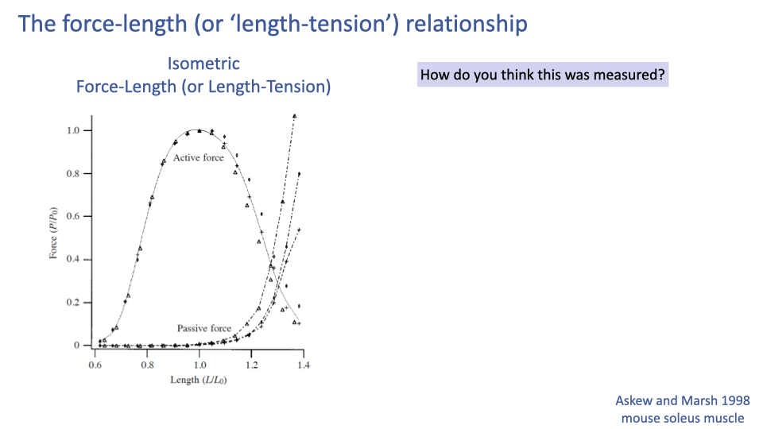
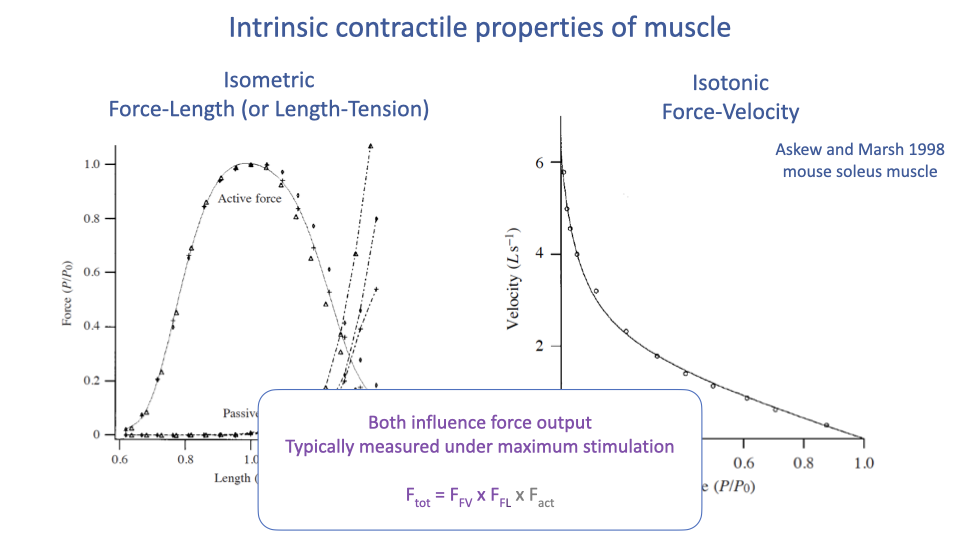
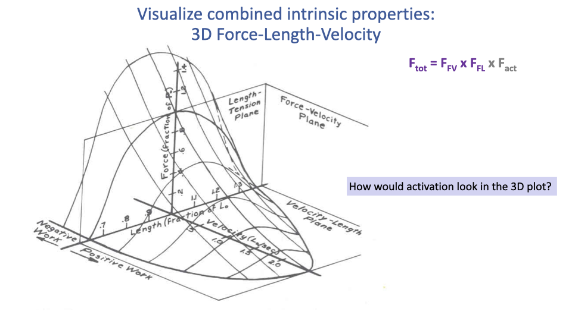

## Slide 1

- Continues the muscle physiology section from Lecture 11, building from the cellular scale up to the tissue scale of muscle function.
- Today's focus: the intrinsic mechanical properties of muscle as a tissue — the **force-length** and **force-velocity** relationships and how they translate molecular cross-bridge dynamics into whole-muscle behavior.
- A central message: muscle's intrinsic properties produce a trade-off between force and displacement at the molecular and tissue level, and different optimal contraction conditions maximize force, speed, power, or efficiency.

---

## Slide 2

### Today: From Molecules to Tissue Properties

- Tissue-scale intrinsic properties of muscle:
  - **Force–length** (length–tension) relationship.
  - **Force–velocity** relationship.
- These properties emerge from the molecular machinery (sliding filaments, cross-bridge cycling) but operate at a different scale of analysis.
- They formalize a trade-off between force and displacement that runs from the molecular level (overlap of actin and myosin) all the way to whole-tissue mechanics.
- Different points on these curves yield optimal conditions for force, speed, power, or efficiency — no single muscle state can maximize all of them simultaneously.

---

## Slide 3

![Slide titled "Design trade-offs among functional components of muscle — 'zero sum game'" with three pie charts showing volume fractions for myofibrillar proteins (blue), mitochondria (Mt, orange), and SR (gray). Left: anaerobic high-force muscle (~85% myofibrils, ~5% Mt, ~10% SR), labeled "high force, fast, rapid fatigue". Middle: aerobic muscle (~70% myofibrils, ~25% Mt, ~5% SR), labeled "lower force, slow, fatigue-resistant". Right: super fast muscle (rattlesnake) (~50% myofibrils, ~20% Mt, ~30% SR), labeled "super fast, very low force, fatigue-resistant". Below: Caveat: very few things in life are truly a zero sum game! This trade-off exists in terms of the division of volume fraction of cell contents.](images/lec12/slide-003.png)

### Recap — The "Zero-Sum Game" of Muscle Volume Fractions

- Recap from Lecture 11: a fixed muscle-cell volume must be partitioned among myofibrils (force), SR (activation/relaxation speed), and mitochondria (aerobic ATP).
- The three example pie charts (anaerobic high-force, aerobic, super-fast rattlesnake) each represent different solutions on the trade-off surface.
- The zero-sum game describes the division of volume fraction in a fixed cell; it is not an absolute trade-off in capacity.

---

## Slide 4

### Hypertrophy Breaks the Strict Zero-Sum Game

- With training, the volume of the muscle cell increases (**hypertrophy**) — so absolute amounts of all three components can grow simultaneously.
- The zero-sum game still applies in per-unit-mass terms (you can't have a high mass-specific everything), but it does not apply in absolute terms.
- Why this matters: carrying mass is energetically costly, so animals trade off mass-specific capacity (proportions) against absolute capacity (whole-muscle mass).

---

## Slide 5

![Slide titled "Shifts in muscle ultrastructure with training within fiber types" with two figures: left shows volume density of mitochondria across type I, type IIA, and type IIB fibers before and after 6 weeks and 6 months of endurance training; right shows SR Ca²⁺ uptake rate for two strength training protocols (10-set vs 3-set) with significant pre/post increases (P = 0.003). Bullets: volume density of mitochondria increases in all fiber types with training; SR Ca²⁺ release rate & uptake rates improve with training.](images/lec12/slide-005.png)

### Within-Fiber-Type Plasticity (Recap)

- Both mitochondrial volume density and SR Ca2+-handling rates improve with training within each fiber type, not just by shifting fiber-type proportions.
- This further illustrates that fiber type is a continuum, not a strict category, and that the cellular components are individually plastic.
- Together with hypertrophy, these adaptations explain why elite athletes can achieve combinations of force, speed, and endurance that look like violations of the zero-sum game.

---

## Slide 6

![Slide titled "Endurance at high speed: beating the 'zero sum game'" with a photograph of a hovering Anna's hummingbird on the left and TEM micrograph of hummingbird flight muscles on the right (Suarez 1991, 1992). Text: highest mass-specific metabolic rates among vertebrates; capable of extended hovering flight; wingbeat frequencies ~40–80 Hz; giant mitochondria, occupy ~35–50% of total volume; "double-packed" inner membranes (cristae); higher body temperature increases rates of ATP synthesis and Ca²⁺ pumping.](images/lec12/slide-006.png)

### Hummingbirds Push the Trade-off Surface

- Hummingbirds combine extreme aerobic capacity with high contraction frequency:
  - Highest mass-specific metabolic rates of any vertebrates.
  - Hovering flight sustained for prolonged periods.
  - Wingbeat frequencies of ~40–80 Hz.
- Their flight muscles have:
  - Giant mitochondria occupying ~35–50% of cell volume (well beyond typical vertebrate muscle).
  - Double-packed cristae (extra inner membrane).
  - Operating temperatures elevated above typical body temperature, accelerating ATP synthesis and Ca2+ pumping.
- These specializations expand the cellular envelope rather than violating the zero-sum trade-off.

---

## Slide 7

![Slide titled "Very low force-generating ability and unusually high temperature dependency in hummingbird flight muscle fibers" (Reiser et al.). Top-left scatterplot: P/CSA (force per cross-sectional area, kN m⁻²) vs resting sarcomere length (1.60 to 3.00 µm), with pectoralis fibers, supracoracoideus fibers, and leg fibers; flight muscle fibers (green-yellow points) cluster at low P/CSA values. Right panels show micrographs of fibers. Bottom plot: P/CSA vs temperature (°C) for Calypte anna and Taeniopygia guttata fibers, with extrapolations to body temperature; hummingbird shows steeper temperature dependence. Text annotations: low specific tension, high temperature sensitivity, design trade-offs remain.](images/lec12/slide-007.png)

### Hummingbird Trade-offs — Low Specific Tension and Thermal Sensitivity

- The "broken zero-sum game" of hummingbird flight muscle comes with its own costs:
  - Very low specific tension (force per unit cross-sectional area) — because so much volume is mitochondria, less is myofibrils.
  - High temperature sensitivity — force falls off steeply at lower temperatures.
- Functional consequence: hummingbirds enter torpor in cold conditions because muscle force collapses below their narrow operating temperature range.
- Design trade-offs remain — even extreme specialists pay for one capacity with another.

---

## Slide 8

![Slide titled "Regional endothermy in red muscle" with an underwater photograph of a tuna and a phylogenetic/temperature plot (Bernal et al. 2017) showing red muscle temperature (RM) vs sea surface temperature for various scombrid fishes (tuna, mackerel, bonito) and lamnid sharks. Text: tunas and mackerel sharks have a network of countercurrent blood vessels associated with slow-twitch aerobic red muscles used for continuous swimming; rete mirabile (vascular countercurrent heat exchanger) is found in association with swimming muscles, viscera, and cranial/orbital regions; tuna also have a "heater organ" derived from extraocular muscles; muscle fibers lost their contractile ability and perform futile calcium cycling between the cytoplasm and the sarcoplasmic reticulum generating large amounts of heat; other scombrids including mackerel (Scombrini) and bonito (Sardini) lack retia.](images/lec12/slide-008.png)

### Regional Endothermy and Heater Organs

- Tunas and mackerel sharks maintain elevated red-muscle temperature above ambient water using a rete mirabile — a vascular countercurrent heat exchanger that traps metabolic heat near the slow-twitch aerobic red muscle used for continuous swimming.
- The rete also occurs in association with viscera and cranial/orbital regions in some species.
- Heater organs: in some tunas, extraocular muscles have lost contractile function and instead perform futile Ca2+ cycling between cytoplasm and SR — generating heat to warm the eye and brain.
- Other scombrids (mackerel, bonito) lack retia, so this is a derived feature within the group.
- Reinforces the importance of muscle temperature for muscle function — and shows that the molecular machinery of muscle can be co-opted for thermogenesis when the contractile function is lost over evolutionary time.

---

## Slide 9

### Learning Objectives — Tissue Properties

1. Describe the intrinsic **force–length (F–L)** and **force–velocity (F–V)** mechanical properties of muscle and discuss the experimental conditions used to measure them.
2. Be able to calculate an optimal power curve from a force–velocity curve.
3. Discuss how muscle fiber type and activation level influence F–V and F–L properties.

---

## Slide 10

![Slide titled "Types of muscle action during contraction" with three labeled cartoon panels showing a person performing a biceps curl with a dumbbell. (1) Concentric (Shortening): muscle contracts with force greater than resistance and shortens — labeled "Positive work," most energetically expensive (most ATP for a given force). (2) Eccentric (Lengthening): muscle contracts with force less than resistance and lengthens — labeled "Negative work," most economic (least ATP for a given force), most likely to cause muscle injury. (3) Isometric: muscle contracts but does not change length — labeled "No work," force only (to resist load), steady-state cost proportional to force. Below: 4) Isotonic (constant force) and 5) Isokinetic (constant velocity).](images/lec12/slide-010.png)

### Types of Muscle Action — Concentric, Eccentric, Isometric, Isotonic, Isokinetic

| Action | Description | Energetic cost |
|---|---|---|
| **Concentric (shortening)** | Muscle force > load; muscle shortens; positive work | Most expensive ATP per unit force |
| **Eccentric (lengthening)** | Muscle force < load; muscle lengthens; negative work | Most economic; highest injury risk |
| **Isometric** | Force generated, no length change; no work | Steady-state cost proportional to force |
| **Isotonic** | Constant force during shortening; experimental condition | — |
| **Isokinetic** | Constant velocity during shortening; experimental condition | — |

- These action types matter physiologically: e.g., you can jump down from a higher height than you can jump up to — eccentric contractions produce higher force, more economically, than concentric contractions.
- Isotonic and isokinetic are mainly laboratory conditions used to isolate one variable (force or velocity) — they map onto the F–V experiments below.
- Isometric work with elastic tendon stretch–recoil is common in locomotion (e.g., running) and is economical because the muscle does no shortening work.

---

## Slide 11

![Slide titled "Intrinsic contractile properties of muscle" with two side-by-side plots from Askew and Marsh 1998 mouse soleus muscle. Left: "Isometric Force-Length (or Length-Tension)" — Force (P/P₀) on y-axis vs. Length (L/L₀) on x-axis (0.6 to 1.4); a parabolic active force curve peaks at L/L₀ = 1.0, and a separate exponential passive force curve rises sharply at long lengths. Right: "Isotonic Force-Velocity" — Velocity (L s⁻¹) on y-axis vs. Force (P/P₀) on x-axis (0 to 1.0); hyperbolic curve from V_max ≈ 6 at zero force down to 0 at F_max. A photograph of a mouse appears at top right.](images/lec12/slide-011.png)

### The Two Intrinsic Curves

- **Isometric force–length (length–tension):** the maximum active force a muscle can produce as a function of its length.
  - Parabolic shape with a peak at the **optimum length L0**.
  - **Passive force** (from connective tissue and titin) rises exponentially at long lengths.
- **Isotonic force–velocity:** the maximum shortening velocity a muscle can sustain at a given constant force.
  - Hyperbolic shape (Hill-type curve).
  - **Vmax** at zero force; **Fmax** at zero velocity.
- These two curves are the foundation of all muscle modeling — including the musculoskeletal simulations used in clinical biomechanics (e.g., **OpenSim**).

---

## Slide 12

![Slide titled "Skeletal muscle length-tension relationship" with a textbook curve showing tension (% of maximum, y-axis) vs % of resting sarcomere length (x-axis, 60 to 180). The curve rises from zero at 60% length, reaches an "optimal sarcomere length" plateau between roughly 80% and 120% (~100% tension), and falls to zero again at 180%. Labels 1, 2, 3 mark short, optimal, and long sarcomere lengths. Below the graph are three sarcomere schematics: (1) short, with thick and thin filaments overlapping each other and crowding the Z-discs (interference); (2) optimal, with maximal cross-bridge overlap; (3) long, with little actin–myosin overlap. Below each is a cartoon of the corresponding whole muscle length (short, mid, long).](images/lec12/slide-012.png)

### Mechanism of the Length–Tension Curve at the Sarcomere Level

- The active force–length curve is mechanistically explained by actin–myosin filament overlap:
  - Short lengths: actin filaments cross past each other and myosin filaments butt against the Z-discs → interference and reduced cross-bridge formation.
  - Optimal length (~100% of resting sarcomere length, plateau ~80–120%): maximal overlap of actin binding sites with myosin heads → maximum cross-bridge formation.
  - Long lengths: filament overlap decreases → fewer cross-bridges can form → force falls.
- The plateau region in whole-muscle data exists because individual sarcomeres in a muscle are not all at exactly the same length — the variation smears out the sharp peak predicted at the single-sarcomere level.

---

## Slide 13

### Setup — How Was the F–L Curve Measured?

- The slide poses the measurement question: how was this curve actually generated experimentally?
- Important conceptual point: the curve is not measured by stretching one muscle while it contracts.
- Each point is generated under strict isometric, maximally stimulated conditions at a series of different fixed lengths (next slide).

---

## Slide 14

### How the F–L Curve Is Measured (Protocol)

1. Mount the muscle (or fiber) in a **muscle ergometer** — a rig that fixes the muscle at a given length while measuring force.
2. Hold the muscle at a constant length; measure the passive force at that length (no stimulation).
3. Maximally stimulate the muscle (electrically for a whole muscle, by Ca2+-bath for a skinned fiber).
4. Measure the maximum force during isometric contraction at that length: $F\_{max} = F\_{active} + F\_{passive}$.
5. Compute: $F\_{active} = F\_{max} - F\_{passive}$.
6. Repeat at a series of fixed lengths; each length yields one passive point and one active point on the curve.

- There is no single experiment in which a muscle continuously sweeps through this curve. The F–L curve is assembled from many independent isometric trials — it is an "envelope" of maximum capability, not a record of any single contraction.

---

## Slide 15

![Slide titled "Force-length data from guinea fowl lateral gastrocnemius" with three panels and a photo of a guinea fowl. Top-left: Force (N, 0–150) vs. time trace from a single trial showing isometric force rising and then falling. Bottom-left: simultaneous fascicle length (mm, 18–24) trace showing the fascicle shortening during the contraction (because the tendon stretches). Right: full F-L plot with active force (blue curve, peak ~140 N at fascicle length ~18 mm) and passive force (dashed line, rising at long lengths); the data points (open circles) trace out the active curve; a single trial contributes one circle. The continuous black trajectory traces the loop of a single contraction.](images/lec12/slide-015.png)

### Real Data — Guinea Fowl Lateral Gastrocnemius

- An example of an actual F–L measurement on the guinea fowl lateral gastrocnemius (a whole muscle–tendon unit).
- During each isometric trial, the fascicles shorten slightly even though the whole muscle–tendon length is fixed — the shortening is taken up by tendon stretch.
- The investigator must wait for the fascicle length to reach steady state before recording the force value; that pair of (fascicle length, force) becomes one point on the F–L curve.
- Repeated trials at many starting lengths fill out the active and passive force–length curves.

---

## Slide 16

### The Isotonic F–V Curve — Endpoints

- **Vmax**: the maximum unloaded shortening velocity (force = 0).
- **Fmax** (also written P0 or F0): the maximum isometric force (velocity = 0).
- The shape between these endpoints is hyperbolic — a key intrinsic property of muscle (Hill 1938).

---

## Slide 17

![Slide titled "The Isotonic Force-Velocity Relationship" with the same F-V curve on the left and a "Load clamp experiment" inset on the right. The load clamp inset shows three time-aligned traces from a single trial: top — force (P/P₀, 0–0.6) clamped to ~0.6 between two red vertical lines during electrical stimulation (horizontal black bar); middle — strain trace showing the muscle shortening once the clamp force is reached; bottom — velocity (L s⁻¹) computed from the strain derivative, showing a steady-state shortening velocity of approximately 0–0.5 L s⁻¹ during the clamp window. Question: "How does the 'load clamp' experiment result in 'Force-Velocity' curve?"](images/lec12/slide-017.png)

### How the F–V Curve Is Measured — The Load Clamp

- The **load clamp experiment** holds the muscle force at a specified constant value while letting it shorten.
- Procedure:
  1. Stimulate the muscle.
  2. As force rises, clamp it at a target value (e.g., 0.6 × Fmax).
  3. Once the target force is reached, allow the muscle to shorten freely while maintaining the clamped force.
  4. Measure the steady-state shortening velocity during the clamp.
- That velocity, paired with the clamped force, becomes one point on the F–V curve.

---

## Slide 18

### Mapping a Load-Clamp Trial to the F–V Curve

- The diagram shows how the clamped force (top panel of the inset, ~0.6 P/P0) and the steady-state shortening velocity (bottom panel, ~1 L s−1) are read off and mapped to a single point on the F–V curve.
- Repeating the experiment at many different clamp forces generates the full curve.
- This is again an envelope — each point is from a separate, controlled trial.

---

## Slide 19

![Slide titled "Force-velocity data from guinea fowl lateral gastrocnemius" with traces on the left and a F-V plot on the right. Left panels: top — fractional force (F/F_max) traces from two trials, one clamped at ~0.9 F_max (dark blue shaded window) and one at ~0.3 F_max (light blue shaded window); bottom — corresponding length (mm, 12–24) traces showing slow shortening at the high-force trial and fast shortening at the low-force trial. Right: F/F_max vs. shortening velocity (L₀ s⁻¹, 0–5); the dark blue point (high force, slow velocity) and the light blue point (lower force, faster velocity) are highlighted on the curve, which falls from F/F_max ≈ 0.9 at low velocity to ≈ 0.1 at high velocity.](images/lec12/slide-019.png)

### Real Data — Guinea Fowl F–V Curve

- Two example load-clamp trials on the guinea fowl lateral gastrocnemius:
  - High clamp force (~0.9 Fmax) → slow shortening (low velocity point).
  - Lower clamp force (~0.3 Fmax) → fast shortening (high velocity point).
- Repeating at many force levels yields the full F–V hyperbola for that muscle.
- Why force and velocity trade off (cross-bridge mechanism): at higher shortening velocities, more myosin heads are detached at any moment because they spend more time cycling; at zero velocity (isometric), all cross-bridges can be simultaneously attached, giving maximum force.

---

## Slide 20

![Slide titled "Comparative measures of maximum velocity (V_max)" with a log-log plot of V_0 (mL s⁻¹) vs. body mass (kg, 0.01 to 10000) for several mammals (mouse, rat, dog, human, horse, rhinoceros). Two regression lines are shown: an upper line for fast oxidative/glycolytic (type IIa) fibers (open circles) and a lower line for slow oxidative (type I) fibers (filled circles). Both have negative slopes — small animals have faster muscles. Annotation: "Small animals have faster muscles". Citation: Marx et al. 2006, Eur J Physiol.](images/lec12/slide-020.png)

### Body Size and Vmax — Small Animals Have Faster Muscles

- Across mammals, both type I and type IIa fibers show decreasing Vmax with increasing body mass.
- Functional rationale: larger animals take longer, slower strides to cover a given distance, so the selective pressure for fast muscles is weaker; meanwhile, fast muscles are energetically expensive.
- Fiber type offset: type IIa (fast) > type I (slow) at every body size.

---

## Slide 21

![Slide titled "Comparative measures of maximum velocity & power" with two plots from Seow and Ford 1991. Top plot (A): maximum shortening velocity vs body weight (kg, 0.01–1000) on log-log scales for fast (filled symbols) and slow (open symbols) fibers, showing a negative scaling. Bottom plot (B): relative maximum power vs body weight on log-log scales, also showing negative scaling for both fast and slow fibers. Annotations: "Small animals have faster muscles"; limitations and caveats: small sample sizes; likely to be high diversity among animals of similar size; may not reflect how the muscle is used in vivo.](images/lec12/slide-021.png)

### Body Size and Maximum Power — With Caveats

- Both maximum velocity and relative maximum power decrease with body size in mass-specific terms.
- Caveats:
  - Small sample sizes in comparative studies.
  - High within-size diversity — muscle is highly plastic and varies among muscles within an organism.
  - Lab measurements may not reflect in vivo use: animals of different sizes have different mechanical demands and use their muscles differently.

---

## Slide 22

### Combining F–V, F–L, and Activation

- Both intrinsic curves are typically measured at maximum stimulation — they describe the upper envelope of force capability.
- A widely used muscle model combines them multiplicatively:

$$F\_{tot} = F\_{FV} \times F\_{FL} \times F\_{act}$$

- Where:
  - FFV: scaling factor from the force–velocity curve at the current shortening velocity.
  - FFL: scaling factor from the force–length curve at the current length.
  - Fact: activation level (between 0 and 1).
- Used in clinical and research musculoskeletal models (e.g., OpenSim) to predict how muscles will perform under different movements and surgical interventions (e.g., tendon transfers, shoulder reconstruction).

---

## Slide 23

![Slide titled "Visualize combined intrinsic properties: 3D Force-Length-Velocity" with a 3D wireframe surface plot. Three orthogonal planes are labeled: Length-Tension Plane (parabolic curve), Force-Velocity Plane (hyperbolic curve), and Velocity-Length Plane. The surface combines the parabolic F-L shape and the hyperbolic F-V shape into a 3D ridge — at high velocities, the maximum force is much lower; at intermediate length, force is highest; the surface peaks at optimal length and zero velocity. Equation: F_tot = F_FV × F_FL × F_act.](images/lec12/slide-023.png)

### The 3D Force–Length–Velocity Surface

- At maximum activation, the muscle's force capability is fully described by a 3D surface: the product of the F–L parabola and the F–V hyperbola.
- This surface defines the action space of the muscle:
  - Highest force at optimal length and zero velocity.
  - Force falls off away from optimal length (in either direction).
  - Force falls off with increasing shortening velocity.
- Any in vivo contraction corresponds to a trajectory across this surface; the resulting force is read off the surface at the current length and velocity.

---

## Slide 24

### Activation Level Scales the F–V Curve

- A hyperbolic F–V relationship exists at every activation level, not just at 100%.
- Lower activation produces a lower-amplitude curve — both maximum force and maximum velocity decrease.
- In standard muscle models, activation is often assumed to scale the entire surface proportionally (multiplicatively) — though there is now growing evidence that the curve shape changes at submaximal activation as well (see Slide 28).

---

## Slide 25

### Activation in 3D — Nesting Surfaces

- Conceptually, lower activation corresponds to a smaller, nested 3D surface stacked beneath the maximally activated surface.
- An apt metaphor: Russian nesting dolls — each activation level produces a similarly shaped but smaller F–L–V surface.
- The full muscle model therefore lives in a 4D space (force × length × velocity × activation).

---

## Slide 26

### Constructing the Power–Velocity Curve

- Power = Force × Velocity at every point on the F–V curve.
- Power is zero at the endpoints (zero velocity → zero displacement → no power; zero force → no work done) and reaches a single peak at intermediate force and velocity.
- Peak power typically occurs at roughly 0.2–0.3 × Vmax for vertebrate skeletal muscle.
- There is an optimal contraction velocity for power output — for example, this is why bicycles need gears, so cyclists can keep their muscles operating near their optimal cadence regardless of road speed or grade.

---

## Slide 27

![Slide titled "Power-stress curve" with a plot from Berne and Levy Physiology adapted from Mosby. Y-axis on the left labeled "Shortening" and "Velocity"; x-axis labeled "Load (stress)". Two curves: a "Velocity-stress curve" descending from V_0 (maximum cycling rate, no load) at the top-left down to zero at maximum stress; and a "Power-stress curve" rising from zero at no load, peaking at intermediate load, and falling to zero at maximum stress. Annotations: V_0 = maximum cycling rate (no load); peak power at intermediate loads and velocities; equation Power = Work/Time = F × V; "Stress = force/PCSA"; "Power = F × V".](images/lec12/slide-027.png)

### Power–Stress Curve and Cross-Sectional Normalization

- An equivalent way to plot the same relationship: power vs. load (stress) instead of power vs. velocity.
- **Stress** = force per **physiological cross-sectional area (PCSA)** — normalizes for muscle size.
- Same general result: peak power at intermediate loads and velocities.
- The shape of these curves is foundational for understanding why athletes train at specific resistance levels and why muscle architecture (PCSA, fiber length) matters for whole-muscle power output.

---

## Slide 28

![Slide titled "Intrinsic properties vary with activation" with four panels from Holt and Azizi 2016 Proc Roy Soc B. Top-left (a): F/F_0max vs L/L_0max for activation levels 1.0, 0.68, 0.40, 0.20 — F-L curves shrink and shift to longer L_0 at lower activation. Top-right (a): power (W kg⁻¹) vs velocity (L_0max s⁻¹) for the same activation levels — peak power and optimum velocity both decline with activation. Bottom-left (b): L_0/L_0max vs activation level — optimum length increases at lower activation, from 1.0 down to ~1.3. Bottom-right (b): V_opt (L_0max s⁻¹) vs activation level — optimum velocity for max power decreases at lower activation. Annotations: "Longer optimum length at lower activation level"; "Slower optimum velocity for max power at lower activation level".](images/lec12/slide-028.png)

### The Curves Themselves Change With Activation

- New experimental evidence (Holt and Azizi 2016): the F–L and F–V curves change shape — not just amplitude — with activation level.
- Key effects at lower activation:
  - Optimum length L0 shifts to longer fiber lengths.
  - Optimum velocity for peak power Vopt shifts to slower velocities.
- Implication for muscle modeling: the simple multiplicative model ($F\_{tot} = F\_{FV} \times F\_{FL} \times F\_{act}$) is an approximation — at submaximal activation (which is typical of most everyday movements!), more sophisticated models are required.

---

## Slide 29

![Slide titled "Intrinsic properties vary with fiber type (e.g., myosin isoforms)" with a Power vs. Velocity (L s⁻¹, 0.00 to 1.25) plot from Bottinelli et al. 1996 of human skeletal muscle. Three curves are shown for three fiber types: type IIB (fast glycolytic) — highest peak power (~3.5 W L⁻¹) at velocity ~0.25 L s⁻¹; type IIA (fast oxidative) — peak power ~2 W L⁻¹ at velocity ~0.15 L s⁻¹; slow (type I, slow oxidative) — peak power ~0.5 W L⁻¹ at velocity ~0.05 L s⁻¹. Magenta dots mark each curve's peak. Color labels at right: fast glycolytic (type IIb), fast oxidative (type IIa), slow oxidative (type I).](images/lec12/slide-029.png)

### F–V and Power Vary With Fiber Type

- Different myosin isoforms produce different F–V hyperbolas — and therefore different power curves.
- In human skeletal muscle (Bottinelli et al. 1996):
  - Type IIB (fast glycolytic): highest Vmax and highest peak power, at the highest optimum velocity.
  - Type IIA (fast oxidative): intermediate.
  - Type I (slow oxidative): lowest Vmax, lowest peak power, slowest optimum velocity.
- All three curves share the same fundamental hyperbolic shape, but their scale and curvature differ.
- These differences are why fiber type composition of a muscle matters so much for sport-specific performance.

---

## Slide 30

![Slide titled "Muscle efficiency as a function of velocity" with three panels. Left: experimental traces from Barclay, Woledge, Curtin (2010) J Physiol — top: ΔL (mm), middle: force output (kPa), bottom: cumulative heat produced (mJ/g) over time in a single trial; efficiency calculated from work done vs. heat + work. Top-right (C): relative rate of energy output (enthalpy and power) vs shortening velocity (V/V_max) at 20°C, 25°C, and 30°C — both enthalpy and power increase with velocity but plateau or decline at high velocity. Bottom-right (E): mechanical efficiency vs shortening velocity at the same three temperatures, with a magenta arrow showing peak efficiency at low velocity (~0.2 V/V_max) — annotated "Peak efficiency at low velocity".](images/lec12/slide-030.png)

### Efficiency Peaks at Low Velocity

- **Mechanical efficiency** (work output ÷ total energy expenditure) is a function of shortening velocity.
- Across temperatures (20–30°C in mouse soleus), efficiency:
  - Peaks at low shortening velocity (~0.1–0.2 V/Vmax).
  - Falls off at higher velocities as more energy is lost as heat.
- The velocity that maximizes power (~0.25 V/Vmax) is higher than the velocity that maximizes efficiency — animals (and athletes) face a trade-off between going fast and using fuel efficiently.

---

## Slide 31

![Slide titled "Muscle properties relate to performance trade-offs between sprint speed & power vs fatigue resistance" with two scatterplots from Vanhooydonck et al. 2014 Proc Roy Soc B comparing 17 lizard species. Top: log-transformed mass-specific muscle power vs sprint speed — positive correlation (annotation: "Muscle power is positively correlated with sprint speed by enabling faster acceleration"). Bottom: log mass-specific muscle power vs fatigue resistance — negative correlation (annotation: "Muscle power output is negatively correlated with fatigue resistance"). A photo of a lizard appears at lower right.](images/lec12/slide-031.png)

### Sprint Power vs. Fatigue Resistance — A Comparative Trade-off

- Across 17 lizard species (Vanhooydonck et al. 2014):
  - Mass-specific muscle power is positively correlated with sprint speed (high power → fast acceleration).
  - Mass-specific muscle power is negatively correlated with fatigue resistance.
- This is the whole-organism manifestation of the cellular zero-sum game from Lecture 11: species that have evolved high sprint power have done so at the cost of endurance.
- A clean comparative example of how intrinsic muscle properties translate into ecological performance trade-offs.

---

## Slide 32

### Learning Objectives — Recap

1. Intrinsic F–L and F–V properties: assembled from many isometric (F–L) or isotonic load-clamp (F–V) trials, each at maximum stimulation; they form envelopes, not records of single contractions.
2. Power from F–V: power = force × velocity, so the power–velocity curve is computed point-by-point from the F–V curve. Peak power occurs at intermediate force and velocity (~0.2–0.3 Vmax).
3. Fiber type and activation effects: faster fiber types have higher Vmax and higher peak power; activation scales the F–V/F–L surface and (per recent work) also shifts its optimal length and velocity.

---

## Key Equations

| Equation | Name | Description |
|----------|------|-------------|
| $F\_{max} = F\_{active} + F\_{passive}$ | Total isometric force | Measured force during maximally stimulated isometric contraction is the sum of **active** (cross-bridge) force and **passive** (titin + connective tissue) force. |
| $F\_{active} = F\_{max} - F\_{passive}$ | Active force | Active force is computed by subtracting separately measured passive force from the total. Used to construct the active F–L curve point-by-point. |
| $(V + b)(F + a) = b(F\_0 + a)$ | Hill force–velocity equation | The classic hyperbolic relation between shortening velocity $V$ and load $F$. $F\_0$ is the **maximum isometric tension** (at $V = 0$); $V\_0$ is the **maximum shortening velocity** (at $F = 0$); $a$ is a coefficient related to the heat of shortening; $b = a(V\_0/F\_0)$. |
| $P = F \cdot V$ | Mechanical power | Instantaneous power output; computed point-by-point from the F–V curve. **Peak power occurs at intermediate force and velocity (~0.2–0.3 Vmax).** |
| $F\_{tot} = F\_{FV} \cdot F\_{FL} \cdot F\_{act}$ | Combined muscle model | The standard multiplicative muscle model used in musculoskeletal simulations (e.g., OpenSim): total force is the product of velocity-, length-, and activation-dependent factors. |
| $\sigma = F / \text{PCSA}$ | Specific tension (stress) | Force normalized by **physiological cross-sectional area**; allows comparison of intrinsic capability across muscles of different sizes. |

---

## Glossary of Key Terms

| Term | Definition |
|------|-----------|
| **Hypertrophy** | Increase in muscle cell volume in response to training; allows simultaneous increases in absolute amounts of myofibrils, mitochondria, and SR even though their fractional volumes still trade off. |
| **Hovering flight** | Sustained flight in place; aerodynamically demands lift on both upstroke and downstroke, requiring extreme power output (e.g., hummingbirds). |
| **Pectoralis** | Avian downstroke flight muscle; in hummingbirds, exclusively type IIa fibers packed with giant mitochondria. |
| **Supracoracoideus** | Avian upstroke flight muscle; routes through a tendon over the shoulder to lift the wing. |
| **Specific tension (P/CSA)** | Force generated per unit cross-sectional area; reflects myofibrillar volume fraction and is much lower in hummingbird flight muscle than in standard vertebrate muscle. |
| **Regional endothermy** | Maintenance of elevated temperature in selected tissues using vascular countercurrent heat exchangers (e.g., red swimming muscle in tunas). |
| **Rete mirabile** | The vascular countercurrent heat exchanger that traps metabolic heat in tissues such as red muscle of tunas and mackerel sharks. |
| **Heater organ** | A muscle (e.g., extraocular in some tunas) that has lost contractile function and dedicates its calcium-cycling machinery to thermogenesis via futile Ca2+ cycling. |
| **Concentric contraction** | Shortening contraction in which muscle force exceeds the load; performs **positive work**; most expensive in ATP per unit force. |
| **Eccentric contraction** | Lengthening contraction in which the load exceeds muscle force; performs **negative work**; most economic per unit force; greatest injury risk because sarcomeres can be stretched past overlap. |
| **Isometric contraction** | Constant-length contraction with force generation but no shortening; no mechanical work, but ATP cost is proportional to force. |
| **Isotonic contraction** | Contraction at **constant force**; an experimental condition used to isolate the F–V relationship via load clamps. |
| **Isokinetic contraction** | Contraction at **constant velocity**; produced experimentally by an isokinetic dynamometer (also a clinical biomechanics device). |
| **Force–length (length–tension) relationship** | The intrinsic relationship between muscle length and the maximum active isometric force it can produce; parabolic with a peak at the optimum length L0, mechanistically explained by actin–myosin filament overlap. |
| **Optimum length (L0)** | The fiber/muscle length at which active isometric force is maximum; corresponds to maximal actin–myosin overlap. |
| **Passive force** | Force borne by titin and connective tissue at long lengths, independent of activation; measured before stimulation in F–L experiments. |
| **Active force** | The Ca2+-dependent, cross-bridge-driven force; computed as Fmax − Fpassive in F–L experiments. |
| **Force–velocity (F–V) relationship** | The intrinsic hyperbolic relationship between shortening velocity and load; foundational result of Hill (1938). |
| **Vmax** | Maximum unloaded shortening velocity of a muscle fiber; primarily determined by myosin isoform; declines with body size across mammals. |
| **Fmax (P0)** | Maximum isometric force at zero velocity. |
| **Load clamp experiment** | A muscle ergometer protocol that holds the muscle force at a specified value while measuring the resulting steady-state shortening velocity; used to construct the F–V curve point-by-point. |
| **Muscle ergometer** | A laboratory device that controls and measures muscle length and force; the workhorse of in vitro muscle mechanics. |
| **Power–velocity curve** | The product of force and velocity computed across the F–V curve; rises from zero, peaks at intermediate velocity (~0.2–0.3 Vmax), and falls to zero at Vmax. |
| **Mechanical efficiency** | Mechanical work output divided by total energy expenditure; peaks at lower velocities than peak power, reflecting the cost of cross-bridge cycling at high speeds. |
| **Activation level (Fact)** | A scalar (0–1) representing the fraction of fibers active or the level of Ca2+ activation; in standard muscle models scales the F–L–V surface multiplicatively. |
| **3D F–L–V surface** | The combined intrinsic action space of a muscle at maximum activation; the product of the F–L parabola and the F–V hyperbola. |
| **OpenSim** | Open-source musculoskeletal simulation software widely used for predicting in vivo muscle force from joint motion using F–L, F–V, and activation models. |
| **Physiological cross-sectional area (PCSA)** | The cross-sectional area of a muscle measured perpendicular to its fibers; sets the muscle's maximum force capacity (proportional to number of sarcomeres in parallel). |
| **Sarcomeres in series vs. in parallel** | Architectural arrangement that determines, respectively, the muscle's range of shortening (series) and maximum force (parallel); training type can shift this balance. |
| **Hill-type muscle model** | A standard phenomenological muscle model based on the Hill F–V hyperbola, often combined with an F–L curve and an activation factor. |
