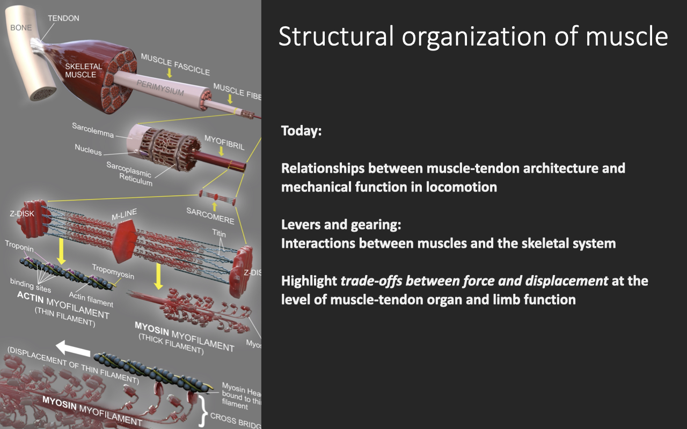
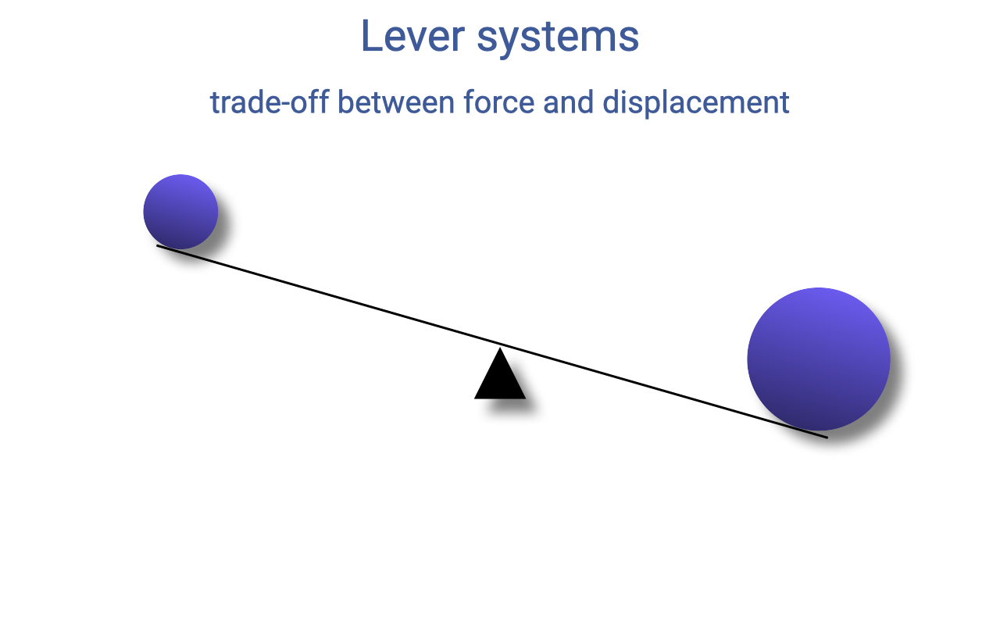
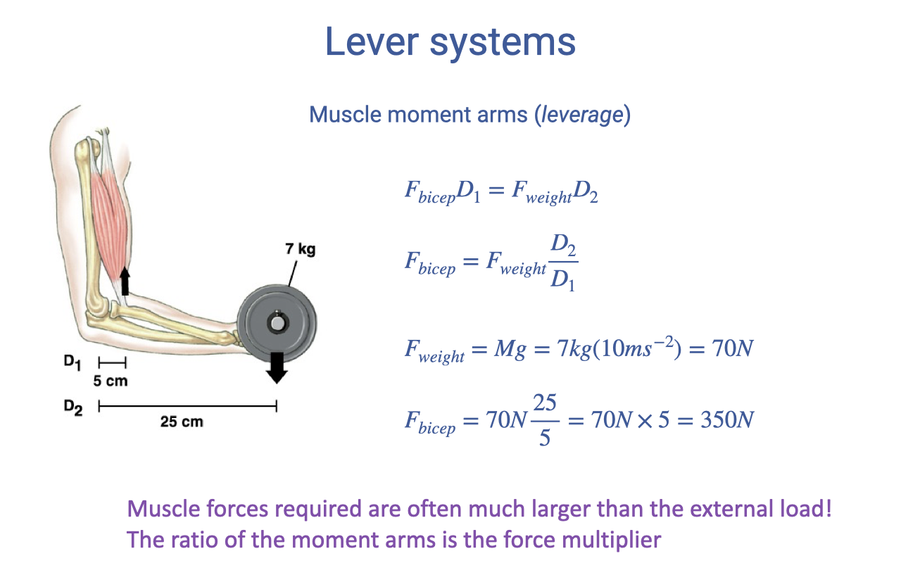

## Slide 1

- Opens **Lecture 13**, the third in the muscle structure-and-function sequence — moving from the **cellular** (Lecture 11) and **tissue** (Lecture 12) scales up to the **organ** (muscle–tendon unit) and **limb** (skeletal lever) scales.
- Central theme continued: **trade-offs at every structural level** — and these trade-offs **integrate across levels** (tissue intrinsic properties × architecture × lever systems).
- Today's focus: how **muscle–tendon architecture** and **skeletal lever systems** influence force, displacement, work, and power capacity at the whole-muscle and whole-limb level.

---

## Slide 2

![Recap slide titled "Intrinsic contractile properties — Force-length and force-velocity data from guinea fowl LG" with two plots from the prior lecture. Left: force (N) vs. fascicle length (mm, 14–24) showing the active force–length curve as a parabolic "envelope" of points and the passive force curve at long lengths; one example single-trial trajectory is shown as a black loop. Right: fractional force (F/F_max) vs. shortening velocity (L₀ s⁻¹, 0–5) showing the hyperbolic Hill-type force–velocity curve. Photograph of a guinea fowl is included for context.](images/lec13/slide-002.png)

### Recap — Intrinsic Tissue Properties (Hill-Type Properties)

- Recap from Lecture 12: muscle's **intrinsic contractile properties** are the **isometric force–length** (F–L) and **isotonic force–velocity** (F–V) relationships.
- These are sometimes called **"Hill-type" properties**, after **A.V. Hill**, who developed the experimental methods to measure them.
- Each curve is built up as an **envelope** from many independent isometric or load-clamp trials — not a record of a single sweeping contraction.

---

## Slide 3

![Recap slide titled "Perspective on musculoskeletal modelling and predictive simulations of human movement to assess the neuromechanics of gait" by Friedl De Groote and Antoine Falisse. Left: a series of skeletal figures walking, with red muscles overlaid on the right limb. Right: a flowchart showing optimal-control loop with central nervous system (control policy) → muscle excitations → muscle dynamics → musculoskeletal geometry (joint torques) → skeleton dynamics → movement, with feedback. A circled inset highlights a Hill-type muscle model (CE + PE element). Annotation at bottom right shows the equation F_tot = F_FV × F_FL × F_act and a note: "Hill-type models: force-length, force-velocity & activation; widely used in simulations for rehabilitation, design of mobility assistance devices."](images/lec13/slide-003.png)

### Why Hill-Type Properties Matter — Musculoskeletal Modeling

- The intrinsic F–L and F–V properties are the **foundation of musculoskeletal models** used in clinical and research biomechanics.
- A **predictive simulation** can be built from a subject's **motion-capture video** alone, run through a forward model with **Hill-type muscle elements**:

$$F\_{tot} = F\_{FV} \times F\_{FL} \times F\_{act}$$

- Used for **rehabilitation programs**, **prosthetic design**, and **mobility-assistance devices**.
- **Limitation**: Hill-type models capture F–L, F–V, and activation effects, but **do not capture all of the complexities** of contraction (e.g., shape changes with activation; history-dependent effects).

---

## Slide 4

![Recap slide titled "Intrinsic properties vary with activation" with four panels from Holt and Azizi 2016 Proc Roy Soc B. Top-left (a): F/F_0max vs L/L_0max for activation levels 1.0, 0.68, 0.40, 0.20 — F-L curves shrink and shift to longer L_0 at lower activation. Top-right (a): power (W kg⁻¹) vs velocity (L_0max s⁻¹) for the same activation levels — peak power and optimum velocity both decline with activation. Bottom-left (b): L_0/L_0max vs activation level — optimum length increases at lower activation. Bottom-right (b): V_opt vs activation level — optimum velocity for max power decreases at lower activation. Annotations: "Longer optimum length at lower activation level"; "Slower optimum velocity for max power at lower activation level".](images/lec13/slide-004.png)

### Recap — Intrinsic Properties Vary With Activation

- Hill-type properties are not fixed — they **depend on activation level** (Holt and Azizi 2016).
- At **lower activation**:
  - **Optimum length L0 shifts to longer fiber lengths.**
  - **Optimum velocity for peak power Vopt shifts to slower velocities.**
- This is a **limitation of standard Hill-type models**, which assume activation only scales the curve amplitude.

---

## Slide 5

![Recap slide titled "Intrinsic properties vary with fiber type (e.g., myosin isoforms)" showing power (W L⁻¹) vs velocity (L s⁻¹) for three human skeletal-muscle fiber types from Bottinelli et al. 1996: Type IIB (fast glycolytic, highest peak power ~3.5 W L⁻¹ at velocity ~0.25 L s⁻¹); Type IIA (fast oxidative, intermediate); Type I (slow oxidative, lowest peak power at slowest velocity). Magenta dots mark each curve's peak. Bottom annotations: "Trade-off between force and velocity; Optimal power at intermediate velocity (20–30% V_max); Peak power and optimal velocity varies by fiber type and activation level."](images/lec13/slide-005.png)

### Recap — Fiber Type Sets the Position of the Power Curve

- Different myosin isoforms produce different F–V hyperbolas — and therefore different power curves.
- **Faster fiber types** (e.g., type IIB) have:
  - **Higher Vmax**.
  - **Higher peak power**.
  - **Higher optimal velocity for peak power**.
- **General principle**: peak power is at **20–30% Vmax**, but the absolute optimum velocity scales with fiber type.

---

## Slide 6

![Recap slide titled "Muscle efficiency as a function of velocity" with three panels from Barclay, Woledge, Curtin (2010) J Physiol. Left: example traces of muscle length, force, and cumulative heat over time during a single trial. Top-right (C): relative rate of energy output vs. shortening velocity (V/V_max) at 20°C, 25°C, 30°C — both enthalpy and power shown. Bottom-right (E): mechanical efficiency vs. shortening velocity, with a magenta arrow pointing to peak efficiency at low velocity (~0.1–0.2 V/V_max). Annotation: "Peak efficiency at low velocity."](images/lec13/slide-006.png)

### Recap — Efficiency Peaks at Low Velocity

- **Mechanical efficiency** (work output / total energy expenditure) peaks at **low shortening velocity** (~0.1–0.2 V/Vmax).
- The velocity that maximizes **power** (~0.25 V/Vmax) is **higher than** the velocity that maximizes **efficiency**.
- Animals and athletes face a trade-off between **going fast** and **using fuel efficiently**.

---

## Slide 7

![Slide titled "What factors limit performance?" with a photograph of a wildebeest with a tracking collar in tall savanna grass. Bullet points: wildebeest travel 20–40 km between drinking events; travel 60–80 km during migration; average daily temperatures > 38°C (100°F) in 9 of 12 months. Two efficiency-vs-stimulation phase plots (Curtin et al. 2018 Nature) compare wildebeest red muscle (peak efficiency ~0.6) and cow red muscle (peak efficiency ~0.4). Annotation: "If wildebeest completed the same muscle work with the cow efficiency, water loss would be 50% greater."](images/lec13/slide-007.png)

### Wildebeest Muscle Efficiency — A Whole-Animal Adaptation

- Returns to the **wildebeest** example introduced in Lecture 1: these animals migrate **60–80 km** between water sources in temperatures **above 38°C** (100°F) for 9 months of the year.
- **Curtin et al. (2018) Nature**: wildebeest red muscle has **peak efficiency ~0.6** (60%) — far higher than typical mammalian muscle (cow: ~0.20–0.40).
- **Functional consequence**: if wildebeest used cow-level muscle efficiency, they would **lose 50% more water** for the same migration.
- **Why efficiency matters**: low muscle efficiency means more **heat production** and more **water loss** — costs that scale with locomotor demand.

---

## Slide 8

![Recap slide titled "Muscle properties relate to performance trade-offs between sprint speed & power vs fatigue resistance" with a comparative study of 17 lizard species (Vanhooydonck et al. 2014 Proc Roy Soc B). Top: log mass-specific muscle power vs sprint speed — positive correlation, with annotation "Muscle power is positively correlated with sprint speed by enabling faster acceleration." Bottom: log mass-specific muscle power vs fatigue resistance — negative correlation, with annotation "Muscle power output is negatively correlated with muscle fatigue resistance." Photograph of a green lizard at lower right.](images/lec13/slide-008.png)

### Sprint Speed vs. Fatigue Resistance — A Comparative Trade-off

- Across 17 lizard species:
  - **Mass-specific muscle power** is **positively** correlated with **sprint speed** (high power → faster acceleration).
  - **Mass-specific muscle power** is **negatively** correlated with **fatigue resistance**.
- This is the **whole-organism manifestation** of the cellular zero-sum game from Lecture 11 and the F–V trade-off from Lecture 12.
- Each species sits at a different point on the trade-off surface based on its ecological niche.

---

## Slide 9

![Recap slide titled "Types of muscle action during contraction" with three labeled cartoon panels showing a person performing a biceps curl: (1) Concentric (shortening) — positive work, most ATP for given force; (2) Eccentric (lengthening) — negative work, most economic, most likely to cause injury; (3) Isometric — no work, force only to resist load. Below: also lists isotonic (constant force) and isokinetic (constant velocity) lab conditions. Annotations note that concentric requires "higher volume of active muscle" via the F–V relation.](images/lec13/slide-009.png)

### Recap — Types of Muscle Action

| Action | Description | Energetic cost |
|---|---|---|
| **Concentric** | Shortening, Fmuscle > Fload, **positive work** | Most ATP per unit force |
| **Eccentric** | Lengthening, Fmuscle < Fload, **negative work** | Most economic; high injury risk |
| **Isometric** | No length change, **no work**, force only | Cost ∝ force |
| **Isotonic** | Constant force (lab condition for F–V) | — |
| **Isokinetic** | Constant velocity (lab condition / clinical dynamometer) | — |

- These tissue-level distinctions set the stage for relating muscle action to **architectural** and **whole-limb** function in this lecture.

---

## Slide 10

### Today — From Tissue to Organ to Limb

- Today builds **upward in scale** from tissue properties:
  - **Organ-level**: muscle–tendon **architecture** (fascicle length, pennation angle, PCSA, tendon length and stiffness) and how it sets force, displacement, velocity, work, and power capacity at the **whole muscle–tendon unit** (MTU) level.
  - **Limb-level**: the **lever and gearing systems** through which muscles act on bones and joints.
- Central theme: a **trade-off between force and displacement** appears at each level — independent of, but compounding with, the tissue-level trade-offs.

---

## Slide 11

### Learning Objectives

1. **Relate muscle function to morphology**: fascicle length, pennation angle, physiological cross-sectional area (PCSA), and tendon length relative to fascicle length.
2. Use the **lever-system equation** to relate **muscle-force demands** to externally applied loads at a joint.
3. Discuss how **effective mechanical advantage (EMA)** scales with **body size** across diverse vertebrates.

---

## Slide 12

### Discussion Prompt — How Does Anatomy Influence Muscle Function?

- Class discussion prompt: starting from prior knowledge of human anatomy, **what features of a muscle's anatomy are important to its function?**
- Common answers raised in lecture:
  - **Cell type** (e.g., cardiac vs. skeletal — different intrinsic properties).
  - **Origin and insertion** — which joints the muscle crosses; whether it is **uni-articular** vs. **bi-articular**.
  - **Tendon vs. muscle belly** structure.
  - **Mass and physical size** — relates to force and power capacity.
  - **Antagonist relationships** and **muscle groups** acting at the same joint.

---

## Slide 13

### Three Architectural Categories

- Skeletal muscles fall on a continuum of architectural designs, illustrated by three textbook examples:
  - **Longitudinal (parallel-fibered)** — e.g., **biceps brachii**: fibers run along the line of action; **muscle length ≈ fascicle length** (ML = FL).
  - **Unipennate / pennate** — e.g., **vastus lateralis**: fibers act at an **angle (the pennation angle)** to the line of action; muscle length > fascicle length.
  - **Multipennate** — e.g., **gluteus medius**: multiple internal tendons with fibers fanning at multiple angles; cannot be characterized by a single pennation angle.
- These categories influence the muscle's **force**, **displacement**, **velocity**, **work**, and **power** capacities for a given **volume** of muscle.

---

## Slide 14

### Specific Tension — A Conserved Tissue Property

- **Specific tension** (force per unit cross-sectional area of contractile tissue) is **highly conserved across vertebrates**:

$$\sigma\_{specific} \approx 18\text{–}30 \text{ N/cm}^2$$

- Range reflects fiber-type variation:
  - **Anaerobic fast-twitch fibers** (high myofibril fraction) → **higher** specific tension.
  - **Aerobic / slow-twitch fibers** → lower specific tension.
- This conservation lets researchers **scale forces between species** and **estimate** whole-muscle force from anatomical measurements.
- A **typical value of ~25 N/cm²** is used as an estimate when the precise specific tension is not known.

---

## Slide 15

### Architectural Relationships — Force, Displacement, Velocity

- **Maximum force** ∝ number of sarcomeres in **parallel** ∝ **cross-sectional area** (the **PCSA**).
- **Maximum displacement** ∝ number of sarcomeres in **series** ∝ **fiber length**.
- **Maximum velocity** ∝ number of sarcomeres in series ∝ **fiber length**.
- **Question** posed to the class: what about **maximum work and power**?
- **Answer** (developed on the next slide): work and power capacity are proportional to the **product of CSA × fiber length** — i.e., the **muscle's volume**. This is why muscle **mass** is so often used as a proxy for power capacity in comparative studies.

---

## Slide 16

![Slide titled "How does anatomy influence muscle function?" with two schematic diagrams illustrating the calculation of physiological cross-sectional area (PCSA). Top: a parallel-fibered muscle with a transverse cut (purple line) perpendicular to the fibers — annotation reads "Physiological cross-sectional area (PCSA): cross-section perpendicular to the fibers." Bottom: a unipennate muscle (feather-like arrangement of fibers off a central tendon). Right side shows the equation: PCSA = Volume / fiber length.](images/lec13/slide-016.png)

### Physiological Cross-Sectional Area (PCSA)

- For a **parallel-fibered** muscle, PCSA is just a transverse cut **perpendicular to the fibers**.
- For a **pennate** or **multipennate** muscle, the fibers cross the muscle belly at angles — a single transverse cut **does not** give the correct cross-section.
- The general formula avoids the geometry problem entirely:

$$\text{PCSA} = \frac{\text{Volume}}{\text{fiber length}}$$

- **Volume** can be measured by:
  - **Mass × density** in dissection (muscle density is highly conserved at ~1.06 g/cm³).
  - **Imaging** (MRI, CT, ultrasound) in living human studies.
- **Fiber length** is measured as the average length of dissected fascicles (or estimated from imaging).

---

## Slide 17

### Anatomical vs. Physiological Cross-Sections

- The **blue lines** show a transverse section through the muscle belly perpendicular to the **long axis** of the muscle — what an anatomist might cut in dissection.
- The **green lines** show the actual **physiological** cross-section perpendicular to the **fiber axis** — the cross-section that the active sarcomeres present.
- For complex muscles like the **soleus** (which internally resembles option C — many compartments with short fibers on internal tendons), there is no simple cut that yields the PCSA.
- In these cases, only the **Volume / fiber length** formula is practical.

---

## Slide 18

![Slide titled "How does anatomy influence muscle function?" with a schematic of a long parallel-fibered muscle (green lines, top) and a short-fibered pennate muscle (cyan, bottom) on the left. A force–length plot on the right shows muscle force (N) vs. muscle length (cm, 5–25): the blue curve (short fibers, large PCSA) has a high, narrow peak (~100 N at length ~7 cm) that drops off rapidly; the green curve (long fibers, small PCSA) has a lower peak (~50 N) but spans a much wider range of lengths (5–20 cm).](images/lec13/slide-018.png)

### Architectural Force–Length Trade-off

- Two hypothetical muscles with the **same volume** but different architectures:
  - **Short fibers, large PCSA** (e.g., bipennate calf-like muscle) → **high peak force** but a **narrow** operating range.
  - **Long fibers, small PCSA** (e.g., parallel-fibered biceps-like muscle) → **lower peak force** but a **wider** operating range.
- This is a **whole muscle–tendon unit (MTU) level** force–length trade-off that **adds to** the tissue-level force–length curve.
- **Functional implication**: high-PCSA muscles are best for **brief high-force tasks** within a narrow range; long-fibered muscles are best for **large excursions** at moderate force.

---

## Slide 19

![Slide titled "How does anatomy influence muscle function?" with the same architectural diagrams on the left and a force–velocity plot on the right showing muscle force (N) vs. muscle velocity (cm/s, 5–25): the blue curve (short fibers, large PCSA) starts at ~100 N at low velocity and falls steeply, reaching zero at ~14 cm/s; the green curve (long fibers, small PCSA) starts at ~50 N and falls more gradually, reaching zero at ~20 cm/s. A highlighted box reads: "Trade-off between force and displacement in muscle architecture."](images/lec13/slide-019.png)

### Architectural Force–Velocity Trade-off

- The **same architectural trade-off** appears in the F–V relationship at the MTU level:
  - **Short fibers, large PCSA** → **higher Fmax** but **lower Vmax** (steeper drop with velocity).
  - **Long fibers, small PCSA** → **lower Fmax** but **higher Vmax** (more gradual drop).
- **This trade-off is independent of fiber type** — it arises purely from muscle architecture and applies even when both muscles have identical tissue-level intrinsic properties.
- Whole-muscle F–V curve combines **fiber-type effects** (Lecture 12) with **architectural effects** (this slide) into a single envelope.

---

## Slide 20

![Slide titled "Design of tendon relative to muscle belly" with a schematic of a pennate muscle showing fibers, aponeurosis (internal tendon, on the muscle belly), and external tendon, with pennation angle α. Header reads "Tendon slack length (L_T): optimal muscle fiber length (L_o)." Two labeled blocks below: HIGH ratio — high tendon stretch, muscle shortens against tendon, good for economic force, elastic energy cycling; bad for position control and range of motion. LOW ratio — low tendon stretch, muscle shortening rotates the joint, good for position control and range of motion; bad for economic force and elastic energy cycling.](images/lec13/slide-020.png)

### Tendon Slack Length to Optimal Fiber Length Ratio (LT / Lo)

- A second architectural parameter: the **ratio of tendon slack length** (LT, including both **aponeurosis** and **external tendon**) to **optimal muscle fiber length** (Lo).
- **High LT/Lo ratio** (long tendon, short fibers):
  - Tendon stretches a lot under load → muscle effectively shortens **against the tendon**.
  - **Good** for **economic force production** and **elastic energy cycling** (storing strain energy in the tendon and returning it).
  - **Bad** for joint **position control** and **range of motion**.
- **Low LT/Lo ratio** (short tendon, long fibers):
  - Muscle shortening directly rotates the joint.
  - **Good** for **position control** and **range of motion**.
  - **Bad** for elastic energy storage.

---

## Slide 21

![Slide titled "Design of tendon relative to muscle belly" with the same pennate muscle schematic and a comparative table of tendon-length to muscle-fiber-length ratios across species (human, cat, guinea fowl, wallaby, mallard, turkey). Soleus: 11 (human), 2 (cat). Gastrocnemius: 9 (human), 5 (cat), 11 (guinea fowl), 4 (mallard), 3 (turkey, unossified portion). Plantaris: 15 (wallaby). Quads (vasti): 3 (human), 3 (cat). Hamstrings (semitendinosus): 2 (human), 1 (cat). Hip uniarticular muscles: 0.2 (human), 1 (cat). A second figure on the right shows the muscle-tendon unit anatomy with overall length D, fiber length L, and free tendon length l_s.](images/lec13/slide-021.png)

### Comparative LT/Lo Ratios — Distal vs. Proximal

| Muscle | Human | Cat | Guinea fowl | Wallaby | Mallard | Turkey |
|---|---|---|---|---|---|---|
| **Soleus** | 11 | 2 | — | — | — | — |
| **Gastrocnemius** | 9 | 5 | 11 | — | 4 | 3 |
| **Plantaris** | — | — | — | **15** | — | — |
| **Quads (vasti)** | 3 | 3 | — | — | — | — |
| **Hamstrings (semitendinosus)** | 2 | 1 | — | — | — | — |
| **Hip uniarticular muscles** | 0.2 | 1 | — | — | — | — |

- A clear pattern: **distal limb muscles** (soleus, gastrocnemius, plantaris) have **very high** LT/Lo ratios (~5–15) — long tendons relative to short fibers, optimized for **elastic energy cycling**.
- **Proximal hip muscles** have **low** ratios (~0.2–3) — short tendons, longer fibers, optimized for **range of motion**, **work**, and **power**.
- **Rule of thumb**: muscles typically only shorten by **~25% of their length** in a single contraction. Combined with high LT/Lo, this means most of the MTU length change comes from **tendon stretch**, not fiber shortening.

---

## Slide 22

![Slide titled "Design of tendon relative to muscle belly" with the same muscle-tendon schematic. Header: "Tendon cross-sectional area (A_T): muscle physiological cross-sectional area (PCSA)." HIGH A_T/PCSA: 'stiffer' tendon, lower muscle shortening against tendon, muscle directly rotates joint, lower elastic energy cycling at a given force. LOW A_T/PCSA: 'compliant' tendon, higher muscle shortening against tendon, muscle shortening stores energy in tendon, higher elastic energy cycling at a given force.](images/lec13/slide-022.png)

### Tendon Cross-Sectional Area to PCSA Ratio (AT / PCSA)

- A third architectural parameter: the **ratio of tendon cross-sectional area** to **muscle PCSA**.
- This ratio determines how **stiff** the tendon is **relative to** the force the muscle can generate:
  - **High AT/PCSA** → **stiffer tendon**:
    - Lower muscle shortening against the tendon.
    - Muscle directly rotates the joint.
    - **Low elastic energy cycling** at a given force.
  - **Low AT/PCSA** → **compliant tendon**:
    - Higher muscle shortening against the tendon.
    - Muscle shortening stores energy in the tendon.
    - **High elastic energy cycling** at a given force.
- Combined with the LT/Lo ratio, AT/PCSA defines the **spring-like** vs. **direct-drive** behavior of the MTU.

---

## Slide 23

### Why Skeletal Lever Systems Matter — Body Size

- Muscles do not act in isolation: they pull on **bones** that **rotate around joints**. The skeleton is the **lever system** through which muscle force becomes movement.
- **Comparative observation**: small animals (shrews, mice) have a **crouched** posture; large animals (elephants, rhinos) have a **straight-legged**, **columnar** (graviportal) posture.
- Understanding **lever systems** is necessary to explain why this posture shift exists — and why it has implications for muscle force, work, and energetic cost.
- **Returns to Lecture 1 themes**: comparative biomechanics across body sizes.

---

## Slide 24

### Lever Systems — The Basics

- A **lever** is a rigid bar that rotates around a **fulcrum** (the joint).
- Each load applies a force at some **distance** from the fulcrum — the **lever arm** (or **moment arm**).
- A lever can be **balanced** when the **torques** on both sides are equal — and the trade-off is between **force** and **displacement**.

---

## Slide 25

### Imbalanced Loads at Equal Distances

- If a **larger load** is placed at the same lever-arm distance as a smaller load, the lever rotates toward the heavier side — **torques are not balanced**.
- Familiar from playground experience: a heavier child sinks the seesaw.

---

## Slide 26

### The System Rotates Until the Torques Balance

- An imbalanced lever **rotates** (and falls toward the heavier load) until something stops it (the ground, a stop, etc.).
- For static balance, the configuration must be adjusted so the **torques** are equal.

---

## Slide 27

### Balancing By Adjusting the Moment Arms

- The **larger force** can be balanced if it sits **closer to the fulcrum** — i.e., with a **shorter moment arm**.
- This is the basic intuition: **a small force at a long lever arm can balance a large force at a short lever arm.**

---

## Slide 28

### Torque Balance — The Equation

- **Torque** ($\tau$ or $T$) = the ability of a force to generate rotation around a fulcrum:

$$T = F \times D$$

- where $F$ is the force and $D$ is the **perpendicular distance** from the line of action of the force to the fulcrum.
- For a balanced lever:

$$T_1 = T_2 \quad \Rightarrow \quad F_1 D_1 = F_2 D_2$$

- The 100 kg ball balances the 5 kg ball if the heavier ball sits at **1/20** the distance — **short moment arm × large force = long moment arm × small force**.

---

## Slide 29

### Worked Example — Torque Calculation

- For convenience in class, gravity is approximated as **g = 10 m/s²**.
- For the 100 kg mass at 0.01 m (1 cm) from the fulcrum:

$$T_1 = (100 \text{ kg} \times 10 \text{ m/s}^2) \times 0.01 \text{ m} = 10 \text{ N·m}$$

- **Class exercise**: calculate $T_2$ for the 5 kg mass at 0.20 m. (Answer: $T_2 = 50 \text{ N} \times 0.20 \text{ m} = 10 \text{ N·m}$ — confirming balance.)
- **Key reminder**: lever systems are **passive**. The work done at one end equals the work done at the other end ($F_1 \times d_1 = F_2 \times d_2$ where the d's are the displacements through which the forces act).

---

## Slide 30

### Applied — The Biceps Curl

- **Biceps moment arm** D1 ≈ 5 cm (insertion to elbow joint center).
- **External-load moment arm** D2 ≈ 25 cm (dumbbell to elbow joint center).
- For a 7 kg dumbbell:

$$F\_{weight} = 7 \text{ kg} \times 10 \text{ m/s}^2 = 70 \text{ N}$$

$$F\_{bicep} = F\_{weight} \times \frac{D_2}{D_1} = 70 \text{ N} \times \frac{25}{5} = 350 \text{ N}$$

- **Key insight**: muscles must generate **forces many times larger than the external load** because they typically insert **close to the joint** (short moment arm) while the load acts far from the joint (long moment arm).
- **Trade-off**: this **force amplification** is paid for by a corresponding **displacement amplification** at the load — small muscle shortening produces large hand motion.

---

## Slide 31

### Biewener (1989) — Scaling of Body Support

- Classic comparative paper applying the lever-system concept across body sizes.
- **Key idea**: in standing or walking, the **ground reaction force (GRF)** must support body weight. This GRF acts at some perpendicular distance from each joint center — the **external moment arm** — which depends on **limb posture**.
- **The same GRF** produces **different muscle-force demands** depending on whether the limb is **crouched** (long external moment arm) or **upright** (short external moment arm).

---

## Slide 32

### The Biewener Limb Lever System

- **Fm** = muscle force, acting at moment arm **r** (the muscle's insertion-to-joint distance — primarily set by **skeletal morphology**).
- **Fg** = ground reaction force, acting at moment arm **R** (the perpendicular distance from the GRF vector to the joint center — primarily set by **limb posture**).
- **Fg** averaged over a full stride must equal **body weight (mass × gravity)** for an animal moving at steady speed.

---

## Slide 33

### Effective Mechanical Advantage (EMA)

- Torque balance at the joint:

$$F\_{muscle} \times r = F_g \times R$$

- Solving for muscle force:

$$F\_{muscle} = F_g \times \frac{R}{r}$$

- The ratio **r / R** is the **effective mechanical advantage (EMA)**:

$$\text{EMA} = \frac{r}{R}$$

- **Higher EMA** → **lower muscle force** required to support body weight.
- A **straight (upright) limb posture** keeps the GRF vector closer to the joint center → smaller R → **higher EMA**.
- This is why a **straight-legged stance** is energetically cheap — you can verify it by trying to stand with bent knees: muscular effort rises immediately.

---

## Slide 34

### EMA Across Species — Larger Animals Have Higher EMA

- **Across species** (horse, dog, ground squirrel):
  - **EMA does not change much with running velocity** within a species.
  - **EMA increases dramatically with body size**: horse ~1.0, dog ~0.4–0.5, ground squirrel ~0.15–0.2.
- This means **larger animals can produce body-weight-supporting forces with less mass-specific muscle force** — they exploit a more upright posture to make their lever systems mechanically efficient.

---

## Slide 35

![Slide titled "Scaling of limb posture" with a striking photograph (top left) showing the foot of an elephant next to a small mouse (illustrating extreme size range). Below: an annotated F_m / F_g / r / R diagram, and a scatter plot on the right showing log–log effective mechanical advantage (EMA = r/R) vs. body mass (kg, 0.01–1000) for many species (mouse, chipmunk, squirrel, prairie dog, agouti, goat, deer, dog, horse — plus humans for walk/run). The plot shows a positive scaling: EMA increases from ~0.1 (mouse, chipmunk) up to ~1.0 (horse). Annotation across the top reads "Posture Shift" with red brackets at each end. Caption text below: "EMA increases with body size; allows muscle forces to scale similar to bone and muscle cross-sectional area."](images/lec13/slide-035.png)

### Scaling of EMA With Body Size

- **EMA scales positively with body mass** across mammals:
  - **Small animals (mouse, ~30 g)**: EMA ~0.1.
  - **Large animals (horse, ~500 kg)**: EMA ~1.0.
- The mechanism is a **postural shift**: larger animals adopt **straighter limbs**, which reduces R relative to r.
- **Functional consequence**: this scaling allows muscle and bone forces to scale **similarly to muscle and bone cross-sectional area** — preventing large animals from breaking under their own weight (or needing impossibly disproportionate muscle masses).
- Humans are an outlier: **walking** has a relatively high EMA (straight knee), but **running** EMA is lower (more flexed knee).

---

## Slide 36

![Slide titled "Shift in leg posture with body size" with two scaling plots (Daley and Birn-Jeffery 2018) for 23 bird species across multiple orders (Anseriformes, Cariamiformes, Charadriiformes, Ciconiiformes, Galliformes, Passeriformes, Ratites, Tinaniformes). Top: log hip height (m) vs. log body mass (kg, 0.1–100), positive slope, ostriches at top right, small shorebirds and quail at lower left. Bottom: posture index (H / Σ L_seg) vs. log body mass — posture becomes more upright (higher index) at larger sizes, but with high diversity at intermediate (~1 kg) sizes. Annotations: "Log plots in scaling studies reveal 'high level' trends. High diversity in leg morphology and posture at a given size, particularly at intermediate body size."](images/lec13/slide-036.png)

### The Same Pattern in Birds — With High Within-Size Diversity

- Comparative study of **23 bird species** (Daley and Birn-Jeffery 2018) shows the **same trend** of more upright posture with larger body size — the EMA scaling is not unique to mammals.
- **Caveats** to log-log scaling plots:
  - They reveal **high-level trends** but **average over substantial within-size diversity**.
  - At **intermediate body sizes (~1 kg)**, the **same body mass** can have very different limb postures depending on **locomotor ecology** (e.g., ground-foragers vs. take-off-flight specialists).
- **Take-home**: the scaling rules apply broadly, but **selection for specific behaviors** introduces species-specific deviations.

---

## Slide 37

![Slide titled "Variation in ankle function & human running economy" reproducing key panels from Scholz et al., "Running biomechanics: shorter heels, better economy." Top left: schematic of measuring foot anatomy — photographs of a foot from lateral and medial sides aligned with a reference block, with the moment arm calculated as the average of the perpendicular distances from the malleoli to the Achilles tendon. Bottom left: equation F_muscle = F_g × R/r, with annotations: "For smaller r, muscle-tendon force is higher; tendon energy storage increases with muscle force; as r decreases, tendon energy cycling increases. Improves running economy by minimizing muscle work." Right: scatter plot of V̇O₂ at 16 km/h (ml kg⁻¹ min⁻¹, 30–60) vs. ankle moment arm (cm, 4–5.5) showing a positive relationship — runners with shorter ankle moment arms had lower VO₂ (better economy).](images/lec13/slide-037.png)

### Ankle Moment Arm and Human Running Economy

- **Within humans** (Scholz et al.), **individual variation** in **ankle moment arm** (Achilles tendon to ankle joint center) significantly predicts **running economy**:
  - **Shorter ankle moment arm** → **better running economy** (lower V̇O2 at 16 km/h).
- **Mechanism** — counterintuitive at first:
  - From the lever equation: **smaller r** → **higher Fmuscle** for a given Fg.
  - But higher muscle–tendon force **increases tendon strain energy storage** in the Achilles tendon.
  - The tendon's **elastic energy cycling** can do work that the muscle would otherwise have to do — **minimizing muscle work** and improving economy.
- This is a preview of the **integrative theme** of Lecture 14: muscle, tendon, lever, and limb posture all act together to determine in vivo muscle function.

---

## Key Equations

| Equation | Name | Description |
|----------|------|-------------|
| $\sigma\_{specific} = F / \text{PCSA} \approx 18\text{–}30 \text{ N/cm}^2$ | Specific tension | Force per unit physiological cross-sectional area; highly conserved across vertebrates and varies modestly with fiber type. A typical value of ~25 N/cm² is used as an estimate. |
| $\text{PCSA} = \dfrac{\text{Volume}}{\text{fiber length}}$ | Physiological cross-sectional area | The cross-sectional area of muscle perpendicular to the fibers; used to compute maximum force capacity. Volume is obtained from mass × density (~1.06 g/cm³) or imaging. |
| $F\_{max} \propto \text{PCSA}$ | Force capacity | Maximum force is proportional to the number of sarcomeres in parallel — i.e., the PCSA. |
| $\text{Displacement}, V\_{max} \propto L\_{fiber}$ | Displacement and velocity capacity | Maximum shortening distance and maximum shortening velocity are proportional to the number of sarcomeres in series — i.e., the fiber length. |
| $\text{Work}, P \propto \text{Volume} = \text{PCSA} \times L\_{fiber}$ | Work and power capacity | Maximum work and power are proportional to the muscle's volume (or, equivalently, mass via the conserved muscle density). |
| $T = F \times D$ | Torque | The rotational effect of a force around a fulcrum, where $D$ is the perpendicular distance from the force's line of action to the fulcrum. |
| $F_1 D_1 = F_2 D_2$ | Lever balance | Torques on either side of a fulcrum balance at equilibrium. |
| $F\_{muscle} = F_g \times \dfrac{R}{r}$ | Limb lever equation | Muscle force required to resist the ground reaction force, where **r** is the muscle's moment arm (skeletal morphology) and **R** is the GRF moment arm (set by posture). |
| $\text{EMA} = \dfrac{r}{R}$ | Effective mechanical advantage | Ratio of muscle moment arm to GRF moment arm. Higher EMA → lower required muscle force per unit body weight; scales positively with body mass across vertebrates. |

---

## Glossary of Key Terms

| Term | Definition |
|------|-----------|
| **Hill-type properties** | The intrinsic isometric force–length and isotonic force–velocity relationships of muscle, named after **A.V. Hill**, who developed the experimental methods to measure them. |
| **Musculoskeletal model** | A computational model of the body that combines bones, joints, and Hill-type muscle elements to predict in vivo muscle force from observed motion (e.g., **OpenSim**). |
| **Fiber arrangement** | The geometric organization of muscle fibers within a muscle belly: **parallel (longitudinal)**, **pennate (unipennate, bipennate)**, or **multipennate**. |
| **Pennation angle** | The angle between the muscle fibers and the line of action of the muscle–tendon unit. Increasing pennation packs more fibers per unit volume. |
| **Fascicle / fiber length (Lfiber)** | The length of a muscle fascicle (a bundle of fibers). Determines the displacement and velocity capacity of the muscle. |
| **Physiological cross-sectional area (PCSA)** | The cross-section of muscle perpendicular to the fibers, computed as **volume / fiber length**. Determines the muscle's maximum force capacity. |
| **Specific tension (σ)** | Force per unit physiological cross-sectional area; ~18–30 N/cm² across vertebrate skeletal muscle, highly conserved with modest fiber-type variation. |
| **Aponeurosis** | The flat, broad **internal tendon** that lies on (or within) the muscle belly and connects to the external tendon. Part of total tendon length LT. |
| **External tendon** | The free portion of the tendon that connects the muscle to bone (e.g., the visible Achilles tendon). |
| **Tendon slack length (LT)** | The length of the tendon (aponeurosis + external) at zero force; one of the key architectural parameters. |
| **LT/Lo ratio** | Ratio of tendon slack length to optimal muscle fiber length. **High** (long tendon, short fibers) → economic force, elastic energy cycling. **Low** (short tendon, long fibers) → range of motion and position control. |
| **AT/PCSA ratio** | Ratio of tendon cross-sectional area to muscle PCSA; sets the **stiffness** of the tendon relative to the force the muscle can apply. **Low** AT/PCSA → compliant tendon, high elastic energy cycling. |
| **Compliant tendon** | A tendon that stretches substantially under physiological loads; stores and returns elastic strain energy. Low AT/PCSA. |
| **Stiff tendon** | A tendon that stretches little under load; transmits force directly to rotate the joint. High AT/PCSA. |
| **Lever system** | A rigid bar (bone) that rotates around a **fulcrum** (joint), with forces applied at perpendicular distances called **moment arms**. |
| **Fulcrum** | The pivot point of a lever — at the joint center of rotation in musculoskeletal systems. |
| **Moment arm (lever arm)** | The perpendicular distance from the line of action of a force to the fulcrum; determines that force's torque. |
| **Torque (T)** | Rotational effect of a force, $T = F \times D$. Measured in newton-meters (N·m). |
| **Muscle moment arm (r)** | The perpendicular distance from the muscle's line of action to the joint center; determined primarily by skeletal morphology (e.g., calcaneal length for the Achilles tendon at the ankle). |
| **External (GRF) moment arm (R)** | The perpendicular distance from the **ground reaction force** vector to the joint center; determined primarily by **limb posture**. |
| **Effective mechanical advantage (EMA)** | The ratio **r/R**. Higher EMA means lower required muscle force to support a given GRF. Scales positively with body mass across mammals and birds. |
| **Inverse dynamics** | A technique for inferring **muscle and joint forces** from **external measurements** of motion (motion capture or high-speed video) and ground reaction force. Requires lever-system analysis at each joint. |
| **Graviportal posture** | The straight-legged, columnar limb posture seen in very large animals (elephants, rhinos), maximizing EMA to keep muscle forces tractable despite large body weight. |
| **Crouched posture** | The flexed-limb posture seen in small animals (mice, shrews) and in humans during deep knee bends; lower EMA, higher muscle-force demand. |
