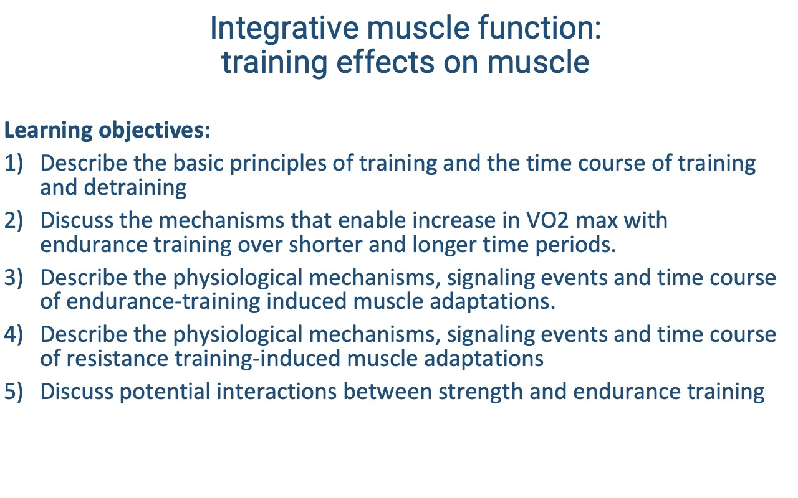

This lecture introduces the basic principles of training and detraining and walks through the physiological mechanisms, signaling events, and time courses of endurance- and resistance-training-induced muscle adaptations. It closes with the interaction between concurrent strength and endurance training.

---

## Slide 1

- Continuing the integrative muscle sequence — moving from the **structural and architectural levels** of Lectures 11–14 to the **plastic adaptive responses** of muscle.
- Today's focus: the **basic principles of training**, and how **endurance** and **resistance** training each alter muscle physiology.

---

## Slide 2

### Learning Objectives

1. Describe the **basic principles of training and detraining** and their time courses.
2. Discuss the mechanisms that enable increases in **VO2 max** with endurance training over **short and longer time periods**.
3. Describe the physiological mechanisms, **signaling events**, and **time course** of **endurance-training-induced** muscle adaptations.
4. Describe the physiological mechanisms, signaling events, and time course of **resistance-training-induced** muscle adaptations.
5. Discuss potential interactions between **strength and endurance training** (concurrent training).

---

## Slide 3

### Four Core Principles of Training

- **Overload** — physical stress placed on a body system must be **greater than usual** in amount or intensity to elicit adaptive plasticity.
- **Progression** — once a fitness level is reached, the stimulus must **continue to increase** to drive further adaptation; small progressive increases minimize injury risk.
- **Specificity** — benefits are **specific to the systems under stress**, including:
  - **Aerobic vs. anaerobic** training.
  - Specific **muscle groups** (and even specific limbs — see Slide 11).
  - **Velocity of contraction** and **range of motion**.
  - **Type of contraction** (eccentric, concentric, isometric).
- **Reversibility** — gains are **lost when training stops**, but not all adaptations decay at the same rate.

---

## Slide 4

![Slide titled "Animal vs human studies on training effects and muscle hypertrophy" reproducing a Venn diagram from Roberts et al. 2023 (Physiological Reviews). Left circle (rodent): advantages — gene modulation, unique tracers, feasibility of aging studies, stringent environmental controls, whole-muscle assays; limitations — translatability, body and muscle size differences, faster aging timeline, higher metabolism and protein turnover. Right circle (human): advantages — more variable responses suit responder analysis; limitations — free-living scenarios, protocol compliance, invasive repeated biopsies, miniscule biopsy samples, short training durations (2–6 months). Center (shared strengths): hypertrophy occurs in both species, most assays work in both, protein-coding gene similarities. Footer: "Published high quality evidence can be limited or mixed; there is a lot of unpublished knowledge in the training community."](images/lec15/slide-004.png)

### Strengths and Limitations of Training-Effect Studies

- **Rodent models** allow tight environmental control, gene manipulation, and full-muscle assays — but rodents differ from humans in body size, fiber types, aging timeline, and protein turnover, so results don't always translate.
- **Human studies** apply directly to humans but have wide variation in baseline fitness, training history, and protocol compliance; biopsies are small and durations are typically short (2–6 months).
- **Practical takeaway**: published evidence on training effects is mixed in quality and tends to capture **short-term** adaptations; much practical knowledge resides in coaches and athletic trainers.

---

## Slide 5

![Slide titled "Principles of Training" with two plots. Main plot (left): "Measure of fitness" vs. "Time" showing three curves — a Training response (blue) that oscillates upward in stair-step fashion above baseline; a Detraining response (green dashed) that decays back toward baseline after training stops; an Overtraining curve (magenta dot-dash) that oscillates downward below baseline. Inset (upper right): "Time within one bout" curve illustrating the supercompensation cycle — overload causes a dip below starting baseline, recovery and adaptation produce a new peak above the starting baseline. Bottom box: "Detraining: beneficial effects diminish in 2 weeks if physical activity is substantially reduced; disappear in 2–8 months if physical activity is not resumed; muscle memory — with retraining, recovery can be faster than the original training process." Citations: Bompa & Haff 2018; Meeusen et al. 2013 (PMID 23247672).](images/lec15/slide-005.png)

### Training, Detraining, Overtraining, and Muscle Memory

- **Training response** (blue): each bout produces a brief dip from microdamage, followed by recovery to a **new, higher baseline** — the **supercompensation** cycle.
- **Overtraining** (magenta) occurs when the next bout starts before recovery is complete; performance progressively **declines** over time. Risk increases with poor nutrition, sleep, or high stress.
- **Detraining** (green dashed):
  - Benefits diminish within **~2 weeks** of substantially reduced activity.
  - Benefits can fully disappear within **2–8 months** without resumption.
- **Muscle memory** — recovery on retraining is **faster than the original training process** because of long-lasting cellular and epigenetic changes (revisited on Slides 19, 23–24).

---

## Slide 6

![Slide titled "Endurance training-induced changes in VO2 max" showing a grouped bar chart of % improvement from baseline for three variables (Max cardiac output, Max a-v O2 difference, VO2 max) at two training durations (4 months — hatched; 32 months — solid blue). At 4 months: ~10%, ~15%, ~25%. At 32 months: ~15%, ~25%, ~42%. Side annotation: "Training-induced increases in arteriovenous O2 difference: increased muscle blood flow; improved ability of muscle fibers to extract and use O2 (capillary density, mitochondria)." Citations: Saltin et al. 1968 (PMID 5696236); Lundby, Montero & Joyner 2017 (PMID 27888580).](images/lec15/slide-006.png)

### Short- vs. Long-Term Contributions to VO2 Max

- After **~4 months** of endurance training, most of the gain in VO2 max comes from **increased cardiac output** (driven mainly by larger **stroke volume**).
- After **~32 months**, additional gains come from a larger **a-v O2 difference**, driven by **higher capillary density** (shorter diffusion distance) and **more mitochondria** (larger tissue O2 sink).
- The longer-term peripheral adaptations require time because new capillaries and mitochondria must be built.

---

## Slide 7

![Slide titled "Genetics influence the effects of training on changes in VO2 max" showing five hypothetical genotype curves (A through E) of VO2 max (ml kg⁻¹ min⁻¹, 30–80) vs. months of endurance training (0–30). Genotype A is a low responder (~38, almost flat); genotype E is a high responder (~60 → ~77). Side bullets: heritability determines ~50% of VO2 max in sedentary adults; genetics also determines training response; average improvement is 15–20%; low responders improve 2–3%; high responders ~50%. Citation: Bouchard et al. 1999 (PMID 10484570).](images/lec15/slide-007.png)

### Genetic Variation in Trainability

- About **50%** of the variation in VO2 max in sedentary adults is **heritable**.
- Genetics also influences the **training response**: average improvement is **15–20%**, but **low responders** gain only **2–3%** and **high responders** can gain **~50%**.
- Even low responders gain many other benefits from training (cardiovascular health, strength, bone density) — VO2 max is one metric among many.

---

## Slide 8

![Slide titled "Endurance exercise training reduces the O2 deficit at the onset of work" plotting VO2 (L·min⁻¹, 0–2.5) vs. time from exercise onset (0–6 min). Two curves rise to a steady-state demand of ~2.05 L·min⁻¹: a magenta dashed "Before training" curve rising slowly with a large shaded O2 deficit, and a navy solid "After training" curve rising rapidly with a much smaller deficit. Annotation: "Faster rise in oxygen uptake → lower lactate formation, less PC depletion." Citation: Hickson, Bomze & Holloszy 1978 (PMID 670010), Fig. 1.](images/lec15/slide-008.png)

### Faster O2 Kinetics After Training

- After endurance training, VO2 rises **more quickly** at the onset of exercise — the **O2 deficit** is smaller.
- A faster rise means **less anaerobic ATP** is required at the start: lower lactate accumulation and less **phosphocreatine depletion**, reducing the post-exercise excess oxygen consumption.

---

## Slide 9

### On-Kinetics Speed Up Across Submaximal Loads

- The faster on-kinetics shown on Slide 8 hold across **all submaximal work rates** after endurance training — t9/10 drops by roughly **20–30 seconds** at every relative load.
- Practical impact: an athlete can transition into a steady metabolic state more quickly during interval work and during the early minutes of any continuous bout.

---

## Slide 10

![Slide titled "Intracellular signaling in response to endurance exercise training" reproducing a schematic from Powers et al. Exercise Physiology Figure 13.9. A photograph of a cyclist labeled "Endurance Training" feeds into a muscle fiber. Three primary signals (Ca²⁺ ↑, AMP/ATP ↑, free radicals ↑) act on a seconds timescale; secondary signals (Calcineurin, CaMK, AMPK, p38, NFκB) on a minutes-to-hours timescale converge on PGC-1α. Outputs (days–weeks): fast-to-slow fiber-type shift, mitochondrial biogenesis, synthesis of antioxidant enzymes.](images/lec15/slide-010.png)

### Endurance-Training Signaling Cascade

- **Primary signals** (seconds): increases in **Ca2+** cycling, **AMP/ATP** ratio, and **free radicals**.
- **Secondary signals** (minutes–hours): **Calcineurin, CaMK, AMPK, p38, NFκB** — all converging on the master transcriptional coactivator **PGC-1α**.
- **Long-term outputs** (days–weeks): **mitochondrial biogenesis**, a small **fast-to-slow** fiber-type shift, and increased **antioxidant enzyme** synthesis.
- The signals are local — only fibers that actually contract receive the stimulus (see Slide 11).

---

## Slide 11

![Slide titled "One-leg training study: limited transfer of training from one leg to another" showing four time-series panels (noradrenaline, lactate, adrenaline, ventilation) for trained leg (navy) and untrained leg (magenta) over days 0–18. The trained leg shows steady declines in all four variables across 15 days of training; when the untrained leg begins training at day 15, all four variables jump back to near-baseline levels and only slowly decline again. Side bullets: measurements of HR, lactate, ventilation, adrenaline, noradrenaline; trained one leg for 13 sessions; switched to other leg; limited transfer of training effects. Citation: Saltin et al. 1976 (PMID 132082), Figs. 3–5.](images/lec15/slide-011.png)

### Training Adaptations Are Local — One-Leg Study

- Subjects trained **one leg** for 13 sessions, then switched to the **other leg**.
- Whole-body responses (lactate, adrenaline, noradrenaline, ventilation) progressively dropped during one-leg training, then **returned to near-baseline** when the untrained leg began training.
- Confirms that training adaptations are **specific to the muscles doing the work** — even systemic responses are driven by the trained tissue, not by circulating signals alone.
- This finding supports the use of one leg as an **internal control** in many training-physiology studies.

---

## Slide 12

![Slide titled "Time course of detraining-induced changes" plotting % change from trained baseline vs. days of detraining (0, 12, 21, 56, 84) for five variables: VO2 max (green), HR max (blue), SV max (magenta), Q max (navy), a-v O2 diff max (yellow). Stroke volume drops fastest (~−10% by day 12). VO2 max and Q max follow similar trajectories. HR max increases slightly. The a-v O2 difference declines slowly, falling sharply only between days 56 and 84. Citation: Coyle, Martin, Sinacore, Joyner, Hagberg & Holloszy 1984 (PMID 6511559).](images/lec15/slide-012.png)

### Detraining — Two Different Decay Rates

- **Stroke volume** and **cardiac output** drop within the first **two weeks** of detraining — the most rapid changes.
- The **a-v O2 difference** declines much more slowly, mostly between weeks 8 and 12, because mitochondrial and capillary adaptations take longer to reverse.
- VO2 max tracks the combined loss of central and peripheral adaptations.

---

## Slide 13

![Slide titled "Time course of training/detraining adaptations in skeletal muscle mitochondrial content" plotting relative mitochondrial content (0.8–2.4) vs. weeks of training or detraining (0–10). A navy "Training" curve rises from 1.0 to ~1.95 over 5 weeks. A magenta dashed "Detraining" curve drops from 1.95 to ~1.15 over weeks 5–10. A green dot-dash "Retraining" curve rises from ~1.6 back to ~1.95 over weeks 6–10. Annotation: "Detraining decays faster than retraining recovers." Citations: Booth & Holloszy 1977 (PMID 188815); Henriksson & Reitman 1977 (PMID 190867).](images/lec15/slide-013.png)

### Mitochondrial Content — Training, Detraining, Retraining

- Mitochondrial content nearly **doubles** in 5 weeks of training, then **plateaus** unless workload is increased.
- After detraining, the steepest losses occur in the **first ~2 weeks**, with continued slow decay.
- **Retraining recovers prior content within ~4 weeks** — a clear example of muscle memory at the mitochondrial level.

---

## Slide 14

![Slide titled "Resistance training effects on muscle strength: nervous system and muscle fiber adaptations" showing arbitrary-units increase in muscular strength vs. time (weeks → months). Total strength curve (navy) rises smoothly. Neural component (magenta dashed) rises rapidly and plateaus early. Hypertrophy component (green dot-dash) rises slowly and continues. A gray dotted line further above shows additional gains "with anabolic steroids." Vertical reference line marks "most training studies" at the early time point; "most serious strength trainers" continue beyond. Citations: Sale 1988 (PMID 3057313); Moritani & deVries 1979 (PMID 453338); Folland & Williams 2007 (PMID 17241104).](images/lec15/slide-014.png)

### Two Phases of Strength Gain

- The early strength gains from resistance training (~2–8 weeks) are dominated by the **nervous system** — increased neural drive and improved coordination, not yet by larger fibers.
- **Hypertrophy** rises more slowly and is the dominant contributor over **longer training durations**.
- Most short-duration studies (the gray vertical line) capture mostly the **neural phase**, missing later hypertrophy gains.

---

## Slide 15

### Resistance Adaptations — Part 1 (Neural and Fiber)

| Variable | Resistance training effect |
|---|---|
| **Nervous system** | Increased **neural drive** (2–8 weeks); optimization of muscle **co-activation patterns** |
| **Muscle mass** | **Hypertrophy** detectable within ~3 weeks; **hyperplasia** in animals but limited evidence in humans |
| **Muscle fiber specific force** | Increased specific force in **type I (slow twitch)** fibers |
| **Muscle fiber type** | Small shift from **type IIx (glycolytic)** to **type IIa (fast oxidative glycolytic)** fibers |

- One reason strength gains can outpace voluntary force capacity: **maximum voluntary contraction** does not recruit 100% of a muscle — the nervous system imposes a **safety factor** to protect bones and tendons. Training (and adrenaline) can partially override this.

---

## Slide 16

![Slide titled "Summary of resistance training-induced physiological adaptations" showing a five-row table. Muscle oxidative capacity: increase possible, depends on type of training. Muscle capillary density: increase possible, depends on type of training. Muscle antioxidant capacity: 12 weeks of training increases antioxidant enzyme activity by ~100%. Tendons and ligament strength: increase to match muscle strength. Bone mineral content: increases in bone mineral density result in stronger bones. Footer: many of these factors decline with age; resistance training is particularly helpful for slowing the effects of aging.](images/lec15/slide-016.png)

### Resistance Adaptations — Part 2 (Tissue, Tendon, and Bone)

| Variable | Resistance training effect |
|---|---|
| **Muscle oxidative capacity** | Increase possible — depends on the **type of resistance training** (more if heart rate is elevated) |
| **Muscle capillary density** | Increase possible — depends on whether training imposes aerobic demand |
| **Muscle antioxidant capacity** | ~100% increase in antioxidant enzyme activity over 12 weeks |
| **Tendon and ligament strength** | Increase to **match** rising muscle strength — but **slower** than muscle, so injury risk is highest when muscle gains outpace connective-tissue remodeling |
| **Bone mineral content** | Increases in mineral density produce stronger bones |

- Many of these tissues **decline with age** — making resistance training a particularly effective intervention for older adults.

---

## Slide 17

![Slide titled "Time course of resistance training-induced increase in muscle protein synthesis" plotting % increase in muscle protein synthesis (0–160%) vs. time after resistance exercise (0–50 h). Trained subjects (navy solid) peak rapidly at ~150% by hour 3, then drop sharply to ~40% by hour 10 and decay slowly. Untrained subjects (magenta dashed) rise more slowly to ~150% by hour 20, then decline gradually. Citations: Phillips, Tipton, Aarsland, Wolf & Wolfe 1997 (PMID 9252485); Damas et al. 2016 (PMID 27250575).](images/lec15/slide-017.png)

### Trained Muscle Synthesizes Protein More Rapidly and Briefly

- In **untrained** subjects, the protein-synthesis response is slow and prolonged (peak at ~20 h, lasting >40 h).
- In **trained** subjects, the response is **rapid** (peak at 3 h) but **shorter-lived** — a more focused, efficient response that allows **faster recovery** between training bouts.
- This shift requires **more nuclei per fiber** to support the higher rate of protein synthesis (Slide 19).

---

## Slide 18

![Slide titled "Signaling events leading to resistance training-induced muscle hypertrophy" reproducing a schematic from Powers et al. Figure 14.4. A "Resistance Training" image of dumbbells feeds into a muscle fiber. Mechanoreceptor activation triggers PA synthesis (left) and Erk kinase activation (right) on a seconds timescale. PA accumulates on the lysosome surface and combines with Rheb (which is released from inhibition by TSC2 when Erk inhibits TSC2) on a minutes timescale. Leucine ↑ also feeds into mTOR activation. mTOR activation (minutes) drives protein synthesis (hours), which drives muscle hypertrophy (weeks of training).](images/lec15/slide-018.png)

### Resistance-Training Signaling Cascade

- **Primary signal** (seconds): **mechanoreceptor** activation in the muscle membrane.
- **Secondary signals** (minutes): kinase activation (Erk) inhibits **TSC2**, releasing **Rheb**, which combines with **phosphatidic acid (PA)** to activate **mTOR** (mammalian target of rapamycin). Dietary **leucine** also activates mTOR.
- **mTOR** drives **protein synthesis** (hours) and ultimately **muscle hypertrophy** (weeks).
- Compare to the endurance pathway (Slide 10) — the two cascades are **distinct** and, as Slide 22 shows, can **interfere with each other**.

---

## Slide 19

### Hypertrophy Adds Both Protein and Nuclei

- Resistance training in humans produces **hypertrophy** (larger fibers) and an **increase in the number of myonuclei** per fiber — but **not** more fibers (no convincing hyperplasia in humans).
- More nuclei expand each fiber's **myonuclear domain**, increasing its capacity for **rapid protein synthesis** in response to subsequent bouts.
- These added nuclei are **retained** during detraining — the cellular basis for muscle memory (Slide 23).

---

## Slide 20

![Slide titled "Genetics variation influences response to resistance training" showing mean muscle fiber CSA (μm², 0–8000) for three responder groups (Non-responder, Modest responder, Extreme responder) at baseline (hatched) and after 16 weeks of resistance training (solid blue). Non-responder: 4500 → 4500 (−1%). Modest responder: 4000 → 5100 (+28%). Extreme responder: 4250 → 6750 (+58%). Side bullets: genetic variation explains ~80% of inter-individual variation in muscle hypertrophy response; mechanism — extreme responders show greater satellite cell-mediated myonuclear addition, expanding the cell's protein-synthesis capacity. Citations: Petrella et al. 2008 (PMID 18436694), Fig. 1A; Hubal et al. 2005 (PMID 15947721).](images/lec15/slide-020.png)

### Genetic Variation in Hypertrophy Response

- **~80%** of inter-individual variation in muscle hypertrophy response is heritable — even larger than the genetic component of VO2 max trainability (Slide 7).
- **Non-responders** show essentially no fiber growth over 16 weeks; **extreme responders** can gain **+58%** CSA.
- **Mechanism**: extreme responders show greater **satellite-cell-mediated myonuclear addition**, expanding each fiber's protein-synthesis capacity.

---

## Slide 21

![Slide titled "Changes in muscular strength and fiber size during detraining and retraining" with two plots. Left: % maximum strength at three time points — Trained (100%), Detrained (69%, −31%), Retrained (95%). Right: mean fiber CSA (μm², 0–6000) for type I (navy), type IIa (magenta), and type IIx (green) fibers at the same three time points. Type IIa fibers are largest throughout; type IIx fibers shrink most during detraining (−14%). Bullets: 20–30 days of inactivity can result in substantial reduction in strength and CSA; detraining of strength is slower than loss of VO2 max; recovery of strength can occur within 6 weeks; "muscle memory" — increases in myonuclei are retained, enabling rapid protein synthesis on retraining. Citations: Staron et al. 1991 (PMID 1827108); Houston et al. 1983 (PMID 6684028).](images/lec15/slide-021.png)

### Detraining and Retraining of Strength

- **20–30 days** of inactivity can reduce strength by ~30% and shrink fiber CSA across all fiber types — with the largest losses in **type IIx** (−14%).
- Strength loss is **slower** than VO2 max loss.
- **Retraining** restores strength to near-baseline within ~6 weeks — supported by the retained extra myonuclei (Slide 19).

---

## Slide 22

### Concurrent Training — Endurance Signaling Inhibits Hypertrophy

- Endurance training activates **AMPK**, which activates **TSC1/2**, which **inhibits mTOR**.
- Combining endurance and resistance training in the same session can therefore **blunt strength gains** relative to resistance training alone.
- Practical implication: training program design should match the **specific performance goal** (most sports require some balance of both).

---

## Slide 23

![Slide titled "Skeletal muscle memory: cellular component" reproducing a figure from Sharples and Turner 2023 (https://doi.org/10.1152/ajpcell.00099.2023). A schematic shows three phases — Training/AAS use, Detraining/AAS abstinence, Later training/Retraining — with cartoon mouse and seated-human icons. During training, muscle hypertrophy is accompanied by myonuclear accretion (newly acquired myonuclei in blue, resident myonuclei in red, satellite cells in green). During detraining, muscle shrinks but the newly acquired myonuclei are retained (shown in pale blue). Upon retraining, the retained myonuclei enable an enhanced response.](images/lec15/slide-023.png)

### Muscle Memory — Cellular Basis

- During training, satellite cells donate **new myonuclei** to growing fibers.
- During detraining, fibers shrink but the **extra myonuclei are retained**.
- On retraining, the retained nuclei give the fiber a "head start" on protein synthesis — producing the **enhanced response** (faster recovery to prior strength) seen in Slide 13 and Slide 21.

---

## Slide 24

![Slide titled "Skeletal muscle memory: epigenetic component" reproducing the second mechanism schematic from Sharples and Turner 2023. The y-axis is DNA methylation; three phases (Training, Detraining, Retraining) on the x-axis. Two memory signatures: signature 2 (solid curve) — methylation decreases with training, returns to pre-training levels during detraining, then drops again with retraining. Signature 1 (dashed curve) — methylation decreases with training and remains hypomethylated during detraining, leading to enhanced hypomethylation upon retraining. Lower panels show corresponding gene expression: increased during training, retained or returned to baseline during detraining, enhanced upon retraining.](images/lec15/slide-024.png)

### Muscle Memory — Epigenetic Basis

- A second mechanism for muscle memory is **DNA methylation** at gene regulatory regions.
- **Signature 1**: hypomethylation is **retained** through detraining, enabling enhanced gene expression on retraining.
- **Signature 2**: methylation returns to pre-training levels during detraining but responds more strongly on the next round.
- These epigenetic changes complement the cellular (myonuclear) memory — together they explain why prior training accelerates retraining.

---

## Slide 25

![Slide titled "Muscle Hypertrophy Response Is Affected by Previous Resistance Training Volume in Trained Individuals" reproducing Figure 1B from Scarpelli et al. 2022 (PMID 32108724). Within-subject control trial: each subject's leg was assigned to one of two training protocols. Non-individualized: 22 sets per week. Individualized: 1.2× sets logged in the previous 2 weeks. Left plot (B): vastus lateralis cross-sectional area (tons) vs. weeks (1–8); both groups rise from ~34 to ~49 tons. Right plot (C): training volume (RT sessions/week) at baseline (previous WTV, black filled), N-IND (open), and IND (gray filled), with individual subject tracks.](images/lec15/slide-025.png)

### Adapting Training Volume to Prior History

- A within-subject design: each subject's two legs received different protocols — **non-individualized** (22 sets/week) vs. **individualized** (1.2× the subject's logged volume from the prior 2 weeks).
- Both protocols increased vastus lateralis cross-sectional area over 8 weeks, but the **individualized** protocol was tuned to each subject's **recent training history**.
- Sets up the next slide, which shows the difference in hypertrophy gain.

---

## Slide 26

### Individualized Volume Yields Greater Hypertrophy

- The **individualized** protocol produced ~**10.5%** ΔCSA vs. ~**6.5%** for non-individualized — a statistically significant advantage.
- Suggests that for **already-trained** individuals, **matching training volume to recent training history** drives larger hypertrophy than a fixed protocol.
- Aligns with the principle of **progressive overload**: progress requires stimulus relative to **the individual's current state**, not an absolute target.

---

## Slide 27

![Slide titled "Mechanisms of mechanical overload-induced skeletal muscle hypertrophy" reproducing a figure from Roberts et al. 2023. Subtitle: "Satellite cells play a critical role in the overload induced hypertrophy." Left column (Fusion role): satellite cell on the surface of a muscle fiber → short-term overload → satellite cell proliferation (acute response) → chronic overload → satellite cell fusion to donate myonucleus, creating a new myonuclear domain. Right column (Non-fusion role): capillary endothelial cells and fibrogenic cells near a muscle fiber → short-term and chronic overload → exosome release regulating fibrogenic gene expression, ECM remodeling, and angiogenesis.](images/lec15/slide-027.png)

### Two Roles for Satellite Cells in Hypertrophy

- **Fusion role** — under chronic overload, satellite cells **donate myonuclei** to existing fibers (the cellular basis of Slide 19).
- **Non-fusion role** — satellite cells release **exosomes** that modulate gene expression in fibroblasts and endothelial cells, supporting **ECM remodeling** and **angiogenesis** in step with hypertrophy.
- Both roles position satellite cells as the **central regulator** of long-term muscle adaptation.

---

## Slide 28

### Class Activity — Open Questions on Muscle

- A reflection prompt to close the muscle physiology unit.
- Students were asked to identify a topic of greatest curiosity and a remaining area of confusion — useful for guiding the Friday review.

---

## Slide 29

### Learning Objectives — Recap

1. **Training principles** — overload, progression, specificity, reversibility — set the stimulus and time course of all adaptations. Detraining shows two distinct decay rates, and prior training accelerates retraining ("muscle memory").
2. **Endurance training** raises VO2 max in two phases: rapid central gains (cardiac output, stroke volume) over months, and slower peripheral gains (capillary density, mitochondria) over years.
3. **Endurance signaling** uses Ca2+, AMP/ATP, and free radicals → AMPK/CaMK → PGC-1α → mitochondrial biogenesis.
4. **Resistance signaling** uses mechanoreceptor activation → mTOR → protein synthesis → hypertrophy + myonuclear addition.
5. **Concurrent training** can blunt strength gains because endurance signaling (AMPK) inhibits mTOR.

---

## Key Equations

This lecture is mostly conceptual; the central quantitative relationships are listed in the table below.

| Quantity | Description |
|----------|-------------|
| Time course of training response | Increase in fitness after each bout follows the **supercompensation** cycle (Slide 5). |
| Detraining decay timescale | Cardiac/stroke-volume decay ~**2 weeks**; full reversal of benefits **2–8 months**. |
| Retraining recovery | Mitochondrial content recovered within **~4 weeks**; strength within **~6 weeks**. |
| **Average VO2 max trainability** | **15–20%** average gain; **2–3%** in low responders; **~50%** in high responders. |
| **Heritability of VO2 max** | ~**50%** in sedentary adults. |
| **Heritability of hypertrophy response** | ~**80%** of inter-individual variation. |
| Antioxidant enzyme increase | ~**100%** over 12 weeks of training. |

---

## Glossary of Key Terms

| Term | Definition |
|------|-----------|
| **Overload** | Physical stress greater than usual that elicits adaptive plasticity. |
| **Progression** | The need to continually increase stimulus once a fitness level is reached. |
| **Specificity** | Adaptations are specific to the body systems, muscle groups, contraction types, and velocities trained. |
| **Reversibility** | Loss of training-induced gains when training stops. |
| **Supercompensation** | The recovery cycle in which fitness rebounds **above baseline** after each effective training bout. |
| **Overtraining** | Decline in performance when training stress exceeds recovery capacity (often combined with poor nutrition, sleep, or stress). |
| **Detraining** | Decline in fitness after training stops; cardiovascular adaptations decay in ~2 weeks, peripheral over months. |
| **Muscle memory** | Faster regain of fitness on retraining, supported by retained myonuclei (cellular) and DNA methylation patterns (epigenetic). |
| **Cardiac output (Q)** | Heart rate × stroke volume; rises with training mainly via increased **stroke volume**. |
| **Stroke volume (SV)** | Volume of blood ejected per heartbeat; the most rapidly trained — and detrained — cardiovascular variable. |
| **a-v O2 difference** | Difference between arterial and venous O2 content; rises slowly with peripheral adaptation (capillaries, mitochondria). |
| **VO2 max** | Maximal rate of oxygen consumption during exercise; the canonical metric of aerobic capacity. |
| **O2 deficit** | Shortfall between O2 demand and O2 uptake at the start of exercise; reduced by training. |
| **PGC-1α** | Master transcriptional coactivator that drives mitochondrial biogenesis after endurance training. |
| **AMPK** | AMP-activated protein kinase; an energy-sensor that activates endurance signaling and inhibits mTOR. |
| **mTOR** | Mammalian target of rapamycin; the kinase that initiates protein synthesis after resistance training. |
| **TSC1/2** | Tuberous sclerosis complex; an inhibitor of mTOR activated by AMPK — the molecular link in concurrent-training interference. |
| **Hypertrophy** | Increase in muscle fiber size (cross-sectional area), the dominant long-term resistance adaptation in humans. |
| **Hyperplasia** | Increase in muscle fiber number; observed in animal models but limited evidence in humans. |
| **Myonucleus / myonuclear domain** | Each multinucleated muscle fiber's nuclei; their number and territory determine protein-synthesis capacity. |
| **Satellite cell** | Resident muscle stem cell that proliferates and fuses with fibers to donate new myonuclei during overload. |
| **Type I / IIa / IIx fibers** | Slow oxidative / fast oxidative-glycolytic / fast glycolytic fiber types; resistance training favors a small IIx → IIa shift. |
| **Specific force** | Force per unit cross-sectional area of contractile protein; rises in type I fibers with resistance training. |
| **Maximum voluntary contraction (MVC)** | Largest force a person can produce voluntarily; less than the muscle's true maximum due to neural safety factors. |
| **Concurrent training** | Combined endurance + resistance training; can produce smaller strength gains than resistance alone due to AMPK → TSC → mTOR inhibition. |
| **Responder / non-responder** | Individuals at the high or low end of the genetically influenced range of trainability for a given variable. |
