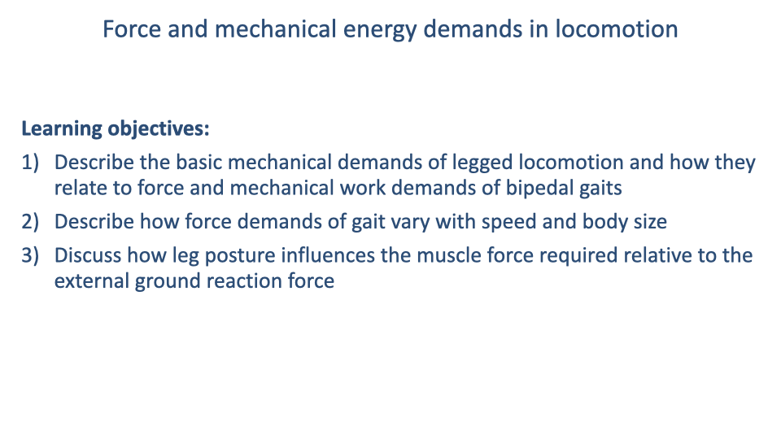
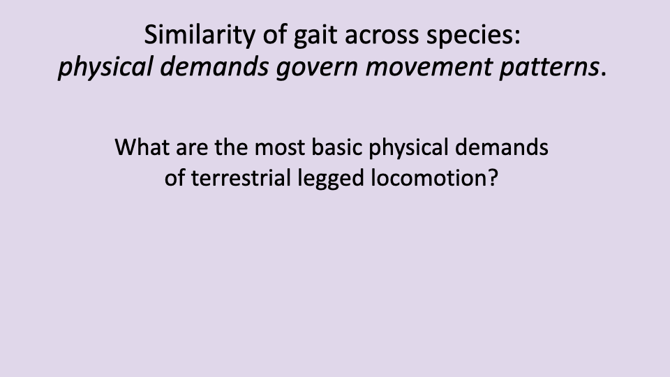
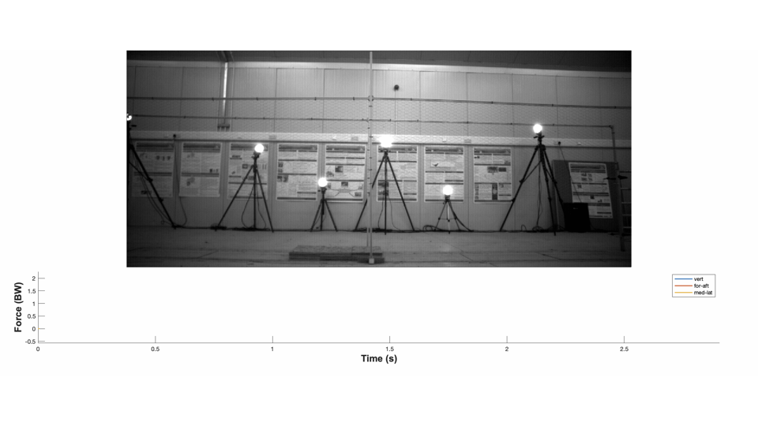
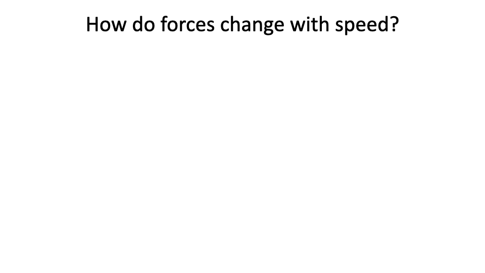
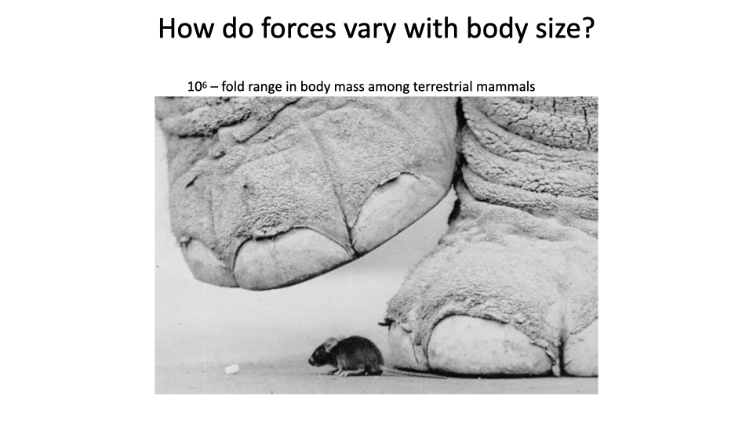

This lecture builds the link from **whole-body movement dynamics** to the **force and mechanical-energy demands** placed on muscles. It introduces ground reaction forces, the inverted-pendulum and bouncing-spring models of walking and running, the "collisional" perspective on step-to-step transitions, and how forces scale with speed and body size — the foundation for next week's lectures on the **metabolic cost of locomotion**.

---

## Slide 1

- Bridges the muscle physiology unit (Lectures 11–15) to the **whole-organism mechanics of locomotion**.
- Goal: connect **force and mechanical energy demands** of movement to the **muscular and metabolic energy demands** that follow.

---

## Slide 2

### Learning Objectives

1. Describe the basic **mechanical demands of legged locomotion** and how they relate to the **force and mechanical work** demands of bipedal gaits.
2. Describe how **force demands** of gait vary with **speed** and **body size**.
3. Discuss how **leg posture** influences the **muscle force required** relative to the external ground reaction force.

---

## Slide 3

### Why Do We Move the Way We Move?

- Animals exhibit a **surprisingly small** number of characteristic terrestrial gaits — most can be identified from a single snapshot.
- The convergence on a few stereotyped patterns suggests that **physical principles** (not just anatomy or development) constrain efficient locomotion.

---

## Slide 4

### The Ministry of Silly Walks

- Humans are not **physically constrained** to walk the way we do — many other patterns are mechanically possible.
- The fact that we converge on a narrow set of gaits underscores that the patterns we use are **energetically favored**, not anatomically forced.
- Modern AI-based gait recognition exploits the small individual signature embedded in the otherwise stereotyped pattern.

---

## Slide 5

### Walking and Running — Same Patterns Across Species

- Despite very different morphologies, **humans and ostriches** show essentially the same dynamics for walking and for running.
- The schematics introduce the **mass-spring model** of locomotion that will recur throughout the lecture.

---

## Slide 6

### Convergence Despite Different Development

- A young ostrich (a few weeks old) shows the same gait dynamics as the adult — only **scaled in body size**.
- Humans take many months and many practice steps to learn to walk, yet **converge on similar mechanics** as a precocial bird that walks shortly after hatching.
- Strong evidence that **fundamental physical principles** — not just developmental learning — drive the choice of gait.

---

## Slide 7

### Setting Up the Physical Framework

- Transition slide. The remainder of the lecture develops the **basic physical demands** of legged movement and uses them to predict gait mechanics.

---

## Slide 8

### Three Basic Demands

- **Move the center of mass** from point A to point B.
- **Support body weight** against gravity throughout each stance.
- **Oscillate the legs** to position them for the next stance phase.
- These three constraints are the foundation for understanding all the force and energy patterns of gait.

---

## Slide 9

![Slide titled "Newton's laws relate motion and forces" with the same runner photograph and "Gravity" arrow on the left. Right side text gives gravitational acceleration g = −9.81 m/s² (≈ −10 m/s²) and three numbered statements: (1) gravity exerts a force proportional to mass × gravity (Mg); (2) to remain standing, the legs must exert a balanced upward force, with vertical force balance ΣF_vertical = Mg + F_legs = 0, giving F_legs = −Mg; (3) when legs push against the ground, the ground pushes back with an equal and opposite force — the ground reaction force (GRF).](images/lec16/slide-009.png)

### Newton's Laws and the Ground Reaction Force

- Vertical equilibrium across a complete stride requires:

$$\sum F_{vertical} = Mg + F_{legs} = 0 \quad \Rightarrow \quad F_{legs} = -Mg$$

- The **ground reaction force (GRF)** is the equal-and-opposite force the ground exerts on the foot — measured directly by a **force platform**.
- Averaged over an integer number of strides, vertical GRF must equal body weight; horizontal GRF must average **zero** at constant speed.

---

## Slide 10

### Why Legs Are Different from Wheels

- Legs involve **intermittent ground contact**: each step decelerates and re-accelerates the body.
- This creates **collisional energy losses** at each foot-down event — a key driver of the muscular work demand explored later in the lecture.

---

## Slide 11

### Measuring Ground Reaction Forces

- A **force platform** embedded in the track measures the GRF during one stance phase.
- The vertical GRF is **largest** in magnitude (multiple body weights at peak).
- The horizontal GRF is **biphasic**: negative (decelerating) at heel strike, positive (accelerating) at push-off.

---

## Slide 12

### Multi-Plate Force Measurement Setup

- Sequential force plates allow measurement of GRF across **several consecutive steps**, enabling analysis of the full stride cycle and any unsteady (accelerating, perturbed) movements.
- The same paradigm is used in animal experiments and in human gait labs.

---

## Slide 13

![Slide titled "Ground reaction forces in steady running" with three components: top-left, a stick-figure body-spring schematic showing the body center of mass following a bouncing trajectory across three steps; top-middle, a plot of measured (solid) and modeled (dashed) GRF showing vertical (f_g,y) and horizontal (f_g,x) traces over time; top-right, side annotation "Average vertical forces support body weight; horizontal (fore-aft) forces average zero to maintain steady speed." Bottom: photographs of an ostrich, a dog, and a cockroach. Citations: Cavagna et al. 1977, Blickhan 1989, McMahon and Cheng 1990, Farley et al. 1993.](images/lec16/slide-013.png)

### The Mass-Spring Model of Bouncing Gaits

- A **single point mass on a massless springy leg** reproduces both the **magnitude** and the **timing** of GRF in steady locomotion.
- Holds across an enormous range of legged animals — cockroach, dog, ostrich, human — for **bouncing** (running, hopping, trotting) gaits.
- For multi-legged animals, all stance limbs are approximated as a single **virtual leg**.

---

## Slide 14

![Slide titled "Ground reaction forces for different gaits" with three columns of photographs (Walk DF=0.60; Grounded run DF=0.52; Aerial run DF=0.40) of human and ostrich subjects, each above a force-vs-time trace showing vertical (solid) and fore-aft (dashed) GRF. Walk shows a double-hump (M-shape) vertical force with a "Double support" shaded region. Grounded run shows a single, smoother peak. Aerial run shows a tall single peak with an "Aerial phase" gap between contacts. Citation Nilsson & Thorstensson 1989.](images/lec16/slide-014.png)

### Walk vs. Grounded Run vs. Aerial Run

- **Walking**: characteristic **M-shaped** vertical GRF with a **double-support** phase (both feet on the ground).
- **Grounded run** (e.g., race-walking): single GRF peak, but **no aerial phase** — duty factor still > 0.5.
- **Aerial run**: tall single GRF peak with a true **aerial phase** between steps; peak force grows because **stance duration shrinks** as speed increases (Slide 27).

---

## Slide 15

![Slide titled "Shifts in ground reaction forces with speed and gait" showing photographs of a human walking next to an ostrich and running next to an ostrich, above a 3×3 grid of GRF traces (medio-lateral, fore-aft, vertical) for Walk (left column), Run rear-foot strike (middle), and Run forefoot strike (right). The vertical-force trace for the rear-foot-strike runner shows a small early "impact peak" before the main peak; the forefoot-strike runner shows a smoother rise without that impact peak. Citation: Nilsson & Thorstensson 1989.](images/lec16/slide-015.png)

### Foot-Strike Pattern and Impact Peaks

- **Rear-foot strikers** (heel contact first) show a **brief early impact peak** in the vertical GRF — caused by the abrupt collision of a relatively rigid heel.
- **Forefoot strikers** show a smoother rise because the foot's **arch acts as a spring** to cushion the contact.
- Rear-foot striking became common with the **invention of running shoes** — most barefoot running is forefoot-strike.

---

## Slide 16

![Slide titled "Mechanical energy fluctuations" with two columns (Walk, Run). Each column shows a stick-figure ostrich silhouette with a sphere-and-spring leg model and a plot of mechanical energy across one stride: gravitational potential energy E_g (blue dashed) and kinetic energy E_k (red solid). For Walk: E_g and E_k are out of phase (E_g peaks at mid-stance, E_k troughs at mid-stance). For Run: E_g and E_k are in phase (both decrease together at landing, both increase together at push-off). Walk bullets: out of phase, "vaulting" over a stiff leg, "inverted pendulum," energy exchange between E_g and E_k. Run bullets: in phase, "bouncing" on a compliant leg, energy cycling in elastic springs (E_spring), in collagenous connective tissues (tendons & ligaments).](images/lec16/slide-016.png)

### Walk = Inverted Pendulum; Run = Bouncing Spring

- **Walking**: Eg and Ek are **out of phase** — the body **vaults** over a stiff leg, exchanging gravitational potential and kinetic energy like an inverted pendulum. Little muscular work needed within stance.
- **Running**: Eg and Ek are **in phase** — the body **bounces** on a compliant leg. The mechanical energy lost from the body is **stored elastically** in tendons and ligaments and **returned** at push-off.

---

## Slide 17

### What Passive Cycling Cannot Eliminate

- Both inverted-pendulum (walk) and elastic-spring (run) mechanisms **minimize** the mechanical work the muscles must do **within** the stance phase.
- They cannot eliminate two demands:
  1. **Force demands** to support body weight.
  2. **Energy losses at step-to-step transitions** (collisions when the next foot lands).
- These two unavoidable demands set the **minimum muscular work** of locomotion.

---

## Slide 18

![Slide titled "Reduced prosthetic stiffness lowers the metabolic cost of running for athletes with bilateral transtibial amputations" with a portrait photograph of Dr. Alena Grabowski (left). Top-right: stick-figure schematics (panels A and B) of a bouncing spring-leg model showing leg compression ΔL and prosthesis-spring deformation ΔRSP, with leg angle θ and resting lengths L₀, Res₀, RSP₀. Bottom-right: photographs of three running prosthetics (A: 1E90 Sprinter; B: Catapult FX6; C: Cheetah Xtend) with labeled socket, pylon, prosthesis, and bracket components.](images/lec16/slide-018.png)

### Prosthetic Limbs as Mass-Spring Systems

- The mass-spring model of running motivates the design of **carbon-fiber running blades** for athletes with transtibial amputations.
- Three blade designs (1E90 Sprinter, Catapult FX6, Cheetah Xtend) have very different stiffnesses, which can be tested directly against the model.

---

## Slide 19

### Lower Prosthetic Stiffness Lowers Running Cost

- Across three blade types, **stiffer prostheses raise the net cost of transport** for running.
- A more compliant blade allows greater **elastic energy cycling**, mimicking the natural Achilles tendon's energy-storage function.
- A direct application of the mass-spring framework: simple physics-based models can guide assistive-device design.

---

## Slide 20

![Slide titled "A 'collisional' perspective on step-to-step transitions" reproducing a figure from Art Kuo. Left: skeletal cartoon of a human walker showing inverted-pendulum phase, push-off, and collision at heel strike. Right: schematic of the body center-of-mass trajectory across single support, double support, and the next single support — push-off arrows from the trailing leg (blue) and collision arrows from the leading leg (red) labeled "step-to-step transition." Bottom annotation: "Collisions are a main source of energy loss and muscle work demand."](images/lec16/slide-020.png)

### The Collisional Perspective

- During the **double-support** phase of walking, the trailing leg **pushes off** while the leading leg **collides** with the ground.
- Push-off **adds** mechanical energy; the collision **dissipates** energy.
- The amount of push-off work needed is **directly proportional** to the collisional energy loss — making **collisions the central determinant** of muscular work in walking.

---

## Slide 21

![Slide titled "A 'collisional' perspective" reproducing a Kuo 2007 figure with a portrait of Dr. Art Kuo on the left. Panel a: stick-figure illustration of a step-to-step transition with leg angle 2α, force vectors F₁ and F₂, and step length s. Panel b: scatter plot of center-of-mass work rate (W/kg) vs. step length (m) for experimental data (red squares) and a theoretical model (blue) of the form C·s⁴ + D, with R² = 0.96. Bottom bullets: collisions determine the external work at step transitions; collisions increase with step length (relative to a fixed leg length); step length and collision magnitudes increase with speed; an important factor in changing gait to running to make use of elastic mechanisms.](images/lec16/slide-021.png)

### Collision Cost Scales as Step Length to the Fourth Power

- Center-of-mass work scales **roughly as step length to the fourth power**, with R² = 0.96.
- As walking speed (and step length) increases, the collisional cost **explodes** — a major reason humans **switch to running** at higher speeds, where elastic mechanisms can offset some of the cost.

---

## Slide 22

### Rimless Wheel — A Mechanical Demonstration of Collisions

- A **rimless wheel** with n spikes rolling down a fixed slope is a simple physical model of legged walking.
- With **fewer spokes** (longer effective step length), more energy is lost at each collision and the wheel rolls **slower**.
- With **more spokes** (shorter steps), collisions are smaller and the wheel rolls **faster**.
- The slope is constant, so this isolates the effect of **collision geometry** on speed.

---

## Slide 23

### Two Ways to Reduce Collisional Cost

- **Ankle push-off** by the trailing leg **just before** heel strike of the leading leg reverses some of the body's downward velocity, **shrinking** the upcoming collision.
- **Foot rolling** during stance — the human foot's plantar geometry acts like a wheel, translating the center of pressure smoothly from heel to toe.
- A demonstration with two seven-sided polygons (one with concave sides, one with convex sides) shows that even small **convex curvature** on the contact surface dramatically reduces collisional losses — a simple mechanical explanation for why human feet are large and curved (see also Adamczyk, Collins & Kuo studies of foot curvature).

---

## Slide 24

### Passive-Dynamic Walking Robots

- Robots designed around the same principles — minimal actuation, **rolling foot contact**, **ankle push-off**, **locked knees** during mid-stance — can walk reasonably well on essentially **no power**.
- McGeer's classic **passive walkers** descend a slope powered only by gravity.
- Concrete demonstration that the **physics of collisions and elastic cycling** are the dominant determinants of bipedal walking — not active neural control.

---

## Slide 25

### Transition — Forces and Speed

- Transition into the next section: how **GRF magnitudes** scale with **running speed**.

---

## Slide 26

### Acceleration vs. Steady Speed

- During the acceleration phase, the **fore-aft GRF** is **net positive** at every step — the runner is adding energy.
- As the runner reaches a steady speed, the fore-aft GRF shifts to its standard **biphasic** pattern (negative then positive, net zero).
- Posture also shifts — a forward lean during acceleration straightens out at steady speed.

---

## Slide 27

### Why Peak Force Grows with Speed

- Average vertical GRF must equal **body weight** across each step.
- As speed rises, the **stance time tc shrinks** and the **aerial time grows** — so the **peak vertical force** must rise to keep the time-integrated average constant.
- Roughly: peak GRF $\propto 1/t_c$.

---

## Slide 28

![Slide titled "Vertical ground reaction force must support body weight" reproducing a figure from Weyand et al. 2010 — "The biological limits to running speed are imposed from the ground up." Top-left: stick-figure schematic showing rear-leg, mid-leg, and forward-leg postures during stance. Center: equation F_avg / W_b = T_step / T_c = L_step / L_c. Right (Panel A): F_avg/W_b vs. running speed for three gait types (forward run, one-legged hop, backward run). Right (Panel D): minimum t_c vs. speed across the same gaits. Bottom annotations: "Speed is limited by (1) the minimum achievable contact time to apply the necessary force, and (2) the fastest achievable swing frequencies. Force demands determined by physics, but force limits (magnitude and rate) depend on muscle properties (maximum strength and frequency of contraction)."](images/lec16/slide-028.png)

### What Limits Top Running Speed

- The required **average vertical GRF** can be predicted from gait timing alone:

$$\dfrac{F\_{avg}}{W_b} = \dfrac{T\_{step}}{T_c} = \dfrac{L\_{step}}{L_c}$$

- Across normal running, one-legged hopping, and backward running, this relationship holds.
- **Top speed is set by**:
  1. The **minimum achievable contact time** to apply the necessary force.
  2. The **fastest achievable swing frequency**.
- Force demands come from **physics**; force *limits* come from **muscle strength and contraction frequency**.

---

## Slide 29

### Scaling Across Body Size

- Terrestrial mammals span a **~106-fold** range in body mass (mouse to elephant).
- Across this enormous range, the **physics of legged locomotion** demands very different **postural and architectural** solutions — the topic of the next slides.

---

## Slide 30

![Slide titled "Body Size and Shape: Scaling with Isometry" with two cubes (small, side length 1; large, side length 2). A table compares length, cross-sectional area, volume/mass, and CSA/mass ratio: at length 1, CSA = 1, volume = 1, ratio = 1; at length 2, CSA = 4, volume = 8, ratio = 0.5. Bullets: strength is proportional to cross-sectional area (length²); loading is proportional to body mass and volume (length³); the ratio of CSA to mass decreases with increasing size; if animals get larger without changing shape, they become relatively weaker.](images/lec16/slide-030.png)

### Geometric Scaling — Why Bigger Animals Are Relatively Weaker

- **Strength** scales with **cross-sectional area** (length2).
- **Body mass** (and weight loading) scales with **volume** (length3).
- The ratio **CSA / mass ∝ 1/length** — so larger isometric animals are **relatively weaker**.
- Without compensating shape change, an elephant-sized animal would lack the structural margin to support its own weight.

---

## Slide 31

### How Animals Solve the Scaling Problem

- Larger animals **change shape** rather than scaling isometrically — bones become **proportionally thicker**, and limb postures become **more upright**.
- Sets up the key scaling relationship of the next slide: **effective mechanical advantage**.

---

## Slide 32

![Slide titled "Scaling of limb posture" with two components. Left: schematic of a hindlimb showing muscle force F_m at moment arm r and ground reaction force F_g at moment arm R, with the equation F_g = F_muscle × (r/R), defining effective mechanical advantage EMA = r/R. Right: log-log scatter plot of EMA (r/R, 0.1–1.0) vs. body mass (kg) for eight species (mouse, chipmunk, squirrel, prairie dog, agouti, goat, deer, dog, horse, plus humans walking and running), with EMA increasing roughly linearly on the log-log plot from ~0.1 (mouse) to ~1.0 (horse). Annotation arrow labeled "Posture Shift." Footer: "EMA increases with body size; allows muscle forces to scale similar to bone and muscle cross-sectional area."](images/lec16/slide-032.png)

### Effective Mechanical Advantage Scales With Body Size

- **Effective mechanical advantage**:

$$\text{EMA} = \dfrac{r}{R}$$

- Larger animals adopt **straighter limb postures** that **increase EMA** — moving the GRF closer to the joint center, reducing the muscle force required.
- Across mammals, **EMA scales positively with body mass** — allowing peak muscle (and bone) forces to scale with cross-sectional area, preventing structural failure.
- (This is the same Biewener 1989 result reviewed in Lecture 14.)

---

## Slide 33

### Crouched Posture Raises Muscular Effort

- McMahon's classic **Groucho running** experiment: subjects run with deliberately flexed knees.
- Crouched posture moves the **GRF moment arm R** further from the joint center → larger muscle force required for the same GRF.
- Vertical GRF profiles also become smoother (reduced impact peak) — but at a steep metabolic cost.

---

## Slide 34

### Groucho Running Costs ~50% More Energy

- Running with a deeply flexed knee raises the metabolic cost of running by **~50%** above normal upright posture.
- The mechanism is exactly the lever-system equation $F_{muscle} = F_g \times R/r$ — a larger R demands a larger muscle force, which costs more ATP per stride.
- A direct demonstration that **leg posture is a primary determinant** of the energy cost of locomotion.

---

## Slide 35

![Slide titled "Why is it useful to understand ground reaction forces in gait?" with four bulleted points: GRF is a major determinant of muscle force demand and a major source of metabolic energy cost; maximum force capacity can be performance limiting (top speed, turn radius), with peak bone stresses around 25–50% of failure strength (safety factor 2–4) per Biewener 1990; unexpectedly high loads are a source of injury; muscle force can't be avoided, but muscle work can be minimized through passive-dynamic energy cycling mechanisms.](images/lec16/slide-035.png)

### Why GRF Matters

- GRF magnitude sets the **muscle force demand** — and hence the **metabolic energy cost**.
- **Maximum force capacity** can be **performance-limiting** (top speed, sharpest turn radius).
- Skeletal **safety factor** is typically **2–4** — peak bone stress is normally 25–50% of failure strength; **unexpectedly high loads** cause injury.
- **Muscle force can't be avoided**, but **muscle work** can be minimized through passive-dynamic energy cycling (springs, pendulums).

---

## Slide 36

![Slide titled "Why is it useful to understand ground reaction forces in gait?" with subtitle "Musculoskeletal tissues remodel in response to applied loads." Three labeled MRI cross-sections of mid-thigh muscle and adipose tissue from Wroblewski et al. 2011: a 40-year-old triathlete (large, dense quadriceps, minimal adipose), a 74-year-old sedentary man (greatly reduced quadriceps, large intramuscular and subcutaneous adipose), and a 70-year-old triathlete (quadriceps comparable to the 40-year-old, minimal adipose). Citation: Wroblewski et al. 2011, The Physician and Sportsmedicine 39:72–178.](images/lec16/slide-036.png)

### Tissue Remodeling Across the Lifespan

- Musculoskeletal tissues **remodel in response to applied loads** — both during training (Lecture 15) and across the lifespan.
- The MRI cross-sections compare three subjects at the same anatomical level:
  - **40-year-old triathlete**: large quadriceps, minimal adipose.
  - **74-year-old sedentary**: small quadriceps, extensive intramuscular and subcutaneous adipose.
  - **70-year-old triathlete**: quadriceps essentially indistinguishable from the 40-year-old.
- **Chronic exercise preserves lean muscle mass** into older age — strong evidence for the role of mechanical loading in long-term tissue maintenance.

---

## Slide 37

![Closing summary slide titled "Summary:" with eleven bullet points covering: regulation of ground reaction forces is a central principle of locomotion; morphology and gaits are diverse but Newton's laws are unavoidable; body weight support against gravity is a fundamental demand; peak GRF increases with speed; muscle force capacity can limit speed; GRFs relate to muscle force demand through skeletal levers; passive energy cycling reduces muscle work within stance; collisions at step transitions are a source of energy loss, work demand, and energy cost; collisions increase with step length and speed; collision-reduction mechanisms (ankle push-off, foot rolling) help minimize cost; larger animals are relatively weaker; large animals adopt straight-legged posture to mitigate force demands.](images/lec16/slide-037.png)

### Summary

- The **regulation of GRFs** is the central principle of terrestrial locomotion. Newton's laws are unavoidable.
- **Body-weight support** against gravity is a fundamental demand; peak GRFs **rise with speed** because contact time shrinks.
- **Muscle force capacity** can limit running speed and turning ability.
- GRFs translate into muscle force demands through **skeletal lever systems** (Lecture 13–14 EMA framework).
- **Passive-dynamic energy cycling** (inverted pendulum, elastic spring) reduces muscle work *within* stance — but cannot eliminate force demands or step-to-step collisions.
- **Collisions** at step-to-step transitions are the dominant source of mechanical work demand; they **grow with step length** (~s4) and with speed.
- **Ankle push-off** and **foot rolling** reduce collision losses.
- **Larger animals are relatively weaker** by isometric scaling and compensate with **straighter limb postures** (higher EMA).

---

## Key Equations

| Equation | Name | Description |
|----------|------|-------------|
| $\sum F\_{vertical} = Mg + F\_{legs} = 0$ | Vertical force balance | Average vertical force from the legs equals body weight across an integer number of strides. |
| $F\_{avg}/W_b = T\_{step}/T_c = L\_{step}/L_c$ | Weyand step-cycle equation | Predicts the average vertical GRF (in body weights) from the ratio of step duration to stance duration. |
| $F\_{peak} \propto 1/t_c$ | Peak force vs. contact time | As speed rises, contact time shrinks and peak vertical GRF must rise to maintain weight support. |
| $\text{COM work} \propto s^4$ | Kuo step-length scaling | Center-of-mass work rate at step transitions scales approximately as the **fourth power of step length**. |
| $F\_{muscle} = F_g \times R/r$ | Limb lever equation | Muscle force needed to balance the GRF at a joint, with r = muscle moment arm and R = GRF moment arm. |
| $\text{EMA} = r/R$ | Effective mechanical advantage | Ratio of muscle to GRF moment arms; **rises with body mass** as posture straightens. |
| Strength $\propto L^2$, Mass $\propto L^3$ | Isometric scaling | Strength grows with surface area, mass with volume — larger isometric animals are relatively weaker. |

---

## Glossary of Key Terms

| Term | Definition |
|------|-----------|
| **Center of mass (CoM)** | The single point at which the body's mass can be approximated as concentrated for whole-body dynamics. |
| **Ground reaction force (GRF)** | The force the ground exerts on the foot — equal and opposite to the force the foot exerts on the ground (Newton's 3rd law). |
| **Force platform** | An instrumented plate that measures the three components (vertical, fore-aft, medio-lateral) of GRF in real time. |
| **Stance phase** | The portion of the stride cycle when the foot is on the ground. |
| **Aerial phase** | The portion of the stride cycle when no foot is on the ground (running, hopping). |
| **Double support** | The portion of a walking stride when **both feet** are on the ground. |
| **Duty factor (DF)** | Fraction of the stride cycle spent in stance; > 0.5 for walking, < 0.5 for aerial running. |
| **Mass-spring model** | A point-mass body on a massless springy leg; reproduces GRF magnitudes and timing in bouncing gaits across diverse legged animals. |
| **Inverted pendulum model** | The walking analogy in which the body vaults over a stiff stance leg, exchanging gravitational and kinetic energy out of phase. |
| **Bouncing gait** | A locomotion pattern (running, hopping, trotting) in which gravitational and kinetic energies fluctuate **in phase** and elastic structures cycle the energy. |
| **Inverted pendulum** | The walking mechanism: gravitational PE peaks at mid-stance while KE is minimum, allowing passive energy exchange. |
| **Step-to-step transition** | The brief interval at the end of one stance and the start of the next when the trailing leg pushes off and the leading leg collides. |
| **Collision** | The energy-dissipating impact at heel strike when the leading leg comes down with downward velocity that must be reversed. |
| **Push-off** | Trailing-leg work that adds energy to the body; effective push-off **just before** heel strike reduces the upcoming collision. |
| **Foot rolling** | The continuous translation of the center of pressure from heel to toe during stance, made possible by the foot's curved geometry — reduces collision losses. |
| **Rear-foot strike** | A running foot-strike pattern (heel first) producing a small early **impact peak** in the vertical GRF; common in shod runners. |
| **Forefoot strike** | A running foot-strike pattern (ball of foot first) with smoother GRF rise; uses the foot arch as a spring; common in barefoot runners. |
| **Effective mechanical advantage (EMA)** | Ratio of muscle moment arm to GRF moment arm (r/R); rises with body mass and is roughly constant within a species. |
| **Isometric scaling** | Geometric scaling in which all linear dimensions grow in proportion; under isometry, strength (∝ L²) grows slower than mass (∝ L³). |
| **Allometric scaling** | Scaling with body size in which proportions change — e.g., the postural shift that raises EMA in larger mammals. |
| **Safety factor** | Ratio of failure stress to peak operating stress; bone safety factor is typically **2–4** in locomotion. |
| **Cost of transport (CoT)** | Metabolic energy required to move a unit body mass over a unit distance (J kg⁻¹ m⁻¹) — the central efficiency metric for locomotion. |
| **Groucho running** | Running with a deeply flexed knee and lowered center of mass; dramatically increases muscle force demand and metabolic cost (~50%). |
| **Passive-dynamic walking** | Bipedal locomotion driven by gravity (or minimal actuation) plus mechanical-system geometry; demonstrated in McGeer-style passive walkers. |
| **Running blade prosthesis** | Carbon-fiber prosthetic foot designed to mimic the elastic energy cycling of the natural Achilles tendon. |
