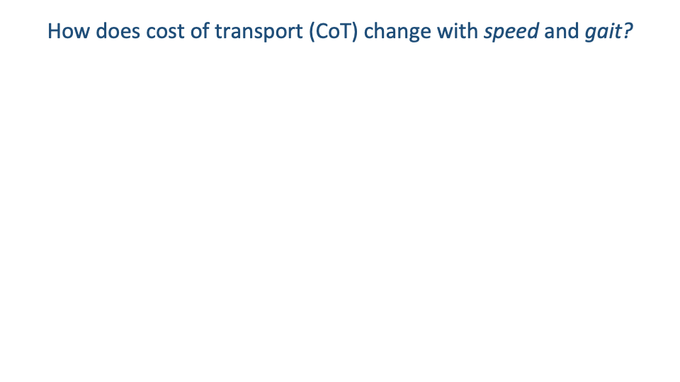
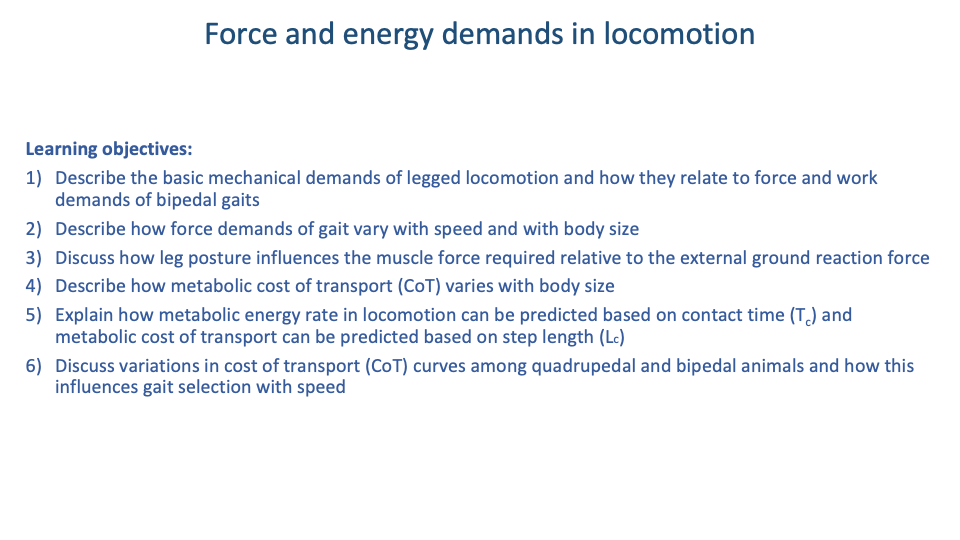

## Slide 1

- Continues directly from Lecture 16. Same overall theme — forces and mechanical energy demands of locomotion — now extending into the metabolic energy cost that follows from those force demands.

---

## Slide 2

![Slide titled "Mechanical energy fluctuations" with two columns labeled "Walk" and "Run." Each column shows a stick-figure ostrich silhouette with sphere-and-spring leg models traced across one stride, above a plot of mechanical energy across the stride: gravitational potential energy E_g (blue dashed) and kinetic energy E_k (red solid). Walk plot — E_g and E_k are out of phase: E_g peaks at mid-stance, E_k troughs at mid-stance. Run plot — E_g and E_k are in phase: both decrease together at landing, both increase together at push-off. Walk annotation: "'inverted pendulum' energy exchange between E_g and E_k." Run annotation: "'bouncing' energy cycling in elastic springs." Bottom caption in dark blue: "These mechanisms minimize mechanical work within stance, but can't eliminate: 1) force demands and 2) collisional energy losses at step-to-step transitions."](images/lec17/slide-002.png)

### Recap — Mechanical Energy Patterns of Walking and Running

- **Walking** = **inverted pendulum**: stiff leg vaults the body up and over, exchanging gravitational potential (Eg) and kinetic energy (Ek) out of phase.
- **Running** = **bouncing spring**: compliant leg cycles mechanical energy through elastic springs in tendons and ligaments; Eg and Ek fluctuate in phase.
- These passive mechanisms minimize the muscular work within a stance, but they cannot eliminate:
  1. Force demands to support body weight against gravity.
  2. **Collisional energy losses** at step-to-step transitions.
- These two irreducible demands are what drive the metabolic energy cost of legged locomotion.

---

## Slide 3

![Slide titled "Variations in ground reaction force in walking" with two figure clusters. Top-left: a series of vertical-force traces vs. % stance for human walking at progressively faster speeds (Hubel and Usherwood 2015), showing the characteristic M-shaped double-hump pattern with the mid-stance trough deepening at higher speeds; speed bins are labeled 0.3-0.4, 0.4-0.5, 0.5-0.6, 0.6-0.7, 0.7-0.8, 0.8-0.9, 0.9-1.0 (dimensionless speed). Bottom-left: two GRF traces from Usherwood et al. 2018 — Panel A "Peak power minimizing" shows an M-shape with both peaks of similar height, Panel D "Work minimizing" shows an asymmetric M-shape where the second peak is shorter than the first. Right column: four small panels (b, c, d, e) showing photographs of different foot postures (ostrich-like high-heel, plantigrade barefoot, walking shoe, high-heel platform) above their corresponding vertical-force traces, illustrating how foot morphology and footwear change the GRF shape — in particular, traces with a plantigrade heel-first contact show a clear early impact peak ("I") preceding the main M-shape peaks.](images/lec17/slide-003.png)

### Walking GRF — Shape Variations with Speed, Strategy, and Footwear

- Speed dependence (Hubel & Usherwood 2015): the M-shape vertical GRF of walking deepens as speed rises. At very high walking speeds, the mid-stance trough can reach zero — and the body would be in aerial phase if walking continued, which is why a real walker switches gait first.
- Asymmetric M-shape (Usherwood et al. 2018): at high walking speeds the M-shape can become asymmetric. The shape depends on whether the gait is minimizing peak power (second peak smaller — prolongs the late-stance push-off so muscle-tendon units deliver power over longer time) or minimizing work (symmetric M — maintains passive inverted-pendulum motion).
- Foot morphology and footwear: the trace shape changes with how the foot meets the ground.
  - **Plantigrade** barefoot heel strike (typical human walking): an early impact peak appears, caused by the rapid heel-deceleration collision.
  - Forefoot or ball-of-foot contact (e.g., a human walking on the balls of the feet, or an ostrich digitigrade foot): the impact peak is smoothed out — collisional energy is absorbed by the longitudinal arch and elastic structures.
  - High-heel shoes: a stiletto removes the natural foot-roll, producing two sharp collisions (heel then toe) with no rolling in between, raising collisional cost. Platform heels are less disruptive than stilettos.

---

## Slide 4

### Body Size — A 106-Fold Range Across Mammals

- Terrestrial mammals span ~106-fold in body mass — from a few grams to several thousand kilograms.
- Different sizes pose different mechanical problems, and animals across this range show systematic differences in posture, limb proportions, and metabolic cost. These trends are explained by simple scaling arguments developed in the next slides.

---

## Slide 5

![Slide titled "Body Size and Shape: Scaling with Isometry" with two cubes — a small one (side length 1) and a larger one (side length 2). A table beneath lists: Length 1 vs. 2; Cross-sectional Area 1×1=1 vs. 2×2=4; Volume or Mass 1×1×1=1 vs. 2×2×2=8; Ratio CSA/Mass 1 vs. 4/8=0.5. Text below summarizes: Strength is proportional to cross-sectional area (CSA) (length squared); Loading is proportional to body mass and volume (length cubed); The ratio of CSA to mass decreases with increasing size; If animals get larger without changing shape, they become relatively weaker.](images/lec17/slide-005.png)

### Isometric Scaling — Why Bigger Means Relatively Weaker

- **Isometric scaling** — if a body doubles in linear dimension (L) without changing shape:
  - **Cross-sectional area (CSA)** ∝ L2 → strength of bones and muscles increases by 4×.
  - Volume and mass ∝ L3 → loading increases by 8×.
  - Ratio CSA/mass halves.
- Conclusion: strength scales with L2, loading scales with L3 — so if animals enlarged without changing shape, larger animals would be relatively weaker.
- Real animals do not scale isometrically — they change shape with size (next slides). An elephant the size of a mouse with the same posture and bone proportions would simply be unable to support itself.

---

## Slide 6

### Posture Must Change with Size

- Because weight scales faster than musculoskeletal strength, larger animals cannot use the same posture as small animals.
- Solution: as body size increases, limb posture shifts to a more upright (extended) configuration, aligning the limb more closely with the ground reaction force.
- This raises the **effective mechanical advantage (EMA)** of the limb so that a given muscle force can resist a much larger GRF.

---

## Slide 7

![Slide titled "Scaling of limb posture" with three components. Top-left: photograph of an elephant foot beside a mouse, repeated from Slide 6. Bottom-left: schematic showing a crouched-posture leg with muscle force F_m, muscle moment arm r, ground reaction force F_g acting on the foot, and GRF moment arm R; with equation F_g = F_muscle × (r/R) labeled "Effective mechanical advantage (EMA)." Right: scatter plot of EMA (r/R) on the y-axis (log scale, 0.1 to 1.0) vs. Body Mass (kg) on the x-axis (log scale, 0.01 to 1000). Data points labeled chipmunk, squirrel, mouse, prairie dog, agouti, dog, deer, goat, horse, and two human points (walk and run) trend upward with body mass on a clear log-log straight line. Top annotation: "Posture Shift" with an arrow from crouched to upright posture spanning the trend. Bottom annotation: "EMA increases with body size — Allows muscle forces to scale similar to bone and muscle cross-sectional area."](images/lec17/slide-007.png)

### Effective Mechanical Advantage Scales with Body Size

- The EMA, defined as $r/R$ — the ratio of muscle moment arm $r$ to GRF moment arm $R$ — increases systematically with body mass across mammals.
- Quantitative result (Biewener and colleagues): EMA rises from ~0.1 in small rodents to ~1.0 in horses on a log-log line spanning four orders of magnitude in body mass.
- Mechanism — posture shift: large animals stand with a more upright (extended) limb; small animals with a crouched limb. The upright posture aligns the limb with the GRF, raising EMA.
- Functional consequence: with higher EMA, a given muscle force can resist a larger GRF. This allows muscle force capacity to keep up with body weight as size increases — so muscle and bone do not have to scale impossibly fast with body mass.
- Trade-off (revisited in the human-context lecture): a crouched posture, while metabolically expensive, gives greater range of joint motion and is therefore better for acceleration and maneuvering — which is why small animals run with crouched legs even though it is energetically costly.

---

## Slide 8

![Slide titled "Leg posture influences running energetics" with header "Groucho running" and citation McMahon, Valiant, and Frederick 1987. Left: photographs and corresponding stick-figure motion-capture diagrams of human runners in two postures — top row "Normal" with extended-leg posture, bottom row "Groucho" with deeply flexed-knee posture mimicking the Groucho Marx walk. Right: two GRF traces over time — Normal shows a tall narrow vertical force peak rising well above body weight (dashed horizontal line); Groucho shows a lower, broader peak that just exceeds body weight, with a longer contact time.](images/lec17/slide-008.png)

### Groucho Running — Manipulating Posture in Humans

- Classic experiment (McMahon, Valiant & Frederick 1987): humans were asked to run with an artificially flexed (crouched) knee posture — the "Groucho" run — and compared with their normal running.
- GRF effects of crouched posture:
  - Longer contact time (broader force trace).
  - Lower peak vertical force but larger fore-aft (horizontal) excursions.
  - Greater joint flexion-extension range and more mechanical work at the joints.

---

## Slide 9

![Slide continuing "Groucho running" with the same photograph/stick-figure column on the left. Right: scatter plot of normalized VO₂ (VO₂/normal VO₂, y-axis from 1.0 to 1.6) vs. mid-stance thigh angle β (degrees, x-axis from 90 to 50, with extension increasing leftward). Data points (open and filled) show a strong positive trend — as runners flex the knee more, normalized VO₂ rises sharply, reaching about 1.5 (a 50% increase) at the most flexed postures. A horizontal reference line marks "Normal Running." Bottom-right annotation in green: "Metabolic energy cost increases ~50% for running with a flexed knee."](images/lec17/slide-009.png)

### Crouched Running Costs ~50% More Metabolic Energy

- Same experiment, metabolic side: normalized VO2 rose with the degree of knee flexion at mid-stance.
- At the most flexed postures, metabolic cost increased by ~50% above normal running.
- Demonstrates a tight link from posture → muscle force demand → metabolic cost: even small changes in geometry produce large changes in energy cost.
- Begs the question of why small animals voluntarily use crouched postures if they could save so much energy by extending their legs — addressed in the lecture by the trade-off between economy and maneuverability/acceleration.

---

## Slide 10

![Slide titled "Why is it useful to understand ground reaction forces in gait?" with four bulleted points in dark blue: Ground reaction force is a major determinant of muscle force demand → major source of metabolic energy cost; Maximum force capacity can be performance limiting (top speed, turn radius), with Biewener 1990: Peak bone stresses are around 25-50% of failure strength, indicating a safety factor (ratio of failure strength to peak stress) of 2 to 4; Unexpectedly high loads are a source of injury; Muscle force can't be avoided, but muscle work can be minimized through passive-dynamic energy cycling mechanisms.](images/lec17/slide-010.png)

### Why GRF Matters

- Four reasons to care about ground reaction forces in gait:
  1. GRF is a major determinant of muscle force demand, and therefore a major source of metabolic energy cost.
  2. Maximum force capacity is performance limiting. Leg-extensor strength predicts top running speed in elite athletes and turn radius in rapid maneuvering.
  3. **Bone safety factor** (Biewener 1990): peak bone stresses in everyday locomotion are 25–50% of failure strength, giving a safety factor of 2–4 that is remarkably constant across vertebrates because bone remodels to match typical loads.
  4. Unexpectedly high loads cause injury. Knowing the typical loading helps explain which activities are most injury-prone.
- Force cannot be avoided (gravity is non-negotiable); muscle work can be minimized through inverted-pendulum and elastic-spring mechanisms (Slide 2).

---

## Slide 11

![Slide titled "Why is it useful to understand ground reaction forces in gait?" with subhead "Musculoskeletal tissues remodel in response to applied loads." Three stacked mid-thigh MRI cross-sections from Wroblewski et al. 2011: top, 40-year-old triathlete — large lean quadriceps cross-section with minimal adipose tissue; middle, 74-year-old sedentary man — dramatically smaller muscle area, large intramuscular adipose deposits (labeled), heavy subcutaneous fat layer; bottom, 70-year-old triathlete — quadriceps cross-section essentially identical to the 40-year-old, with minimal fat infiltration. Caption: Wroblewski et al 2011. Chronic exercise preserves lean muscle mass in masters athletes. The Physician and Sportsmedicine, 39: 72-178.](images/lec17/slide-011.png)

### Tissues Remodel with Applied Load

- Cross-sectional MRI from Wroblewski et al. 2011 of three thighs: a 40-year-old triathlete, a 74-year-old sedentary man, and a 70-year-old triathlete.
- The 70-year-old triathlete has muscle and bone architecture nearly indistinguishable from the 40-year-old triathlete — and dramatically different from the 74-year-old sedentary subject.
- The biggest difference is not age but activity level. Chronic exercise preserves muscle mass and bone density by maintaining the mechanical loads that drive tissue remodeling.
- A practical motivation for the rest of the lecture: understanding the forces and energy costs of exercise lets us predict how training and lifestyle shape tissue health over the lifespan.

---

## Slide 12

![Slide titled "Force and energy demands in locomotion" listing six numbered learning objectives in dark blue: 1) Describe the basic mechanical demands of legged locomotion and how they relate to force and work demands of bipedal gaits; 2) Describe how force demands of gait vary with speed and with body size; 3) Discuss how leg posture influences the muscle force required relative to the external ground reaction force; 4) Describe how metabolic cost of transport (CoT) varies with body size; 5) Explain how metabolic energy rate in locomotion can be predicted based on contact time (T_c) and metabolic cost of transport can be predicted based on step length (L_c); 6) Discuss variations in cost of transport (CoT) curves among quadrupedal and bipedal animals and how this influences gait selection with speed.](images/lec17/slide-012.png)

### Learning Objectives

- The lecture covers six related objectives — the first three were largely set up in Lecture 16, and the last three are the focus of Lecture 17:
  1. Mechanical demands → force/work demands of bipedal gaits.
  2. Force demands vary with speed and body size.
  3. Leg posture sets the muscle force required for a given GRF.
  4. **Cost of transport (CoT)** varies with body size.
  5. Metabolic rate predicted from contact time (Tc); CoT predicted from step length (Lc).
  6. CoT curves vs. speed in quadrupeds and bipeds, and how those curves drive gait selection.

---

## Slide 13

![Slide titled "Measuring metabolic energy cost of locomotion." Left photograph: human runner on a treadmill wearing a face mask connected by tube to a respirometry system, sampling exhaled gases. Top-right photograph: small chipmunk inside a closed chamber on a treadmill with an O2 analyser line drawn to the chamber. Caption: "Exhaled gases sampled and pumped to an oxygen analyzer" (left) and "Small animals exercised in a chamber (chipmunk)" (right). Below, equation: "Energy demand measured in mL Oxygen per minute based on the Fick principle: V̇O₂ = V̇_E (FI O₂ − FE O₂)." Bottom annotation in red: "Requires steady-state conditions for at least 6 continuous minutes."](images/lec17/slide-013.png)

### Measuring Metabolic Cost — Respirometry and the Fick Principle

- Energy cost of locomotion is measured indirectly as **oxygen consumption ($\dot{V}O_2$)**, related to the **Fick principle**:

$$\dot{V}O_2 = \dot{V}_E (F_I O_2 - F_E O_2)$$

  where $\dot{V}_E$ is the rate of expired air, and $F_I O_2$ and $F_E O_2$ are the inspired and expired oxygen fractions.
- Human set-ups use a face mask (or hood) sampling exhaled gases into an oxygen analyzer; small-animal set-ups seal the animal inside a chamber with a continuous airflow and sampled output.
- Key methodological constraint: respirometry requires steady-state conditions for at least ~6 minutes. This rules out instantaneous measurements during rapid maneuvers and limits classical CoT data to steady-state treadmill or overground locomotion.

---

## Slide 14

### Respirometry — Even on an Elephant

- Brief and humorous: respirometry has been done on elephants by mounting a custom mask, putting the analysis equipment on a golf cart, and walking the cart-elephant pair around the zoo.
- Demonstrates that respirometry is in principle applicable across the full vertebrate body-size range — though logistically far easier in some species than others.

---

## Slide 15

![Slide titled "Mass-specific metabolic rate and cost of transport" with a schematic plot in the center: mass-specific metabolic rate (V̇O₂/kg, y-axis) vs. Speed (x-axis). Multiple straight lines fan out from near the origin with different slopes — labeled top to bottom: mouse (red, steepest slope), squirrel, dog, man, horse (blue, shallowest slope). A small triangle on each line indicates "Linear tangent (slope)." Top-right annotation in purple: "slope = cost of transport (steeper slope → higher CoT)." Mid-right equations: "Cost of Transport (CoT)" with V̇O₂ / speed = mlO₂ / (kg×s) × 1/(m/s) leading to CoT = mlO₂ / (kg×m). Bottom caption in purple: "Mass-specific cost of transport (CoT) is used to compare animals (energy used per meter travelled per kilogram body mass)."](images/lec17/slide-015.png)

### Mass-Specific Metabolic Rate and CoT

- **Mass-specific metabolic rate** $\dot{V}O_2/kg$ increases approximately linearly with speed within a gait.
- The slope of that line is the cost of transport:

$$\text{CoT} = \frac{\dot{V}O_2}{\text{speed}} = \frac{\text{ml }O_2}{\text{kg} \cdot \text{s}} \times \frac{1}{\text{m/s}} = \frac{\text{ml }O_2}{\text{kg} \cdot \text{m}}$$

- CoT is energy used per meter travelled per kg of body mass — the standard metric for comparing locomotor economy across species of very different size.
- Across mammals, the slope is steeper in small animals (mouse) and shallower in large animals (horse) — small animals are metabolically expensive per unit distance.

---

## Slide 16

![Slide titled "Energetic cost of transport (CoT) of swimming, flying, running" with a large log-log scatter plot reproduced from Tucker 1975 and Schmidt-Nielsen 1972. X-axis: body mass (kg, log scale from 10⁻⁶ to 10⁷). Y-axis: minimum cost of transport, P_t/(M·V) (log scale from 0.1 to 10+). Three diagonal trend lines run downward-right: dashed blue "Fliers" (insect, bird, mammal fliers — mosquito, fly, blowfly, bee, horsefly, locust, hummingbird, budgerigar, crow, bat, pigeon) at the top; solid green "Runners" (mammal, bird, reptile runners — mice, quail, lizards, rat, rabbit, snake, goose, dog, human, cheetah, kangaroo, horse) in the middle; dashed magenta "Swimmers" (fish, mammal swimmers — fishes) at the bottom. A human data point is highlighted with an arrow labeled "humans: higher CoT than expected for our body size." Grey square data points along the bottom right represent man-made machines: pedal airplane, ice skater, bicyclist, F-105 jet, helicopter, light plane, Cadillac, hovercraft, VW, DC-8 jet, dirigible, truck, freight steamer, freight train. A left-side panel summarizes: "Cost of transport (CoT) — energy used per unit distance, per unit body mass. CoT = work / (mass · distance) = power / (mass · velocity). Lower CoT in larger animals." Citation at bottom: Tucker (1975) American Scientist 63:413–419 and Schmidt-Nielsen (1972) Science 177:222–228 (PMID 4557340).](images/lec17/slide-016.png)

### Cost of Transport Across Locomotor Modes

- The Tucker–Schmidt-Nielsen compilation places fliers, runners, and swimmers on a single log–log CoT vs. body-mass plot.
- Three universal patterns:
  - Swimmers are cheapest per unit distance — water supports body weight, eliminating the cost of weight-support.
  - Fliers are next — flapping is expensive but they cover distance fast.
  - Runners are most expensive per unit distance — full support against gravity plus collisional losses.
- Within each mode, larger animals have lower CoT.
- Humans sit above the runner trend line — our running is expensive for our body size (revisited in Lecture 18). We are not metabolically specialized runners — but our large body size still places us at a relatively low absolute CoT.
- Engineered machines (cars, trains, jets, hovercraft, helicopters) plotted in grey for comparison — most have higher CoT than animals in their size range.

---

## Slide 17

![Slide titled "Energetics of running: a new perspective" by Rodger Kram and C. Richard Taylor (Harvard University, Museum of Comparative Zoology). Center-left: highlighted equation E_metab/W_b = C (1/T_c), with C = 0.189 J/N assuming 20.1 J/mL O₂. Right column: three small line plots stacked vertically — Panel a: E_metab/W_b vs Speed for kangaroo rat (steep), ground squirrel, spring hare, dog (intermediate), pony (shallow); Panel b: 1/T_c (inverse stance time) vs Speed for the same species, all showing positive slopes; Panel c: C (cost coefficient J/N) vs Speed for the same species, all curves clustering tightly around a horizontal line at ~0.18 J/N indicating that C is approximately constant across animals and speeds. Top-right annotation in purple: "Smaller animals must activate their muscles at higher frequencies, and for a larger number of contractions to travel a given distance." Citation at top.](images/lec17/slide-017.png)

### Kram & Taylor 1990 — Cost Predicted by 1/Tc

- Insight (Kram & Taylor 1990): across diverse species and speeds, mass-specific metabolic rate per body weight is predicted by a strikingly simple equation:

$$\frac{\dot{E}_{\text{metab}}}{W_b} = C \cdot \frac{1}{T_c}$$

  where $T_c$ is the stance contact time of one foot per stride, and $C$ is a near-constant **cost coefficient**.
- C ≈ 0.189 J per N of body weight supported (assuming 20.1 J per mL O2).
- Interpretation: the cost of generating force per Newton of support is relatively constant across species, but smaller animals must turn their muscles on and off at higher frequencies (shorter Tc) to keep up with the gait — and pay accordingly more energy per second.
- Bottom three panels (right): when plotted vs. speed, $\dot{E}_{\text{metab}}/W_b$ and $1/T_c$ both rise with speed and with decreasing body size, while C remains nearly constant — the equation captures most of the species-and-speed variation.

---

## Slide 18

![Slide repeating the layout of Slide 17 with the addition of a table at the bottom labeled "Oxycaloric Coefficients = energetic equivalent of oxygen consumption." Columns: Substrate, J/mg O₂, J/L O₂, J/mmol O₂, Ref. Rows: Carbohydrate 14.77, 21.06, 481.86, Ivlev 1935; Elliott & Davison 1975; Gnaiger 1983; Lipid 13.73, 19.58, 447.93, Ivlev 1935; Elliott & Davison 1975; Gnaiger 1983; Protein 11.39, 19.41, 444.01, Ivlev 1935; Elliott & Davison 1975; Gnaiger 1983; Average 14.10, 20.11, 460.00, Ivlev 1935; Elliott & Davison 1975; Gnaiger 1983.](images/lec17/slide-018.png)

### Oxycaloric Coefficients — Converting O2 to Joules

- Conversion factor used in the Kram-Taylor framework: ~20.1 J per mL O2 — the average **oxycaloric coefficient**.
- The coefficient varies modestly with the substrate being oxidized:
  - Carbohydrate: ~21.1 J/mL O2.
  - Lipid: ~19.6 J/mL O2.
  - Protein: ~19.4 J/mL O2.
  - Average: ~20.1 J/mL O2.
- Differences are small because all aerobic pathways extract similar energy per oxygen atom consumed. 20.1 J/mL O2 is the default conversion factor used throughout comparative energetics.

---

## Slide 19

![Slide continuing "Energetics of running: a new perspective" by Kram and Taylor. Right: scatter plot of Step Length (L_c, m) on y-axis (0.1 to 1.0) vs. Speed (m s⁻¹) on x-axis (1 to 7) for five species — Pony (filled squares, top), Dog (open triangles), Spring hare (asterisks), Ground squirrel (open circles), Kangaroo rat (filled circles). Each species occupies a separate horizontal band — pony at ~0.7-0.9 m step length, dog at ~0.5 m, spring hare at ~0.4 m, ground squirrel and kangaroo rat at ~0.1 m. Within each species, step length increases modestly with speed. Top schematic: stick-figure horse/pony silhouettes with a step labeled "Step length." Left annotation in purple: "Larger animals travel a greater distance per stride."](images/lec17/slide-019.png)

### Larger Animals Travel Farther Per Stride

- **Step length (Lc)** — the distance the body moves forward during one stance — is proportional to body size.
- A pony covers ~0.8 m per step; a kangaroo rat about 0.1 m. Within any species, Lc rises modestly with speed; across species, the dominant predictor is body size.
- This is the second half of the Kram-Taylor explanation for the decrease in CoT with body size: large animals not only contract muscles less frequently, but each contraction also moves them farther.

---

## Slide 20

![Slide continuing "Energetics of running: a new perspective" with three small plots on the right column showing log-log scaling of three quantities vs. body mass: Panel a — E_cot (J N⁻¹ m⁻¹) on y-axis, body weight on x-axis: a clear negative trend, slope = −0.25; Panel b — L_c (step length) on y-axis, body weight on x-axis: a positive trend, slope = 0.30; Panel c — C (cost coefficient, J N⁻¹) on y-axis: nearly flat, slope = 0.04. Center: highlighted equation E_cot/W_b = C × 1/L_c, with C = 0.189 J/N assuming 20.1 J/mL O₂. Bottom box in purple: "Larger animals have a lower cost of transport because they 1) travel a greater distance per stride, and 2) activate muscles at lower frequencies."](images/lec17/slide-020.png)

### CoT Predicted by 1/Lc

- Combining the previous two slides:

$$\frac{E_{\text{cot}}}{W_b} = C \cdot \frac{1}{L_c}$$

  CoT per Newton of body weight equals the cost coefficient divided by step length.
- Scaling exponents:
  - CoT vs. body weight: slope ≈ −0.25 (CoT falls with size).
  - Lc vs. body weight: slope ≈ +0.30 (step length rises with size).
  - C vs. body weight: slope ≈ +0.04 (cost coefficient is essentially constant).
- Take-home (Kram & Taylor): larger animals have lower CoT for two compounding reasons:
  1. They travel farther per stride (larger Lc).
  2. They activate muscles at lower frequencies (longer Tc).
- The same logic applies within humans: individuals with longer legs tend to have lower CoT than shorter-legged individuals.

---

## Slide 21

### Transition — CoT vs. Speed Within Gait

- Section transition. The previous slides covered how CoT scales with body size at a preferred speed. The next set asks how CoT changes with speed within each gait, and how it sets the gait-transition speeds.

---

## Slide 22

![Slide titled "Gait selection and energetics of locomotion" with citation "Gait and the energetics of locomotion in horses" by Donald F. Hoyt and C. Richard Taylor (Museum of Comparative Zoology, Harvard University). Three photographs at the top show the same horse walking, trotting, and galloping. Right: three stacked scatter plots — Horse A, B, C — each plotting Rate of oxygen consumption (mL O₂ kg⁻¹ s⁻¹) vs. Running speed (m s⁻¹). Each plot shows three clusters of data points (walk, trot, gallop, plotted as different symbols), with the data approximately linear in each gait but showing curvature within each gait when examined closely. Annotation in green: "Linear relationship with speed in previous graphs was based on preferred speeds or self-selected speeds. Outside the preferred speed range, energy cost tends to be higher."](images/lec17/slide-022.png)

### Horses — Energy Cost Across Walk, Trot, and Gallop

- Hoyt & Taylor 1981 trained horses to use walk, trot, and gallop over wide speed ranges, including speeds they would not naturally use for each gait.
- The classic linear $\dot{E}_{\text{metab}}$-vs-speed relationships of earlier studies were based on preferred (self-selected) speeds only — and so missed within-gait curvature.
- When horses were forced to use a gait at non-preferred speeds, $\dot{V}O_2$ rose non-linearly: energy cost was higher outside the preferred speed range of each gait.

---

## Slide 23

![Slide continuing the Hoyt & Taylor 1981 horse study. Left panel A: V̇O₂ (mL O₂ kg⁻¹ s⁻¹) vs Speed (m s⁻¹) showing three colored curves — Walk (red), Trot (purple), Gallop (orange) — each curving upward. Linear tangent (slope) lines drawn from the origin define minimum cost of transport for each curve. Annotation: "lines define minimum cost of transport." Right top panel: Cost of Transport (mL O₂/m) vs Speed showing three U-shaped curves — walk (filled circles, lowest at low speeds), trot (open triangles, U-shape, minimum at intermediate speed), gallop (filled diamonds at high speeds). The minima of the U-shaped curves are connected by lines from the origin in panel A. Right bottom: histogram showing the distribution of voluntarily chosen overground speeds (no. of observations) vs running speed (m s⁻¹), grouped under three gait labels (walk, trot, gallop) — voluntary speeds cluster near the minimum of each U-shaped CoT curve. Citation: Hoyt & Taylor (1981). Bottom-right: equation for cost of transport: V̇O₂/speed = (mL O₂/s)/(m/s) = mL O₂/m.](images/lec17/slide-023.png)

### CoT Within Each Gait — U-Shaped Curves

- For each gait, CoT vs. speed forms a U-shaped curve with a clear minimum.
- The slope of a line from the origin to a point on the $\dot{V}O_2$-vs-speed curve equals CoT at that speed. The line tangent from the origin marks the minimum-CoT speed for that gait.
- For horses, the minimum-CoT speed within each gait corresponds closely to the preferred (voluntarily chosen) speed — confirmed by overground speed histograms aligning with the U-curve minima.

---

## Slide 24

### Two Rules of Gait Selection

- Two simple rules emerge from the Hoyt-Taylor curves:
  1. Gait transitions occur near the intersections of the CoT curves — the speed at which one gait becomes more expensive than the next.
  2. Animals choose speeds within each gait that minimize CoT — preferred speed sits near the U-curve minimum.
- Energetics is a strong (though not the only) driver of voluntary gait and speed selection in steady locomotion.

---

## Slide 25

![Slide titled "Gait selection and energetics in bipeds vs quadrupeds" with citation Bramble and Lieberman (2004) Endurance running and the evolution of Homo. Nature 432, 345-352. Single plot: CoT (mL O₂ kg⁻¹ km⁻¹) on y-axis (40 to 240) vs Speed (m s⁻¹) on x-axis (0 to 7). Two main curve families: top — biped (human) data shown with a steep U-shaped dashed walking curve (peaks near 1.5 m/s minimum, rising sharply on both sides) and a near-flat blue running curve extending from about 2 m/s out to 6 m/s with very small slope; bottom — quadruped (horse) data shown with three smooth U-shaped curves (blue walk, light blue trot, orange gallop) that overlap at lower CoT (~80-120) with intersecting minima at 1.5, 3, and 5 m/s respectively. Dotted boxes around each curve minimum mark the preferred-speed range. Sketch icons of human walker and human runner at the top, horse silhouettes (walk, trot, gallop) at the bottom.](images/lec17/slide-025.png)

### Bipeds vs. Quadrupeds — Walking U, Running Flat

- A composite CoT-vs-speed plot from Bramble & Lieberman 2004 places humans and horses on the same axes.
- Walking (in both humans and horses): a steep U-shaped curve with a clear minimum.
- Running in humans: nearly flat — CoT changes very little with running speed, an unusual feature relative to quadrupeds.
- Quadrupeds show three overlapping U-shaped curves (walk, trot, gallop), with gait transitions at the curve intersections — exactly the Hoyt-Taylor pattern.
- Human running has no comparable equivalent. We commit to a single bouncing gait (running) and can use a wide speed range without paying much extra energy.

---

## Slide 26

![Slide titled "Gait selection and energetics in human and avian bipeds" with citation Watson et al. 2011. Top-left panel a: net cost of transport (J kg⁻¹ m⁻¹) on y-axis (0 to 7) vs speed (m s⁻¹) on x-axis (0 to ~5). Multiple data series: emu (filled and open circles), ostrich (filled and open squares and triangles), rhea (open diamonds), with overlaid human walk (dashed line, U-shape with minimum near 1.5 m/s) and human run (dashed line, nearly flat at ~3.5). The bird data are clustered at relatively low CoT (~2-3) across a wide range of running speeds. Top-right legend: lists the data series. Bottom-left panel b: number of trials (left y-axis 1-6) vs speed (right y-axis showing total cost of transport (J kg⁻¹ m⁻¹) 4-8) for emu, with bars showing the distribution of voluntarily chosen speeds, and two overlaid curves — solid total CoT and dashed net CoT — both U-shaped with minima around 1-2 m/s. Two bullets at right in purple: "Bipeds have a flat cost of transport curve in running"; "Ostriches show especially low CoT for running gaits."](images/lec17/slide-026.png)

### Avian Bipeds — Flat Running CoT, Ostriches Especially Cheap

- Watson et al. 2011 measured net CoT for emus, ostriches, and rheas over a wide speed range, alongside human walk and run reference curves.
- All bipeds — human and avian — show flat running CoT at running speeds. The plateau is a general feature of bipedal running, not just a human quirk.
- Ostriches sit at especially low running CoT (~1.5–2 J kg−1 m−1) — they are exceptional running specialists.
- Voluntary overground speeds (bottom panel) cluster near the minimum of the CoT curve — the same Hoyt-Taylor pattern, now in birds.

---

## Slide 27

![Slide titled "Energetics of walking and running: insights from simulated reduced-gravity experiments" by Claire T. Farley and Thomas A. McMahon (Museum of Comparative Zoology and Division of Applied Sciences, Harvard). Left: line drawing of the apparatus — a human runs on a motorized treadmill while suspended from a ceiling-mounted system of springs (Sp) attached via a cable (C) to a bicycle saddle (S); a winch (W) tensions the springs to apply a nearly constant upward force on the body, simulating reduced gravity. A strain gauge force platform (F) under the tread measures ground reaction forces. Caption: "FIG. 1. Apparatus for simulating reduced gravity, consisting of a series of springs (Sp), which applied a nearly constant upward force to the body through a bicycle saddle (S). Magnitude of force was increased by stretching springs with a winch (W). Motorized treadmill included a strain gauge force platform (F) under the tread (10). [From He et al. (8).]" Right: two scatter plots. Panel A: E_metab/M_b (W·kg⁻¹) on y-axis (0 to 12) vs Speed (m s⁻¹) on x-axis (0 to 3). Two trend lines — top curve labeled 1.0g (filled circles) rising from ~2 to ~10 W/kg; bottom curve labeled 0.5g (open circles and triangles) rising from ~1.5 to ~4 W/kg. Panel B: Cost of transport (J kg⁻¹ m⁻¹) on y-axis (0 to 4) vs Speed. The 1.0g curve sits well above the 0.5g curve, with both showing slight U-shape.](images/lec17/slide-027.png)

### Reduced-Gravity Experiments — Method

- Farley & McMahon 1992: human subjects ran on a treadmill while a ceiling-mounted spring system applied a constant upward force, effectively lowering apparent gravity (and therefore body weight).
- Manipulating gravity isolates the weight-support cost from other components of locomotion: at the same speed, a runner at 0.5g supports half as much weight against gravity.
- The right-hand plots show:
  - Mass-specific metabolic rate (Panel A) is much lower at 0.5g than at 1g across all speeds.
  - CoT (Panel B) is roughly halved at 0.5g.
- A direct experimental confirmation of the Kram-Taylor framework: when body weight is reduced, force demand drops, and metabolic cost falls in proportion.

---

## Slide 28

![Slide repeating the Farley & McMahon apparatus drawing on the left and showing on the right two stacked scatter plots: Panel A — E_metab/M_b (W·kg⁻¹, y-axis 0-12) vs Gravity (g, x-axis 0.00 to 1.00). Two trend lines: top "Run" (filled circles) rising steeply with gravity from ~1 W/kg at 0.25g to ~10 W/kg at 1g; bottom "Walk" (filled triangles) rising only modestly from ~1 to ~2 W/kg over the same range. Panel B: Cost of transport (J kg⁻¹ m⁻¹, y-axis 0-4) vs Gravity (g). Same pattern: "Run" rises steeply (~1 to ~3.5), "Walk" rises only slightly (~1.5 to ~2). Caption: "FIG. 3. A: metabolic rate during running decreased in direct proportion to gravity (E_metab/M_b = -0.005 + 9.88 G, R² = 0.956, 95% confidence limits of slope = 8.66, 11.1, P<0.01). By contrast, metabolic rate during walking decreased only slightly when gravity was reduced (E_metab/M_b = 1.19 + 0.93 G, R² = 0.549, 95% confidence limits of slope = 0.45, 1.41, P<0.01). Triangles, walking at 1 m/s; filled circles, running at 3 m/s." Bottom-right purple annotation: "Increasing weight support" with a leftward arrow.](images/lec17/slide-028.png)

### Reduced-Gravity — Walking vs. Running Have Different Sensitivities

- Plotting metabolic rate and CoT against gravity (g) at fixed speed reveals a striking dissociation:
  - Running cost falls in near-direct proportion to gravity (slope ≈ 9.9 W kg−1 per g, R2 = 0.96). Reducing weight support by half cuts running cost nearly in half.
  - Walking cost falls only modestly with reduced gravity (slope ≈ 0.93 W kg−1 per g, R2 = 0.55).
- Mechanistic interpretation:
  - Running cost is dominated by the force demand to support body weight at each landing — reducing weight directly reduces force.
  - Walking cost is dominated by mechanical work to redirect the center of mass (collisional losses at step-to-step transitions) — this work depends weakly on weight support.
- Powerful confirmation that running and walking are limited by different physical demands, and that the Kram-Taylor force-cost framework applies specifically to running and other bouncing gaits.

---

## Slide 29

### Limitations of Classic Steady-State Locomotion Studies

- The classic respirometry framework requires steady-state locomotion for at least ~6 minutes — so all of the data on Slides 13–28 are from constant-speed treadmill or controlled overground trials.
- Two important limits:
  - Real-world locomotion is rarely steady-state. Foraging, commuting, sport, and everyday walking involve frequent starts, stops, turns, and terrain changes that the steady-state framework cannot directly assess.
  - Sample sizes are small and rarely capture individual variation in size, leg length, fitness, age, or terrain experience.
- Modern wearables and IMU/respirometry systems make it possible to address both limits (next slides).

---

## Slide 30

![Slide titled "What about locomotion in the 'real world'?" with citation Daley et al (2016). Left photograph: an outdoor scene of a researcher (Dr. Daley) standing in a grass field with an instrumented ostrich wearing a leg-mounted IMU tracker and harness. Right: large 2D scatter plot of foot trajectories over an outdoor enclosure — North (m) vs East (m) axes, both spanning roughly -60 to +60 m. Hundreds of colored trajectory line segments fill the elliptical area, with color scaled by relative speed (right-hand color bar 0.0 to 3.0, with blue=slow and red=fast). The dense trajectory map reveals movement paths at all speeds across the enclosure, with high-speed segments concentrated along certain corridors.](images/lec17/slide-030.png)

### Tracking Real-World Movement — Ostriches

- Daley et al. 2016 instrumented free-ranging ostriches with IMU and GPS sensors to track foot trajectories and speeds across a large outdoor enclosure.
- The trajectory map shows that real movement is highly variable in speed, direction, and turning — nothing like the constant-treadmill paradigm.
- Real locomotor energetics may differ substantially from steady-state lab estimates, especially in habitats with frequent turns, terrain variation, or social interactions.

---

## Slide 31

![Slide titled "Gait selection and energetics of locomotion" with citation Daley et al (2016). Single composite plot: Fraction of steps (left y-axis 0 to 0.25) vs Relative speed V/√(L_leg × g) (x-axis 0 to 3.5), with a second y-axis on the right labeled Net CoT (J kg⁻¹ m⁻¹, 1.0 to 4.0). Stacked colored histograms show the distribution of step relative speeds — blue (Walk) peaks at ~0.3, yellow (Run-walk, transitional) and purple (Walk-run, transitional) span 0.4-0.6, red (Run) is a broad distribution centered near 1.0-1.5. Overlaid on the histogram are short black lines with dotted error bands showing measured Net CoT vs relative speed — a steeply rising line for walk speeds and a nearly flat line for running speeds. Legend in upper right: Walk (blue), Run (red), Run-walk (yellow), Walk-run (purple).](images/lec17/slide-031.png)

### Real-World Speed Distributions and CoT

- For free-ranging ostriches, the distribution of step relative speeds (V / √(Lleg · g)) shows that:
  - Most steps fall in the slow walking range (relative speed ~0.3) — corresponding to the minimum-CoT walking speed.
  - There is a broad running distribution centered at higher relative speeds — corresponding to the flat-CoT running plateau.
  - Transitional gaits (run-walk, walk-run) are rare and brief.
- The CoT data overlaid on the histogram confirm that ostriches voluntarily choose the relative speeds that minimize CoT within each gait — Hoyt-Taylor extended to free-ranging birds.

---

## Slide 32

![Slide titled "Energetics of locomotion in uneven terrain" with citation Kowalsky et al (2021). Top-left: line drawing of a runner wearing portable instrumentation — a respirometry mask with O₂ analyzer, a chest-mounted respirometer, a GPS unit on the wrist, and an inertial measurement unit (IMU) on the shoe. Top-right: time-series plots of measured signals over ~600 s including walking speed (m/s), V̇O₂ and V̇CO₂ (mL/min), gyroscope (deg/s), and accelerometer (m/s²), all showing characteristic gait-cycle fluctuations. Bottom: photographs of five terrain types side by side — Sidewalk, Gravel, Grass, Woodchip, Dirt — with corresponding speed traces and an elevation-vs-distance plot. Caption: "Fig 1. Measurement of foot paths and energy expenditure on outdoor terrain."](images/lec17/slide-032.png)

### Wearable Tools for Real-World Energetics

- Kowalsky et al. 2021 used a portable respirometer + GPS + IMU setup to measure energy expenditure during walking across five real terrains: sidewalk, dirt, gravel, grass, woodchips.
- This is the modern answer to the classical lab limitation: wearable instrumentation lets researchers measure CoT and gait variability in the field, across varying terrain, and in larger and more diverse subject populations.

---

## Slide 33

![Slide continuing "Energetics of locomotion in uneven terrain" with citation Kowalsky et al (2021). Four bar charts comparing five terrain conditions (Sw=Sidewalk red, Dt=Dirt purple, Gv=Gravel blue, Gs=Grass green, Wc=Woodchips orange). Top-left: Net Metabolic Rate (W) — bars rise from ~190 (Sw) to ~250 (Wc), with error bars. Top-right: Net Cost of Transport (J kg⁻¹ m⁻¹) — bars rise from ~0.23 (Sw) to ~0.29 (Wc). Bottom-left: Stride Height Variability (RMS in m) — bars rise from ~0.015 (Sw, Dt) to ~0.045 (Wc). Bottom-right: Stride Width Variability — bars rise from ~0.05 (Sw) to ~0.10 (Wc). Three purple bullet points below: "Gait variability is an important factor in energy expenditure"; "Wearable and portable devices enable studies in 'real world' conditions"; "Wearables + big data approaches → reveal variation in gait and energetics among individuals (and in response to training, medical treatments and interventions)."](images/lec17/slide-033.png)

### Uneven Terrain Raises CoT in Proportion to Gait Variability

- Across the five terrains, both stride-height variability and stride-width variability increase going from sidewalk to woodchips.
- Net CoT increases in parallel, by ~25% from sidewalk to woodchips.
- Two implications:
  - Gait variability is itself a metabolic cost. Stabilizing each step on uneven ground demands additional muscle activation that adds to the steady-state baseline.
  - Wearable + big-data approaches enable comparisons across individuals (training status, age, medical condition, intervention) — extending the comparative-energetics framework from species to individuals.

---

## Slide 34

### Learning Objectives Revisited

- Closing repeat of the learning objectives. Each is now backed by data from the lecture:
  1. Mechanical demands → force and work demands.
  2. Force varies with speed and body size.
  3. Posture sets the muscle force needed.
  4. CoT decreases with body size.
  5. Metabolic rate predicted by 1/Tc; CoT predicted by 1/Lc.
  6. CoT-vs-speed curves drive gait selection in quadrupeds and bipeds.

---

## Slide 35

![Slide titled "Summary:" with ten bulleted points in dark blue: Metabolic energy cost of locomotion is measured using respirometry and the Fick principle; Mass-specific metabolic rate increases with speed, but more sharply in small animals compared to large animals; The slope of metabolic rate curve as a function of speed is equal to Cost of Transport (CoT); CoT is high for running compared to aerial and aquatic locomotion, but decreases with body size across all modes of locomotion; In terrestrial gaits, the metabolic rate of locomotion can be predicted based on 1/T_c with a consistent cost per Newton force; In terrestrial gaits, the metabolic CoT can be predicted based on 1/L_c with a consistent cost per Newton force; Quadrupeds show a U-shaped CoT with speed within each gait; Bipeds have a flat CoT curve in running — possibly associated with long strides and increased elastic energy cycling with increasing speed; The energetics of walking and running differ due to differences in energy cycling mechanisms (inverted pendulum in walking, elastic bouncing in running); Gait variability increased the CoT of locomotion in uneven terrain.](images/lec17/slide-035.png)

### Summary

- Final summary of the lecture in ten bullets:
  - Respirometry and the Fick principle measure the metabolic energy cost.
  - Mass-specific metabolic rate increases with speed, more steeply in small animals.
  - The slope of metabolic rate vs. speed is the CoT.
  - Running is more expensive per distance than flying or swimming, but CoT decreases with body size in all three modes.
  - In terrestrial gaits, metabolic rate is predicted by 1/Tc and CoT by 1/Lc, with a near-constant cost per Newton of force.
  - Quadrupeds show U-shaped CoT curves within each gait.
  - Bipeds (humans and birds) have flat running CoT curves, possibly because long strides and elastic cycling rise together with speed.
  - Walking and running have different physics — inverted pendulum vs. elastic bouncing — and respond differently to weight support (reduced-gravity experiments).
  - Real-world gait variability raises CoT — captured by modern wearable studies of free locomotion.

---

## Key Equations

| Equation | Name | Description |
|----------|------|-------------|
| $\dot{V}O_2 = \dot{V}_E (F_I O_2 - F_E O_2)$ | Fick principle | Oxygen consumption equals ventilation rate times the difference between inspired and expired O2 fractions. The basis of respirometry. |
| $\text{CoT} = \dot{V}O_2 / \text{speed}$ | Mass-specific cost of transport | Energy used per unit distance traveled, per unit body mass — typically expressed as mL O2 kg−1 m−1 or J kg−1 m−1. |
| $\dot{E}\_{\text{metab}}/W\_b = C \cdot (1/T\_c)$ | Kram & Taylor metabolic rate equation | Mass-specific metabolic rate per body weight equals the cost coefficient $C$ divided by stance contact time $T\_c$. $C ≈ 0.189$ J/N is nearly constant across mammals. |
| $E\_{\text{cot}}/W\_b = C \cdot (1/L\_c)$ | Kram & Taylor cost-of-transport equation | CoT per unit body weight equals the cost coefficient $C$ divided by step length $L\_c$. Larger animals have longer Lc, so lower CoT. |
| $F_g = F_{\text{muscle}} \cdot (r/R)$ | Effective mechanical advantage | The ground reaction force a leg can resist equals the muscle force times the ratio of muscle moment arm to GRF moment arm. EMA increases with body size. |
| $1 \text{ mL } O_2 \approx 20.1 \text{ J}$ | Oxycaloric coefficient | Average energetic equivalent of aerobic oxygen consumption. Converts respirometry data to joules of energy expenditure. |

---

## Glossary of Key Terms

| Term | Definition |
|------|-----------|
| **Cost of transport (CoT)** | Energy used per unit distance traveled, per unit body mass. Standard metric for comparing locomotor economy across species and speeds. SI units: J kg−1 m−1. |
| **Mass-specific metabolic rate** | Rate of energy use per unit body mass during locomotion. The **slope** of metabolic rate vs. speed gives CoT. Increases more steeply with speed in small animals than in large animals. |
| **Stance (contact) time, Tc** | Duration that one foot is in contact with the ground during a single step. Small animals have short Tc and must therefore activate muscles at higher frequencies. |
| **Step length, Lc** | Distance the body moves forward during one stance. Increases with body size; longer Lc → lower CoT in the Kram & Taylor framework. |
| **Cost coefficient (C)** | Energy used per Newton of body weight supported, per second. ~0.189 J/N, approximately constant across species and speeds. |
| **Oxycaloric coefficient** | Energy released per unit oxygen consumed during aerobic metabolism. ~20.1 J/mL O2 on average (~21 J/mL O2 for carbohydrate, ~19.6 J/mL O2 for lipid). Used to convert respirometry data to joules. |
| **Fick principle (respirometry)** | The conservation principle linking ventilation, gas concentrations, and oxygen consumption — the foundation of indirect calorimetry. |
| **Effective mechanical advantage (EMA)** | Ratio of muscle moment arm to ground-reaction-force moment arm at a joint: EMA = r/R. Scales positively with body mass across mammals. |
| **Plantigrade / digitigrade / unguligrade posture** | Three foot postures along a continuum of distal-limb elongation. Plantigrade (humans, bears) — flat foot on ground; digitigrade (dogs, cats, birds) — toes on ground; unguligrade (horses, ungulates) — only the tips of the toes on ground. Larger and more cursorial animals are progressively more digitigrade or unguligrade. |
| **Posture shift with body size** | The trend across mammals for limb posture to become **more upright** with increasing body size, raising EMA so that muscle force can keep up with body weight. |
| **Inverted-pendulum walking** | Walking gait in which a relatively stiff leg vaults the body up and over with Eg and Ek exchanged out of phase, minimizing muscular work within stance. |
| **Bouncing (elastic) running** | Running gait in which a compliant leg cycles mechanical energy through elastic tendons and ligaments, with Eg and Ek in phase. |
| **Collisional energy loss** | The energy dissipated at the moment of foot-ground contact during step-to-step transitions. A major irreducible energy cost in legged locomotion; foot morphology and step length both modulate its size. |
| **M-shaped vertical GRF** | Characteristic double-hump vertical force trace of walking, with peaks at early and late stance and a mid-stance trough. Becomes asymmetric at high walking speed depending on whether peak power or peak work is minimized. |
| **Groucho running** | Voluntarily flexed-knee running posture used as an experimental probe. Raises GRF contact time, lowers peak vertical force, and increases metabolic cost by up to ~50%. |
| **Bone safety factor** | Ratio of bone failure strength to peak bone stress during typical locomotion. About **2–4** across vertebrates, because bone remodels to match the loads it routinely experiences. |
| **Hoyt-Taylor rule** | Across speeds within a gait, animals voluntarily choose the speed near the **minimum** of the U-shaped CoT curve, and switch gaits near **CoT-curve intersections**. |
| **Flat running CoT** | The pattern observed in **bipeds** (humans and birds) of CoT changing little with running speed over a wide range. Unlike quadrupeds, bipeds commit to one bouncing gait across most running speeds. |
| **Reduced-gravity experiments** | Treadmill experiments with a partial-weight suspension system that reduces apparent body weight. Demonstrate that **running metabolic cost is approximately proportional to gravity**, while walking cost is largely insensitive — confirming that running is force-limited and walking is work-limited. |
| **Wearable respirometry and IMU** | Portable equipment that allows measurement of $\dot{V}O_2$, GPS speed, and stride mechanics in real-world conditions. Enables comparisons across terrains and individuals beyond the steady-state lab paradigm. |
| **Gait variability** | Variation in stride length, step width, foot height, or timing from step to step. Increases on uneven terrain and raises CoT proportionally — an irreducible cost of stabilizing each step. |
