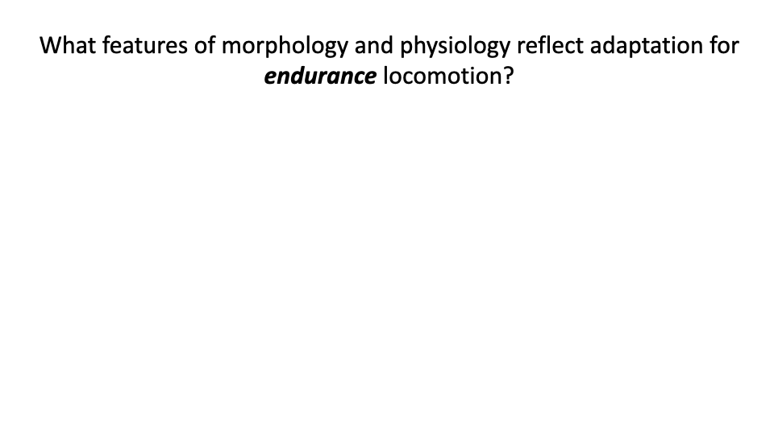
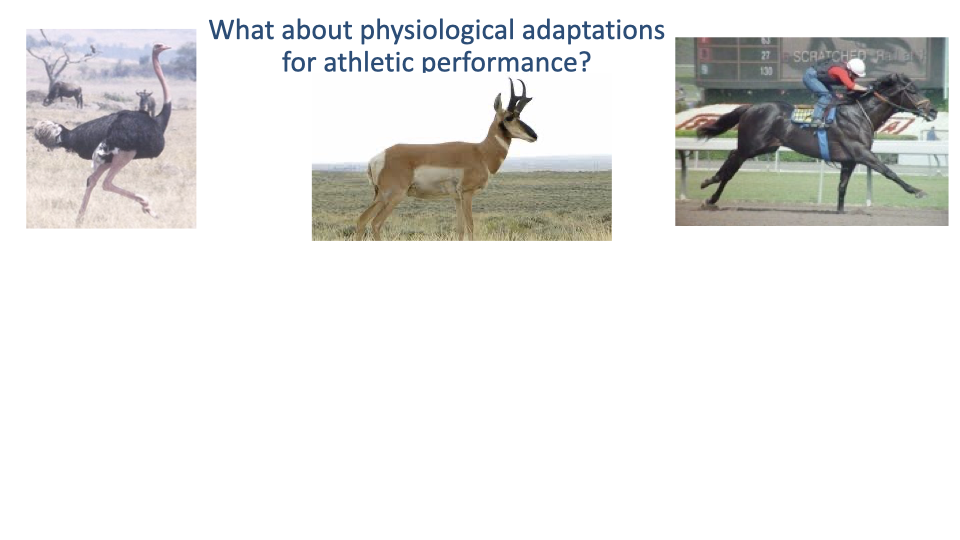

This lecture places human locomotion in an **evolutionary and comparative framework**. It opens with worked examples of **how to interpret cost-of-transport curves** — distinguishing gait-transition speeds from minimum-CoT speeds, extrapolating curves to find their intersections, and recognizing how sampling range and runner fitness shape what the running curve looks like. It then surveys the **morphological and physiological adaptations for endurance and speed** seen across vertebrates (ungulates, theropod dinosaurs and birds), introduces the **factorial aerobic scope** as a physiological measure of athletic capacity, and asks whether humans qualify as **running specialists**. Evidence from **Bramble & Lieberman 2004**, **Pontzer's economy and endurance studies**, and **barefoot vs shod running research** is weighed alongside the criticisms that some of the same features could equally reflect specialization for **economical walking** rather than running.

---

## Slide 1

- Final lecture of the locomotion unit. Goal: integrate material from across the course — gas exchange, oxygen cascade, muscle physiology, force demands, and cost of transport — into an **evolutionary view of human locomotor function**.

---

## Slide 2

![Slide titled "Interpreting cost of transport curves" with a single plot reproduced from a classic biped-gait paper. Panel a (top): metabolic COT (J N⁻¹ m⁻¹, y-axis 0 to 0.6) vs speed (m s⁻¹, x-axis 0.75 to 3.25). Two curves: a U-shaped walking curve (open circles, minimum near 1.25 m/s at COT ~0.27) and a downward-sloping running curve (filled circles, starting at COT ~0.45 at 2 m/s and falling toward 0.42 at 3.25 m/s). A vertical red dashed line at 2.0 m/s marks a candidate transition speed. Panel b (bottom): efficiency of positive work (y-axis 0 to 0.5) vs speed — open and filled circles with error bars hovering around 0.35-0.40 across all speeds. Bottom annotation: "Cost of walking is still lower than cost of running at 2.0 m/s."](images/lec18/slide-002.png)

### Worked Example — Predicting the Walk–Run Transition Speed

- Reading off the **lowest measured running data point** (2.0 m/s on this graph) is a tempting shortcut for the walk–run transition — but it is wrong.
- At 2.0 m/s the **walking CoT is still lower than the running CoT**. There is no energetic reason for a walker to switch yet.
- **Rule for interpreting CoT curves**: the gait-transition speed is the **intersection of the two CoT curves** — the speed at which both gaits cost the same per meter traveled. Above the crossover, running is cheaper; below it, walking is cheaper.
- The intersection often lies **beyond the measured data range** for one of the gaits, so finding it requires **extrapolating the walking curve forward** along the same U-shape implied by the data already in hand.

---

## Slide 3

### Walk–Run Transition Speed — Extrapolated Intersection

- Extrapolating the walking U-curve forward (purple dashed segment), it intersects the declining running curve at **~2.25 m/s**.
- That intersection is the **predicted walk–run transition speed** for this dataset — the speed above which walking becomes more expensive than running, so a rational walker switches to a run.
- **General lesson**: gait-transition predictions require **projection of both CoT curves to where they cross**, not just inspection of measured points within each gait's data range.

---

## Slide 4

![Slide titled "Interpreting cost of transport curves" with the prompt "The graph below shows the cost of transport (CoT) of locomotion as a function of speed for ostriches walking and running. At what approximate speed do you expect the ostrich to prefer to transition from a walk to a run?" Plot: cost of transport (CoT) J/kg·m (y-axis 0.75 to 3.75) vs Speed (m/s, x-axis 0.5 to 6.5). Walking data points (blue dots) span 0.75-2.5 m/s rising linearly from ~1.4 to ~3.2 along a blue trend line. Running data points (orange dots) span 2.5-6 m/s, decreasing from ~2.6 to ~2.1 along an orange trend line. A purple dashed extrapolation extends the walking trend upward, and a purple vertical dotted line at ~1.75 m/s marks the predicted walk–run transition.](images/lec18/slide-004.png)

### Worked Example — Ostrich Walk–Run Transition

- Same logic applied to **ostrich** data. Walking and running data ranges in ostriches do **not overlap** — unlike treadmill-trained horses, ostriches will not readily walk at very high speeds or run at very low ones.
- **Tempting but incorrect**: reading the transition as ~2.5 m/s (the lowest measured running speed).
- **Correct approach**: extrapolate the walking line and find where it intersects the running line — at **~1.75 m/s**, well below the lowest measured running speed in this dataset.
- **Comparative note**: ostriches walk over a much narrower speed range than humans; their transition speed is also lower in absolute terms.

---

## Slide 5

### Worked Example — Minimum-CoT Speed in the Ostrich

- A different question on the same dataset: not the gait-transition speed, but the **speed that minimizes CoT** across the whole dataset.
- **Answer**: the **lowest measured walking speed (~0.8 m/s)** — at that point CoT reaches its dataset minimum (~1.3 J/kg·m).
- **Key distinction**: minimum-CoT speed and **preferred speed** are not the same thing. Animals do not always pick the speed that minimizes CoT — preferred speed depends on **why** they are moving (foraging, migration, predator escape, social travel).
- **Reading rule**: to find a minimum-CoT speed, scan the **whole curve** for its lowest value — do not assume it sits at the bottom of the U for the gait the animal happens to prefer.

---

## Slide 6

![Slide titled "Is CoT of human running linear or U-shaped?" with the header "People choose to run at their optimal speed" and citation Joseph K. Rathkey, Cara M. Wall-Scheffler (first published 14 February 2017, https://doi.org/10.1002/ajpa.23187). Main plot: CoT (kcal/km, y-axis 55 to 105) vs Speed (m/s, x-axis 0 to 6). Gray data points (walking) form a U-shape with minimum near 1.4 m/s at CoT ~62, fit with a steep U-shaped curve labeled R²=0.9983. Black data points (running) span 2-5 m/s with CoT around 75-85, fit with a shallower U-shaped curve with minimum near 3 m/s at CoT ~75 (R²=0.9878). Two linear-fit trend lines (dotted) are also overlaid for each. Inset (top right): same data plotted with finer scale — clearly shows the U-shape of the running curve. Statistics R² values shown for both linear and curvilinear fits.](images/lec18/slide-006.png)

### Is the Human Running CoT Curve Truly Flat?

- Lecture 17 noted that the human running CoT curve appears **nearly flat with speed** — a hallmark of bipedal running.
- **Recent debate** (Rathkey & Wall-Scheffler 2017): with **larger samples** and **wider speed ranges**, the running CoT curve fits a **U-shape** somewhat better than a flat line.
- Two practical drivers of the historical flat-curve picture:
  - Old respirometry studies required **6+ minutes of steady-state running**, limiting the **range of speeds** that could be sampled.
  - Average runners could not maintain high speeds long enough to measure steady-state CoT — biasing data to lower speeds.
- **Reconciliation**: the running CoT curve is **shallower** than the walking curve, but it does have a true minimum. Whether it looks "flat" or "U-shaped" depends on the **speed range sampled** and the **fitness level** of subjects.

---

## Slide 7

![Slide titled "Does Metabolic Rate Increase Linearly with Running Speed in all Distance Runners?" by Matthew E. Batliner, Shalaya Kipp, Alena M. Grabowski, Rodger Kram, William C. Byrnes. Left plot: V̇O₂ (mL O₂ kg⁻¹ min⁻¹, y-axis 25 to 65) vs Speed (m s⁻¹, x-axis 1.5 to 5.5). Two data series — Average Runners (open squares) and Sub-Elite Runners (filled squares). Linear fits and curvilinear (quadratic) fits are both shown with their equations and R² values: linear V̇O₂=11.2x+3.05, R²=0.9965 (average runners), and V̇O₂=12.2x-1.11, R²=0.9858 (sub-elite); curvilinear V̇O₂=1.08x²+5.20x+11.04, R²=0.9994 (average) and V̇O₂=1.54x²+1.54x+15.7, R²=0.9990 (sub-elite). Right plot: O₂ CoT (mL O₂ kg⁻¹ km⁻¹, y-axis 180 to 230) vs Speed for the same two groups — a clear U-shape for both. Average runners' CoT data are mostly at lower speeds (1.75 to 3.5 m/s) showing decline then early rise; sub-elite runners' data extend to 5 m/s and show a clear U-shaped minimum near 3-3.5 m/s.](images/lec18/slide-007.png)

### Average vs Sub-Elite Runners — Sample Size Reveals the U-Shape

- **Batliner et al.** measured CoT in both average and sub-elite runners across a wide speed range.
- **Average runners** (open squares) sample mostly slower speeds and produce a CoT trend that looks nearly flat or even slightly decreasing.
- **Sub-elite runners** (filled squares) can sustain higher speeds — when their data are added, the U-shape **clearly emerges**, with a minimum at ~3.0–3.5 m/s.
- A **curvilinear fit** improves R2 only slightly over a linear fit (0.9994 vs 0.9965), but the **shape of the optimum** is real.
- **Methodological lesson**: the apparent "flat" running CoT in the classic literature reflects **limited speed sampling and limited subject fitness**, not a special property of bipedal running.

---

## Slide 8

### Lecture Overview and Objectives

- **Overview**: think about humans **in an evolutionary context** — what does the comparative method tell us about our locomotor specializations?
- **Learning objectives**:
  1. Discuss **adaptive features for athletic movement** across vertebrates (speed, economy, endurance).
  2. Critically evaluate the evidence that **humans are running specialists**.

---

## Slide 9

![Slide titled "Diversity of animal form and function reflects both adaptation and evolutionary history" with a vertebrate phylogeny on the left listing major clades — Hagfishes, Lampreys, Cartilaginous fishes, Ray-finned fishes, Coelacanth, Lungfish, Caecilians, Salamanders, Frogs, Turtles, Tuatara, Lizards and snakes, Crocodilians, Birds, Monotremes, Marsupials, Placentals. Red bracketing highlights "Athletic animals — High aerobic scope, speed and endurance" on the right side of the tree, encompassing crocodilians, birds, and placental/marsupial mammals. Three icon clusters: aquatic-paired-fins lateral-body-undulation animals at top (red text on left); athletic animals (red arrow on right) with photographs of an ostrich-dinosaur (Ornithomimus), ostrich, peregrine falcon, horse, cheetah, and small bird; and grouped silhouettes of typical mammals and reptiles bracketed by red boxes.](images/lec18/slide-009.png)

### Athleticism Evolved Multiple Times Across Vertebrates

- The vertebrate phylogeny on the left shows the major clades from hagfishes to placental mammals.
- **High aerobic scope, speed, and endurance** have emerged **multiple times** independently — most strikingly in **birds (theropod dinosaurs)** and in **mammals** (with athletic crocodilians a more limited example).
- This is **convergent evolution** in the broad sense: similar physical demands (escape, predation, foraging over long distances) have driven repeated emergence of high-performance locomotion in unrelated lineages.

---

## Slide 10

### Transition — Morphological Adaptations for Endurance

- Section divider. The next slides survey **morphological** features that distinguish endurance specialists, before moving on to **physiological** features.

---

## Slide 11

### Endurance Specialists — Quadrupedal Ungulates

- **Ungulates** (antelope, deer, camel, horse, zebra, elephant) are the canonical **quadrupedal endurance specialists**.
- They are **specialists in both endurance and speed** — the same lineage often supplies both.
- **Ecological drivers**:
  - **Swift grazing**: herbivorous, but must move efficiently between dispersed food and water resources.
  - **Long-distance migration**: many species track seasonal resources over hundreds or thousands of kilometers.
  - **Prey status**: many are subject to **predator escape**, selecting for both **maximum speed** and **economical sustained travel**.

---

## Slide 12

### Endurance Specialists — Theropod Dinosaurs and Birds

- The **other major clade** of athletic vertebrates: **theropod dinosaurs and their modern descendants, birds**.
- Cursorial ground birds (ostrich, emu, rhea, guinea fowl, turkey, quail) display the same morphological pattern as ungulates: **upright posture**, **elongated distal limbs**, **proximally concentrated muscle mass**.
- Bipedalism in this lineage is **ancient** (~250 million years) — much older than human bipedalism (~5–10 million years).
- Provides a powerful comparative reference point: the morphology of cursorial birds shows what **a long evolutionary history of bipedal running specialization** looks like.

---

## Slide 13

![Slide titled "Morphological adaptations for economy and speed" with subtitle "Over evolutionary time within a lineage, from the fossil record." A horizontal series of anatomical drawings showing the evolution of the horse forelimb skeleton from the ancestor: Horse ancestor (broad, five-toed foot in green), Eocene horse Hyracotherium, Miocene horse Mishippus, modern horse (Equus, red, single-toed hoof). The bones progressively fuse and elongate, with reduction in the number of digits — from five toes down to one. Caption: "FIGURE 1.5 EVOLUTIONARY TRENDS IN PROPORTIONS AND NUMBER OF SERIAL PARTS of the left forefoot of the horse. (Not drawn to scale.) Although the trends shown are real, the exact examples may not have been direct steps. The Eocene and Miocene are divisions of the Tertiary." Citation: Hildebrand & Goslow 2001 Analysis of Vertebrate Structure 5th Ed. John Wiley & Sons. New York.](images/lec18/slide-013.png)

### Within-Lineage Evolution — Horse Foot Reduction

- The horse fossil record provides a textbook example of **within-lineage evolution toward athleticism**.
- **Bone fusion and elongation** of the distal foot, **digit reduction** from five toes (ancestral) down to one (modern *Equus*).
- **Functional payoffs**:
  - **Lighter distal limb** → lower swing-leg inertia → lower cost to oscillate the leg.
  - **Reduced number of joints** distally → fewer muscles needed for stabilization, further reducing distal-limb mass.
  - **Longer distal leg segment** → longer effective leg → longer step length → lower CoT.

---

## Slide 14

![Slide titled "Morphological adaptations for economy and speed" with subtitle "Across different lineages: Convergent evolution of features associated with athletic behavior." Five distal-limb skeleton drawings shown side by side: Ostrich Dinosaur (Ornithomimus), Ostrich (Struthio), Cheetah (Acinonyx), Vicuna (Vicugna), Horse (Equus). All show striking lengthening and fusion of metatarsals/metacarpals, reduction of digits (2-3 numbered in each), and squaring or fusion of tarsal bones. Caption: "FIGURE 24.15 LENGTHENING, COMPACTION, AND FUSION OF METATARSALS. LOSS OF LATERAL DIGITS, AND SQUARING OR FUSION OF TARSALS in the left hind foot of selected cursors of three classes. Digits are numbered." Citation: Hildebrand & Goslow 2001.](images/lec18/slide-014.png)

### Convergent Evolution — Same Pattern Across Lineages

- The **same morphological pattern** appears independently in:
  - **Ostrich-mimic dinosaurs** (Ornithomimus, ~80 Mya).
  - **Modern ostriches** (~10 Mya extant lineage).
  - **Cheetahs** (mammalian carnivore specialist).
  - **Vicuñas and horses** (perissodactyl and artiodactyl ungulates).
- All show **lengthening and fusion of metatarsals/metacarpals, loss of lateral digits, fusion of tarsals**.
- **Convergent evolution** is a powerful argument that these features are **functional adaptations** for running, not just shared ancestry.

---

## Slide 15

![Slide titled "Morphological adaptations for economy and speed" with a large-scale stick-figure skeleton drawing of a generic cursorial mammal limb shown moving through stance, with proximal joints near the hip and successive distal segments swinging through to the foot. Multiple arrows on the limb point in the direction of motion of each segment, and a single large arrow at the foot points along the ground with the label "Total velocity." The schematic illustrates how successive segment rotations sum to give a large total foot velocity. Citation: Hildebrand & Goslow 2001.](images/lec18/slide-015.png)

### Why Long Legs and Many Segments Give High Speed

- A schematic of how **segment rotations sum** to produce foot velocity.
- Each limb segment rotates relative to the proximal segment; the **velocities add** along the kinematic chain.
- **Longer segments and more segments** → **higher foot velocity at the same angular rates** → **higher running speeds achievable**.
- This is the geometric basis for one of the recurring morphological themes: **longer distal limbs → faster and more economical locomotion**.

---

## Slide 16

![Slide titled "Morphological adaptations for economy and speed" with three side-by-side skeletal drawings of mammalian distal limbs in different postures: Plantigrade bear (entire foot in contact with ground), Digitigrade dog (heel and most of foot off ground, standing on toes), Unguligrade deer (only the tips of toes/hoof in contact, with very long elongated metapodials). Right text block (purple-outlined box): "Postural adaptations: Limbs directly under body; Motion restricted to sagittal plane; Fusion and elongation of distal bones; plantigrade → digitigrade, unguligrade." Caption: "FIG. 24.5 CONTRAST IN PROPORTIONS AND FOOT POSTURE in the left hind leg of a noncursor (left), moderate runner (center), and highly specialized cursor (right)." Citation: Hildebrand & Goslow 2001.](images/lec18/slide-016.png)

### Postural Adaptations Across Mammals

- Foot posture progresses along a continuum with increasing cursorial specialization:
  - **Plantigrade** — entire foot in ground contact (humans, bears).
  - **Digitigrade** — toes on ground, heel and metatarsals elevated (dogs, cats, birds).
  - **Unguligrade** — only tip of toe on ground, hoof at the very end (horses, deer, antelope).
- **General postural changes** in cursorial animals:
  - **Limbs directly under the body** (vertically aligned).
  - **Motion restricted to the sagittal plane** (minimizing wasteful side-to-side body motion).
  - **Fusion and elongation of distal bones** (longer effective leg, lighter distal mass).

---

## Slide 17

![Slide titled "Morphological adaptations for economy and speed" with header "Horse forelimb." Left: anatomical drawing of the equine forelimb showing major muscles and tendons labeled — Supraspinatus (proximal), Teres Major, Triceps, Shoulder joint, Biceps, Elbow joint, Olecranon of ulna, SDF muscle (Superficial Digital Flexor), DDF muscle (Deep Digital Flexor), AL of SDF (Accessory Ligament of SDF), Carpus, SDFT (SDF Tendon), DDFT (DDF Tendon), AL of DDF, SL (Suspensory Ligament), MCP joint, DIP joint. Right schematic: a body-mass box at top connected by a zigzag (spring-like) line down to the ground, representing the elastic muscle-tendon system of the distal limb. Right-side text box (purple): "Muscular adaptations: Reduced muscle mass in distal limb; Elaboration of distal ligaments and tendons." Caption: "The equine forelimb, showing the muscles associated with weight bearing." Citation: M. Polly McGuigan, and Alan M. Wilson J Exp Biol 2003;206:1325-1336.](images/lec18/slide-017.png)

### Equine Forelimb — Muscle Mass Concentrated Proximally

- McGuigan & Wilson 2003 anatomical view of the horse forelimb:
  - **Proximal**: large supraspinatus, triceps, teres major, biceps — high-force, work-producing muscles.
  - **Distal**: almost no muscle belly — only long superficial and deep digital flexor tendons (**SDFT, DDFT**) and the **suspensory ligament**, plus thin guiding muscles.
- The right-hand schematic shows the **whole distal limb as a passive elastic spring** between body mass and ground.
- **Adaptations summarized**:
  - **Reduced distal-limb muscle mass** → lower swing inertia, less metabolic cost to cycle the limb.
  - **Elaboration of distal ligaments and tendons** → elastic energy storage and return during stance, especially in high-speed gaits.

---

## Slide 18

### Is Large Body Size Itself an Athletic Adaptation?

- An interlude before the human discussion: **elephants** lack the elaborated distal tendons and slender limbs of horses, but they can travel **long distances economically**.
- **Why?** Large body size alone provides **long Lc** (long step length) and **slow muscle-cycling frequency** — the same Kram-Taylor factors that lower CoT.
- So **large body size can be a sufficient adaptation for low-cost long-distance travel**, even without explicit cursorial morphology.
- This reframes the question of human athleticism: humans are **large-bodied** compared with most mammals, and that alone gives us a relatively low CoT — independent of any running-specific adaptations.

---

## Slide 19

![Slide titled "Scaling of metabolic cost of transport" with a log-log scatter plot reproduced from Taylor et al. 1970. X-axis: BODY WEIGHT (g, log scale 10 g to 1000 kg). Y-axis: mL O₂ (g km)⁻¹ (log scale 0.01 to 10). Data points labeled with species names along a downward-sloping trend line: White Mouse and Kangaroo Rat (upper left), Kangaroo Rat (smaller), White Rat, Ground Squirrel, Dog (two points), Man (highlighted with purple arrow), Horse (lower right). The trend line has slope ≈ −0.4. The arrow from Man points right to a callout box reading: "Cost of transport is lower in larger animals; Humans have higher cost than expected, for our body size." A right-side text panel summarizes: "Cost of Transport (CoT): Work/(mass*distance), Power/(mass*velocity), In SI units: J kg⁻¹ m⁻¹." Caption: Taylor et al. (1970).](images/lec18/slide-019.png)

### Taylor 1970 — Humans Have Higher CoT Than Expected

- The classical **CoT vs. body mass** scaling line from Taylor et al. 1970 shows CoT decreasing with body mass with a slope of ~−0.4 (log-log).
- **Humans (Man)** sit **above** the trend line — our running CoT is higher than predicted by body size alone.
- Original Taylor et al. estimate: human running ~50% more expensive than expected.
- Sets up the contemporary question: are we **disadvantaged runners** for our size, or did Taylor's limited dataset overstate the gap?

---

## Slide 20

![Slide titled "Reappraisal of the comparative cost of human locomotion using gait-specific allometric analyses" with citation Jonas Rubenson, Daniel B. Heliams, Shane K. Maloney, Philip C. Withers, David G. Lloyd, Paul A. Fournier. Two side-by-side log-log scatter plots. Left plot (running): cost of transport (E_run, J N⁻¹ km⁻¹, y-axis log scale 10 to 1000) vs body mass (kg, x-axis log scale 0.001 to 1000+). Open circles represent quadruped data forming a clear downward trend line ("Predicted net cost: subtraction method (present study)"). A dashed line above shows the older "Predicted net cost: original method (Taylor et al., 1982)." Humans, Horse, Antelope, Rheas labeled near the larger sizes. Right plot (walking): CoT for walking (similar y-axis log scale) vs body mass. Humans sit notably below the quadruped trend line. Two annotations below each plot: Left annotation in dark blue: "Human running is 17% higher than predicted based on mass. Not as high as originally suggested by Taylor." Right annotation: "Human walking is 20% less expensive than predicted based on mass." Bottom-left summary in purple: "Humans are relatively economical runners by virtue of large body size. But less economical than quadrupeds of the same size. We are economical at walking for our size."](images/lec18/slide-020.png)

### Modern Reappraisal — Humans Run Costlier, Walk Cheaper Than Expected

- **Rubenson et al.** reanalyzed the comparative CoT data with **more species, larger samples, and updated statistical methods**.
- **Revised findings**:
  - **Human running** is **~17% higher** than predicted from body mass — much smaller than Taylor's original ~50% estimate, but still real.
  - **Human walking** is **~20% less expensive** than predicted from body mass.
- **Synthesis**:
  - **Running**: humans are mediocre by mass, **economical only because we are large**.
  - **Walking**: humans are **exceptionally economical** for our body size.
- This dataset is central to the **endurance running vs endurance walking debate** (Slides 26–31): the strongest case is for **economical walking**, not necessarily for running specialization.

---

## Slide 21

![Slide titled "The largest animals are not the fastest" with citation Dick and Clemente (2017). Single scatter plot: Speed (km/h, y-axis log scale 2 to 100) vs Body mass (kg, x-axis log scale 0.01 to 10,000). Three colored trend lines fit to three taxonomic groups: Felids (orange, peak ~80 km/h around 50 kg), Mammals (yellow, peak ~60 km/h around 100 kg), Varanids (blue, peak ~20 km/h around 10 kg). Each curve is a clear inverted-U/quadratic with an intermediate optimum size for maximum speed. Sample images near each curve show small varanid lizard, antelope, large cat, and small mammal silhouettes. Legend: Felids (orange), Mammals (yellow), Varanids (blue). Bottom annotation: "Optimum size for speed, around 10 to 100kg; *But consider the challenges of measuring maximum speed."](images/lec18/slide-021.png)

### The Largest Animals Are Not the Fastest

- Dick & Clemente 2017 compiled **top-speed data** across mammals, felids, and varanid lizards.
- Within each lineage, **top speed vs body mass** shows an **inverted-U** — there is an **intermediate optimum size** for maximum speed (~10–100 kg).
- **Optima**:
  - **Felids** peak at ~80 km/h near 50 kg (cheetah-sized).
  - **General mammals** peak at ~60 km/h near 100 kg.
  - **Varanid lizards** peak much lower, near 10 kg.
- **Humans** sit near the mammalian optimum for size — though far below the speed line, because top human speed is limited by other factors (bipedal posture, distal-limb mass, training).
- **Caveat**: estimating true maximum speed in wild animals is methodologically hard — historical "top speed" data were often estimated from a Jeep speedometer chasing the animal.

---

## Slide 22

![Slide titled "Morphological specializations for endurance and speed" with three photographs across the top: an ostrich (running), a pronghorn antelope, and a racehorse with jockey. Below, a centered blue box reading "What about physiological adaptations for athletic performance?" Behind this box, partially visible, a list of bullet points labeled (from earlier slides): "Upright, parasagittal limb posture — reduces the muscular effort; Passively stable trunk — minimizes postural muscular effort; Elongated legs — increase stride length and speed; Reduction in distal mass (inertia) — minimizes the power and energy cost to swing the legs; 'Springy' tendons for elastic energy cycling — reduce muscle work and power; Large body size (lower cost of transport, higher aerobic scope); 'Cursorial' animals."](images/lec18/slide-022.png)

### Transition — From Morphology to Physiology

- Summary of the **morphological adaptations** for endurance and speed seen in cursorial vertebrates:
  - **Upright parasagittal limb posture** — reduces muscle force demand to support body weight.
  - **Passively stable trunk** — minimizes postural muscular effort.
  - **Elongated legs** — longer stride, higher speed, lower CoT (Kram & Taylor).
  - **Reduced distal mass** — lower swing-leg inertia.
  - **"Springy" tendons** — elastic energy cycling reduces muscle work and power.
  - **Large body size** — lower CoT, higher aerobic scope.
- Animals showing these features are called **cursorial** (running-adapted).
- Next: what about the **physiological** side — the oxygen supply cascade and aerobic capacity?

---

## Slide 23

### Setting Up the Physiology Discussion

- Section divider. The next slides cover **physiological adaptations** for athletic performance — high VO2max, lung and cardiac specialization, hematocrit, thermoregulation, and how humans rank physiologically against other vertebrate athletes.

---

## Slide 24

![Slide titled "Allometric scaling of maximal metabolic rate in mammals: muscle aerobic capacity as determinant factor" with citation Ewald R. Weibel, Leonardo D. Bacigalupe, Beat Schmitt, Hans Hoppeler. Main plot: Factorial Aerobic Scope (y-axis log scale 1 to 100) vs Body Mass Mb (kg, x-axis log scale 0.001 to 1000). Two upward-trending lines: top — athletic species (triangles) fAS(athl) = 17.66·Mb^0.184, R² = 0.888; bottom — non-athletic species (circles) fAS(nonathl) = 8.29·Mb^0.100, R² = 0.448. Top equation in blue: "Factorial Aerobic Scope (fAS) = V̇O₂max / BMR." Bottom-left text box (purple-bordered): "Factorial Aerobic scope: Horse ~50X; Human untrained: 12X, cyclists: 16-21X, runners, skiers: 24X."](images/lec18/slide-024.png)

### Factorial Aerobic Scope — Athletic vs Non-Athletic

- **Factorial aerobic scope (fAS) = $\dot{V}O_{2max}/BMR$** — how many times above basal metabolic rate the animal can sustain.
- **Scaling**:
  - **Athletic species**: $fAS_{athl} = 17.66 \cdot M_b^{0.184}$, R2 = 0.89.
  - **Non-athletic species**: $fAS_{nonathl} = 8.29 \cdot M_b^{0.100}$, R2 = 0.45.
- Athletic species sit at **2–4× higher fAS** than non-athletic species at the same body size.
- **Human placement**:
  - **Untrained humans**: fAS ≈ **12** — squarely in the non-athletic range.
  - **Trained cyclists**: 16–21.
  - **Elite runners and cross-country skiers**: 24.
- **Comparison**: a **horse** can have fAS ≈ 50. Even our most trained athletes are not exceptional by mammalian standards — humans are physiologically **average mammals** in aerobic scope, somewhat above non-athletic average with training.

---

## Slide 25

![Slide titled "Physiological specializations for endurance and speed" with the same three athletic-vertebrate photographs (ostrich, pronghorn, racehorse) and a bulleted list: High 'aerobic scope' — Typically 10-20X in birds & mammals, up to 50-60X in athletic species compared to ~5X in reptiles; Requires adaptations across the entire oxygen supply cascade; Lung capacity; Heart muscle mass → stroke volume (can vary 10x between species); Hematocrit → oxygen carrying capacity of blood; Large spleen to rapidly increase hematocrit during exercise (e.g. horses); Mitochondrial density in muscle; Temperature regulation; Evaporative cooling (sweating, panting), brain temperature regulation (carotid rete).](images/lec18/slide-025.png)

### Physiological Specializations Summarized

- Athletic species achieve high aerobic scope through adaptations **across the entire oxygen supply cascade** (a recurring theme of E183):
  - **Lung capacity** — increased gas-exchange surface area and ventilation rate.
  - **Heart muscle mass and stroke volume** — can vary 10× between species (e.g., horses have very large hearts for their size).
  - **Hematocrit** — higher oxygen-carrying capacity per unit blood volume.
  - **Splenic blood reserve** — horses have a very large spleen that releases stored red blood cells to rapidly elevate hematocrit during exercise.
  - **Mitochondrial density in muscle** — increases capacity for sustained ATP production.
  - **Temperature regulation** — evaporative cooling (**sweating** in humans, **panting** in dogs); brain-temperature regulation via the **carotid rete** in ungulates.
- **Humans shine specifically in thermoregulation** — extensive sweat glands and hairless skin allow exceptional evaporative cooling, supporting sustained exercise in heat where many other mammals would overheat.

---

## Slide 26

![Slide titled "Are humans 'cursorial' (running specialists)?" with two side-by-side panels: Left panel — screenshot of a TED Talks page showing Christopher McDougall giving a TED talk titled "Are we born to run?" with a transcript excerpt summary text: "Christopher McDougall explores the mysteries of the human desire to run. How did running help early humans survive — and what urges from our ancient ancestors spur us on today? McDougall tells the story of the marathoner with a heart of gold, the unlikely ultra-runner, and the hidden tribe in Mexico that runs to live." (46 kB). Right panel — book cover of "BORN TO RUN — A Hidden Tribe, Superathletes, and the Greatest Race the World Has Never Seen" by Christopher McDougall (National Bestseller). Cover features a silhouetted runner on a desert mountain.](images/lec18/slide-026.png)

### Are Humans Running Specialists?

- The question is not just academic — it has been **debated publicly** for decades.
- **Christopher McDougall's "Born to Run"** (and his TED talk) argued forcefully for human endurance running as our defining trait, popularizing **barefoot running** and the lifestyle of the Tarahumara people of Mexico.
- The popular case rests largely on the **scientific work of Bramble & Lieberman** (next slides) — but as with all hypothesis claims, it needs critical evaluation.

---

## Slide 27

![Slide titled "Are humans 'good' runners?" with citation header "Endurance running and the evolution of Homo" by Dennis M. Bramble and Daniel E. Lieberman. Top-right small photograph of a human male running on a track. Body text: "Habitual striding bipedalism is a derived feature in hominids, compared to other great apes. Need to consider human form and function in the context of primate ancestry" (last line underlined). Bottom citation: Bramble and Lieberman (2004) Endurance running and the evolution of Homo. Nature 432, 345-352.](images/lec18/slide-027.png)

### Bramble & Lieberman 2004 — The Endurance-Running Hypothesis

- The **Bramble & Lieberman 2004 Nature paper** is the foundational scientific paper for the endurance-running hypothesis.
- **Key framing**: **habitual striding bipedalism is derived in hominids** — it does not exist in other great apes.
- Therefore, human locomotor anatomy must be considered **in the context of primate ancestry**, not against the broad mammal background of Slide 19.

---

## Slide 28

![Slide continuing the Bramble & Lieberman paper, with the same title and runner photo. Six panels (a-f) of full-body human skeletal drawings with various muscle groups highlighted in red across different regions: legs and feet (a), gluteal muscles and erector spinae (b), trunk stabilizers (c), arm and shoulder muscles (d), gluteal muscles labeled "Maximus" and (e) trapezius muscle group at the back/shoulders, and (f) full anterior view of leg and trunk musculature. Citation: Bramble and Lieberman (2004) Endurance running and the evolution of Homo. Nature 432, 345-352.](images/lec18/slide-028.png)

### Highlighted Anatomical Features

- Bramble & Lieberman highlight a suite of anatomical features that they argue are running-specific specializations:
  - **Long legs** with **straight orientation** for inverted-pendulum walking and bouncing running.
  - **Elaborated tendons** (Achilles, plantar arch) for elastic energy cycling.
  - **Stabilizing trunk and gluteal muscles** for upright bipedal striding.
  - **Trapezius and nuchal ligament** for head stabilization during running.
- The argument: these features are **uniquely emphasized in humans** compared with other great apes, so they reflect selection for running performance in early *Homo*.

---

## Slide 29

![Slide titled "Are humans 'good' runners?" with same Bramble & Lieberman header and runner photo. Body text: Compared to other primates and great apes, humans have: Several features of anatomy that improve locomotor economy: long legs, long Achilles tendon, plantar arch, rigid narrow foot; Adaptations for skeletal strength, reduced bone stress; Features of neck and arm anatomy to enable head stability & balance; Specializations for thermoregulation, heat dissipation. Citation: Bramble and Lieberman (2004) Endurance running and the evolution of Homo. Nature 432, 345-352.](images/lec18/slide-029.png)

### Bramble & Lieberman — Specific Features for Endurance Running

- The paper organizes human-vs-great-ape differences into four categories:
  1. **Locomotor economy** — long legs, **long Achilles tendon**, **plantar arch**, **rigid narrow foot**.
  2. **Skeletal strength** — reduced bone stress, increased cross-sectional area of long bones.
  3. **Head stability and balance** — neck and arm anatomy (nuchal ligament, trapezius arm coupling).
  4. **Thermoregulation and heat dissipation** — sweat glands, body hair reduction, breath cooling.

---

## Slide 30

![Slide titled "Are humans 'good' runners?" with the same Bramble & Lieberman header and runner photo. Main figure: a gait-speed range diagram comparing four animal categories. Horizontal bars across a speed axis (1 to 12 m/s) show: Quadruped (500 kg, e.g., a horse) — labeled "Trot" then "Sustained gallop" with markers labeled Tm, Tp, T-G, Gp, Gms; Pony (110-170 kg) — same arrangement with overlapping trot and gallop bars; Quadruped (65 kg) — trot and sustained gallop bars at lower speeds; Human (~65 kg) — labeled "Average 'jogging'" on a blue bar from 2 to 6 m/s, then "Human ER range" (Endurance running) continuing to ~7 m/s, and "Human sprint range" from ~7 to ~11 m/s in gray. Bottom annotation: "Sustainable endurance running speeds overlap with speeds used by quadrupeds to travel long-distances."](images/lec18/slide-030.png)

### Sustainable Speeds — Humans vs. Quadrupeds

- Speed-range diagram comparing human endurance running with quadruped sustained gaits (trot and gallop) at matched body mass.
- **Key observation**: **human sustainable endurance running speeds overlap with the speeds quadrupeds use to travel long distances**.
- The endurance-running hypothesis: this overlap is no accident — humans evolved to **sustain quadruped-like trot speeds aerobically** as part of **persistence hunting** — running prey to exhaustion in hot environments.
- Persistence hunting depends on:
  - **Aerobic endurance** — to sustain trot-equivalent speeds for hours.
  - **Superior thermoregulation** — to outlast prey that overheats.
  - **Cooperative tracking** — coordination over long distances does not require winning a sprint.

---

## Slide 31

![Slide titled "Are humans 'good' runners?" with the same Bramble & Lieberman header and runner photo. Main figure: CoT (mL O₂ kg⁻¹ km⁻¹, y-axis 80 to 240) vs Speed (m s⁻¹). Two curve families: human walk (steep dashed U-curve with minimum at ~1.3 m/s near CoT 100, rising sharply on both sides, with three dotted-box markers around the minimum) and human run (blue solid curve, nearly flat near CoT ~200 across 2.5-6 m/s, with two dotted-box markers near minima); plus an orange curve representing a generic quadruped's gait progression with the same crossing pattern. Bottom-left annotation box (purple-outlined): "Criticisms: Over-interpretation of observational evidence; Limited fossil record to support claims; Some features also adaptations for economical walking & standing." Citation: Bramble and Lieberman (2004) Endurance running and the evolution of Homo. Nature 432, 345-352.](images/lec18/slide-031.png)

### Bramble & Lieberman — Criticisms

- Three main criticisms of the endurance-running hypothesis:
  1. **Over-interpretation of observational evidence** — the case is built largely on **anatomical observation and comparison**, with limited experimental tests.
  2. **Limited fossil record** — direct paleontological evidence for endurance-running behavior in early *Homo* is scarce; soft-tissue features cannot be directly observed.
  3. **Alternative interpretation**: many of the highlighted features (Achilles tendon, plantar arch, long legs, straight knees) are **equally good adaptations for economical walking and standing** — see the Rubenson et al. result that humans walk **20% more cheaply than expected** (Slide 20).
- The debate is unresolved: humans clearly have **some** features that help with running, but it is hard to say whether **running** or **walking** (or both) was the dominant selective pressure.

---

## Slide 32

![Slide titled "Human foot structure and bare-foot vs shod running" with citation "Foot strike patterns and collision forces in habitually barefoot versus shod runners" by Daniel E. Lieberman, Madhusudhan Venkadesan, William A. Werbel, Adam I. Daoud, Susan D'Andrea, Irene S. Davis, Robert Ojiambo Mang'Eni, Yannis Pitsiladis (Nature 463, 531-535, 2010). Two side-by-side vertical-GRF traces over a stride. Left panel (a): Force (body weights, y-axis 0 to 2.4) vs Time (s, 0 to 0.7). Shows a vertical GRF trace with a small early impact peak (~1 BW) at heel contact (foot-strike images show rear-foot striker), followed by a higher main loading peak (~2.4 BW). Foot diagrams along the trace illustrate heel-first, then foot-flat, then push-off positions of a typical shod runner. Right panel (b): same axes, GRF trace for a shod runner with an even more pronounced early impact peak (~2 BW) and a similar main loading peak (~2.4 BW), with foot diagrams showing the same rear-foot strike pattern with shoes.](images/lec18/slide-032.png)

### Foot Strike Patterns — Shod Heel Strike

- Lieberman et al. 2010 measured GRF in **habitually barefoot** vs **habitually shod** runners.
- **Shod runners** (and many barefoot runners landing heel-first): the vertical GRF trace shows a distinct **early impact peak** (≈1.5–2 body weights) corresponding to the **abrupt collision** of the heel with the ground.
- The impact peak is followed by a larger **main loading peak** during mid-stance.
- The impact peak represents a **rapid loading rate** that has been linked to higher rates of running injury.

---

## Slide 33

![Slide titled "Human foot structure and bare-foot vs shod running" with the same Lieberman et al. 2010 citation. Two panels in a different arrangement than Slide 32: Left panel (c, highlighted with a purple-outlined box): same Force-vs-Time axes but now showing the GRF trace for a barefoot fore-foot strike — a smoother single peak rising gradually to ~2.4 BW without the early sharp impact peak. Foot-strike images along the trace show toes-first landing, then foot-flat, then push-off, all illustrating a forefoot-strike barefoot pattern. Right panel (b): same shod rear-foot-strike trace as Slide 32 (large early impact peak followed by main loading peak).](images/lec18/slide-033.png)

### Barefoot Forefoot Strike Smooths the GRF Trace

- **Barefoot runners** typically land on the **forefoot/ball of the foot**.
- The vertical GRF trace lacks the early impact peak (panel c) — the **arch of the foot acts as a spring**, absorbing the collision elastically.
- **Evolutionary interpretation**: the **plantar arch and intrinsic foot muscles** evolved as a tunable spring for cushioning forefoot landings — consistent with the endurance-running argument.
- **Modern shoes** with cushioned heels effectively allow heel-first landing without the pain, but **bypass the natural spring mechanism** of the foot.
- **Caveat**: switching to barefoot/forefoot running takes adaptation and can cause injury in habitually shod runners if done abruptly.

---

## Slide 34

![Slide titled "Economy and Endurance in Human Evolution" with citation Hermon Pontzer. Top-left: a series of four hominin skeletal silhouettes showing the evolution of bipedal posture — Chimpanzee, Ardipithecus, Australopithecus, Human — each progressively more upright, with the human at the right standing with vertical posture and straight legs. Bottom-left bullet: "Humans have exceptional endurance in both walking and running compared to other primates." Right column: two stacked plots. Panel A: Endurance (minutes, y-axis log scale 0.1 to 10000) vs Speed (m s⁻¹, x-axis 1 to 10). Filled circles labeled Humans show very high endurance (~10000 minutes at slow speed, falling to ~1 minute at 10 m/s) along a fit y = 130,964x^(-3.9), R² = 0.99. Filled squares labeled Chimpanzees show much lower endurance (≤10 minutes at any speed) along a fit y = 2,578,999x^(-6.0), R² = 0.96. Panel B: V̇O₂max (mL O₂ min⁻¹, y-axis log scale 1 to 10000) vs Muscle mass (kg, x-axis log scale 0.001 to 1000). Single linear fit y = 343x^(0.96), R² = 0.98. Humans labeled at the far right, Quad. Bipedal Chimpanzees labeled adjacent, both lying on the line.](images/lec18/slide-034.png)

### Pontzer — Humans Are Endurance Specialists Compared to Other Primates

- Pontzer compared **endurance** (time sustainable at a given speed) and **VO2max** between humans and chimpanzees, our closest living relatives.
- **Panel A**: humans have **dramatically greater endurance** than chimpanzees at every speed — orders of magnitude more, at speeds chimpanzees can barely sustain.
- **Panel B**: human **VO2max** fits the **standard mammalian scaling line** with muscle mass — we are not unusual; we simply have **more muscle mass than chimpanzees** because we are larger.
- **Interpretation**: humans are exceptional endurance performers **among primates**, but our underlying physiology is **standard for our muscle mass**. The endurance advantage is largely about **body size** plus **biomechanical economy**, not about exceptional aerobic capacity.

---

## Slide 35

![Slide titled "Economy and Endurance in Human Evolution" with the same Pontzer citation and hominin skeleton series. Bottom-left bullets: "Humans have much more economical walking compared to other primates" followed by three indented items: long legs, straight leg posture, specialized foot morphology. Bottom-center: small inset of a colored foot pressure map showing center of pressure excursion across the plantar surface during a walking step, with labels "Foot Width," "Center of Pressure Excursion," "Center of Pressure Line." Bottom annotation: "CPEI = (Center of Pressure Excursion × 100%) / Foot Width." Right column: two stacked plots. Panel B: Cost of transport (J kg⁻¹ m⁻¹, y-axis 0 to 4) vs Speed (m s⁻¹, x-axis 0 to 4). Curves labeled with fit equations: a U-shape for humans (open circles, y = 1.70x² - 4.53x + 5.23, minimum at ~1.3 m/s), and a separate linear fit for running (y = -0.06x + 3.89). A higher-positioned fit y = 0.17x + 4.20 represents chimpanzee walking (much higher CoT). Panel C: Economy (mg J⁻¹, y-axis 0 to 0.5) vs Speed. Curves labeled y = -0.25x² + 0.67x (curved walking), y = 0.005x + 0.256 (running flat), y = -0.010x + 0.241 (chimpanzee).](images/lec18/slide-035.png)

### Pontzer — Humans Walk Far More Economically Than Other Primates

- Human walking is **far more economical** than chimpanzee walking — even when normalized for size.
- **Three structural reasons** for the economy gap:
  - **Long legs** → long step length, low cycling frequency.
  - **Straight (extended) leg posture** → near-pendulum vaulting, locked knees support body weight passively.
  - **Specialized foot morphology** — center-of-pressure rolls smoothly from heel to toe along the foot's curved sole, minimizing collisional losses.
- The **Center-of-Pressure Excursion Index (CPEI)** quantifies this rolling: the longer the COP excursion relative to foot width, the more efficient the roll.
- **Synthesis**: when the comparative reference is **other primates** (rather than other mammals), humans are clearly **specialized walkers and (probably) runners** — though the walking case is the stronger of the two.

---

## Slide 36

![Slide split into two halves. Top half: heading "Running is a Total Body Affair" by Gretchen Reynolds (The New York Times). Top photographs show a multi-exposure motion-capture sequence of a runner mid-stride and a second-frame view of arm-and-shoulder motion synchronized with leg motion. Below this header: "Neuromechanical linkage between the head and forearm during running" by Andrew K. Yegian, Yarish Tucker, Dennis M. Bramble, Daniel E. Lieberman. American Journal of Physical Anthropology, DOI: (10.1002/ajpa.24234). Bottom half: four bulleted findings on the right: Muscular linkage between arm, shoulders and head; Stabilizes pitching rotations induced by foot-strike; Synchronized muscle activation in running, but not walking; Reduced face & emergence of nuchal ligament in early Homo may have arisen from selection for running performance in hunter-gatherers. Left: small anatomical drawing of a human skeleton with labeled muscles highlighted in red — superior trapezius, SLT (semispinalis), biceps — connecting head, neck, shoulders, and arm.](images/lec18/slide-036.png)

### Head Stability — Neuromechanical Linkage Between Arm and Head

- Yegian et al. (Lieberman lab) showed a **specific neuromechanical linkage** between the **forearm and the head** during running:
  - **Synchronized muscle activation** of arm, shoulder, and neck muscles **during running** but **not walking**.
  - Stabilizes the **pitching rotations** of the head that result from foot-strike impacts.
- **Anatomical correlates** in early *Homo*: reduced face mass and emergence of the **nuchal ligament** — both interpreted as adaptations for **head stability during running**.
- Adds a piece of evidence to the endurance-running case: it is **specific to running**, not equally explainable by walking.

---

## Slide 37

![Slide titled "Linking brains and brawn: exercise and the evolution of human neurobiology" by David A. Raichlen and John D. Polk (Published 07 January 2013, https://doi.org/10.1098/rspb.2012.2250). Right side: flowchart with boxes connected by arrows. Top: "selection for improved aerobic activity performance." Below: "increased baseline neurotrophin and GF signaling." Two parallel branches below that: left — "improved tissue and vascular system repair/growth; improved regulation of metabolism" leading to "higher level of aerobic activity performance"; right — "increased neurotrophin and GF signaling during ontogeny" leading to "larger adult brain size and/or increased cognition." A dashed double-headed arrow with a question mark links the two terminal boxes. Bottom paragraph in purple: "The hunting and gathering lifestyle adopted by human ancestors (~2 Mya) required a large increase in aerobic activity"; "Exercise increases brain size and improves cognitive performance in humans and other animals"; "Selection acting on endurance increased baseline neurotrophin and growth factor signaling (responsible for both brain growth and metabolic regulation) leading to increased brain development and adult brain size"; "The development of endurance capabilities in Homo parallels the evolutionary increase in brain size, cognitive ability and metabolic rate."](images/lec18/slide-037.png)

### Linking Brains and Brawn — Aerobic Activity and Brain Evolution

- Raichlen & Polk 2013 propose that **selection for aerobic endurance** in early *Homo* was a key driver of **brain evolution**:
  - Endurance activity increases **neurotrophin and growth-factor signaling**.
  - These signaling molecules promote both **tissue repair/metabolic regulation** and **neural development**.
  - The result is **larger adult brain size and improved cognition** as a coevolutionary side-effect of aerobic specialization.
- **Re-framing**: rather than "we developed big brains and then became active," the proposal is **"we became active, and big brains came along for the ride."**
- Whether or not the specific mechanism is correct, the **temporal correlation** in the hominin record between **endurance capacity, brain size, and metabolic rate** is striking.

---

## Slide 38

![Slide titled "Why do humans have such heavy limbs?" with a side-by-side anatomical comparison drawing of a human skeleton (left) and ostrich skeleton (right) in upright posture. Multiple connecting lines and labels link homologous joints: red lines connect anatomically equivalent joints (hip-hip, knee-knee, ankle-ankle); green lines connect functionally equivalent joints. Yellow shading indicates muscle mass concentration. Labeled anatomical points include Hip, Thigh bone (femur in human, illustrative in ostrich), Knee, Shin bone, Ankle joint, and on the ostrich: Tarso-metatarsus, with the annotation "Elevated toe joint = tiptoed posture." Three bullets at right: "Evolution does not always produce 'optimal' solutions"; "Optimal for one task may not be optimal for another (e.g. walking versus running)"; "Possible sequence effect resulting in functional constraint: If foot function became adapted for economical walking before selection for increased body size and leg length." Bottom-left small text: "Red lines connect anatomically equivalent joints; Green lines connect functionally equivalent joints; Yellow shading indicates muscle mass." Citation: Nina Schaller.](images/lec18/slide-038.png)

### Why Do Humans Have Such Heavy Distal Limbs?

- Human distal-limb morphology is **anomalous** for a cursorial bipedal: heavier than expected, plantigrade, with a wide flat foot.
- **Schaller diagram**: when human and ostrich skeletons are aligned by **functional joints** (green lines) rather than **anatomical homologies** (red lines), the human "ankle" corresponds **functionally** to the bird's mid-shank, not to the ankle.
- **Three interpretations**:
  1. **Evolution does not produce optimal solutions** — it tinkers with what is there.
  2. **Trade-offs between tasks**: optimal for walking may not be optimal for running.
  3. **Sequence effect**: if humans first became specialized for **economical walking** (long legs, plantigrade arch-spring foot), and only later acquired longer running endurance, then the heavy plantigrade foot is a **historical constraint** — the cost of having walked first.

---

## Slide 39

![Slide titled "There is also high variation among individual humans" with subhead "Evolutionary perspectives typically focus on large scale variation (across orders of magnitude). (This is why you often see comparative data on logarithmic scales)." Two panels side by side. Left panel: from a review article "Factors Affecting Running Economy in Trained Distance Runners" by Philo U. Saunders, David B. Pyne, Richard D. Telford, John A. Hawley — a complex flowchart showing the multifaceted factors influencing running economy. Boxes for Performance in distance running, Running economy, and feeding into it: Training, Metabolic biomechanical factors, Anthropometric factors, Plyometrics, Maximal oxygen uptake, Resistance training, Heat altitude, hills, etc., Substrate metabolism, Linking to economy, Hyper carbic/oxic, Influence of training speeds. Right panel: a table titled "Table 1. Biomechanical factors related to better running economy in runners" with two columns "Feature" and "Description for better running economy." Rows list: Age, Height, Body fat composition, Body fat, Leg morphology, Pelvis, Feet, Stride length, Kinematics, Kinetics, Strength of foot muscles, Training, Running surface, with brief descriptions for each.](images/lec18/slide-039.png)

### Within-Species Variation in Running Economy

- Beyond the broad comparative trends, **individual humans vary enormously** in running economy.
- The **Saunders flowchart** (left) shows that running economy in trained distance runners depends on a complex interplay of:
  - **Training history and intensity**.
  - **Biomechanical and anthropometric factors** (limb proportions, body fat composition).
  - **Maximal oxygen uptake and substrate metabolism**.
  - **Environmental conditions** (heat, altitude, hills).
- The **Saunders table** (right) catalogs specific anthropometric and kinematic features linked to better running economy.
- **Why this matters**: log-log comparative plots like Slide 19 average over individual variation. Within humans, this variation is at least as large as the species-level differences with chimpanzees, and a productive area of contemporary sports-physiology research.

---

## Slide 40

![Slide titled "Summary" with bulleted text in dark blue: The comparative approach provides evolutionary context to understand adaptive features and limits to performance; Many features of animal morphology and physiology (form and function) reflect adaptation for locomotor function and energy delivery to tissues; Common adaptive features have emerged among 'athletic' species: minimize of energetic cost of transport (CoT) and maximize factorial aerobic scope (fAS); It is informative to interpret human anatomy, physiology and locomotor function in an evolutionary framework. Bottom heading "Background reading:" with two listed references — Bramble and Lieberman 2004: Endurance Running and the Evolution of Homo; Carrier 1987: The Evolution of Locomotor Stamina in Tetrapods: Circumventing a Mechanical Constraint.](images/lec18/slide-040.png)

### Summary

- **Comparative approach** provides the evolutionary context for understanding **adaptive features** and **performance limits**.
- Many features of **form and function** in animals reflect adaptation for **locomotor function** and **energy delivery to tissues**.
- **Common adaptive features** among "athletic" species:
  - Minimize **energetic cost of transport (CoT)**.
  - Maximize **factorial aerobic scope (fAS)**.
- Interpreting **human anatomy, physiology, and locomotor function** in an evolutionary framework is informative — even when it leaves open questions (e.g., are we running or walking specialists?).
- **Background reading**:
  - **Bramble and Lieberman 2004** — *Endurance Running and the Evolution of Homo*.
  - **Carrier 1987** — *The Evolution of Locomotor Stamina in Tetrapods: Circumventing a Mechanical Constraint*.

---

## Slide 41

### Learning Objectives Revisited

- Repeat of the learning objectives. Each is now backed by evidence from the lecture:
  1. **Adaptive features for athletic movement** — long limbs, upright posture, distal-mass reduction, springy tendons, large body size, high factorial aerobic scope.
  2. **Are humans running specialists?** — humans have many cursorial features compared to other primates, but they are also explainable by selection for **economical walking**. The strongest unambiguous human specialization is **thermoregulation** (sweat-based evaporative cooling); the strongest physiological signature is **economical walking** rather than running per se. The debate is open.

---

## Key Equations

| Equation | Name | Description |
|----------|------|-------------|
| $\text{fAS} = \dot{V}O\_{2max} / \text{BMR}$ | Factorial aerobic scope | Ratio of maximum to baseline metabolic rate. Athletic species sit on a separate scaling line with 2–4× higher fAS than non-athletic species at the same body size. |
| $\text{fAS}\_{athl} = 17.66 \cdot M\_b^{0.184}$ | Athletic-species fAS scaling | Allometric fit (Weibel et al.) for athletic mammals. Implies that aerobic scope rises with body mass even within the athletic group. |
| $\text{fAS}\_{nonathl} = 8.29 \cdot M\_b^{0.100}$ | Non-athletic-species fAS scaling | Companion fit for non-athletic mammals. Lower intercept and shallower slope than the athletic fit. |
| $\text{CoT} \propto M_b^{-0.25}$ | CoT vs body mass scaling | Across runners, CoT decreases as body mass to the −0.25 power on log-log axes (Taylor et al. 1970; updated by Rubenson et al.). |

---

## Glossary of Key Terms

| Term | Definition |
|------|-----------|
| **Cursorial** | Adapted for running. Cursorial morphology includes upright parasagittal limbs, elongated distal limbs, reduced distal-limb mass, elaborated tendons, and (often) large body size. |
| **Endurance running hypothesis** | The proposal (Bramble & Lieberman 2004) that selection for endurance running shaped many of the unique anatomical features of *Homo*, with persistence hunting as a plausible behavioral context. |
| **Persistence hunting** | A hunting strategy in which hunters track prey at sustained running speeds in heat until the prey overheats and collapses. Often cited as the selective pressure for human endurance-running adaptations. |
| **Plantigrade vs digitigrade vs unguligrade** | The three foot postures on the continuum of cursorial specialization. Humans are plantigrade — an unusual posture for a putative running specialist. |
| **Factorial aerobic scope (fAS)** | $\dot{V}O\_{2max} / \text{BMR}$ — how many multiples of basal metabolic rate the animal can sustain. Athletic species sit on a higher scaling line than non-athletic species. |
| **Plantar arch** | The longitudinal arch of the human foot, supported by the plantar aponeurosis. Acts as a tunable spring that stores and returns elastic energy during running, especially with forefoot landing. |
| **Achilles tendon** | The long, energy-cycling tendon connecting the gastrocnemius–soleus complex to the calcaneus. Disproportionately long in humans compared to other great apes — often cited as a running adaptation. |
| **Plantar aponeurosis** | The passive elastic sheet running from the calcaneus to the toe pads, supporting the longitudinal arch. Central to the foot-as-spring view of human running. |
| **Center-of-pressure excursion index (CPEI)** | A measure of how much the center of pressure rolls forward along the foot during stance, normalized to foot width. Larger excursion → more efficient walking. |
| **Nuchal ligament** | A passive elastic ligament running along the back of the neck in humans and many cursorial mammals. Helps stabilize the head against pitching during running. Absent or much smaller in other great apes. |
| **Carotid rete** | A meshwork of arterioles around the carotid artery in many cursorial mammals (e.g., antelope, dogs) that cools the blood supply to the brain via heat exchange with the cooler nasal venous return. Humans lack a carotid rete and instead use whole-body evaporative cooling (sweat). |
| **Evaporative cooling (sweat)** | A thermoregulation strategy in which the body dissipates heat by evaporating sweat from the skin. Humans have an exceptionally large number of eccrine sweat glands and minimal body hair — one of our strongest unambiguous specializations. |
| **Bramble & Lieberman 2004** | Foundational paper proposing the endurance-running hypothesis. Catalogs human anatomical features that they argue are running-specific; critiques include limited fossil evidence and alternative interpretations as walking adaptations. |
| **Rubenson et al. reappraisal** | Modern re-analysis of human CoT vs body mass showing that human **running** CoT is ~17% higher than expected for our body mass (less than the original ~50% estimate), while human **walking** CoT is ~20% lower than expected — a stronger case for walking specialization. |
| **Pontzer's economy and endurance studies** | A series of comparative studies showing that humans have dramatically greater endurance than chimpanzees, our VO2max follows the standard mammalian muscle-mass scaling line, and our walking is exceptionally economical relative to other primates. |
| **Raichlen & Polk brain-evolution hypothesis** | The proposal that selection for endurance activity raised baseline neurotrophin/growth-factor signaling in early *Homo*, indirectly driving the evolution of large brain size and cognition. |
| **Hominin** | Member of the human lineage after divergence from the chimpanzee lineage (~6 Mya). Includes *Australopithecus*, *Homo erectus*, *Homo sapiens*, etc. |
| **Habitual striding bipedalism** | The human pattern of upright, long-stride, two-legged locomotion as the default mode of travel. A derived feature in the hominin lineage relative to other great apes. |
| **Forefoot vs rearfoot strike** | The pattern of initial foot-ground contact in running. Habitually shod runners often land **heel-first** (rearfoot strike, with an impact peak in the GRF). Habitually barefoot runners typically land on the **forefoot** (no impact peak, energy absorbed by the plantar arch). |
