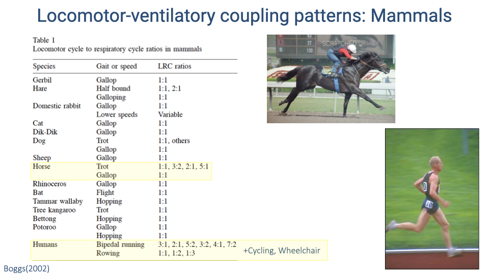
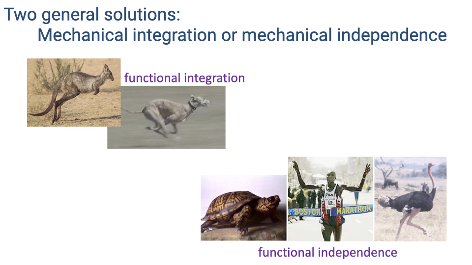

## Slide 1

- This lecture examines how animals coordinate two essential functions — locomotion and breathing — that share many of the same musculoskeletal structures.
- The discussion places humans in a comparative context, highlighting the diversity of solutions vertebrates have evolved to manage this mechanical conflict.

---

## Slide 2

- The final exam is comprehensive, covering all material from Weeks 1 through 10.
- Students may use two double-sided pages of handwritten or printed notes (9 pt font or larger) during the exam.
- Preparing and uploading those notes serves as the Week 10 quiz assignment.

---

## Slide 3

### Review: Are Humans Good Runners?

![Slide titled "Are humans 'good' runners?" referencing the paper "Endurance running and the evolution of Homo" by Bramble and Lieberman. Below lists features that humans have compared to other primates and great apes: features of anatomy that improve locomotor economy (long legs, long Achilles tendon, plantar arch, rigid narrow foot), adaptations for skeletal strength with reduced bone stress, neck and arm anatomy enabling head stability and balance, and specializations for thermoregulation and heat dissipation. Citation: Bramble and Lieberman (2004), Nature 432, 345–352.](images/lec19/slide-003.png)

- Compared to other primates and great apes, humans possess several anatomical features that improve **locomotor economy**: long legs, a long Achilles tendon, a plantar arch, and a rigid narrow foot.
- Skeletal adaptations reduce bone stress, which favors endurance locomotion by limiting repetitive-strain injury.
- Neck and arm anatomy enables head stability and balance during bipedal running.
- Sweat glands distributed across the entire skin surface provide exceptional thermoregulation compared to most mammals.

---

## Slide 4

### Economy and Endurance in Human Evolution

![Slide titled "Economy and Endurance in Human Evolution" by Herman Pontzer. Left side shows an illustration of primate evolutionary progression from chimpanzee to modern human. Top-right graph (A) plots endurance (minutes, log scale) vs. speed (m/s) for humans and chimpanzees, showing humans sustain locomotion far longer at all speeds; exponential decay fits with R² = 0.99 for humans and R² = 0.96 for chimpanzees. Bottom-right graph (B) plots cost of transport (J/kg/m) vs. speed for humans, showing a U-shaped curve with a minimum near walking speed, and a separate higher curve for chimpanzees. An inset shows a pressure map of the human foot highlighting the plantar arch and center of pressure path.](images/lec19/slide-004.png)

- Humans have exceptional endurance in both walking and running compared to other primates. The endurance-vs.-speed curve shows humans sustain locomotion far longer than chimpanzees at all speeds.
- Humans also have much more economical walking. The cost of transport curve for chimpanzees lies well above that for humans.
- This economy advantage is attributed to long legs relative to body size, a straight-legged posture (versus the flexed-knee posture of most great apes), and specialized foot morphology with a rigid plantar arch.

---

## Slide 5

### Neuromechanical Linkage Between Head and Forearm During Running

![Slide showing a New York Times headline "Running Is a Total Body Affair" and a paper by Yegian et al. (2021) titled "Neuromechanical linkage between the head and forearm during running." Right side shows an anatomical diagram of a runner highlighting the superior trapezius (SUT) and biceps (BIC) muscles in red, with a sequence of running photos above. Key points listed: muscular linkage between arm, shoulders, and head; stabilizes pitching rotations induced by foot-strike; synchronized muscle activation in running but not walking; reduced face and emergence of nuchal ligament may have arisen from selection for running performance in hunter-gatherers. Citation: American Journal of Physical Anthropology, DOI: 10.1002/ajpa.24234.](images/lec19/slide-005.png)

- The superior trapezius and biceps muscles, together with the nuchal ligament, create a mechanical linkage between the swinging arms and the head during running.
- This linkage stabilizes pitching rotations of the head induced by foot-strike impact, which is important for maintaining gaze stability during pursuit.
- Synchronized activation of these muscles occurs during running but not walking, suggesting the linkage is specifically important for running.
- The reduced face and prominent nuchal ligament in humans may reflect selection for head stability during endurance running in hunter-gatherers.

---

## Slide 6

### Linking Brains and Brawn: Exercise and Human Neurobiology

![Slide showing the paper "Linking brains and brawn: exercise and the evolution of human neurobiology" by Raichlen and Polk (2013). A flowchart shows how selection for improved aerobic activity performance leads to increased baseline neurotrophins and growth factors, which branches into two pathways: (1) improved cardiovascular and vascular system repair and growth-factor signaling during exercise, leading to higher level of activity performance; and (2) increased neurogenesis and brain-derived neurotrophic factor signaling during exercise, leading to larger adult brain size and cognitive performance. Below states that hunting and gathering lifestyle adopted ~2 Mya required increased aerobic activity; exercise increases brain size and improves cognitive performance; selection for endurance increased neurotrophin and growth factor signaling responsible for both brain growth and metabolic regulation; development of endurance capabilities in Homo parallels increases in brain size, cognitive ability, and metabolic rate.](images/lec19/slide-006.png)

- The hunting-and-gathering lifestyle adopted by human ancestors approximately 2 million years ago required a large increase in aerobic activity.
- Exercise increases brain size and improves cognitive performance in humans and other animals through increased baseline **neurotrophin** and growth factor signaling.
- Selection for endurance may have simultaneously increased signaling factors responsible for both metabolic regulation and brain development.
- The development of endurance capabilities in *Homo* parallels increases in brain size, cognitive ability, and metabolic rate — these features may have co-evolved.
- However, other animals with high aerobic capacity (e.g., ostriches) do not have large brains, so this coupling is not universal across species.

---

## Slide 7

### Why Do Humans Have Such Heavy Limbs?

![Slide titled "Why do humans have such heavy limbs?" showing a side-by-side skeletal comparison of a human and an ostrich, with red lines connecting anatomically equivalent joints and green lines connecting functionally equivalent joints. Yellow shading indicates muscle mass distribution. The human has substantial muscle mass in the distal limb, while the ostrich concentrates muscle proximally with elongated, tendon-dominated distal segments. Three possible explanations listed: (1) evolution does not always produce optimal solutions; (2) optimal for one task may not be optimal for another (e.g., walking vs. running); (3) possible sequence effect resulting in functional constraint — if foot function became adapted for economical walking before selection for increased body size and leg length, the femur elongated rather than the distal limb. Illustration credit: Nina Schaller.](images/lec19/slide-007.png)

- Most cursorial animals concentrate muscle mass proximally and have elongated, tendon-dominated distal limbs (as seen in the ostrich), but humans retain substantial distal limb muscle.
- Possible explanations include: evolution does not always produce optimal solutions; what is optimal for walking economy may not be optimal for running economy; and a sequence of evolutionary events may have created a functional constraint.
- If the human foot became specialized for economical walking before selection acted for endurance running, it may have constrained which skeletal segment could elongate — resulting in femoral rather than distal-limb elongation.

---

## Slide 8

### Individual Variation in Running Economy

![Slide titled "There is also high variation among individual humans." Notes that evolutionary perspectives focus on large-scale variation across orders of magnitude, which is why comparative data often use logarithmic scales. Left side shows a flowchart of "Factors Affecting Running Economy in Trained Distance Runners" from a review article (Saunders et al.), branching into categories: training, environment, physiology, biomechanics, and anthropometry. Right side shows a table listing specific biomechanical factors related to better running economy, including shorter ground contact time, ponderal index, body fat, leg morphology, mass distribution, stride length, vertical oscillation, acute knee angles, arm motion, shoulder rotation, hip and shoulder extension, low peak ground reaction forces, effective exploitation of stored elastic energy, training, and intermediate running surface compliance.](images/lec19/slide-008.png)

- Evolutionary comparisons capture order-of-magnitude effects across deep time, but individual variation within the human population also matters for performance.
- Many factors influence running economy: training status, physiology, biomechanics, anthropometry, and environment.
- Specific biomechanical factors associated with better economy include shorter ground contact time, lower vertical oscillation, greater exploitation of stored elastic energy, and mass distributed closer to the hip joint.
- In elite athletes, small percentage differences in economy can determine competitive outcomes.

---

## Slide 9

### Learning Objectives: Integration of Locomotion and Ventilation

- This section introduces the core topic: how locomotion and ventilation interact mechanically and neurally.
- Learning objectives: describe mechanisms of **locomotor-ventilatory integration**; discuss whether locomotion impedes or assists breathing across species; and evaluate the relationship between locomotor-ventilatory integration and endurance capacity.

---

## Slide 10

### Evolutionary Context: Lateral Body Undulation and Costal Breathing

![Phylogenetic tree of vertebrates from hagfishes through placentals. At the base, the fish ancestor (Sarcopterygii) is labeled with aquatic locomotion, paired fins, and lateral body undulation. At the Tetrapoda node, a blue arrow indicates that ancestral tetrapods used lateral body undulation coupled with limb motion. At the Amniota node, another blue arrow indicates they used costal (rib cage) breathing powered by hypaxial (body wall) muscles. Silhouettes of representative taxa are shown at branch tips.](images/lec19/slide-010.png)

- Ancestral tetrapods used lateral body undulation for locomotion, the same side-to-side trunk motion that powered costal (rib-cage) breathing via hypaxial body wall muscles.
- This shared use of the trunk for both locomotion and breathing created a fundamental mechanical conflict: lateral bending during locomotion shifts air between the two lungs rather than driving effective inhalation or exhalation.
- This constraint is the ancestral condition from which all terrestrial vertebrate solutions to the locomotion–breathing conflict have evolved.

---

## Slide 11

### Mechanical Interference Between Running and Breathing in Lizards

![Slide titled "Mechanical interference between running and breathing in lizards." Top shows breathing traces with large, regular breaths at rest transitioning to suppressed breathing during locomotion. Bottom-right shows a graph of tidal volume (cm³) vs. belt speed (m/s) in lizards, demonstrating that tidal volume decreases sharply as running speed increases — from approximately 8 cm³ at rest to about 1 cm³ at speeds above 0.4 m/s. Citation: Carrier (1991), Conflict in the Hypaxial Musculo-Skeletal System: Documenting an Evolutionary Constraint, Amer Zool 31, 644–654.](images/lec19/slide-011.png)

- In lizards, which retain the ancestral pattern of lateral body undulation, tidal volume decreases sharply with increasing running speed — from approximately 8 cm³ at rest to about 1 cm³ at speeds above 0.4 m/s.
- This demonstrates severe mechanical interference: the body wall muscles are recruited for locomotion and cannot simultaneously drive effective breathing.
- The result is limited endurance and aerobic scope in animals that retain this ancestral locomotor pattern.

---

## Slide 12

### Intercostal Muscles Stabilize the Trunk During Locomotion

![Slide titled "Intercostal muscles stabilize the trunk during locomotion." Shows electromyography (EMG) recordings of left and right external intercostal muscles, lateral bending motion, and tidal volume during locomotion (highlighted in purple) and resting (highlighted in yellow) in a lizard. During locomotion, the intercostal muscles fire rhythmically in synchrony with trunk bending, and tidal volume is minimal. During rest, the same muscles fire in a different pattern synchronized with breathing, and tidal volume returns to normal. Right side shows skeletal diagrams of a lizard in different postures. Citation: Carrier (1991).](images/lec19/slide-012.png)

- Electromyography recordings show that in lizards, the intercostal muscles switch function depending on the behavioral state.
- During locomotion, these muscles fire rhythmically with trunk bending to stabilize the body wall, and breathing is largely suppressed.
- At rest, the same muscles fire in synchrony with the breathing cycle and effectively ventilate the lungs.
- This dual role of trunk muscles — locomotion versus ventilation — underlies the mechanical conflict in animals that use lateral body undulation.

---

## Slide 13

### Two General Solutions: Functional Integration or Functional Independence

- Vertebrates have evolved two broad strategies to overcome the locomotion–breathing conflict:
  - **Functional integration** — coordinating locomotion and breathing so they are mechanically coupled and assist one another (e.g., kangaroos, cheetahs, and other galloping mammals).
  - **Functional independence** — anatomical or postural features that minimize mechanical interactions between the two systems, allowing them to operate independently (e.g., turtles, ostriches, humans).

---

## Slide 14

### Features That Reduce Constraints on Simultaneous Locomotion and Ventilation

![Slide titled "Mammals and birds have features that reduce constraints on simultaneous locomotion and ventilation." Left side shows a vertebrate phylogenetic tree with crocodilians, birds, and mammals highlighted in red. Right side lists features of athletic animals with high aerobic scope and endurance: upright limb posture (not sprawled); sagittal bending of the trunk in quadrupedal mammals (or no bending in birds and humans); stability of the trunk during locomotion allowing body wall muscles to function in ventilation; diaphragm muscle in mammals and crocodilians allowing breathing without body wall muscles; bipedal locomotion in birds and humans reducing locomotor forces on the body wall; and locomotor-ventilatory coupling providing integrated function to achieve both effectively.](images/lec19/slide-014.png)

- Athletic animals with high aerobic scope share several features that reduce the conflict between locomotion and breathing:
  - **Upright limb posture** limits forces exerted on the thorax during locomotion.
  - **Sagittal bending** (flexion–extension) of the trunk replaces lateral bending, avoiding the problem of shifting air between lung lobes.
  - **Trunk stability** during locomotion frees body wall muscles for ventilation.
  - A **diaphragm muscle** (unique to mammals and crocodilians) enables breathing independent of body wall muscles.
  - **Bipedal locomotion** (birds and humans) eliminates direct forelimb loading of the rib cage.
  - **Locomotor-ventilatory coupling** coordinates the two rhythms for mutual benefit.

---

## Slide 15

### Group Discussion: How Do You Breathe When You Run?

- Side-to-side bending of the trunk tends to shift air between lung lobes rather than driving net inhalation or exhalation — illustrating the mechanical conflict faced by animals that use lateral undulation.
- Sagittal flexion (like an abdominal crunch) forces exhalation during flexion and facilitates inhalation during extension, demonstrating the mechanical coupling available during sagittal trunk bending.
- Most human runners report coordinating breathing rhythm with their stride cadence.

---

## Slide 16

### Sagittal Bending of the Trunk

![Slide titled "Sagittal bending of the trunk" showing illustrations of a cheetah and a horse during galloping, each in two postures. The cheetah shows pronounced sagittal flexion and extension of the spine, with the back curving dramatically between a flexed position (limbs gathered underneath) and an extended position (limbs stretched out). A red line traces the spine curvature. The horse shows less pronounced sagittal bending, with the spine remaining more rigid during its galloping cycle. Footfall patterns are shown below each pair.](images/lec19/slide-016.png)

- Quadrupedal mammals use **sagittal bending** (flexion and extension) of the trunk during galloping, which mechanically links trunk motion to ventilation.
- The cheetah shows pronounced sagittal flexion and extension — the back curves dramatically between a gathered (flexed) and stretched (extended) position.
- The horse shows much less sagittal bending, maintaining a relatively rigid trunk. As a large-bodied animal, spinal rigidity is important for supporting body weight but also reduces the mechanical coupling between locomotion and breathing.

---

## Slide 17

### Mechanical Coupling of Locomotion and Ventilation in Quadrupeds

![Slide titled "Mechanical coupling of locomotion and ventilation." Top shows two diagrams of a running dog or rabbit: left position shows extended back with positive pressure ("+") and viscera pushed forward; right position shows flexed back with negative pressure ("-") and viscera shifted back. Below shows a sequence of a rabbit in half-bound gait with footfall timing (left hind, left front, right hind, right front) aligned with respiratory phases, demonstrating strict 1:1 coupling where inspiration occurs during the extended phase and expiration during the flexed phase. Citation: Bramble & Carrier (1983).](images/lec19/slide-017.png)

- In many galloping quadrupeds, there is a strict 1:1 coupling between locomotor and respiratory cycles.
- During the extended phase of the stride (when the back is arched and the thorax is unloaded), inhalation occurs.
- During the flexed phase (when the forelimbs load the thorax and the back curls under), exhalation is forced.
- This creates a strong mechanical linkage: each gallop stride drives one complete breath cycle.

---

## Slide 18

### Locomotor-Ventilatory Coupling Patterns Across Mammals

![Table titled "Locomotor-ventilatory coupling patterns: Mammals" from Boggs (2002). Table lists species, gait or speed, and locomotor-to-respiratory cycle (LRC) ratios. Most species show 1:1 coupling: gerbil (gallop, 1:1), hare (half-bound 1:1 or 2:1, galloping 1:1), domestic rabbit (gallop 1:1, lower speeds variable), cat (gallop 1:1), dik-dik (gallop 1:1), dog (trot 1:1 plus others, gallop 1:1), sheep (gallop 1:1). Horse (trot 1:1, 3:2, 2:1, 5:1; gallop 1:1) and rhinoceros (gallop 1:1) are highlighted. Also listed: bat (flight 1:1), Tammar wallaby (hopping 1:1), tree kangaroo (trot 1:1), bettong (hopping 1:1), potoroo (gallop 1:1, hopping 1:1). Humans show the most variable ratios: bipedal running 3:1, 2:1, 5:2, 3:2, 4:1, 7:2; rowing 1:1, 1:2, 1:3. Photos of a cheetah running and a kangaroo hopping accompany the table.](images/lec19/slide-018.png)

- Across mammals, 1:1 locomotor-ventilatory coupling (one breath per stride cycle) is the most common pattern during galloping.
- At slower speeds or non-galloping gaits, some species show variable ratios.
- Horses are notable among quadrupeds for exhibiting multiple coupling ratios (1:1, 3:2, 2:1, 5:1) during trotting, suggesting greater flexibility — possibly linked to their specialization for endurance.
- Humans show the most variable coupling of any mammal studied: ratios of 3:1, 2:1, 5:2, 3:2, 4:1, and 7:2 during bipedal running, plus coupling during rowing and cycling.

---

## Slide 19

### Locomotor-Ventilatory Coupling: Horses and Humans Stand Out

- Horses and humans both exhibit flexible locomotor-ventilatory coupling patterns, in contrast to the strict 1:1 coupling of most mammals.
- Horses have a relatively rigid back (important for supporting their large body mass), which reduces the mechanical coupling between trunk motion and breathing and allows greater independence.
- Humans also exhibit coupling during cycling, rowing, and wheelchair locomotion — activities that involve minimal trunk flexion — suggesting that the coupling is not purely a mechanical consequence of trunk bending.

---

## Slide 20

### The Visceral Piston Hypothesis

- The **visceral piston hypothesis** was proposed to explain 1:1 locomotor-ventilatory coupling in galloping quadrupeds.
- The hypothesis posits that the viscera (gut organs), which are loosely attached inside the body cavity, slide forward and backward with each stride's acceleration and deceleration.
- This pistoning motion would push on the diaphragm, creating pressure changes that mechanically drive ventilation in synchrony with locomotion.

---

## Slide 21

### Testing the Visceral Piston Hypothesis

![Slide titled "Testing the visceral piston hypothesis." Left side shows diagrams from Simons (1999): a rabbit with a face mask connected to a pressure transducer, an X-ray setup diagram, and an X-ray image showing the diaphragm and liver positions within the rib cage of a running rabbit. Right side shows a circular diagram plotting the timing of peak liver motion (cranial and caudal) relative to the respiratory cycle (peak inspiration at 180° and peak expiration at 0°/360°), with rabbit silhouettes at each quadrant. The text states: "During running, in contrast to the predictions of the visceral piston hypothesis, the general pattern of relative motion of the liver is caudal during expiration and cranial during the first half of inspiration." Citation: Simons 1999.](images/lec19/slide-021.png)

- High-speed X-ray video of running rabbits was used to track liver position relative to the rib cage throughout the gait cycle.
- The visceral piston hypothesis predicts that the liver moves cranially (forward) during expiration. Instead, the liver moved caudally (backward) during expiration and cranially during inspiration — the opposite of the prediction.
- This result indicates that direct visceral pistoning does not drive the observed locomotor-ventilatory coupling in rabbits. The coupling is more likely due to overall thoracic volume changes from rib-cage loading by the forelimbs.

---

## Slide 22

### The Pneumatic Stabilization Hypothesis

![Slide titled "Alternative hypothesis:" showing diagrams from Simons (1999). Left side shows the rabbit face-mask setup and X-ray positioning. Right side shows a schematic of a running rabbit during forelimb support phase with numbered annotations: (1) ground reaction forces pass through the limbs to the chest wall and underlying lungs; (2) the liver position is maximally cranial as the hindlimbs swing forward; (3) positive pressure (++) is generated in the thoracic cavity. The slide labels this the "Pneumatic stabilization hypothesis" and states that coupled breathing may help stabilize the body and cushion impact forces. Citation: Simons 1999.](images/lec19/slide-022.png)

- The **pneumatic stabilization hypothesis** proposes an alternative function for locomotor-ventilatory coupling: the lungs act as an airbag to cushion impact forces during locomotion.
- During forelimb support, ground reaction forces load the chest wall while the liver is positioned cranially, generating positive pressure in the thorax that may help absorb impact energy.
- Under this hypothesis, the primary benefit of coupling is to assist locomotion (energy dissipation at impact) rather than to drive ventilation.

---

## Slide 23

### Locomotor-Ventilatory Coupling Patterns in Birds

![Slide titled "Locomotor-ventilatory coupling patterns: Birds" from Boggs (2002). Top table shows wingbeat-to-breath ratios in flying birds: ring-billed gull (3:1, 5:2, 3:1), common eider (1:1, 1.5:1), black-capped chickadee (variable), pigeon (variable), black-rumped waxbill and wood duck (3:1, 4:1), evening grosbeak (3:1, 7:2, 4:1), ring-necked pheasant (3:1, 4:1, 5:1), quail and starling (variable), Barnacle goose and Canada goose (variable), and magpie (3:1, 5:2, 2:1, 1:1). Bottom table shows stride-to-breath ratios in running birds at various speeds. Photos of birds in flight accompany the tables. A note recalls that birds have rigid lungs and complex air sacs that help regulate unidirectional flow through the lungs.](images/lec19/slide-023.png)

- Birds show more variable locomotor-ventilatory coupling ratios than most mammals, both during flight and terrestrial locomotion.
- This greater flexibility is expected because the avian respiratory system — with rigid lungs and a complex system of air sacs — is less susceptible to direct mechanical interference from locomotor forces.
- However, a mechanical interaction still exists because the pectoralis muscle (the primary flight muscle powering the downstroke) attaches to the sternum, which must rock to ventilate the air sac system.

---

## Slide 24

### Locomotor-Ventilatory Coupling in Flying Birds

![Slide titled "Locomotor-ventilatory coupling in flying birds." Top panel shows a trace of posterior thoracic air sac pressure (kPa, ranging from -0.4 to 0.4) in a magpie during flight, with inspiration and expiration phases marked. Pressure oscillations correspond to wing position, with upstroke (U) and downstroke (D) events labeled. The downstroke creates a compressive effect on the sternum and air sacs, while the upstroke creates an expansive effect. Bottom shows an anatomical diagram of a bird's sternum and pectoralis muscle during flight. Caption from Fig. 3 explains that oscillations in posterior thoracic air sac pressure are associated with sternum movements toward the vertebral column on downstroke and away on upstroke. Citation: Boggs (2002), reproduced from Boggs et al. 1997a.](images/lec19/slide-024.png)

- Air sac pressure recordings from flying magpies show oscillations timed to the wing-beat cycle.
- The downstroke compresses the sternum toward the vertebral column, increasing thoracic air sac pressure (compressive effect), while the upstroke moves the sternum away, decreasing pressure (expansive effect).
- Inspiration is timed with specific phases of the wingbeat cycle and expiration with others, producing mechanical coupling despite the inherently more independent avian respiratory anatomy.

---

## Slide 25

### What Is the Function of Locomotor-Ventilatory Coupling?

![Slide titled "What is the function of locomotor-ventilatory coupling?" showing three rows of illustrations. Top row: a lizard with pressure symbols showing mechanical driving of ventilation with locomotor forces. Bottom-left: a kangaroo diagram labeled "visceral piston hypothesis" showing viscera and diaphragm motion relative to the path of the center of mass. Bottom-center: a dog illustration with a bottle-like visceral mass labeled "improve gas mixing in lungs." Bottom-right: the rabbit pneumatic stabilization diagram labeled "pneumatic stabilization of thorax and viscera (lungs acting as an air bag)."](images/lec19/slide-025.png)

- Three proposed functions of locomotor-ventilatory coupling:
  1. **Visceral piston effect** — visceral motion mechanically drives ventilation. Studied in kangaroos (hopping creates a simple oscillation) but data from rabbits did not support this as the primary mechanism.
  2. **Gas mixing** — forelimb loading of the chest on alternating sides pushes air between lung lobes, improving gas diffusion. Evidence from dogs during trotting is most consistent with this mechanism.
  3. **Pneumatic stabilization** — the lungs act as an airbag to cushion impact forces, benefiting locomotion rather than ventilation.

---

## Slide 26

### Is Coupling in Humans a Side-Effect of Neural Control?

![Slide titled "Is coupling in humans side-effect of neural control?" Left diagram from Boggs (2002) shows neural pathways: central pattern generators for locomotion (brain and spinal cord) connect to central respiratory controllers, which receive input from chest wall receptors, airway and air sac receptors, and from moving limbs via proprioceptors. Right side shows a sagittal brain diagram with labeled structures (cortex, hypothalamus, pons, cerebellum, medulla) and peripheral inputs (chemoreceptors, stretch receptors, receptors in joints and muscles). Reference: Rassler et al. (1996), Coordination between breathing and finger tracking in man, J Mot Behav 28, 48–56.](images/lec19/slide-026.png)

- Proprioceptive feedback from the limbs, chest wall receptors, and airway receptors all feed into the brainstem respiratory control centers.
- Because locomotion produces rhythmic proprioceptive input, some researchers argue that locomotor-ventilatory coupling in humans may simply be a side-effect of neural cross-talk between locomotor and respiratory pattern generators — with no direct mechanical function.
- Supporting evidence: humans sitting still and tapping a finger to music (with no measurable chest wall loading) still show coordination between the tapping rhythm and breathing rhythm.

---

## Slide 27

### Hypotheses for the Function of Locomotor-Ventilatory Coupling

- Five proposed explanations for why locomotor-ventilatory coupling occurs:
  1. Locomotor forces directly assist the work of breathing.
  2. Coupling avoids conflict and fatigue in muscles that serve both locomotion and ventilation.
  3. Mechanical interactions improve gas mixing and diffusion within the lungs.
  4. Pneumatic stabilization uses lung pressure to cushion impact forces.
  5. Coupling is an incidental byproduct of neural feedback interactions with no direct mechanical function.
- These hypotheses are not mutually exclusive, and the relative importance may differ across species and locomotor modes.

---

## Slide 28

### Two General Solutions (Revisited)

- Returning to the two broad categories: vertebrates have solved the locomotion–breathing conflict through either mechanical integration (coupling the two functions) or mechanical independence (minimizing their interaction).
- The next slides examine specific examples of independence (turtles) and the intermediate case of humans.

---

## Slide 29

### Turtles: Independent Locomotion and Ventilation

![Slide titled "Turtles: Independent locomotion and ventilation." Left panels show anatomical views of a turtle shell with labeled transverse abdominis (TA) and lung, plus lateral views showing the shell structure encasing the body. Right side shows a graph of airflow (mL/min, ranging from -600 to 400) versus time (0–12 s), with exhalation positive and inhalation negative. Airflow trace (red line) shows irregular breathing during locomotion and pause periods. Below, limb contact patterns for all four limbs show no consistent temporal alignment with the breathing trace. Citation: Landberg (2003).](images/lec19/slide-029.png)

- Turtles represent an extreme case of mechanical independence: their completely fused rib cage and rigid shell transmit locomotor forces directly through the skeleton without affecting lung volume or pressure.
- Respiratory airflow recordings show no consistent temporal relationship between breathing cycles and limb contact patterns.
- The absence of coupling is expected because the fused carapace eliminates both the mechanical interaction and the rhythmic proprioceptive feedback from body wall deformation that could entrain breathing.

---

## Slide 30

### Locomotor-Ventilatory Integration in Humans

- Human locomotor-ventilatory integration reflects several features that promote mechanical independence: bipedal upright posture, no direct forelimb loading of the thorax, and low breathing frequencies relative to stride rate.
- The most common coupling pattern is 2:1 (two steps per breath), but humans also use 2.5:1, 3:1, 4:1, or no consistent coupling at all.
- Locomotor forces have a small but measurable effect on ventilatory flows. The 1:1 pattern (one breath per stride) is almost never used because it would cause hyperventilation — it appears only near VO2 max.
- Humans can couple breathing to non-locomotor rhythms (e.g., finger tapping), suggesting neural as well as mechanical mechanisms.

---

## Slide 31

### Soft Tissue Dynamics in Human Locomotion

![Slide titled "Locomotor-ventilatory integration in humans" showing work by Karl Zelik. Panel A shows a suited human figure with labeled soft tissues: intervertebral discs, viscera, muscles, joints/cartilage, and heel pads. Panel B shows simplified body models. Panel C shows a graph of center-of-mass work rate versus percentage of the gait cycle, with phases labeled: collision, rebound, pre-load, push-off, and swing. Below states that 60% of collisional energy loss at impact is dissipated through soft tissues; viscera (gut/abdomen) mass is a large contributor; and visceral motion can impact breathing and locomotor dynamics. Citation: Zelik & Kuo 2010.](images/lec19/slide-031.png)

- Approximately 60% of the collisional energy loss at heel strike in human walking is dissipated through soft tissues — including viscera, muscles, intervertebral discs, cartilage, and heel pads.
- The viscera are a particularly large contributor to this energy dissipation because of their mass and loose attachment within the body cavity.
- Visceral motion during locomotion can therefore affect both breathing mechanics (by loading the diaphragm) and locomotor dynamics (by absorbing impact energy).

---

## Slide 32

### Visceral Piston Model for Humans

![Slide titled "Visceral piston model for humans" showing two anatomical diagrams of the human thorax and abdomen in lateral view. Left panel (Inspiration): intercostal muscles (blue shading) expand the rib cage upward (red arrows), the diaphragm pushes downward (black arrows), and the viscera (green shading) are displaced downward as the abdominal wall relaxes. Right panel (Expiration): intercostal muscles (purple shading) pull the rib cage downward (red arrows), the abdominal muscles (green shading) contract inward to resist visceral motion and push the diaphragm upward. Citation: Daley et al. 2013.](images/lec19/slide-032.png)

- During inspiration, the diaphragm contracts downward while intercostal muscles expand the rib cage. The abdominal wall relaxes, allowing the viscera to be displaced downward ("belly breathing"), increasing thoracic volume.
- During expiration, the abdominal muscles contract inward, pushing the viscera and diaphragm upward while the intercostal muscles pull the rib cage down, reducing thoracic volume.
- This model highlights the large change in mechanical state between the two phases of the ventilatory cycle, and explains why visceral bouncing during running can interact with breathing.

---

## Slide 33

### Human Ventilation While Standing at Rest

- At rest, vertical acceleration is constant (1 g) and ventilatory flow follows a smooth sinusoidal pattern.
- Exhalation and inhalation transitions are clean, with no perturbations from mechanical loading.
- This serves as the baseline for comparison with the perturbed flow patterns observed during running.

---

## Slide 34

### Human Ventilation: Standing vs. Running

![Slide titled "Human ventilation while standing vs running." Panel A (Standing): same smooth ventilatory flow as previous slide. Panel B (Running, 2:1 LRC): top trace shows large rhythmic oscillations in vertical acceleration (~0–2.5 g) with each foot strike (dashed vertical lines mark heel strikes). Bottom trace shows ventilatory flow with the same overall breathing cycle but with visible high-frequency perturbations superimposed on the flow curve — jitter coinciding with each heel strike impact. Despite these perturbations, the breathing rhythm maintains a 2:1 coupling (two steps per breath cycle). Citation: Daley et al. 2013.](images/lec19/slide-034.png)

- During running with 2:1 locomotor-respiratory coupling, large vertical accelerations at each heel strike (up to ~2.5 g) create high-frequency perturbations superimposed on the ventilatory flow curve.
- These perturbations appear as jitter in the flow signal that is absent during standing, caused by visceral bouncing and soft-tissue deformation at impact.
- The perturbation magnitude is approximately 10% of the concurrent tidal volume — small but sufficient to affect the work of breathing.

---

## Slide 35

### Step-Driven Ventilatory Flows

![Slide titled "Step-driven ventilatory flows." Panel A shows step-driven flow (L/s) plotted against fraction of the step cycle (0 to 1.0) for the grand mean of 12 subjects. Three curves (representing different running speeds) show a consistent biphasic pattern: a positive peak around 0.2–0.3 of the step cycle followed by a negative trough, then return to baseline. Amplitude increases with running speed. Panel B shows step-driven volume as a percentage of concurrent tidal volume, comparing inspiration and expiration phases. During inspiration, step-driven volume averages approximately -15% (opposing flow). During expiration, step-driven volume averages approximately +10% (assisting flow). Individual data points are shown. Citation: Daley et al. 2013.](images/lec19/slide-035.png)

- Step-driven ventilatory flows follow a consistent biphasic pattern within each step cycle, with amplitude increasing at faster running speeds.
- Quantification shows that step-driven perturbations amount to approximately 10–15% of the concurrent tidal volume.
- The direction of these perturbations differs by breathing phase: they tend to oppose inspiratory flow (approximately -15%) and assist expiratory flow (approximately +10%).
- This asymmetry means that the phasing of steps relative to the breathing cycle matters — poor phasing increases the work of breathing.

---

## Slide 36

### Phasing of Steps Relative to Breaths Affects Ventilatory Flow

![Slide titled "Phasing of steps relative to breaths has a significant effect on ventilatory flow rates." Three panels from Daley et al. 2013. Panel A (Preferred): acceleration trace and ventilatory flow during a preferred coupling phase — heel strikes (dashed lines) are timed to the mid-breath period, and flow transitions between inhalation and exhalation are smooth. Panel B (Avoided): same runner using a non-preferred (avoided) phase — heel strikes coincide with flow transitions, causing larger antagonistic perturbations and disrupted flow. Panel C: bar graph of transition time (T50, in seconds) comparing preferred (~0.2 s) and avoided (~0.35 s) phases for both inspiration and expiration. The avoided phase significantly increases the time needed to transition between breathing phases. Bullet points state: human runners coordinate running and breathing to minimize antagonistic loads on respiratory muscles, to reduce the work of breathing; this might help prevent respiratory muscle fatigue in endurance running.](images/lec19/slide-036.png)

- When runners use their preferred step-breath phasing, heel strikes land during mid-breath periods and flow transitions are smooth (transition time T50 ≈ 0.2 s).
- In the avoided (non-preferred) phase, heel strikes coincide with flow transitions, causing larger antagonistic perturbations and increasing transition time to approximately 0.35 s.
- Human runners thus coordinate step timing relative to breathing to minimize antagonistic loads on the respiratory muscles, reducing the work of breathing.
- In endurance events such as marathons, this coordination may help prevent diaphragm fatigue.

---

## Slide 37

### Coupling Breathing and Cycling Rhythms Reduces Energy Cost

![Slide showing the paper "Effect of coupling the breathing- and cycling rhythms on oxygen uptake during bicycle ergometry" by Garlando, Kohl, Koller, and Pietsch, University of Zürich. Left panel shows computer output of respiratory signals (nitrogen, oxygen, carbon dioxide traces) and pedal movement trace, plus an example of evaluating coupling degree. Right panel (Fig. 3) shows a scatter plot of VO₂ differences between runs plotted against differences in the degree of coupling. In 12 out of 16 subjects, VO₂ decreased with increased coupling. Text notes that energy cost decreased with increased coupling in 12 out of 16 subjects.](images/lec19/slide-037.png)

- A study of coupling between breathing and pedaling rhythms during bicycle ergometry found that increased coupling was associated with decreased VO2 (oxygen consumption) in 12 out of 16 subjects.
- This provides direct evidence that locomotor-ventilatory coupling can reduce the overall energy cost of exercise, at least in cycling.
- The effect supports the hypothesis that coupling serves a functional role beyond being a neural artifact — it can improve metabolic efficiency.

---

## Slide 38

### Summary

![Slide titled "Summary" with four bullet points and photos of a cheetah, racehorse, ostrich, and human runner. Text states: (1) Mammals and birds have features that avoid constraints on simultaneous locomotion and ventilation; (2) Solutions fall into two general categories — increased mechanical integration and increased mechanical independence (relative to tetrapod ancestors); (3) As upright bipeds, humans achieve greater mechanical independence and flexibility of breathing patterns; (4) Humans coordinate breathing to minimize antagonistic loads on the respiratory muscles.](images/lec19/slide-038.png)

- Mammals and birds have evolved features that reduce or eliminate the ancestral constraint on simultaneous locomotion and ventilation.
- Solutions fall into two categories: increased mechanical integration (coupling locomotion and breathing to work together) and increased mechanical independence (minimizing their interaction).
- As upright bipeds, humans achieve greater mechanical independence and flexibility of breathing patterns compared to quadrupeds.
- When humans do couple breathing to locomotion, the coordination functions to minimize antagonistic loads on the respiratory muscles, reducing the work of breathing and potentially preventing diaphragm fatigue during endurance exercise.

---

## Key Equations

This lecture is primarily conceptual and comparative, with no new mathematical equations introduced. The key quantitative relationships discussed are:

| Concept | Relationship |
|---------|-------------|
| Locomotor-respiratory coupling (LRC) ratio | Number of locomotor cycles (strides or wingbeats) per respiratory cycle; e.g., 1:1 means one stride per breath |
| Step-driven ventilatory volume | Approximately 10–15% of concurrent tidal volume in human running (Daley et al. 2013) |
| Collisional energy dissipation | Approximately 60% of collisional energy loss at heel strike is dissipated through soft tissues (Zelik & Kuo 2010) |

---

## Glossary

| Term | Definition |
|------|-----------|
| Costal breathing | Breathing powered by rib-cage expansion and contraction, driven by intercostal and body wall (hypaxial) muscles |
| Functional independence | An evolutionary strategy in which anatomical features minimize mechanical interactions between locomotion and ventilation, allowing the two systems to operate independently |
| Functional integration | An evolutionary strategy in which locomotion and ventilation are mechanically coupled so that locomotor forces assist or coordinate with breathing |
| Hypaxial muscles | Body wall muscles ventral to the transverse processes of the vertebrae; involved in both trunk stabilization during locomotion and costal breathing |
| Locomotor-ventilatory coupling (LVC) | The coordination of locomotor rhythm (stride or wingbeat frequency) with the breathing rhythm, expressed as a ratio of locomotor cycles to respiratory cycles |
| Nuchal ligament | An elastic ligament at the back of the neck that, along with the trapezius and biceps muscles, helps stabilize the head during running in humans |
| Pneumatic stabilization hypothesis | The proposal that locomotor-ventilatory coupling functions to use lung pressure as an airbag to cushion impact forces during locomotion, benefiting locomotion rather than ventilation |
| Sagittal bending | Flexion and extension of the trunk in the sagittal plane (forward-backward), as seen in galloping mammals; contrasts with lateral bending used by ancestral tetrapods |
| Visceral piston hypothesis | The proposal that the inertial motion of loosely attached viscera within the body cavity mechanically drives ventilation by pushing on the diaphragm during locomotion |
