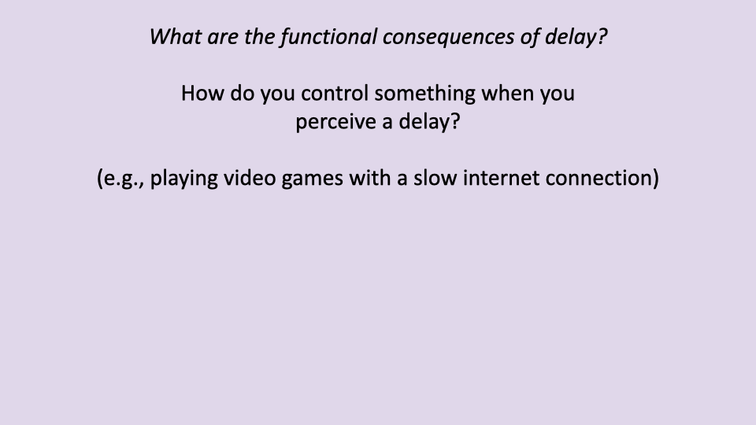

## Slide 1

- This lecture examines how the nervous system controls locomotion, focusing on the sources and consequences of sensorimotor delays, the integration of feedforward and feedback control, and how control strategies change with speed and body size.

---

## Slide 2

### Learning Objectives

![Slide titled "Integrative neuromuscular control of locomotion" listing four learning objectives: (1) Review basic structure of nervous system as it relates to locomotor control; (2) Discuss the sources of neural delay and its consequences for control of locomotion; (3) Describe the role of central pattern generators (CPGs) and the concepts of feedforward and feedback control in locomotion; (4) Discuss how sensorimotor delays lead to shifts in locomotor control strategy with increasing speed and body size.](images/lec20/slide-002.png)

- Learning objectives cover the basic structure of the nervous system in locomotor control, sources of neural delay and their consequences, the role of **central pattern generators (CPGs)** and the concepts of feedforward versus feedback control, and how sensorimotor delays shift control strategies with increasing speed and body size.

---

## Slide 3

### Structural and Functional Organization of the Nervous System

![Slide titled "Structural and functional organization of the nervous system." Left shows a diagram of the central nervous system (brain and spinal cord). Center shows a detailed view of a muscle spindle with sensory neuron endings, gamma motor neuron endings, sensory neurons, and muscle fibers of the spindle. Right shows a diagram of the stretch reflex arc: a sensory neuron from the muscle spindle projects to the spinal cord and synapses with an alpha motor neuron, which innervates extrafusal muscle fibers. A connection to the brain is also shown. An illustration of a leg with the knee-jerk reflex demonstrates the concept.](images/lec20/slide-003.png)

- The central nervous system (brain and spinal cord) integrates sensory information and generates motor commands.
- **Muscle spindles** are sensory organs embedded within muscles that detect stretch. They contain intrafusal fibers with sensory neuron endings and are innervated by gamma motor neurons.
- The **stretch reflex** is the simplest sensorimotor feedback loop: stretch of the muscle activates spindle afferents, which synapse in the spinal cord and drive alpha motor neurons to contract the same muscle.

---

## Slide 4

### Information Flow in the Nervous System

- A stimulus is detected by receptor organs and transmitted via sensory neurons to the central nervous system.
- Within the CNS, one or more layers of interneurons process the information before signals are relayed to motor neurons.
- Motor neurons activate effector organs (muscles), producing a response.
- The complexity of the interneuron processing varies widely depending on the specific control process — from simple monosynaptic reflexes to complex volitional movements.

---

## Slide 5

### Integration of Feedforward, Feedback, and Mechanical Control

![Hierarchical diagram of locomotor control showing three levels across different timescales. At the top, the brain receives inputs from vision, balance, and hearing, and provides descending drive to spinal networks over timescales of 1–3 steps (~100 ms). This is labeled "feedforward, predictive" and handles task and path planning, navigation, prediction, and anticipation of mechanical demands. In the middle, spinal networks contain a central pattern generator (CPG) with extensor and flexor components, operating at ~30 ms timescales. This is labeled "feedback, reactive" and provides rapid reaction, stability responses, and disturbance rejection through reflexes. At the bottom, muscle dynamics (extensor and flexor) interact with body dynamics and the environment at ~5 ms timescales via intrinsic mechanics. Proprioception feeds back from muscles to spinal networks. A box states: "Hierarchical organization provides responsiveness and adaptability over short and long timescales."](images/lec20/slide-005.png)

- Locomotor control operates across a hierarchy of timescales:
  - **Intrinsic mechanics** (~5 ms) — the passive mechanical properties of muscles, tendons, and the body interacting with the environment provide the fastest stabilizing responses.
  - **Feedback/reactive control** (~30 ms) — spinal reflexes and CPG-mediated responses correct errors based on sensory input from proprioceptors.
  - **Feedforward/predictive control** (~100 ms, spanning 1–3 steps) — the brain provides descending commands for task planning, navigation, and anticipation of mechanical demands.
- This hierarchical organization provides both rapid responsiveness to perturbations and longer-timescale adaptability.

---

## Slide 6

### What Is a Reflex?

- **Reflexes** are sensorimotor feedback loops that elicit a rapid, automatic response to a stimulus through spinal networks.
- Because reflexes are processed at the spinal level, they do not require conscious control — making them the fastest neural feedback mechanism in the body.
- The familiar knee-jerk (patellar tendon tap) test is a clinical example of a monosynaptic stretch reflex.

---

## Slide 7

### Alpha-Gamma Co-activation

![Slide titled "Alpha-gamma co-activation." Diagram shows a muscle with intrafusal fibers (muscle spindle) receiving both alpha motor neuron action potentials (which drive extrafusal muscle contraction) and gamma motor neuron action potentials (which contract the intrafusal fibers). Right side text states: "Descending commands activate intrafusal fibers to maintain stretch sensitivity." Below: "This allows the spindles to respond to stretch relative to the 'reference' expected length resulting in an error signal."](images/lec20/slide-007.png)

- When a motor command is sent to a muscle, both alpha motor neurons (driving extrafusal contraction) and gamma motor neurons (adjusting intrafusal spindle fibers) are activated simultaneously — this is **alpha-gamma co-activation**.
- Gamma activation sets the spindle to a reference length that corresponds to the intended muscle position during movement.
- Any stretch that deviates from this expected length generates an error signal, enabling the spindle to detect perturbations relative to the planned movement rather than absolute length.

---

## Slide 8

### Negative Feedback Loop

![Block diagram of a negative feedback loop for muscle length control. Central signals feed into a motor neuron, which activates the muscle, producing force that acts on the musculoskeletal system, resulting in actual length change and movement. Spindle receptors detect the actual length change and compare it to the predicted length change, generating an error signal that feeds back to the motor neuron (subtraction). Below: "Longer length than desired → increase activation → shortening → decreased length."](images/lec20/slide-008.png)

- The stretch reflex operates as a **negative feedback loop**: when the actual muscle length exceeds the desired length, spindle afferents increase motor neuron activation, causing the muscle to shorten and reduce the length error.
- Central signals set the predicted (desired) length change; the difference between predicted and actual length generates the error signal.
- This mechanism is fundamental for maintaining postural stability and correcting for unexpected perturbations during locomotion.

---

## Slide 9

### Motor Units Are the Functional Unit of Muscle Activation

![Slide titled "Motor units are the functional unit of muscle activation." Left shows a diagram of the spinal cord with motor nerve axons branching to innervate groups of muscle fibers, color-coded by motor unit (Motor unit 1 in red, Motor unit 2 in blue, Motor unit 3 in yellow). The fibers of each motor unit are distributed throughout the muscle. Right shows a histological image of skeletal muscle with labeled axon of motor neuron, synaptic knob, neuromuscular junction, and skeletal muscle fibers. Credit: Dr. Thomas Caceci.](images/lec20/slide-009.png)

- A **motor unit** consists of a single motor neuron and all the muscle fibers it innervates — it is the fundamental functional unit of muscle activation.
- In mammalian muscles, the fibers belonging to one motor unit are distributed throughout the muscle rather than clustered together.
- Each motor neuron is associated with a single fiber type, so all fibers within a motor unit share the same contractile properties.

---

## Slide 10

### Motor Unit Fiber Types

![Scatter plot with twitch contraction time (ms) on the x-axis (20–120 ms) and maximum tetanic tension (g) on the y-axis (0–140 g). Three groups are shown: fast fatigable (open circles, high force, short contraction time ~25–50 ms, up to 130 g), fast fatigue-resistant (filled circles, intermediate force ~10–70 g, contraction time ~30–55 ms), and slow (triangles, low force ~2–15 g, long contraction time ~60–110 ms). Text notes: "Fast motor units contain fast fibers (FG, FOG). Slow motor units contain slow fibers (SO)."](images/lec20/slide-010.png)

- Motor units differ systematically in force output and contraction speed according to their fiber type.
- Fast fatigable (FG) motor units produce the highest forces with the shortest contraction times but fatigue quickly.
- Fast oxidative-glycolytic (FOG) motor units produce intermediate forces and are more fatigue-resistant.
- Slow oxidative (SO) motor units produce the lowest forces with the longest contraction times but are highly resistant to fatigue.

---

## Slide 11

### The Size Principle of Motor Unit Recruitment

![Slide titled "The 'size principle' of motor unit recruitment." Left shows a graph of muscle tension increasing in steps as successively larger motor units (M.U.1 through M.U.4) are recruited, each with a higher threshold and greater maximum tension. Below, firing patterns show M.U.1 activating first with high-frequency firing, followed by M.U.2, M.U.3, and M.U.4 as activation level increases. Bullet points: smallest motor units are recruited first; larger units fire with increasing activation levels; creates smooth gradation of increasing force.](images/lec20/slide-011.png)

- The **size principle** of motor unit recruitment states that the smallest (and slowest) motor units are recruited first at low force demands, with progressively larger and faster units added as force requirements increase.
- This orderly recruitment creates a smooth gradation in total muscle force output.
- The smallest motor units (slow, fatigue-resistant) handle sustained, low-force tasks; the largest (fast, fatigable) are reserved for brief, high-force demands.

---

## Slide 12

### Segmental Organization at the Spinal Level

- The segmental organization of the spinal cord is highly conserved across vertebrates, as illustrated by the similar arrangement of nerve plexuses in an alligator and a human.
- Spinal nerves emerge in pairs from each vertebral segment, and this segmental structure determines which muscles are innervated by which spinal levels.
- This conservation reflects the deep evolutionary origins of vertebrate neuromuscular organization.

---

## Slide 13

### Segmental Organization: Reflexes at the Spinal Level

![Slide titled "Segmental organization at the spinal level." Left shows a 3D cross-section of the spinal cord with labeled dorsal root ganglion, dorsal root, cell body of neuron, association neuron (interneuron), white matter, gray matter, spinal cord, and ventral root. Right shows a simplified diagram: sensory neuron enters via the dorsal root, synapses in the spinal cord, and the somatic motor neuron exits via the ventral root to the effector (muscle). Text below states: "Reflexes are sensorimotor loops at the spinal level. Monosynaptic reflexes occur within a single spinal segment." Source: Ch. 8 Human Physiology, McGraw-Hill.](images/lec20/slide-013.png)

- Sensory information enters the spinal cord through the dorsal root and motor commands exit through the ventral root.
- **Monosynaptic reflexes** involve a single synapse within one spinal segment — the sensory afferent synapses directly on the motor neuron innervating the stretched muscle.
- This architecture limits monosynaptic reflexes to acting only on muscles innervated by the same spinal segment, constraining their scope but maximizing speed.
- More complex responses require additional synapses (polysynaptic pathways), each adding processing time to the total delay.

---

## Slide 14

### Sources of Sensorimotor Delay

![Slide titled "Control processes take time, resulting in sensorimotor delay." Left shows a timeline of delay components with color-coded zones: sensing delay (orange), sensory nerve conduction delay (blue), synaptic delay (purple), motor nerve conduction delay (blue), neuromuscular junction delay (green), electromechanical delay (yellow-green), and force generation delay (green). Total response time spans approximately 100 ms. Below the timeline are EMG and force traces showing the delay between stimulus onset and peak force. Right shows a giraffe diagram with numbered delay sources along the neural pathway. Text boxes state: "Sensorimotor delays limit response time" and "Largest delays: Conduction & force generation." Citation: More et al. 2013, J Exp Biol.](images/lec20/slide-014.png)

- Sensorimotor response involves six sequential sources of delay: sensing delay, sensory nerve conduction, synaptic delay, motor nerve conduction, neuromuscular junction delay, and force generation delay.
- Total response time for a monosynaptic reflex is on the order of 100 ms — roughly 100 times slower than electronic control systems used in robotics.
- The two largest contributors are conduction delay (time for the signal to travel to and from the CNS) and force generation delay (time from motor neuron activation to peak muscle force).

---

## Slide 15

### Conduction Delay: Factors and Equations

![Slide defining conduction delay as the time for the neural signal to travel from the sensory organ to the CNS and back to the motor end plate. Left shows an anatomical diagram of the spinal cord, spinal nerve, motor end plates, and motor nerve fibers. Right shows the equation T_conduction = L_axon / V_conduction. For unmyelinated fibers: V_conduction = k√D_nerve. For myelinated fibers: V_conduction = kD_nerve. Factors in conduction delay: myelination, nerve diameter (D_nerve), and axon length (L_axon).](images/lec20/slide-015.png)

- **Conduction delay** is the time for a neural signal to travel from the sensor to the CNS and back to the muscle:

$$T\_conduction = \frac{L\_{axon}}{V\_{conduction}}$$

- Conduction velocity depends on nerve properties:
  - Unmyelinated fibers: $V\_{conduction} = k\sqrt{D\_{nerve}}$
  - Myelinated fibers: $V\_{conduction} = kD\_{nerve}$ (linear, and substantially faster for a given diameter)
- The three main factors affecting conduction delay are myelination (present or absent), nerve diameter, and axon length (determined by anatomy).

---

## Slide 16

### Empirical Measures of Conduction Velocity

- In cat myelinated nerves, conduction velocity increases approximately linearly with nerve fiber diameter, reaching up to 120 m/s for the largest fibers.
- Conduction velocities vary substantially across vertebrate taxa: mammals (cat: 30–120 m/s) have the fastest, while ectotherms have slower velocities (snake: 10–35, frog: 7–30, fish: 3–36 m/s).
- Endothermy (warm-bloodedness) is associated with faster conduction velocities and greater myelination, providing one advantage for rapid sensorimotor control.

---

## Slide 17

### Notecard Activity: Estimating Conduction Delay

- For a reflex from the Achilles tendon, the signal must travel a round trip (sensory afferent to spinal cord, motor efferent back to muscle).
- With a one-way distance of 1.0 m and conduction velocity of 40 m/s: $T\_{conduction} = \frac{2 \times 1.0}{40} = 0.05$ s = 50 ms.
- This 50 ms conduction delay alone is a substantial fraction of the stance phase during fast running, illustrating why reflexes become less effective at high speeds.
- The same calculation explains why reflexes from proximal muscles (shorter axon length) are faster than those from distal muscles.

---

## Slide 18

### Excitation-Contraction Coupling Delay

![Slide titled "Excitation-contraction coupling delay (aka electromechanical delay): time from signal reaching the motor end plate to peak force." Left panel shows data from a human gastrocnemius muscle during hopping: EMG (% MVC), ground force (N), and ankle angle, with dashed lines showing the delay between peak EMG and peak force. Right panel shows equivalent data from a guinea fowl gastrocnemius: EMG (mV), force (N), and fascicle length (L/L₀), again demonstrating a delay between activation onset and force development. Bullet points: independent from conduction delay and adds to total delay; relates to calcium release and uptake from the sarcoplasmic reticulum; typically ~20 milliseconds.](images/lec20/slide-018.png)

- **Excitation-contraction coupling delay** (electromechanical delay) is the time from the motor action potential reaching the neuromuscular junction to peak force development in the muscle.
- This delay is independent of conduction delay and adds approximately 20 ms to the total sensorimotor response time.
- The delay arises from the time required for calcium release from the sarcoplasmic reticulum, cross-bridge cycling, and force transmission through the muscle-tendon unit.
- Combined with the 50 ms conduction delay from the previous example, total reflex response time for the Achilles tendon would be approximately 70 ms.

---

## Slide 19

### Sensorimotor Delay as a Source of Uncertainty

![Slide titled "Sensorimotor delay is a source of uncertainty in animal locomotion." Left shows a giraffe leg diagram with labeled delay sources along the reflex pathway: synaptic delay, nerve conduction delay, neuromuscular junction delay, electromechanical delay, force generation delay, and sensing delay. Right side lists human neural delays: voluntary motor loop ~200 ms, monosynaptic reflex ~60 ms; human stance period: jogging ~300 ms, maximum speed ~100 ms. Below: guinea fowl monosynaptic reflex delay as percentage of stance duration — slow walk <10%, intermediate 20%, fast run >30%. Conclusion: "reflexes are too slow at high speeds."](images/lec20/slide-019.png)

- In humans, voluntary motor loops (requiring brain processing) take approximately 200 ms; the fastest monosynaptic reflexes take approximately 60 ms.
- At jogging speed, stance duration is approximately 300 ms, so a reflex occupies about 20% of stance — enough time to be useful. At maximum speed, stance is only about 100 ms, meaning the reflex delay consumes more than half the available contact time.
- In guinea fowl, the reflex delay increases from less than 10% of stance at slow walking to more than 30% at fast running.
- Reflexes alone are therefore too slow to maintain stability at high locomotor speeds.

---

## Slide 20

### Discussion: Functional Consequences of Delay

- The experience of playing a video game with input lag provides an intuitive analogy for the challenge animals face with sensorimotor delays.
- With significant delay, a "button-mashing" strategy (reactive) becomes less effective, and prediction/anticipation of future states becomes essential.
- Over time, the brain builds an internal model of the delay and compensates — the same principle applies to locomotor control.

---

## Slide 21

### Consequences of Delay: Feedforward and Feedback Roles

![Same hierarchical control diagram as Slide 5, now with additional annotations on the right. Feedforward/predictive level: descending commands initiate a task based on anticipated mechanical demands; central pattern generators (CPGs) generate rhythmic locomotor commands based on descending commands. Feedback/reactive level: shapes motor output based on sensory inputs. A curved arrow indicates that over longer timescales, sensory input from proprioception, vision, vestibular system, and other special senses feeds back up to shape descending commands.](images/lec20/slide-021.png)

- **Feedforward (predictive) control**: descending commands from the brain initiate tasks based on anticipated mechanical demands. CPGs in the spinal cord generate the basic rhythmic motor patterns for locomotion based on these commands.
- **Feedback (reactive) control**: sensory inputs shape motor output in real time, correcting for deviations from the predicted movement.
- Over longer timescales (multiple steps), sensory information from proprioception, vision, and the vestibular system feeds back to the brain to update predictive motor planning.

---

## Slide 22

### Anticipatory Muscle Activation

![Slide titled "What are the consequences of delay?" with subtitle "Must anticipate mechanical events and activate muscles in advance." A timeline bar shows swing phase (blue) transitioning to stance phase (red). An arrow labeled "40 ms" points to the moment stance muscles begin activating — well before the actual swing-to-stance transition. Similarly, swing muscles begin activating before the stance-to-swing transition. Below: "Important consequences for: mechanisms of control, changes in control with speed, changes in control with body size."](images/lec20/slide-022.png)

- Because of sensorimotor delays, muscles must be activated approximately 40 ms before a mechanical event (such as foot contact) to ensure force is available when needed.
- Stance muscles begin activating during the late swing phase, and swing muscles begin activating during late stance.
- This anticipatory activation has important consequences for how control strategies shift with both speed (less time for feedback) and body size (longer delays in larger animals).

---

## Slide 23

### Feedforward and Feedback Components in Muscle Activity

![Slide titled "What are the consequences of delay?" showing guinea fowl gastrocnemius data from Daley and Biewener 2003. Left panel shows three traces during a stride: fascicle length (L/L₀, starting at ~1.4, stretching then shortening during stance), force (N, peaking at ~60 N during stance), and EMG. The shaded stance phase is marked. Annotations highlight: "Activation ~30–40 ms before stance" (feedforward component), "Reflex-mediated" burst after foot contact (feedback component), and "Force development during stance." Right shows a schematic of the control loop: descending drive → spinal networks → muscle activation → muscle-tendon dynamics → body dynamics → environment, with feedforward and feedback pathways labeled. A photo of a guinea fowl is shown.](images/lec20/slide-023.png)

- Guinea fowl gastrocnemius muscle data show both feedforward and feedback components within a single stance phase.
- EMG activation begins 30–40 ms before foot contact — this is the feedforward component, anticipating the ground reaction force.
- After foot contact, a reflex-mediated burst appears in the EMG (delayed by ~30–40 ms relative to contact) — this is the feedback component, adjusting activation based on the actual mechanical conditions encountered.

---

## Slide 24

### Feedback Control Is Too Slow at High Speeds

- At high running speeds, the monosynaptic reflex loop delay (approximately 40 ms in guinea fowl) consumes a large fraction of the stance phase.
- When a running guinea fowl encounters an unexpected drop in the substrate (a camouflaged pothole), the reflex response may arrive too late to be effective during the perturbed step.
- Recovery must instead occur over subsequent strides, relying on feedforward adjustments and intrinsic mechanical stabilization.

---

## Slide 25

### Guinea Fowl Perturbation Experiment

- In this experiment, guinea fowl run across a trackway with a camouflaged drop in the substrate, while muscle force and fascicle length are recorded via surgically implanted sensors.
- The bird's leg extends into the unexpected hole, causing a large deviation in both muscle length and force compared to the typical stride pattern.
- The data allow direct measurement of how the muscle responds to the perturbation and whether that response is driven by neural (reflex) or mechanical (intrinsic) mechanisms.

---

## Slide 26

### Fast Running: Mechanical Response Without Neural Change

- During fast running, the perturbation stride shows no measurable change in EMG activation — the feedforward motor pattern is unchanged because there is insufficient time for a neural response.
- Despite the absence of neural adjustment, the muscle shows a mechanical response: rapid shortening as the foot drops into the hole, followed by stretch when it contacts the bottom, with reduced force.
- The muscle's intrinsic mechanical properties (force-length and force-velocity relationships) provide passive stabilization, absorbing energy and preventing catastrophic failure.

---

## Slide 27

### Comparing Fast and Slow Running Perturbation Responses

![Slide comparing guinea fowl perturbation responses at fast running (left) and slower running (right) from Daley et al. 2009. Same three-panel format (fascicle length, force, EMG). At fast speeds: no EMG change during the perturbation stride. At slower speeds: a visible reflex response appears in the EMG during the perturbation stance phase, forces are maintained closer to control levels, and the perturbation has a smaller effect. Bullet points: at fast speeds, animals rely on feedforward activation and mechanical stability; at slower speeds, reflexes play a larger role.](images/lec20/slide-027.png)

- At fast running speeds, there is no change in activation during the perturbation stride — recovery relies on intrinsic mechanical stability and adjustments in subsequent strides.
- At slower speeds, a reflex response is visible within the perturbed stance phase, allowing within-step correction. Force is maintained closer to control levels, and the perturbation effect is smaller.
- This demonstrates the speed-dependent shift in control strategy: fast speeds rely on feedforward activation and intrinsic mechanics; slow speeds allow greater use of feedback (reflex) control.

---

## Slide 28

### Does Locomotor Control Vary with Body Size?

- Two characteristic timescales determine the challenge of locomotor control at different body sizes:
  - **Leg cycling period** scales with the square root of leg length divided by gravitational acceleration: $T\_{stride} \propto \sqrt{L\_{leg}/g}$
  - **Sensorimotor delay** scales with leg length divided by conduction velocity: $T\_{delay} \propto L\_{leg}/V\_{conduction}$
- As body size increases, sensorimotor delay grows faster (linearly with leg length) than stride period (which grows with the square root), meaning larger animals face proportionally greater delays relative to their movement speed.

---

## Slide 29

### Sensorimotor Responsiveness and Resolution

![Slide titled "Sensorimotor responsiveness and resolution." Left defines sensorimotor responsiveness as the time required to sense and respond to stimuli for a given sensorimotor loop (e.g., the monosynaptic reflex), illustrated by two leg diagrams — one with a slow response (low responsiveness) and one with a fast response (high responsiveness), shown by clock icons and dashed reflex-arc arrows. Right defines sensorimotor resolution as the number of sensory receptors and motor units an animal possesses per unit volume of tissue, illustrated by nerve cross-sections with few (low resolution) versus many (high resolution) axons. Citation: More and Donelan, 2010, 2013, 2018.](images/lec20/slide-029.png)

- **Sensorimotor responsiveness** is the time required to sense and respond to a stimulus for a given sensorimotor loop. Low responsiveness means slow response; high responsiveness means fast response.
- **Sensorimotor resolution** is the number of sensory receptors and motor units per unit volume of tissue. Higher resolution allows finer-grained control of force and position.
- Both properties are constrained by nerve anatomy, and maintaining both becomes increasingly difficult as body size increases.

---

## Slide 30

### Scaling Leads to a Trade-Off

![Slide titled "Scaling leads to a trade-off." Left shows a small animal limb with nerve cross-section (area A, length L, volume V) geometrically scaled up to a larger animal (2L). Right shows three scenarios for the scaled-up nerve: maintaining equal responsiveness requires nerve diameter 4A; maintaining equal resolution requires nerve volume 8V; maintaining both requires an enormous nerve (32A cross-section). Text box: "To maintain similar responsiveness and resolution as a shrew, an elephant would require a sciatic nerve with a diameter of 30 meters." Citation: More and Donelan 2010.](images/lec20/slide-030.png)

- As body size increases, maintaining the same sensorimotor responsiveness requires increasing nerve diameter (for faster conduction), while maintaining the same resolution requires increasing the number of axons.
- Achieving both simultaneously would require nerve cross-sections that scale as body mass to the 4/3 power — physically unrealistic.
- A calculation demonstrates that to match a shrew's responsiveness and resolution, an elephant would need a sciatic nerve 30 meters in diameter.
- In reality, large animals must compromise: they cannot maintain the same responsiveness and resolution as small animals.

---

## Slide 31

### Measuring Conduction Velocity Across Species

- Conduction velocity is measured by stimulating the nerve at two points a known distance apart and recording the time difference between the evoked muscle potentials from each site.
- The conduction velocity is calculated as: $V\_c = \Delta d / \Delta t$
- This method was applied across species ranging from shrews to elephants to determine how conduction velocity scales with body size.

---

## Slide 32

### Scaling of Conduction Velocity with Body Size

![Log-log plot titled "Empirical measures of conduction velocity" showing maximum axonal conduction velocity (m/s) vs. body mass (kg) across species from shrew (~10⁻³ kg) to elephant (~10⁴ kg). Data points for shrew, mouse, rat, guinea pig, rabbit, cat, dog, pig, sheep, and horse cluster around 50–100 m/s regardless of body size. The actual scaling line (red) shows M^0.04 — nearly flat. A gray reference line shows M^(1/3), the scaling that would be needed to compensate for increased body size. Citation: More and Donelan 2010.](images/lec20/slide-032.png)

- If conduction velocity increased proportionally to compensate for larger body size, it would need to scale as M1/3 (gray line). Instead, the measured scaling is only M0.04 — essentially flat across seven orders of magnitude in body mass.
- Maximum conduction velocity remains approximately 50–100 m/s in all mammalian species measured, from shrews to elephants.
- This means large animals do not compensate for their longer axon lengths with faster conduction velocities, so their conduction delays must increase with body size.

---

## Slide 33

### Total Nerve Conduction Delay Scales with Body Size

- Total nerve conduction delay scales as approximately 5.3M0.30, increasing from less than 1 ms in a shrew to approximately 80 ms in an elephant.
- This scaling exponent (~0.30) is close to M1/3, confirming that delay increases in direct proportion to leg length — as expected given the flat scaling of conduction velocity.
- The giraffe, with its exceptionally long legs, shows delays of approximately 30 ms that fall on the same scaling line.

---

## Slide 34

### Total Sensorimotor Delay Relative to Stance Duration

![Graph titled "Total sensorimotor delay relative to stance duration" showing the ratio of total delay to movement duration (y-axis, 0–1.4) vs. body mass (kg, x-axis, log scale 10⁻³ to 10⁴). Multiple lines represent different movement durations. Two key reference lines are highlighted: stance duration at moderate speed (dashed line, ratio ~0.2–0.6 across body sizes) and stance duration at top speed (heavier dashed line, ratio increasing from ~0.4 in small animals to >1.0 in elephant-sized animals). A gray shaded region above ratio 1.0 indicates where the delay exceeds the entire stance phase. Silhouettes of a shrew and elephant are shown. Arrow conclusion: "Large animals must rely more on feedforward (predictive) control and mechanical stability." Citation: More, 2010, 2013, 2018.](images/lec20/slide-034.png)

- At moderate speeds, the ratio of total sensorimotor delay to stance duration increases modestly with body size, remaining below 1.0 for all species.
- At top speeds, the ratio increases steeply with body size. For elephant-sized animals running at top speed, the delay exceeds the entire stance duration (ratio > 1.0), meaning a reflex response cannot be completed within a single stance phase.
- This scaling relationship demonstrates why larger animals must rely more heavily on feedforward (predictive) control and intrinsic mechanical stability, and less on reactive (reflex) feedback.

---

## Slide 35

### Why Body Size Scaling Matters: Implications for Research

![Slide titled "Why are body size scaling issues important?" showing photos of laboratory mice and a mouse locomotion analysis setup (side view and bottom view cameras at 400 fps). Right side shows a paper title: "A quantitative framework for whole-body coordination reveals specific deficits in freely walking ataxic mice." Bottom states: "Principles of comparative physiology should inform selection of study species (Krogh Principle)." An image shows color-coded body segments of mice during walking.](images/lec20/slide-035.png)

- Most biomedical neuroscience research on locomotion and sensorimotor control uses rodent models (mice and rats), which are orders of magnitude smaller than humans.
- The fundamental differences in delay scaling mean that rodents face qualitatively different control challenges than humans — reflexes are proportionally more effective in small animals.
- The **Krogh Principle** (from the beginning of the course) states that for every biological question, there is an organism best suited to study it. This principle should inform the selection of animal models for studying human-relevant sensorimotor control.

---

## Slide 36

### Human Case Studies in Sensorimotor Control

- The final section of this lecture applies the principles of feedforward and feedback control to human case studies, examining how the nervous system adapts to perturbations on both short and long timescales.

---

## Slide 37

### Adaptation of Sensorimotor Control: Short Timescales

![Slide titled "Adaptation of sensorimotor control: short timescales" referencing a paper by Moritz and Farley on passive dynamics during human hopping on unexpected surfaces. Left side describes four experimental conditions: (1) consistently soft surface (control), (2) surprise hard surface, (3) expected hard surface (every 4th hop), and (4) randomized hard surface (25% of hops). Right side shows the experimental setup: a person hopping on a surface with a locking mechanism that can switch between soft and hard conditions, with a force platform underneath.](images/lec20/slide-037.png)

- This experiment tested how humans adapt leg mechanics during hopping when they encounter an unexpected change in surface stiffness.
- Four conditions were compared: consistent soft (control), surprise hard, expected hard (every 4th hop), and randomized hard (25% of hops).
- The different conditions isolate the contributions of reactive (reflex) versus anticipatory (feedforward) adjustments and test whether the nervous system modulates reflex sensitivity based on environmental uncertainty.

---

## Slide 38

### Context-Dependent Control Mechanisms

![Slide titled "Context-dependent control mechanisms" showing vastus medialis (VM) EMG traces (% of maximum) versus time (ms) for three conditions. Top panel (Surprise): gray shaded area shows control soft-surface EMG; black line shows the surprise hard-surface response with a large, delayed reflex burst after time zero — labeled "Reflex response (Reaction)." An asterisk marks the first timepoint significantly different from control. Middle panel (Expected): the hard-surface response shows increased feedforward activation before contact (time zero) compared to control — labeled "Feedforward increase (anticipation)." Bottom panel (Random): the hard-surface response shows a larger and earlier reflex burst compared to the surprise condition — labeled "Larger, faster reflex (increased reflex gain & sensitivity)."](images/lec20/slide-038.png)

- Three distinct control mechanisms are revealed by the different conditions:
  - **Surprise** — a purely reactive reflex response appears after an unexpected hard surface, delayed from time zero. This is feedback control.
  - **Expected** — when the hard surface is predictable, the nervous system increases feedforward activation before contact (anticipation), demonstrating predictive control.
  - **Random** — when the hard surface occurs unpredictably but at known probability, the nervous system increases reflex gain and sensitivity, producing a larger and faster reflex response. This shows that the nervous system tunes reflex parameters based on environmental uncertainty.

---

## Slide 39

### Adaptation of Sensorimotor Control: Longer Timescales

![Slide titled "Adaptation of sensorimotor control: longer timescales" referencing a paper by Finley, Bastian, and Gottschall: "Learning to be economical: the energy cost of walking tracks motor adaptation." Left shows a photo of James Finley. Center shows a silhouette of a person walking on a split-belt treadmill with labels for ground reaction force (GRF), lateral malleolus (Lat. Mal.), and the greater trochanter (GTro). Right shows a diagram of the split-belt treadmill with fast belt (1.5 m/s) and slow belt (0.5 m/s), plus measurements of leading and trailing step length. Below shows the experimental protocol: baseline (both belts at 1 m/s), then split-belt adaptation (left 1.5, right 0.5), then washout (both at 1 m/s).](images/lec20/slide-039.png)

- A split-belt treadmill forces each leg to move at a different speed, creating an asymmetry that the nervous system must adapt to over time.
- This paradigm tests motor adaptation on longer timescales (minutes) — the nervous system gradually adjusts step length symmetry to accommodate the speed difference between belts.
- The study by Finley, Bastian, and Gottschall investigated whether metabolic cost (energy expenditure) tracks this motor adaptation process.

---

## Slide 40

### Motor Adaptation Tracks Energy Cost

![Slide showing results from Finley, Bastian, and Gottschall. Left graph shows step length symmetry over 15 minutes during adaptation (gray line) and post-adaptation/washout (black line). During adaptation, step length symmetry starts negative (asymmetric) and gradually returns toward zero (symmetric) over ~10 minutes. Post-adaptation shows an aftereffect that also decays. Right graph shows metabolic power (W/kg) over the same time course: metabolic cost starts elevated during early adaptation and decreases as step length symmetry improves, suggesting the nervous system optimizes toward lower energy cost. Text box: "Understanding how mechanics and energetics influence sensorimotor control is critical for improving rehabilitation."](images/lec20/slide-040.png)

- During split-belt adaptation, step length symmetry starts asymmetric and gradually returns toward symmetric over approximately 10 minutes.
- Metabolic power is elevated early in adaptation (when the gait pattern is most asymmetric) and decreases as the nervous system adapts to a more symmetric, economical pattern.
- This demonstrates that the nervous system optimizes motor patterns toward minimizing energy cost — metabolic cost tracks motor adaptation.
- Understanding this relationship between mechanics, energetics, and sensorimotor control is critical for improving rehabilitation strategies.

---

## Slide 41

### Current Challenges: Variability in Responses to Assistive Devices

![Slide titled "Current challenges" showing a paper by Zistatsis et al.: "Evaluation of a passive pediatric leg exoskeleton during gait." Left shows photos of the exoskeleton device and a child wearing it. Right shows a bar graph of normalized walking speed for four participants (TD1, TD2, H1, H2) across four conditions (No Exo, Exo Med, Exo Low, Exo High assistance). Results vary dramatically: TD participants increase or maintain speed with the exoskeleton, while H participants show variable or decreased speed. Text box: "Responses to rehabilitation devices and benefits of assistance vary dramatically among individuals."](images/lec20/slide-041.png)

- Evaluation of a passive pediatric leg exoskeleton reveals that responses to assistive devices vary dramatically among individuals.
- Some participants increase walking speed with the exoskeleton while others show no benefit or even decreased performance.
- This variability highlights a fundamental challenge in rehabilitation engineering: the sensorimotor system's response to external assistance depends on individual neuromuscular properties, adaptation capacity, and the specific nature of the impairment.

---

## Slide 42

### Current Challenges: Human-in-the-Loop Optimization

![Slide titled "Current challenges" showing a paper by Welker et al.: "Shortcomings of human-in-the-loop optimization for an ankle-foot prosthesis: a case series." Left (Panel A) shows the experimental setup: a universal emulator connected via Bowden cables to prosthetic end-effectors, with a controller and data/cable connections. Right (Panel B) shows two ankle-foot prosthesis end-effector designs: a 1-DOF device and a 3-DOF device. Below states: "Human in the loop optimization" (control optimized for an individual) reduces metabolic cost of walking with a powered exoskeleton in humans with intact limbs. However, the same methods fail to provide similar benefit for participants with unilateral trans-tibial amputation.](images/lec20/slide-042.png)

- "Human-in-the-loop" optimization iteratively adjusts assistive device parameters to minimize an individual's metabolic cost during walking.
- This approach successfully reduces the metabolic cost of walking with a powered exoskeleton in people with intact limbs.
- However, the same optimization methods fail to provide similar benefits for individuals with unilateral trans-tibial amputation, likely because the altered sensorimotor integration in amputees changes how the nervous system interacts with assistive devices.
- These findings underscore the need to understand the complex interplay between neuromechanics and sensorimotor adaptation when designing rehabilitation technologies.

---

## Slide 43

### Summary: Learning Objectives Revisited

- The nervous system controls locomotion through a hierarchical integration of feedforward (predictive) and feedback (reactive) mechanisms, with intrinsic muscle mechanics providing the fastest stabilizing responses.
- Sensorimotor delays — primarily conduction delay and excitation-contraction coupling delay — fundamentally constrain the responsiveness of neural feedback.
- At high speeds, reflexes become too slow relative to stance duration, forcing greater reliance on feedforward control and intrinsic mechanical stability.
- Larger animals face proportionally greater delays because conduction velocity does not increase with body size, making predictive control and mechanical stability increasingly important.

---

## Key Equations

| Equation | Description |
|----------|-------------|
| $T\_{conduction} = \frac{L\_{axon}}{V\_{conduction}}$ | Conduction delay: axon length divided by conduction velocity (must account for round-trip distance for reflexes) |
| $V\_{conduction} = k\sqrt{D\_{nerve}}$ | Conduction velocity in unmyelinated fibers: proportional to square root of nerve diameter |
| $V\_{conduction} = kD\_{nerve}$ | Conduction velocity in myelinated fibers: directly proportional to nerve diameter |
| $T\_{stride} \propto \sqrt{L\_{leg}/g}$ | Leg cycling (stride) period scales with the square root of leg length over gravitational acceleration |
| $T\_{delay} \propto L\_{leg}/V\_{conduction}$ | Sensorimotor delay scales linearly with leg length divided by conduction velocity |
| $V\_c = \Delta d / \Delta t$ | Measurement of conduction velocity: distance between stimulation sites divided by delay between evoked potentials |

---

## Glossary

| Term | Definition |
|------|-----------|
| Alpha-gamma co-activation | Simultaneous activation of alpha motor neurons (driving extrafusal muscle fibers) and gamma motor neurons (setting the reference length of intrafusal spindle fibers), allowing muscle spindles to detect deviations from the intended movement |
| Central pattern generator (CPG) | A neural network within the spinal cord that generates the basic rhythmic motor patterns for locomotion, capable of producing rhythmic output even without descending input from the brain |
| Conduction delay | The time required for a neural signal to travel along an axon from the sensor to the CNS (and back for a reflex response); determined by axon length and conduction velocity |
| Excitation-contraction coupling delay | The time from the motor action potential reaching the neuromuscular junction to peak force development in the muscle (~20 ms), arising from calcium release/uptake at the sarcoplasmic reticulum |
| Feedforward (predictive) control | Motor commands generated in advance of a mechanical event based on anticipated demands, using descending drive from the brain and CPG-generated patterns |
| Feedback (reactive) control | Motor adjustments made in response to sensory information about actual conditions, including spinal reflexes and longer-latency corrections |
| Krogh Principle | The principle that for every biological question, there exists an organism most suited to its study; relevant when choosing animal models for locomotion research |
| Monosynaptic reflex | The fastest spinal reflex, involving a single synapse between a sensory afferent and a motor neuron within one spinal segment (e.g., the stretch reflex) |
| Motor unit | The functional unit of muscle activation, consisting of a single motor neuron and all the muscle fibers it innervates; all fibers in a motor unit are the same fiber type |
| Muscle spindle | A sensory receptor embedded within skeletal muscle that detects changes in muscle length; the afferent limb of the stretch reflex |
| Sensorimotor resolution | The number of sensory receptors and motor units per unit volume of tissue; higher resolution allows finer motor control |
| Sensorimotor responsiveness | The time required to sense and respond to a stimulus for a given sensorimotor loop; constrained by conduction velocity and axon length |
| Size principle | The principle that motor units are recruited in order from smallest (slow, fatigue-resistant) to largest (fast, fatigable) as force demand increases, producing smooth force gradation |
