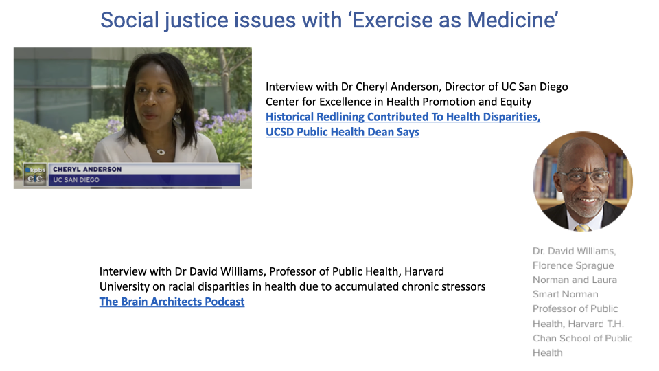

## Slide 1

- This lecture provides a broad overview of the evidence for exercise as a preventive and therapeutic intervention, connecting the physiological principles covered throughout the course to clinical and public health applications.

---

## Slide 2

### Learning Objectives

![Slide titled "Exercise as Medicine" listing six learning objectives: (1) Relate the relationship between fitness, training, and detraining to the concept of exercise as medicine; (2) Discuss evidence that exercise reduces risk of mortality; (3) Describe the dose-response relationship of exercise on health benefits; (4) List some of the benefits of exercise for brain function and mental health; (5) Discuss the interaction between time spent sitting and the benefits of exercise; (6) Consider how environmental factors and social equity issues influence the role of "exercise as medicine."](images/lec21/slide-002.png)

- Learning objectives span the relationship between fitness and health, evidence for mortality reduction, dose-response effects, brain and mental health benefits, the independent risks of sedentary behavior, and the environmental and social equity factors that influence access to physical activity.

---

## Slide 3

### Components of Physical Fitness

![Table titled "Components of physical fitness" with five rows. Cardiorespiratory Fitness: the ability to perform large-muscle, whole-body exercise at moderate-to-vigorous intensities for extended periods. Musculoskeletal Fitness: the integrated function of muscle strength, muscle endurance, and muscle power to enable performance of work. Flexibility: the range of motion available at a joint or group of joints. Balance: the ability to maintain equilibrium while moving or while stationary. Speed: the ability to move the body quickly. Below the table, a highlighted box states: "Cardiorespiratory fitness in particular has been associated with reduced mortality and reduced risk of a range of chronic diseases."](images/lec21/slide-003.png)

- Physical fitness encompasses multiple components: **cardiorespiratory fitness**, musculoskeletal fitness, flexibility, balance, and speed.
- Cardiorespiratory fitness — the ability to sustain large-muscle, whole-body exercise at moderate-to-vigorous intensities — has been most strongly associated with reduced mortality and lower risk of chronic diseases.
- Preferred walking speed has been proposed as a functional vital sign: declines in walking speed with aging can predict future fall risk and declining health.

---

## Slide 4

### Decline of Physiological Function with Age

![Graph titled "Decline of physiological function with age" showing VO₂ max (mL·kg⁻¹·min⁻¹) on the y-axis (0–70) vs. age (years, 20–80) on the x-axis. Two main curves are shown: "Active adults" starts at ~68 at age 20 and declines gradually to ~40 at age 80, with the slope increasing around age 60 (labeled "Reduction in activity plus aging"). "Sedentary adults" starts lower at ~48 and declines more steeply to ~22 by age 80 (labeled "Reduction in activity plus weight gain"). A dashed arrow from age ~40 on the sedentary curve shows the "Expected increase in VO₂ max resulting from an exercise intervention," jumping up to approximately the active adult level. Source: CDC Surgeon General's report.](images/lec21/slide-004.png)

- VO2 max declines with age in all adults, but the rate of decline differs substantially between active and sedentary populations.
- Active adults maintain a relatively constant rate of decline until approximately age 60, when the slope steepens. Sedentary adults show a steeper decline throughout adulthood, compounded by reduced activity and weight gain.
- A sedentary adult who begins an exercise program can achieve a meaningful immediate increase in VO2 max, shifting closer to the active-adult trajectory.
- Maintaining physical activity extends the "health span" — the age range over which an individual can sustain independent, healthy mobility.

---

## Slide 5

### Cardiorespiratory Fitness and Mortality: Study Design

![Slide titled "Cardiorespiratory Fitness and Mortality in Healthy Men and Women" by Imboden et al. (2018). Study details: recruited 4,137 self-referred apparently healthy participants (2,326 men, 1,811 women; mean age 42.8 ± 12.2 years). Cardiopulmonary fitness testing used standardized treadmill protocols to determine VO₂ max and peak power, plus resting heart rate, blood pressure, anthropometrics, body composition, and blood chemistry. Fitness groups were defined using VO₂ max: low (≤33rd percentile), moderate (34th–66th percentile), and high (≥67th percentile) based on the FRIEND database (Fitness Registry and the Importance of Exercise National Database). Follow-up was 24.2 ± 11.7 years (range 1.1 to 49.3 years) for mortality.](images/lec21/slide-005.png)

- This landmark study followed over 4,000 healthy adults for an average of 24 years, categorized by cardiorespiratory fitness level (low, moderate, or high) based on VO2 max percentiles.
- Standardized cardiopulmonary exercise testing, anthropometric measurements, and blood chemistry were collected at baseline.
- The long follow-up period and large sample size provide strong statistical power for evaluating the relationship between fitness and mortality.

---

## Slide 6

### Cardiorespiratory Fitness and Mortality: Results

![Three panels from Imboden et al. showing cumulative hazard (y-axis) vs. years of follow-up (x-axis, 0–50 years) for three fitness levels (low in blue, moderate in red, high in black). Panel A (All-cause mortality): low fitness reaches ~0.9, moderate ~0.55, high ~0.4 by year 45. Panel B (Cardiovascular disease mortality): low fitness reaches ~0.18, moderate ~0.08, high ~0.05. Panel C (Cancer mortality): low fitness reaches ~0.16, moderate ~0.10, high ~0.07. In all three panels, the low-fitness group has consistently higher cumulative hazard.](images/lec21/slide-006.png)

- Across all three mortality categories — all-cause, cardiovascular disease, and cancer — the low-fitness group had the highest cumulative mortality, while the high-fitness group had the lowest.
- The separation between fitness groups widens over time, indicating that the protective effect of fitness is cumulative and long-lasting.
- The association with cancer mortality is notable because exercise is not traditionally considered a cancer treatment, yet the data show a clear dose-response relationship.

---

## Slide 7

### Endurance Exercise Protects Against Cardiac Injury

- Endurance-trained individuals experience approximately one-third the cardiac tissue injury during a myocardial infarction compared to untrained individuals (approximately 20% vs. 60%).
- Regular endurance exercise provides cardioprotection through multiple mechanisms, including improved coronary collateral circulation, enhanced antioxidant defenses, and increased cardiac mitochondrial function.

---

## Slide 8

### Mortality Risk Declines with Fitness Level

![Slide titled "Mortality Risk Declines with Increasing Cardiorespiratory Fitness Level in Apparently Healthy Men and Women." Two panels show mortality risk vs. fitness level (low, moderate, high) for men (top, blue line) and women (bottom, red line). Both show a declining trend from approximately 1.6 at low fitness to approximately 0.9 at high fitness. Silhouettes of a hunched sedentary figure (left) and a sprinting runner (right) illustrate the contrast. Citation: Imboden, M.T. et al., J Am Coll Cardiol. 2018;72(19):2283–92.](images/lec21/slide-008.png)

- Mortality risk declines progressively from low to moderate to high fitness in both men and women.
- The trend is consistent across sexes: increasing cardiorespiratory fitness from low to high reduces mortality risk by approximately 40–50%.

---

## Slide 9

### Dose-Response Relationship: Physical Activity and Mortality

![Graph titled "The relationship between moderate to vigorous physical activity and risk of all-cause mortality." X-axis: Leisure Time Physical Activity (MET-hours per week, 0–30). Y-axis: Hazard Ratio of Mortality (0.5–1.1). The curve starts at 1.0 (sedentary baseline), drops steeply to ~0.80 at ~3 MET-hours/week, then ~0.75 at ~5, reaching ~0.68 at ~10 MET-hours/week. The curve continues to decline but at a decreasing rate, reaching ~0.60 at ~28 MET-hours/week. Annotations: "No lower threshold for benefit," "Steep early slope," "About 70% of benefit reached by 8.25 MET-hours per week," "No obvious best amount," "150–300 minutes of moderate physical activity" range marked, "No evidence of increased risk at high end." Source: adapted from Moore et al., PLoS Med 2012.](images/lec21/slide-009.png)

- The dose-response curve shows several key features:
  - There is no lower threshold — any amount of physical activity reduces mortality risk relative to a sedentary baseline.
  - The curve is steepest at low activity levels, meaning the greatest marginal benefit comes from transitioning from sedentary to even modest activity.
  - Approximately 70% of the maximum mortality reduction is achieved by 8.25 MET-hours per week.
  - The curve continues to decline at higher activity levels, with no evidence of a U-shaped increase in risk at very high levels.
- The CDC-recommended range of 150–300 minutes of moderate physical activity per week falls in the zone of greatest benefit-to-effort ratio.

---

## Slide 10

### Health Benefits of Physical Activity: Comprehensive Summary

![Table titled "Health Benefits of Physical Activity: Adults and Older Adults" from Physical Activity Guidelines for Americans, 2nd edition (HHS, 2018). The table lists category and health benefit across rows: Mortality — lower risk of all-cause and cardiovascular disease mortality. Cardiovascular health — lower risk of cardiovascular disease, heart disease, stroke, hypertension, adverse blood lipid profile. Metabolic health — lower risk of type 2 diabetes. Cancer — lower risk of cancers of the bladder, breast, colon, endometrium, esophagus, kidney, lung, and stomach. Brain health — improved cognition, reduced risk of dementia including Alzheimer's disease. Mental health and well-being — improved quality of life, reduced anxiety, reduced depression, improved sleep. Weight management — slowed or reduced weight gain, weight loss when combined with calorie reduction, prevention of weight regain. Musculoskeletal and function — improved bone health, improved physical function, lower risk of falls (older adults), lower risk of fall-related injuries.](images/lec21/slide-010.png)

- Physical activity provides benefits across virtually every organ system and health category:
  - Lower risk of all-cause and cardiovascular mortality
  - Reduced risk of cardiovascular disease, hypertension, and adverse blood lipid profile
  - Lower risk of type 2 diabetes
  - Reduced risk of at least eight types of cancer
  - Improved cognition and reduced risk of dementia
  - Reduced depression, anxiety, and improved sleep
  - Weight management and prevention of weight regain
  - Improved bone health, physical function, and reduced fall risk in older adults

---

## Slide 11

### Benefits of Physical Activity for Cancer Survivors

![Table titled "Benefits of activity for cancer survivors" from Physical Activity Guidelines for Americans, 2nd edition (HHS, 2018). Header: "Improved health among cancer survivors, lower risk of recurrence." Rows: Cancer survivors (general) — improved health-related quality of life and improved fitness. Breast cancer survivors — lower risk of dying from breast cancer and lower risk of all-cause mortality. Colorectal cancer survivors — lower risk of dying from colorectal cancer and lower risk of all-cause mortality. Prostate cancer survivors — lower risk of dying from prostate cancer.](images/lec21/slide-011.png)

- Physical activity benefits cancer survivors both during and after treatment: improved quality of life, improved fitness, and lower risk of cancer recurrence.
- For breast, colorectal, and prostate cancer survivors, physical activity is associated with reduced cancer-specific and all-cause mortality.
- Despite this evidence, exercise is rarely prescribed as part of oncology treatment plans — an area where clinical practice could better incorporate the evidence.

---

## Slide 12

### Physical Activity and Cancer Risk Reduction

![Table titled "Activity and Relative Risk Reduction for Cancer" from McTiernan et al. (2019). Columns: Cancer Type, Strength of Evidence, Relative Risk Reduction (%), Dose Response. Rows: Bladder — Strong, 15%, Yes. Breast — Strong, 12–21%, Yes. Colon — Strong, 19%, Yes. Endometrial — Strong, 20%, Yes. Esophageal — Strong, 21%, No. Gastric — Strong, 19%, Yes. Renal — Strong, 12%, Yes. Lung — Moderate, 21–25%, Yes. Citation: McTiernan et al. (2019), Physical activity and cancer prevention and survival: A systemic review, Medicine and Science in Sports and Exercise 51: 1252–1261.](images/lec21/slide-012.png)

- A systematic review found strong evidence for a 12–21% reduction in cancer risk associated with physical activity across eight cancer types.
- The evidence is strongest for colon, endometrial, esophageal, and gastric cancers (19–21% risk reduction).
- For most cancer types, there is a dose-response relationship — more physical activity provides greater risk reduction.

---

## Slide 13

### Benefits for People with Chronic Conditions and Disabilities

![Table titled "Health Benefits of Physical Activity: Other Chronic Conditions and Disabilities" from HHS guidelines. Lists conditions and benefits: Osteoarthritis (knee and hip) — decreased pain, improved physical function, improved quality of life, no effect on disease progression at recommended levels. Hypertension — lower cardiovascular disease mortality, reduced cardiovascular disease progression, lower risk of blood pressure increase over time. Type 2 diabetes — lower cardiovascular disease mortality, reduced progression of disease indicators (HbA1c, blood pressure, BMI, lipids). Dementia — improved cognition. Multiple sclerosis — improved physical function including walking speed and endurance, improved cognition. Spinal cord injury — improved walking function, muscular strength, and upper extremity function. Diseases or disorders that impair cognitive function (including ADHD, schizophrenia, Parkinson's disease, and stroke) — improved cognition.](images/lec21/slide-013.png)

- Physical activity provides measurable benefits for people with a wide range of chronic conditions and disabilities, including osteoarthritis, hypertension, type 2 diabetes, dementia, multiple sclerosis, spinal cord injury, and cognitive impairment disorders.
- Benefits span reduced pain, improved physical function, decreased cardiovascular disease progression, and improved cognition.
- Importantly, physical activity at recommended levels does not worsen disease progression in osteoarthritis — a common concern that discourages patients from exercising.

---

## Slide 14

### Benefits for Brain and Mental Health

![Table titled "Benefits of Physical Activity: Brain and Mental Health" listing outcomes by population and whether effects are acute (single bout) or habitual (regular exercise). Cognition: improved academic performance, executive function, processing speed, and memory in children ages 6–13 (habitual); reduced risk of dementia in adults (habitual); improved executive function, attention, memory, crystallized intelligence, and processing speed in adults over 50 (acute and habitual). Quality of life: improved quality of life in adults (habitual). Depression: reduced risk of depression and reduced depressed mood in children 6–17 and adults (habitual). Anxiety: reduced short-term state anxiety in adults (acute); reduced long-term trait anxiety in people with and without anxiety disorders (habitual). Sleep: improved sleep efficiency, sleep quality, deep sleep, reduced daytime sleepiness and medication use (acute); improved sleep outcomes that increase with duration of acute episode (acute).](images/lec21/slide-014.png)

- Exercise benefits brain function and mental health through both acute (single-bout) and habitual (regular) mechanisms:
  - **Cognition** — a single bout of exercise immediately improves executive function and attention; habitual exercise reduces dementia risk and improves memory.
  - **Depression** — habitual exercise reduces risk and severity of depression across age groups.
  - **Anxiety** — acute exercise reduces short-term (state) anxiety; habitual exercise reduces long-term (trait) anxiety even in people with anxiety disorders.
  - **Sleep** — exercise improves sleep quality, efficiency, and deep sleep duration, with benefits increasing with exercise bout duration.

---

## Slide 15

### Exercise and Brain Health: Aerobic Dance Study

- A study of sedentary older adults who participated in an aerobic dance class twice per week for 20 weeks showed measurable improvements in brain function.
- This type of social, aerobic activity provides both the physiological benefits of exercise and the cognitive stimulation of learning new movement patterns.

---

## Slide 16

### Exercise Increases Brain Network Flexibility

![Slide showing a paper by Sinha, Berg, Yassa, and Gluck: "Increased dynamic flexibility in the medial temporal lobe network following an exercise intervention mediates generalization of prior learning." Study design: 20-week dance-based aerobic exercise program, twice per week for 60 minutes; cognitive tests for learning retention and generalization; MRI brain scans analyzing connectivity of brain regions and network flexibility. Bar graph (Fig. 3) shows resting-state dynamic flexibility in the medial temporal lobe (MTL) network: Pre Exercise (blue bars) vs. Post Exercise (green bars) for Control and Exercise Intervention groups. The exercise group shows increased MTL network flexibility post-exercise, while controls show no change.](images/lec21/slide-016.png)

- After the 20-week dance-based aerobic exercise program, participants showed increased dynamic flexibility in the medial temporal lobe (MTL) network — a brain region critical for memory and learning.
- The control group showed no change in network flexibility over the same period.
- Increased network flexibility is associated with better cognitive function, particularly the ability to generalize learning to new contexts.
- These findings suggest that even a relatively modest exercise intervention (two sessions per week for 20 weeks) can produce structural changes in brain connectivity.

---

## Slide 17

### Positive Effects of Acute Exercise: Study Standards

![Slide titled "Positive effects of acute exercise" showing the paper "The Effects of Acute Exercise on Mood, Cognition, Neurophysiology, and Neurochemical Pathways: A Review" by Basso and Suzuki, alongside a thumbnail of a TED talk video by Wendy Suzuki titled "The brain-changing benefits of exercise." Below is a table of proposed acute exercise study standards: Duration — short (0–15 min), moderate (16–45 min), long (46 min or longer). Intensity — low (≤39% VO₂ max), moderate (40–59%), high (≥60%). Perceived exertion by Borg scale (6–20). Exercise index combining duration, intensity, and perceived exertion.](images/lec21/slide-017.png)

- Basso and Suzuki proposed standardized categories for studying acute exercise effects: duration (short, moderate, long), intensity (low, moderate, high as a percentage of VO2 max), perceived exertion (Borg scale), and a combined exercise index.
- These standards help compare findings across different exercise studies, which often use inconsistent methodologies.

---

## Slide 18

### Summary of Acute Exercise Effects on the Brain

- Across many studies, acute exercise consistently enhances prefrontal cognitive function (executive function, attention, working memory).
- Exercise enhances positive mood states and decreases negative mood states.
- These effects are associated with neurophysiological and neurochemical changes in the hippocampus, prefrontal cortex, and other brain regions — including increased neurotrophins (such as BDNF), dopamine, serotonin, and norepinephrine.

---

## Slide 19

### Self-Reflection: Do You Get Enough Exercise?

- A pause for personal reflection on whether current physical activity levels meet the evidence-based recommendations for health benefits.

---

## Slide 20

### CDC Activity Guidelines for Adults

![Slide titled "CDC activity guidelines for adults" showing an infographic from the CDC. Moderate-intensity aerobic activity: at least 150 minutes a week (anything that gets your heart beating faster). Muscle-strengthening activity: at least 2 days a week. A callout states: "Or get the same benefits in half the time: if you step it up to vigorous-intensity aerobic activity, aim for at least 75 minutes a week." Below the infographic, bullet points state: risks for many chronic diseases drop by 20–40%; biggest health gains are in those who transition from sedentary to some activity; the dose-response relationship exists for most health outcomes — more activity is generally better; no evidence of an upper limit — very high levels of activity do no harm.](images/lec21/slide-020.png)

- The CDC recommends at least 150 minutes per week of moderate-intensity aerobic activity (or 75 minutes of vigorous-intensity activity) plus muscle-strengthening activity at least 2 days per week.
- Meeting these guidelines reduces risks for many chronic diseases by 20–40%.
- The biggest health gains come from transitioning from a sedentary lifestyle to any level of regular activity.
- There is no evidence of an upper limit where physical activity becomes harmful — very high activity levels do no harm.

---

## Slide 21

### Percentage of U.S. Adults Meeting the Guidelines

- Despite the well-documented benefits, only approximately 15–20% of women and 20–27% of men in the United States meet both aerobic and muscle-strengthening guidelines.
- Although the percentage has trended upward slightly from 2008 to 2016, the vast majority of the population remains insufficiently active.

---

## Slide 22

### Risks of Sedentary Behavior

- **Sedentary behavior** is defined as any waking behavior with low energy expenditure — sitting, reclining, or lying down. It is distinct from simply not exercising.
- Independent of exercise habits, more time in sedentary behavior increases the risk of all-cause mortality, cardiovascular disease, type 2 diabetes, several cancers, high blood pressure, depression, immune dysfunction, and fractures.
- The health risks of sedentary behavior are not fully offset by exercise — prolonged sitting carries independent risk even in people who exercise regularly.

---

## Slide 23

### Relationship Between Activity, Sitting Time, and Mortality Risk

![Slide titled "Relationship between activity, sitting time and mortality risk." A two-dimensional color-gradient diagram shows mortality risk as a function of moderate-to-vigorous physical activity (x-axis) and daily sitting time (y-axis). The lower-right corner (high activity, low sitting) is green (lowest risk). The upper-left corner (low activity, high sitting) is red (highest risk). Bullet points: high activity levels mitigate excess risk of mortality associated with high sitting time; very low time spent sitting reduces, but does not eliminate, the risk of no physical activity; most people would benefit from both increased activity and reduced sitting.](images/lec21/slide-023.png)

- Mortality risk is determined by the combination of physical activity level and daily sitting time — not either factor alone.
- High activity levels partially mitigate the excess mortality risk from prolonged sitting, but do not eliminate it entirely.
- Conversely, very low sitting time reduces but does not eliminate the risk associated with physical inactivity.
- Most people would benefit from both increasing physical activity and reducing sitting time.

---

## Slide 24

### Social Justice and Equity Issues with Exercise as Medicine

![Diagram titled "Social justice & equity issues with 'Exercise as Medicine'" showing a framework of risk factors. Center: Environmental factors — physical (clean air, water, food), community (safety, access), socioeconomic (income, work demands, housing), and systemic racism and social injustice. Left: Biological factors — age, sex, gender, genetic variation, disability. Right: Behavioral factors — nutrition, sedentary behavior, activity, smoking, drug use. Bottom: Epigenetic factors (e.g., chronic stress, trauma). Arrows show bidirectional interactions among all four categories.](images/lec21/slide-024.png)

- The ability to use exercise as medicine depends not only on individual biology and behavior but also on environmental and social factors.
- Environmental factors include access to clean air, water, and food; safe community spaces for physical activity; socioeconomic constraints (income, work demands, housing); and the effects of systemic racism and social injustice.
- Biological factors (age, sex, genetic variation, disability) and behavioral factors (nutrition, sedentary habits, smoking) interact with environmental conditions.
- **Epigenetic** factors — changes in gene expression caused by chronic stress, trauma, or environmental exposures — can have long-lasting effects across generations, linking maternal health status to offspring health outcomes.

---

## Slide 25

### Genetics Influence the Effects of Training on VO2 Max

![Graph titled "Genetics influence the effects of training on changes in VO₂ max." Y-axis: VO₂ max (mL·kg⁻¹·min⁻¹, range 30–90). X-axis: Months of Endurance Training (0–30). Five genotype groups (A through E) are shown. Genotype E (blue) starts at ~40 and rises steeply to ~80 by 6 months, then plateaus. Genotype D (red) starts at ~48 and rises to ~65. Genotype C (green) starts at ~45 and rises to ~55. Genotype B (purple) starts at ~40 and rises to ~48. Genotype A (dark blue) starts at ~35 and remains essentially flat at ~36 throughout 30 months of training.](images/lec21/slide-025.png)

- The trainability of VO2 max has a strong genetic component. Different genotypes show dramatically different responses to the same endurance training program.
- Some genotypes (e.g., Genotype E) show a large, rapid increase from ~40 to ~80 mL·kg⁻¹·min⁻¹ within 6 months, while others (Genotype A) show essentially no change despite 30 months of training.
- This genetic variation in trainability means that standardized exercise prescriptions will not produce uniform outcomes across individuals — an important consideration for clinical exercise programs.

---

## Slide 26

### Air Pollution and Air Quality

![Slide titled "Air pollution and air quality index" showing a color-coded Air Quality Index (AQI) table: Good (0–50, green), Moderate (51–100, yellow), Unhealthy for Sensitive Groups (101–150, orange), Unhealthy (151–200, red), Very Unhealthy (201–300, purple), Hazardous (301–500, maroon). Below lists health effects of chronic air pollution exposure: decreased capacity to transport oxygen, decreased VO₂ max; increased airway resistance; increased risk of asthma and pulmonary infection; elevated blood pressure; increased inflammatory markers; oxidative stress and DNA damage.](images/lec21/slide-026.png)

- Chronic exposure to air pollution degrades cardiorespiratory function: decreased oxygen transport capacity, decreased VO2 max, increased airway resistance, elevated blood pressure, and increased inflammatory markers.
- People living in areas with poor air quality face a double burden: their cardiorespiratory capacity is reduced by pollution, and outdoor exercise in polluted air may itself be harmful.
- The Air Quality Index (AQI) provides a standardized scale for communicating health risk levels to the public, from "Good" (0–50) to "Hazardous" (301–500).

---

## Slide 27

### Community Factors in Physical Activity

![Slide titled "Community factors in physical activity" discussing community strategies for increasing physical activity. Text describes creating or modifying environments to make it easier for people to walk and be active, including activity-friendly routes to everyday destinations. A CDC community strategies infographic is shown. Notecard activity asks students to consider their home town or Irvine: What aspects of the community design encourage physical activity? What aspects discourage physical activity?](images/lec21/slide-027.png)

- Community design has a direct impact on physical activity levels. Features that encourage activity include walkable neighborhoods, activity-friendly routes to everyday destinations, accessible parks and green spaces, and affordable recreational programs.
- Communities designed primarily for automobile convenience — with sprawling residential areas and few pedestrian-friendly routes — discourage routine physical activity.
- Strategies to increase community physical activity include improving infrastructure for walking and cycling, creating accessible recreational programs, and designing mixed-use developments with local amenities within walking distance.

---

## Slide 28

### Social Justice: Redlining and Health Disparities

- Dr. Cheryl Anderson's research highlights how **historical redlining** — a discriminatory practice that denied mortgages and insurance to residents of predominantly minority neighborhoods — has created lasting health disparities.
- Redlining restricted investment in affected communities for decades, limiting the development of health-promoting infrastructure.

---

## Slide 29

### Redlining and Neighborhood Health

- Interactive data visualizations map historical redlining zones alongside current social vulnerability scores, revealing persistent spatial patterns of health inequality.
- Neighborhoods that were redlined in the 1920s–1970s continue to show elevated social vulnerability and poorer health outcomes decades later.

---

## Slide 30

### Redlining: Definition and Legacy

![Screenshot from the Redlining and Neighborhood Health website providing context: "Redlining was a discriminatory practice in the US that denied financial services such as mortgages and insurance, to people in specific areas designated as 'high risk' because the residents were predominantly Black, Latino or Jewish. This restricted investment and limited the supply of property and business development in these communities. Redlining was officially banned with the Fair Housing Act of 1968, but it has had long-lasting impact."](images/lec21/slide-030.png)

- **Redlining** was a discriminatory practice in the United States that designated neighborhoods with predominantly Black, Latino, or Jewish residents as "high risk," denying them mortgages, insurance, and business investment.
- Although officially banned by the Fair Housing Act of 1968, the effects persist: restricted investment over decades limited property development, infrastructure, and community resources in affected areas.

---

## Slide 31

### Consequences of Redlining for Physical Activity and Health

- Historically redlined districts today have higher air pollution levels and limited access to green spaces, parks, and pedestrian and bicycle infrastructure.
- Residents of these communities face compounding barriers to physical activity: fewer safe places to exercise, poorer air quality that reduces cardiorespiratory capacity, and higher baseline rates of chronic disease.
- These structural inequities illustrate why "exercise as medicine" must account for social determinants of health — prescribing exercise without addressing access barriers may widen rather than narrow health disparities.

---

## Slide 32

- The cumulative effects of historical redlining — reduced investment, higher pollution, fewer green spaces, and limited infrastructure — persist in affected communities today.
- Addressing health disparities requires not only individual-level interventions (exercise prescriptions) but also systemic changes in community infrastructure, environmental policy, and equitable resource allocation.

---

## Slide 33

### Summary: Learning Objectives Revisited

- Cardiorespiratory fitness is strongly associated with reduced all-cause, cardiovascular, and cancer mortality, with a clear dose-response relationship.
- Even small amounts of physical activity provide meaningful health benefits; there is no evidence of harm at high activity levels.
- Exercise benefits extend beyond cardiovascular health to include improved brain function, mental health, sleep, weight management, and outcomes for people with chronic conditions and cancer.
- Sedentary behavior carries independent health risks that are not fully offset by exercise alone.
- Environmental, social, and genetic factors influence an individual's ability to engage in physical activity, and equity considerations are essential when applying the concept of exercise as medicine.

---

## Key Equations

This lecture is primarily evidence-based and clinical, with no new mathematical equations. The key quantitative benchmarks discussed are:

| Concept | Value |
|---------|-------|
| CDC recommended moderate-intensity aerobic activity | ≥150 minutes per week |
| CDC recommended vigorous-intensity aerobic activity | ≥75 minutes per week |
| CDC recommended muscle-strengthening activity | ≥2 days per week |
| Activity level for ~70% of maximum mortality benefit | ~8.25 MET-hours per week |
| Chronic disease risk reduction from meeting guidelines | 20–40% |
| Cancer risk reduction from physical activity | 12–25% depending on cancer type |
| Cardiac injury in trained vs. untrained during MI | ~20% vs. ~60% |

---

## Glossary

| Term | Definition |
|------|-----------|
| Cardiorespiratory fitness | The ability to perform large-muscle, whole-body exercise at moderate-to-vigorous intensities for extended periods; primarily measured by VO2 max |
| Dose-response relationship | The principle that increasing amounts of physical activity produce progressively greater health benefits, with no evidence of harm at high levels |
| Epigenetics | Changes in gene expression caused by environmental factors (such as chronic stress, pollution, or maternal health status) that do not alter the DNA sequence but can persist across generations |
| Health span | The period of life during which an individual maintains healthy, independent function — as distinct from total lifespan |
| MET (metabolic equivalent of task) | A unit expressing the energy cost of physical activity relative to rest; 1 MET equals resting metabolic rate (~3.5 mL O2·kg⁻¹·min⁻¹) |
| Redlining | A historically discriminatory practice in the United States that denied mortgages and insurance to residents of predominantly minority neighborhoods, leading to persistent health disparities through reduced community investment |
| Sedentary behavior | Any waking behavior characterized by low energy expenditure (≤1.5 METs) while sitting, reclining, or lying down; carries independent health risks beyond physical inactivity |
